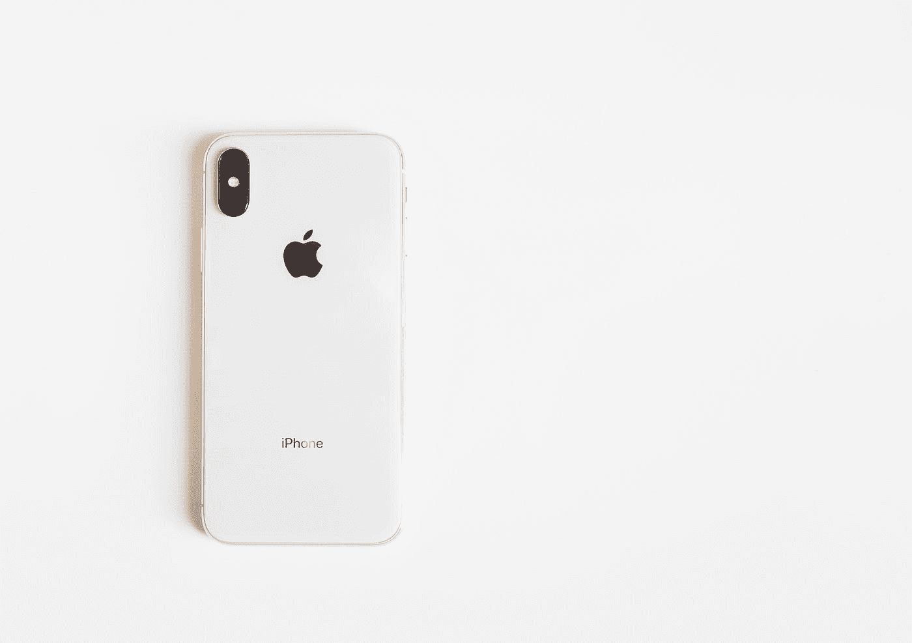

# 苹果需要一个创新负责人

> 原文：<https://medium.com/hackernoon/apple-needs-a-head-of-innovation-9a1218b58312>

## 苹果和雅虎之间初露端倪的相似性

Photo by [NeONBRAND](https://unsplash.com/@neonbrand?utm_source=medium&utm_medium=referral) on [Unsplash](https://unsplash.com?utm_source=medium&utm_medium=referral)

于是苹果发布了全新的 iPhone 产品，yaay！我问我朋友的下一个问题是，**‘这个产品有什么新的吗？’**。他给了我一个直截了当的回答，“双卡”。说真的吗？双卡？**“好吧，还有什么不同？”**我问我的朋友。嗯，他们有这个 ACG 特色。它是做什么的？我想是健康的东西。

> 这就是我的故事。我知道现在会有苹果粉丝读到这篇文章，他们可能会准备好为自己辩护，但在你证明什么是正确的之前，请善意地观察什么不是。

我的另一个朋友曾经提到，自从史蒂夫·乔布斯去世后，苹果公司没有生产出任何完全创新的产品。**该公司是一家闻名世界的公司。人们期待着他们所能提供的东西，因为这些东西常常令人兴奋不已。现在，这一切似乎都随风而逝了。**

几个月前，在一次采访中，苹果公司首席执行官蒂姆·库克说，他们并不热衷于成为第一名(带来创新或功能)，而是热衷于成为最好的。这意味着什么是非常明显的。它可能看起来很小，但这是苹果放弃了多年来使其成为今天的优势。想一想；这家公司给了我们鼠标、iPod、iPad 和 iPhone。**有趣的是，当这些产品推出时，世界上还从未见过如此大规模的产品。现在，苹果已经成为了墨守成规者。**

> 你看了苹果做的第一个广告吗？也许你应该

无意冒犯蒂姆·库克。他是一位出色的经理，可能比世界上任何人都更了解公司。但是，他不是史蒂夫·乔布斯。创新精神赋予了苹果品牌。如果它正在失去它，这种影响肯定不是突然的，而是渐进的。未来几年，我们可能会看到另一个雅虎故事。我确信苹果会从手机销售中大赚一笔，但原因是他们的粉丝还没有理由质疑这一点。如果经济陷入轻微衰退，每个人都变得节俭，会发生什么？

> 当人们想要节约时，有足够的理由来证明购买最新的 iPhone(没有突出的功能)是正确的吗？

成功的秘诀之一是承认你做不到的事情，并找到能做这件事的人。苹果目前正需要创新思维。通过研究和开发所能取得的成果是有限的。记住，他们的每一个竞争对手都有一个 R&D 部门。他们在实验室中得到的结果可以在另一个实验室中得到(具有相同的参数、条件和过程)。**差异一直在想象中**。看起来苹果越来越不可能领导世界进入人们目前幻想的技术未来。

苹果有答案。事实上，他们可以朝着两个方向前进，以确保他们作为全球技术领域领先公司和品牌的未来。**首先是全力以赴有争议的和社会的**，就像耐克正在做的那样。另外，耐克已经这样做了很多年了。他们继续制造鞋子，鞋子没有什么新的，但是他们继续给社会一个选择鞋子的理由。如果苹果想完全停止创新，只是做一家普通的公司，但仍然在销售上大赚一笔，他们可以采用这种方法。但我不推荐它，因为它会搬起石头砸自己的脚。

第二个方向(我会推荐)是让真正有创新精神的人加入。这与上过好学校并有工作经验的人无关。这是完全没有记录的事情。走到街上，找到你需要的人。这里的街道意味着非正式的世界。**苹果需要一个创新负责人**。也许他们现在知道了，但是相信我，没有表现出来。这不是标题的问题。这是关于一个能想出一个想法或概念的人。这是关于一个有不同想法的人，他可以挑战苹果，创造出让世界惊叹的产品。

如果苹果继续沿着这条路走下去，没有显著的变化或方向的转变，他们可能在未来 5 年内都很好，但在此之后，问题开始变得突出。iPhone 是苹果最畅销的产品，遥遥领先。如果他们不能再次达到市场领导者的位置，他们唯一能做的就是向下走。从这个意义上说，也许这就是苹果的巅峰。老实说，我希望不是。

众所周知，苹果改变了人们与技术的互动方式。而他们的改变一直都是圆滑的，时尚的，最重要的是，炫目！众所周知，他们想出了一些不同的东西或不同的方法。你从远处凝视他们的产品，你不会猜错。所有这一切都在改变，这意味着公司将面临问题。我希望他们管理层的高层能及时发现这个问题。10 年可能是很短的时间。

我停止我的案子。