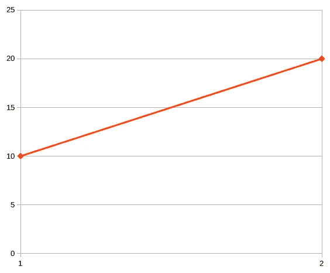
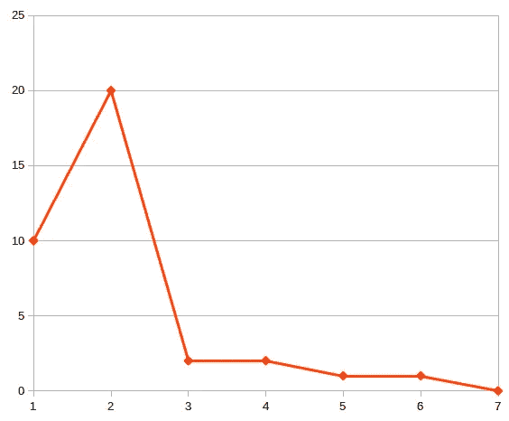
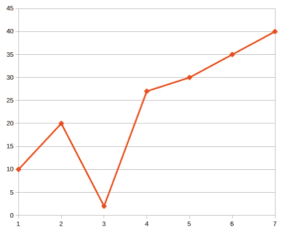

# 苹果股票面试问题

> 原文：<https://medium.com/hackernoon/apple-stocks-interview-question-2b46ce5f0751>

最近我在[面试蛋糕](http://interviewcake.com)上偶然发现了[这个面试问题](https://www.interviewcake.com/question/php/stock-price)。基本上是这样的:你有一组股票价格，你应该计算出你能得到的最高利润。比如你有*【2，1，4，10，7】*—最高利润是*10–1 = 9*。我不喜欢这个问题的地方是，它不需要找到你可以获得最佳利润的最低和最高股票价格，只需要最高利润本身。所以我决定用这个条款来解决。此外，我认为需要更深入地研究这个问题的本质。

在闲逛了半个小时后，我重新阅读了这个问题，希望能找到一个解决方案，我决定画出股票价格如何演变的图表。

这是最简单的开始:



到目前为止，我能获得的最大利润是以 10 美元买入，20 美元卖出。这张图会如何演变？实际上我只对两种情况感兴趣。如果下一个价格比前一个高，我有一个新的最高价格，和新的最高利润。如果下一个价格低于前一个最低价，我*可能*有一个我应该买入股票的最低价。但我不知道后来是否会有一个价格导致新的最高利润。可能是这样的:



或者像这样:



所以我需要引入一个最低候选价格的概念，也就是说，一个我应该买入股票的价格。所以当我发现自己在第三点时，我说它是下一个最低价格的候选。而如果点 4 的股票导致了更高的利润(或者换句话说，到目前为止最高的*)，我假设最低价格的候选实际上变成了最低价格，给我带来最高利润的股票变成了最高价格，也就是我应该卖出股票的价格。*

*因此，下面的代码乍一看似乎不错:*

```
***function** getMaxProfit(**array** $stocks)
{
    $minCandidate = $min = $stocks[0];
    $max = $stocks[1];

    **for** ($i = 1; $i < *count*($stocks); $i++) {
        **if** ($stocks[$i] < $minCandidate) {
            $minCandidate = $stocks[$i];
        } **elseif** ($stocks[$i] - $minCandidate > $max - $min) {
            $max = $stocks[$i];
            $min = $minCandidate;
        }
    }

    **return** [$min, $max];
}*
```

*但是有一个问题。如果股票价格一整天都在下跌，但是价差变小了，怎么办？例如，对于这个数组— *[10，5，2，1]* —我得到了一个错误的结果。所以我需要先计算最高利润，如果需要的话再刷新 *$minCandidate* :*

```
***function** getMaxProfit(**array** $stocks)
{
    $minCandidate = $min = $stocks[0];
    $max = $stocks[1];

    **for** ($i = 1; $i < *count*($stocks); $i++) {
        **if** ($stocks[$i] - $minCandidate > $max - $min) {
            $max = $stocks[$i];
            $min = $minCandidate;
        }

        **if** ($stocks[$i] < $minCandidate) {
            $minCandidate = $stocks[$i];
        }
    }

    **return** [$min, $max];
}*
```

*就是这样。*