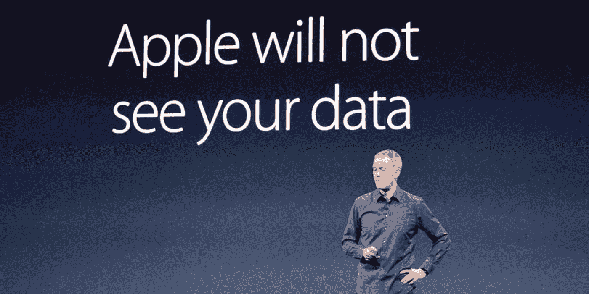
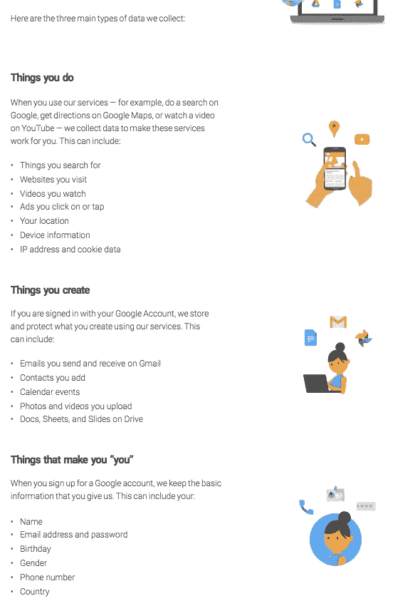
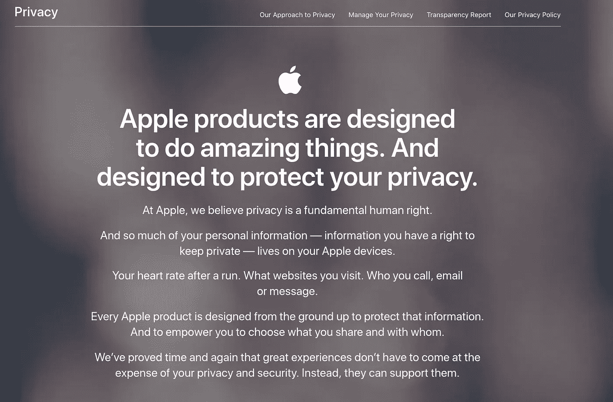
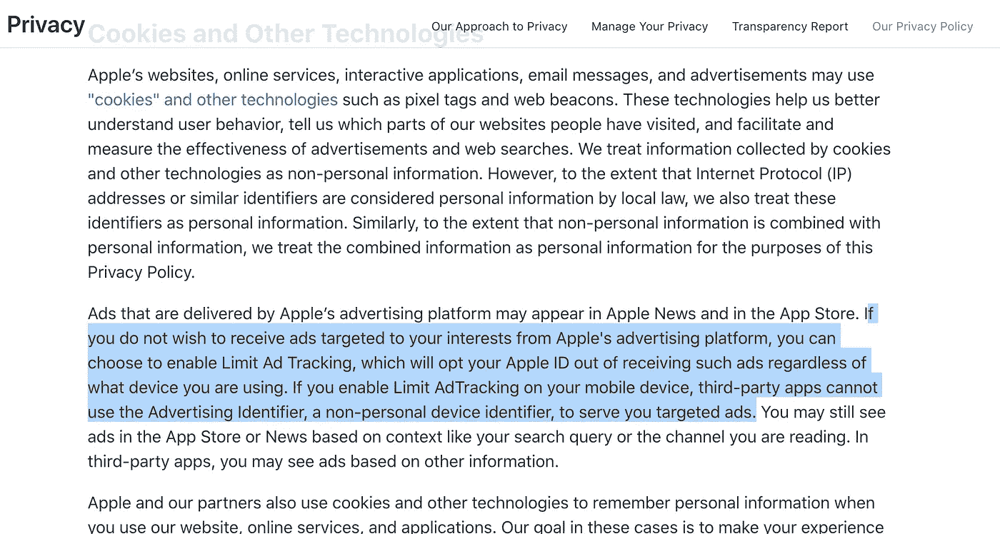
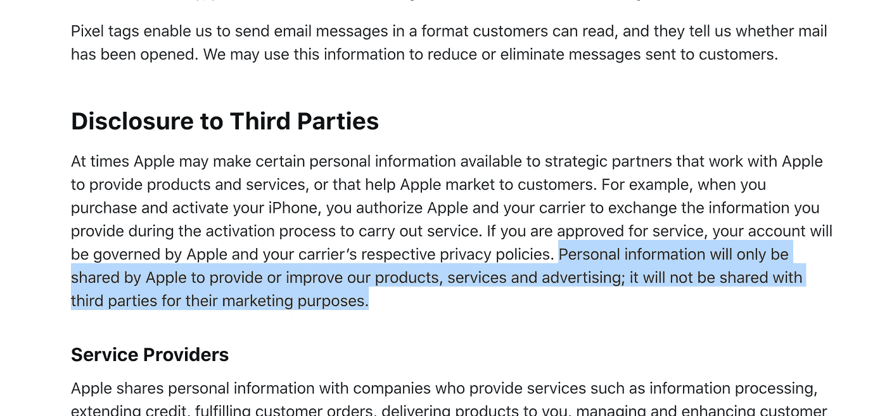
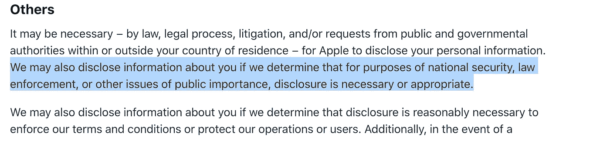
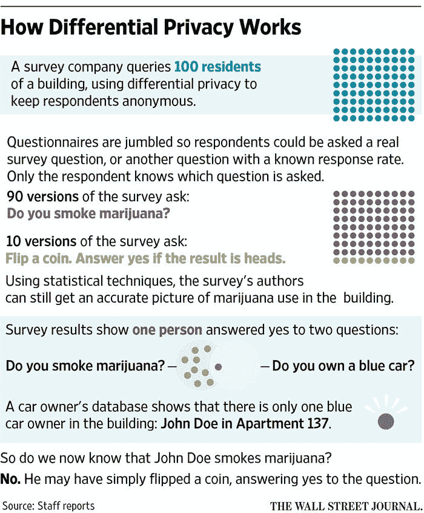

# 苹果最好的产品是隐私，不是 iPhone

> 原文：<https://medium.com/hackernoon/apples-best-product-is-privacy-not-iphone-9919f5fc6fb7>

Source: [https://9to5mac.com/2018/08/09/apple-privacy-weaknesses-questioned/](https://9to5mac.com/2018/08/09/apple-privacy-weaknesses-questioned/)

我手机里的数据(照片、联系人、日历、邮件、信息)准确地定义了我是谁，以及这些天我在做什么。除了这些应用程序，我还很少使用脸书、Instagram、Twitter 和 LinkedIn。正如我们所知，脸书、亚马逊、谷歌等大型科技公司通过对我们的电子邮件、信息、照片和联系人运行他们的[机器学习](https://hackernoon.com/tagged/machine-learning)算法，侵犯了我们的[隐私](https://hackernoon.com/tagged/privacy)。你数字生活的任何部分都不会被触及。你的地理位置，IP 地址，文件，表格也不像你想的那么隐私。这些数据可能会在您不知情/未经您同意的情况下出售给第三方消费者。

想象一下，你的手机里有你和你孩子的照片，这很可爱，但你会希望这些照片未经你的同意就公开吗？没有人希望自己的私生活成为商业模式。

可悲的是，大型科技公司正是这样做的。

最近我下载了脸书，谷歌，苹果关于我的数据。你也能做到。它是非常直接的。以下是链接:

 [## 如何下载一份脸书对你的了解

### 脸书几乎储存了你加入社交网络以来的每一次互动，包括每一次…

www.cnbc.com](https://www.cnbc.com/2018/03/23/how-to-download-a-copy-of-facebook-data-about-you.html)  [## 如何下载苹果公司了解你的所有信息的副本

### 像脸书和谷歌一样，苹果有一个非常简单的方法来下载一个显示苹果所有信息的文件…

www.cnbc.com](https://www.cnbc.com/2018/04/25/how-to-download-a-copy-of-apple-data-about-me.html)  [## 下载您的数据

### 你可以从你使用的谷歌产品中导出和下载你的数据，比如你的电子邮件、日历和照片。几分钟后…

support.google.com](https://support.google.com/accounts/answer/3024190?hl=en) 

我花了大约一个小时从脸书和谷歌获得数据，但苹果花了大约一个星期。

我从脸书得到的 zip 文件的大小是 144 MB，从谷歌得到的是 **5.03 GB！苹果给我的文件只有 5MB。**

看到脸书档案的内容，我感到震惊。我看到了我几年前删除的联系人，我看到脸书确切地知道我正处于人生的哪个阶段，它与许多公司分享了我的联系信息；我都没听说过的公司！我看到脸书调查了我加入后所有的信息交流。在这个网络世界里没有隐私的概念。我甚至懒得下载谷歌档案，因为我知道它会有什么。我肯定它会比脸书更令人震惊。

我意识到我需要以某种方式消除我的数字痕迹，并切换到更有隐私保障的方式。在下一篇文章中，我将讲述如何在这个数字时代变得更加安全和隐私。

# 苹果隐私 vs 谷歌隐私

以下是谷歌与你联系的数据片段。这摘自他们的官方网页:[https://privacy.google.com/your-data.html](https://privacy.google.com/your-data.html)

Source: [https://www.apple.com/in/privacy/](https://www.apple.com/in/privacy/)

和苹果的隐私对比一下就知道了。令人震惊！谷歌直截了当地说它能读取你的电子邮件，苹果说甚至你的心率也是隐私。

> “事实是，如果我们将客户货币化——如果我们的客户就是我们的产品——我们就能赚很多钱，”库克说。“我们决定不这么做。”

我花了一些时间阅读苹果公司的隐私政策。以下是一些片段。我肯定你会喜欢它们的。

iMessage 和 FaceTime 上的对话受到端到端加密的保护，这意味着即使是苹果也无法看到它。苹果也不会以任何可识别的形式存储你的地理位置、地图搜索、Siri 请求。

苹果掌握着你的信息，主要是你通过 iTunes、App Store 消费的内容、电话服务数据、与你开出的罚单相关的数据。苹果不像谷歌和脸书那样储存任何信息、地理位置和广告。

[如果你真的深究隐私这个话题，你可能会发现，苹果让你的 iCloud 钥匙链可以防 NSA，在使用移动设备管理时保护员工的个人信息不被雇主知道，并且设计了没有执法后门的 iPhone。](https://www.macworld.com/article/2366921/why-apple-really-cares-about-your-privacy.html)

[但最近最有说服力的消息是，苹果似乎将随机分配 iOS 设备的 Wi-Fi 硬件地址，以挫败位置和广告追踪器，当你在公共场合走动时，这些追踪器使用这个地址来知道你是谁。这是一个微妙的功能，绝大多数 iOS 用户不会意识到它的存在，即使它保护了他们。](https://www.macworld.com/article/2366921/why-apple-really-cares-about-your-privacy.html)

机器学习算法需要大型数据集来产生令人印象深刻的结果。苹果公司使用**差分隐私**的未来技术，在不损害用户隐私的情况下获得令人印象深刻的结果。差分隐私是一种基于密码术的实践，用于获取使用和偏好数据，而不将其与特定用户联系起来。

 [## 苹果在尖端隐私技术上加大赌注

### 苹果公司启动了一项大规模的新隐私技术实验，旨在解决一个日益棘手的问题…

www.wsj.com](https://www.wsj.com/articles/apple-expands-bet-on-cutting-edge-privacy-technology-1499425201?mg=prod/accounts-wsj) 

随着每次 iOS、OSX、iCloud 更新，苹果总是试图加强其隐私政策。iOS 的设计目的是不弹劾用户的隐私设置。没有键盘嗅探击键并将它们发送到互联网(就像在 Android 上发生的那样)。苹果公司提供的智能家居(HomeKit)服务确保用户的数据在他们的控制之下。网络浏览器 Safari 提供了使用注重隐私的搜索引擎 DuckDuckGo 的选项。生物指纹(触控 ID)在硬件(iPhone、Mac、iPad)中受到保护。

> 即使苹果产品真的很贵，但苹果提供的最好的产品确实是无价的。