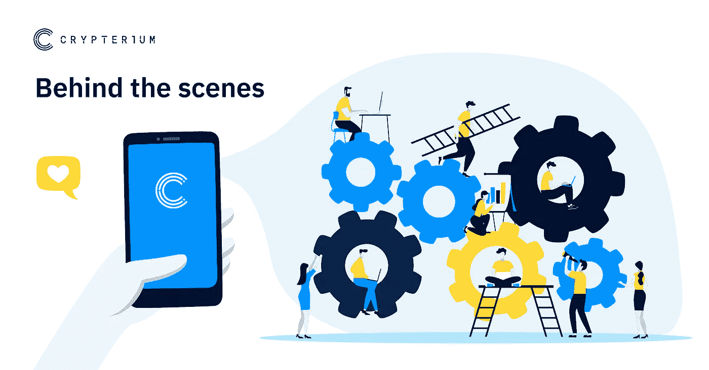
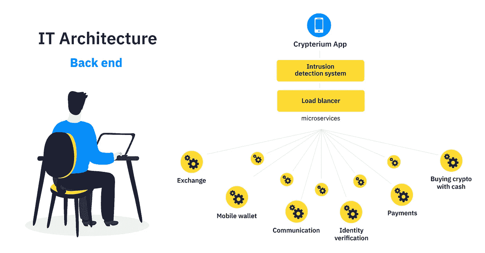
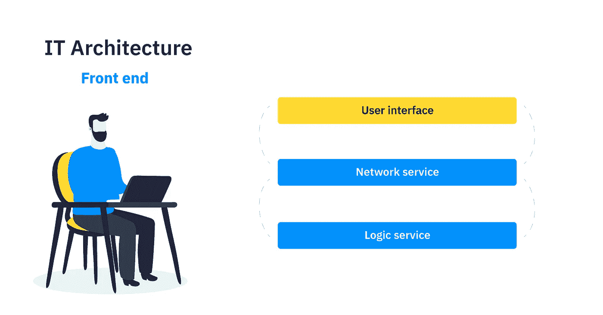

# 用你妈妈能理解的方式解释应用程序架构

> 原文：<https://medium.com/hackernoon/application-architecture-explained-in-a-way-your-mom-will-understand-d9ce71c12903>

***警告:本文包含大量关于编程和技术术语的信息。虽然不会提到哥特式或巴洛克风格，但不是那种建筑。***

简而言之，移动应用架构是一套技术和模式，可以帮助开发者创建一个结构良好的应用。

在 [Crypterium](http://crypterium.com) ，我们正在开发一个非常复杂的[手机应用](https://crypterium.com/install)，让用户用[加密货币](https://hackernoon.com/tagged/cryptocurrency)支付，就像用现金和卡支付一样简单。尽管如此，我们还是希望我们的用户了解幕后的一切是如何工作的。我们将尽可能保持简单，以便您最终了解您每天使用的应用程序是如何构建的。

## 前后解释

您可能听说过应用程序架构在前端和后端有很大的不同，但是没有人真正解释这意味着什么。让我们抛开专业术语，用日常生活来打个比方。

看看你自己的身体。外面的一切，像你的头和身体，都是“前面”，而里面的一切，像你的心、脑和内脏，都是你“后面”的一部分。

我们正在建立一个支付应用程序，而我们的后端团队开发服务，确保所有的交换，转移，存储数据等。，我们的前端确保所有这些复杂的操作以用户友好和易于理解的方式显示给应用程序用户。

## 开发敏捷应用的关键原则

一旦我们理解了前端和后端之间的区别，让我们也弄清楚最进步的开发人员在他们今天的工作中使用的两个关键原则— [API](https://hackernoon.com/tagged/api) 优先和松散耦合。这些都是当代的技术，让你开发一个现代的应用程序，可以很容易地改进。此外，应用程序的任何独立部分都可以独立增强，而无需更改其他部分。

**API first method** 重视高速和新奇高于一切。这个想法很简单:您输入关键的源数据并获得一个 API，在此基础上，后端和前端团队并行编写代码，而测试人员同时准备测试。这种方法的好处包括降低开发成本、提高速度和最小化失败风险。

这里有一个日常生活中的类比:当你在做肉酱面时，你不会先做意大利面，然后再做调味汁，你会并行地做所有的事情。这样你可以更快地得到美味的食物，不会冷，你的朋友可以根据他们的预期来测试结果。

我们在 API-first 方法中使用的一个功能叫做 Swagger(不要与 2015 年在 hip-hop 中流行的趋势或 urban dictionary 的描述混淆)。Swagger 是一个开源软件框架，帮助开发人员构建、设计、记录和设计服务。Swagger tooling 自动为前台和后台生成大多数语言和框架的 API 描述。

第二个原理叫做**松耦合。**情人节约会取消的情况不是松耦合，恰恰相反，在计算和系统设计中，松耦合意味着网络中的组件互连。

松散耦合指的是系统的一个元素对另一个元素的直接了解程度，这些元素在尽可能小的程度上相互依赖。目标是降低在任何元素中所做的更改会在其他元素中引起更改的风险。当出现问题时，限制互连有助于隔离和识别问题，从而简化测试和维护。

## 微服务与整体服务

由于 API 优先和松散耦合原则，Crypterium 在微服务上运行其应用程序。整个应用程序由独立的服务组成，这些服务能够在自己的内存空间上运行，并可以在许多独立的机器上自由扩展。

微服务架构组织得更好，因为每个微服务都有特定的工作。分离的服务也更容易重新配置和重组，以服务于不同的应用程序。此外，它们的特点是快速部署、容错、水平扩展、团队入门水平低、小团队开发和易于管理。

想象一个智能房子，所有东西都可以通过一个设备来控制和管理。这个设备是*核心*，而可控元素是*服务*。有了核心设备，你可以打开窗户，打开电视，甚至关闭窗帘。这基本上就是微服务架构的工作方式。

但总有另一种选择，对吧？第二种类型的架构是整体架构。这意味着应用程序被编写为一个代码单元，其组件被设计为一起工作，共享相同的资源和内存空间。这种应用程序中的服务是紧密相连的，你很难在不干扰其他服务的情况下改变其中一个。想象一个惊人的 12 层巧克力蛋糕。层可能会使这个蛋糕好吃 12 倍，但你不能改变其中一层而不破坏整个蛋糕。这基本上就是整体建筑。

## 。NET Core 与 JVM 平台

多功能应用程序，如手机钱包，通常有数百种不同的服务。为了使工作更加结构化，在 Crypterium，我们决定将我们的后端开发人员分成两个不同的团队。一个团队只负责核心产品，另一个团队负责所有其他的事情(授权、沟通等等。)

每个团队都使用自己的框架。“核心团队”继续工作。网芯多。该平台的特点是快速开发、部署和测试。此外，主要优势包括高性能、适合跨平台需求和面向微服务。同时，附加服务是在 JVM 框架下开发的，JVM 框架是。Oracle 支持的 NetCore。

拥有两个最流行的框架允许我们雇佣习惯不同编程语言的开发人员。因为。NET 核心，我们用 C Sharp 编程语言，对于 JVM 我们用 Kotlin 和 Java。此外，中使用的语言与我们的前端团队用于我们的 Android 应用程序的语言相同。

## 前端解释

前端团队确保应用程序是用户友好的，界面是可读的，可控的，每个人都可以理解的。我们在 iOS 上为 iPhone 用户开发了一个应用，在 Android 上为其他智能手机用户开发了一个应用。

Android 版的 [Crypterium 应用](https://crypterium.com/install)基于 Java 和 Kotlin 语言(就像 JVM 框架一样)，而 iOS 应用基于新的、易于使用的编程语言 Swift。Swift 是苹果公司创造的，非常适合 iPhone 和/或 MacOS。功能包括访问控制、内存管理、调试、链接和面向协议的编程。

## iOS 的 MVVM 和路由风格

[Crypterium](http://crypterium.com) 的 iOS 开发团队选择了 MVVM 和路由风格的架构。这些架构对用户和开发者都是友好的，此外，它们是非常结构化的。

MVVM 代表模型-视图-视图模型，其中模型表示关于产品的信息，视图显示客户如何看待产品。MVVM 有一个层式结构:第一层代表 UI(用户界面)。其他层包括网络服务和逻辑服务。同时，路由负责屏幕后面的转换，决定客户的旅程。用户点击任何按钮去哪里，看到什么，都由路由控制。

让我们分析一个例子，一个用户想把他的密码发送到另一个地址。网络服务层保存着有关发送的加密量和地址的信息。当用户确认交易时，逻辑服务层检查是否有足够的加密货币用于转移，并向用户提供肯定或否定的答案。

## Android 的干净架构

为了增加应用程序的易维护性和灵活性，我们的 Android 团队决定使用一种叫做“干净架构”的方法。这种方法确保不存在不必要的耦合，并使应用程序更具可测试性。

结果是一个干净的，新的，新鲜的，易于使用的 Android 应用程序，从上到下有 4 层:移动设备(或 web，数据库，UI)，控制器(网关，演示者)，用例和实体。

## 结论

应用程序架构是一个非常复杂的主题，上面写的一切只是冰山一角。然而，好消息是我们将继续关注这个和其他相关的主题，并更频繁地发布关于我们产品的技术部分。

## 关于隐密处

 C 在世界各地购物，在任何 NFC 终端或通过扫描二维码用硬币和代币支付。在网上商店购物，支付您的账单，或者只是在几秒钟内跨境汇款，可靠且只需几分之一便士。

加入我们的 [**电报新闻频道**](https://t.me/crypterium_en) 或其他社交媒体，保持更新！

[**网站**](http://crypterium.com)**๏**[**电报**](https://t.me/crypterium)**๏**[**脸书**](https://www.facebook.com/pg/crypterium.org)**๏**[**推特**](https://twitter.com/crypterium)**๏**[**bitcointalk**](https://bitcointalk.org/index.php?topic=2214098.0)****************