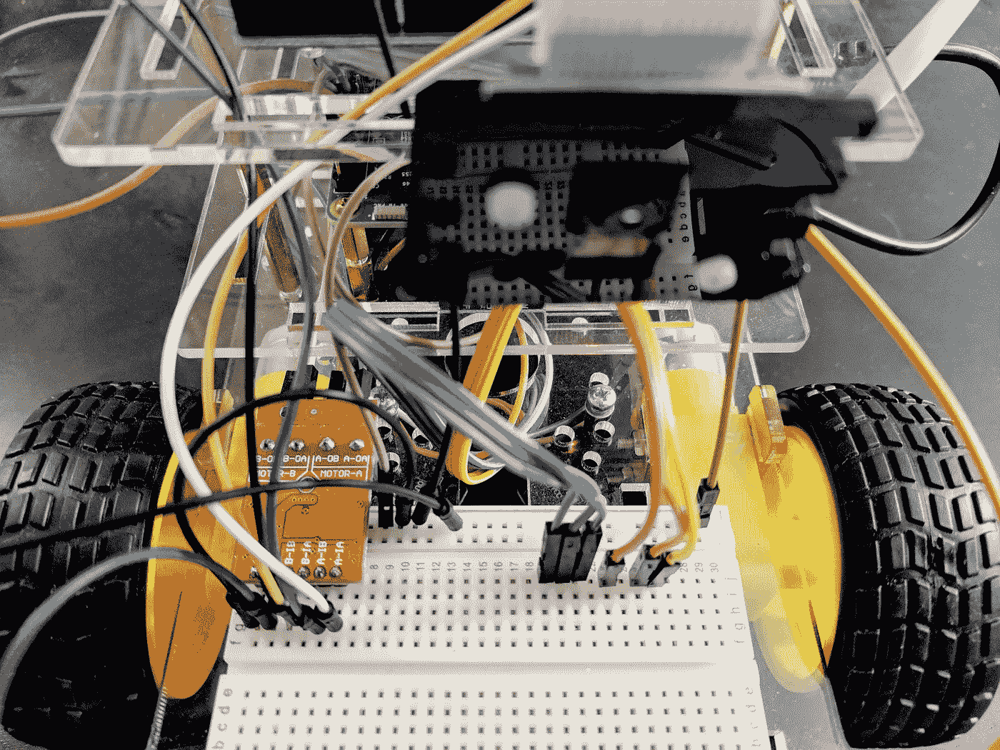
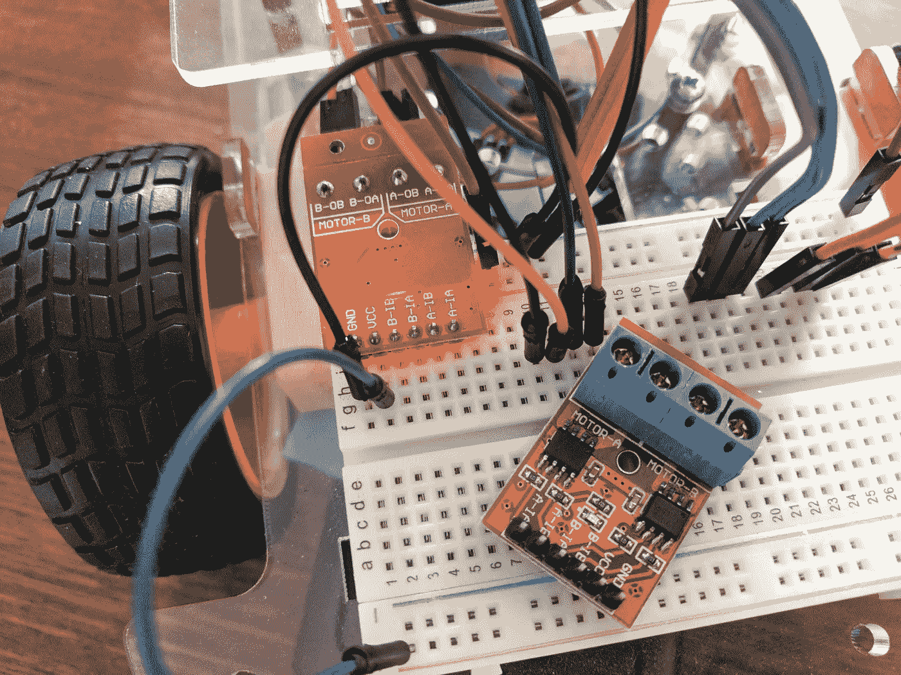
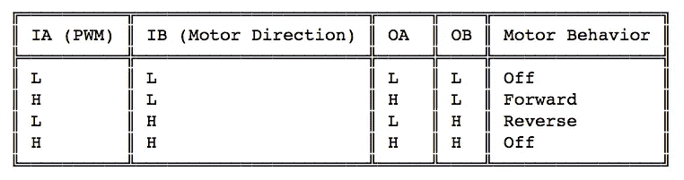
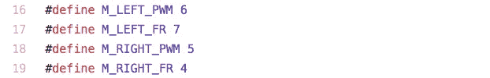
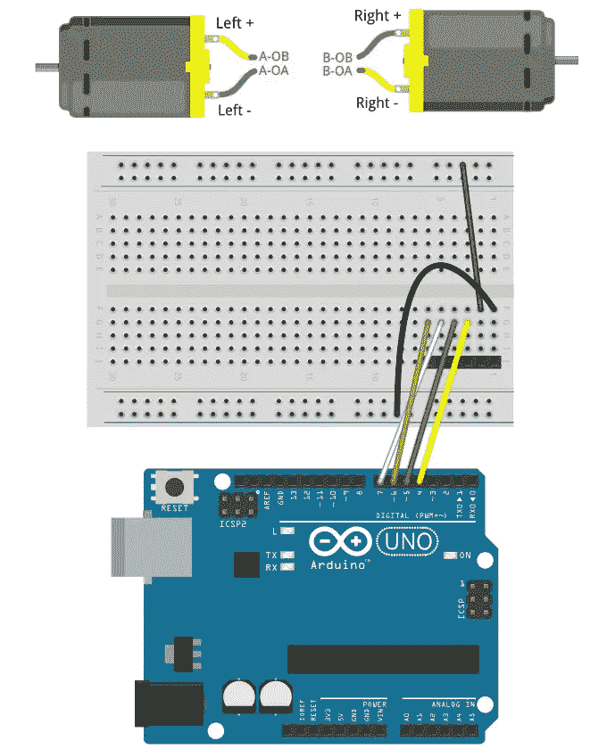
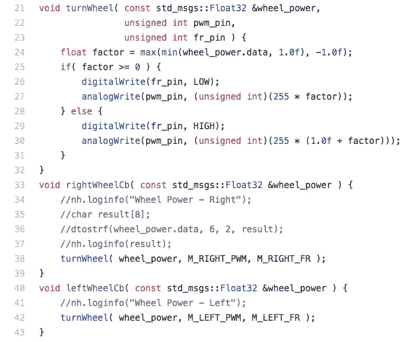
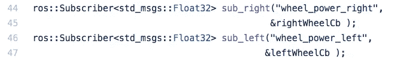

# 用 ROS 和 ROSbots 应用 Coursera 控制移动机器人—第 1 部分

> 原文：<https://medium.com/hackernoon/apply-coursera-control-of-mobile-robots-with-ros-and-rosbots-part-1-777a51f63617>



> **(2020 年 3 月 28 日更新—由于 ROS 商标问题，我们现在是**[**【hada bot**](https://www.hadabot.com)**。查看新的**[**hada bot**](https://www.hadabot.com)**机器人套件！！)**

ROSbots 是一个面向创客的 ROS + OpenCV 机器人套件。我们最近[推出了基于 Raspberry Pi 3 的 ROSbots 版机器人套件](/@rosbots/ros-opencv-robot-kit-for-makers-7e22d91b4fd7)。

该套件包括一个摄像头、车轮编码器、两个可充电锂电池电源，甚至还有一个 Arduino 兼容的 UNO 板，用于硬件 PWM、中断和 ADC 支持。

硬件很有趣，但更重要的是，我们想用硬件来应用机器人概念。这需要学习软件和知识，用现代软件工具如 [ROS](https://www.rosbots.com/) 和 [OpenCV](https://opencv.org/) 来实现这些机器人概念。

作为一个多部分系列的第一篇文章，我们计划发布从 [Coursera 移动机器人控制](https://www.coursera.org/learn/mobile-robot)课程中学到的概念，并将它们应用到使用 ROS 的 ROSbots 机器人上。《移动机器人控制》课程为理解移动机器人控制理论奠定了基础——如何可预测地控制你的机器人，以及如何使用传感器数据来估计姿态并让你的机器人了解周围环境。

(2018 年 3 月 24 日更新:[该系列的第二部分——我们谈论独轮车和差动驱动机器人模型](/@rosbots/unicycle-to-differential-drive-courseras-control-of-mobile-robots-with-ros-and-rosbots-part-2-6d27d15f2010)——已经出版。)

完成我们的多部分系列后，您将对机器人控制理论和 ROS 有一个工作理解。

*(关注@rosbots 获取更新。关注我们的*[*insta gram*](https://www.instagram.com/rosbots/)*和* [*脸书*](https://www.facebook.com/hackrosbots) *吧！)*

如果你有自己的 [ROSbots 机器人](https://www.rosbots.com/purchase)，我们欢迎你跟随。动手使用你自己的 ROSbots 工具包会给我们写的东西增添更多的色彩，而不仅仅是阅读这篇文章。

在本帖中，我们将准备实施移动机器人控制第一周中描述的控制模型。具体来说，我们将在本帖中做以下工作:

1.  了解 ROBbots 机器人上的 L9110 电机驱动器如何工作。
2.  浏览 Arduino 草图代码，该代码实现了一个 ROS 节点来驱动 L9110 旋转车轮。
3.  编译并上传 ROS-Arduino 草图到我们的 ROS bot 的 UNO 板上，并在 ROS bot 的主大脑上运行 ROS 节点——即它的 Raspberry Pi。
4.  给你一个 ROS 的信息系统如何工作的实际感受——使用一些内置的 ROS 工具来控制我们的马达。

我们希望你了解一点电子学，玩过 Arduinos，有一些软件编程经验，并且熟悉电子学和编码术语。

如果你是一个优秀的自上而下的学习者，那么你不需要学习移动机器人控制课程，也不需要了解移动机器人。但如果你两者都做到了，那肯定是有益于智力的。

# 关于 L9110 电机驱动器

L9110 电机驱动器有两个通道，可以说它有能力控制两个电机。



L9110 mounted on the ROSbots (now [Hadabot](https://www.hadabot.com)) robot and another one shown right side up.

每个通道有 2 个输入控制引脚 IA 和 IB，它们“驱动”连接到 ROSbots 机器人电机的 2 个输出引脚 OA 和 OB。因此总共有 4 个输入引脚和 4 个输出引脚。

一个通道 A 有一组 IA/IB/OA/OB 引脚(连接到我们的左电机/车轮)，另一个通道 B 有一组 IA/IB/OA/OB 引脚(连接到右电机/车轮)。

IA 是我们 PWM 调制电机速度的值。IB 引脚控制电机方向。

L9110 引脚表总结了输入/输出行为:



L9110 input and output pin table

想要用你的 ROSbots 机器人做一个快速演示吗？

1.  将连接到 A-IA 的电线，特别是 ROSbots 试验板上的 G-6，插入试验板(VCC)顶行的任何孔中。
2.  将连接到 A-IB(特别是 G-5)的电线插入试验板(GND)底排的任何孔中。
3.  左轮将向前旋转。
4.  现在交换连接——从 G-6 到 GND，从 G5 到 VCC，现在左轮将向后旋转。

我们将通过编写支持 ROS 的 Arduino 草图，在我们的 ROSbots 机器人上驱动带有 UNO 板的 L9110。

[main.cpp 的草图代码可以在 rosbots_driver Github repo](https://github.com/ROSbots/rosbots_driver/tree/master/platformio/rosbots_firmware/examples/motor_driver/src/main.cpp) 中找到(别忘了星随！).

让我们跳过一堆特定于 ROS 的代码，从第 16 行开始直接跳到这个代码块。



注意，右滚轮的 IA (PWM)和 IB(方向)引脚分别连接到 UNO 板上的引脚 5 和 4；左轮的 IA 和 IB 连接到针脚 6 和 7。

接下来，让我们看看实际驱动销转动轮子的代码块。



Ignore the debug code in the comments

在*转轮(…)* 功能中，我们将输入变量 *wheel_power* 箝位在-1.0(全倒车)和 1.0(全前进)之间。这将调制输出到相应 L9110 的 IA 引脚(又名 *pwm_pin* )的 PWM 电压和输出到 IB 引脚(又名 *fr_pin* ，如 fwd-reverse)的数字电压。

*analogWrite(…)* 期间的简单数学运算根据 *wheel_power* 符号指定的方向线性调整 PWM 脉冲宽度——正表示正向，负表示反向。

随着 *wheel_power* 从-1.0 变为 1.0，你可以看到 *pwm_pin* 和 *fr_pin* 从完全后退、停止到完全前进的转变，如本文开头的 L9110 pin 表所述。

让我们编译并上传这个草图代码到我们的 UNO 板上，看看它是如何工作的。

ROSbots 使用 [platformio](http://platformio.org/) 编译并上传 ROS-Arduino 草图代码到 UNO 板上。

1.  我们假设你已经用这些指令设置好了你的 [ROSbots 机器人。](https://github.com/ROSbots/rosbots_setup_tools)
2.  SSH 到您的 ROSbots 的树莓 Pi 中——我们将完成 RPi 的剩余步骤。
3.  在您的 RPi 终端中运行以下命令(随意直接剪切-粘贴):`~/$ upload_firmware ~/gitspace/rosbots_driver/platformio/rosbots_firmware/examples/motor_driver`(全部一行)

成功？？

在我们的 RPi 上，键入`rosnode list`以获得正在运行的 ROS 节点列表——您应该看到以下内容:

```
/rosout
/uno_serial_node
```

键入`rostopic list`以获取正在发布或订阅的 ROS 主题列表——您应该会看到以下内容:

```
/diagnostics
/rosout
/rosout_agg
/wheel_power_left
/wheel_power_right
```

什么是 ROS 节点和主题？这一切意味着什么？

受[发布者/订阅者分布式消息架构](https://en.wikipedia.org/wiki/Publish%E2%80%93subscribe_pattern)的启发，ROS 被设置为一组独立的进程，称为 ROS 节点，它们通过消息相互通信。一个 ROS 节点可以运行读取 Pi 摄像机的进程，然后在“foo”主题通道上以“image”消息类型发布图像。另一个负责检测传入图像中的猫的 ROS 节点将订阅“foo”主题频道。像标准的发布/订阅模型一样，发布者和订阅者不关心谁订阅了或者谁在发布上游和下游。

总之，任何 ROS 节点都可以是通过称为 ROS 主题的命名通道传递的特定消息类型的发布者和/或订阅者。

在我们的示例中，我们编写了一些 Arduino 草图代码，作为订阅两个主题的 ROS 节点— *wheel_power_right* 和 *wheel_power_left* 。这些通道上的消息将是 *Float32* 类型(与上面假设的例子中的“图像”相对)。

看看你编译并上传的这段 Arduino 草图代码:



你会注意到，我们的 UNO 板订阅了两个主题频道——*wheel _ power _ right*和*wheel _ power _ left*——这两个代码块。

当我们得到关于这些主题的消息时，我们分别调用 *rightWheelCb(…)* 和 *leftWheelCb(…)* 回调。如果您还记得，那个回调实现了驱动 L9110 输入引脚的代码。

如果您记得键入了`rostopic list`，那么会列出主题名称 *wheel_power_right* 和 *wheel_power_left* 。

生活是美好的。对吗？

我们的草图代码在我们的 UNO 板上。但是我们的 UNO 板如何与运行在 Raspberry Pi 上的 ROS 系统的其余部分通信呢？

UNO 板通过 USB 连接到我们的 RPi，并通过串口与之通信。这一切都很好，除了 ROS 不直接谈论“串口”！？

如果您再次回忆，当您键入`rosnode list`时，您会看到一个 */uno_serial_node* 被列为正在运行的 ROS 节点之一。为了让 ROS 能够与“串行端口”对话，我们需要一个桥，将 ROS 消息序列化为发送到 UNO 进行处理的串行端口数据包。这个桥应用程序是 ROS 节点，称为[rosserial](http://wiki.ros.org/rosserial)——我们将该节点命名为 */uno_serial_node* 。

*/uno_serial_node* 的工作是打开一个到 uno 板的串口连接，然后序列化/反序列化往返于 UNO 板的 ROS 消息。

键入`rostopic info /wheel_power_left`，您将看到 */uno_serial_node* 作为订户。为什么不说我们的 UNO 代码？

请记住，我们的 UNO 板不能直接与 ROS 系统对话——它只能通过串口与 */uno_serial_node* 对话。我们的 uno 代码确实向 */uno_serial_node* 指定它想要订阅 */wheel_power_left* 主题，并且 */uno_serial_node* 代表 UNO 订阅该主题。你可以认为 rosserial*/uno _ serial _ node*是 ROS 世界和 Arduino Sketch 世界之间的中介。

OK—UNO 是主题 */wheel_power_left* 和 */wheel_power_right* 的订阅者(通过 rosserial*/UNO _ serial _ node*)，这些主题将根据收到的 *Float32* 消息驱动车轮。但是谁是发布者呢？

暂时没有。相反，我们将使用 ROS `rostopic`工具在这些主题频道上手动发布一些 ROS 消息来推动车轮。

在 RPi bash 终端中:

1.  从任何目录，没关系，输入(或剪切-粘贴)`rostopic pub -1 /wheel_power_left std_msgs/Float32 '{data: 1.0}'`——你的左轮应该向前旋转
2.  键入(或剪切-粘贴)`rostopic pub -1 /wheel_power_left std_msgs/Float32 '{data: 0.0}'`——你的左轮应该停下来
3.  键入(或剪切-粘贴)`rostopic pub -1 /wheel_power_left std_msgs/Float32 '{data: -1.0}'`——你的左轮应该向后旋转
4.  键入(或剪切-粘贴)`rostopic pub -1 /wheel_power_left std_msgs/Float32 '{data: -0.5}'`——你的左轮应该向后转得慢一些。

`rostopic pub`命令告诉 ROS 我们想要发布。如果你输入`rostopic pub --help`，你会看到几个选项。`-1`选项表示只发布一次消息，而不是连续发布。下一个选项是主题频道名称。`std_msgs/Float32`是消息类型。`'{data: 1.0}'`是实际有效载荷数据。它采用了类似 JSON 的花括号语法，因为 ROS 将消息概括为数据结构。所以 *Float32* ROS 消息类型是从*STD _ msgs*T23 的一堆标准 [ROS 包中定义的(注意 *Float32* 在链接中列出)。](http://wiki.ros.org/std_msgs) [*Float32* 消息类型](http://docs.ros.org/api/std_msgs/html/msg/Float32.html) 实际上是一个实体的数据结构，一个 32 位浮点。

祝贺您——您刚刚成功发布了关于某个主题的第一组 ROS 消息，并编写了代码来实现订阅和处理该消息的 ROS 节点。随意对右轮做同样的练习。

# ***有疑问？***

如果你有问题，在[answers.ros.org](https://answers.ros.org/questions/)上发表，主题为“ROSbots 问题:*无论你的问题是什么*”，并在帖子上贴上“rosbots”的标签。我们将密切关注论坛，并做出相应的回应。

所有这些与 Coursera 的移动机器人控制课程有什么关系？

我们正在有效地构建部件，以将本课程第 1 周中描述的[独轮车模型转变为差动驱动机器人模型](/@rosbots/unicycle-to-differential-drive-courseras-control-of-mobile-robots-with-ros-and-rosbots-part-2-6d27d15f2010)。然后，我们将添加来自机器人车轮编码器的反馈，以实现车轮速度的 PID 控制器，这将使我们能够估计机器人的姿态——位置和方向。

本系列的最后一篇文章将完全实现课程中描述的编码项目。但是代替使用 Matlab，我们将使用 ROS 和我们的 ROSbots 机器人！

关注@ rosbots on Medium 获取更新。也请在 [Instagram](https://www.instagram.com/rosbots/) 和[脸书](https://www.facebook.com/hackrosbots)上关注我们！

请在此自由发表评论。但是如果你有技术问题，请在 answers.ros.org 发布(主题为“机器人问题: *blahblah* ”，标签为“机器人”)。

如果您想合作，或者只是打个招呼，请不要犹豫，直接与一般反馈联系。如果您还没有这样做，请在这里[购买您自己的机器人来跟进。](https://www.rosbots.com/purchase)

谢谢！
杰克“机器人制造商”