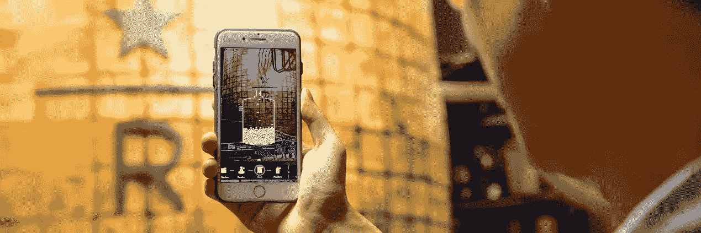
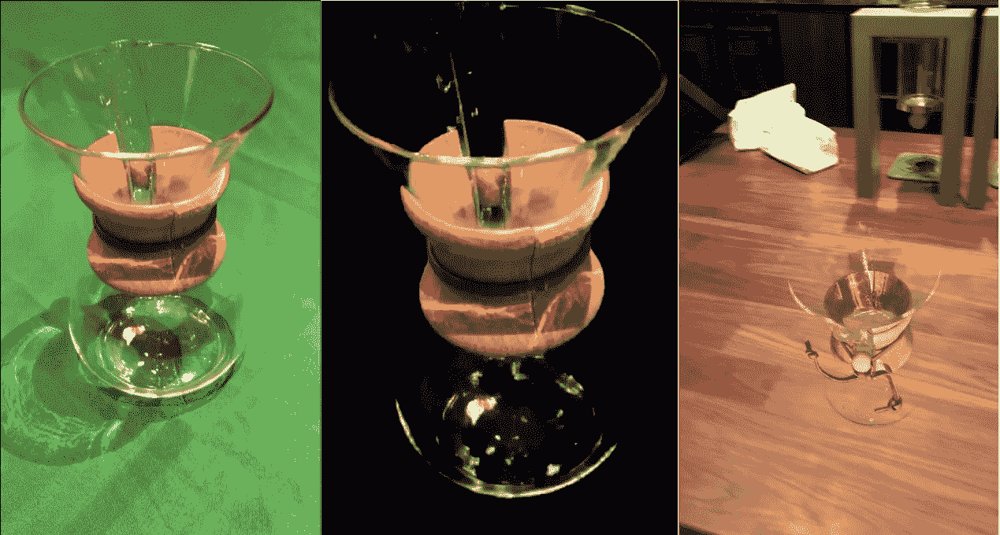
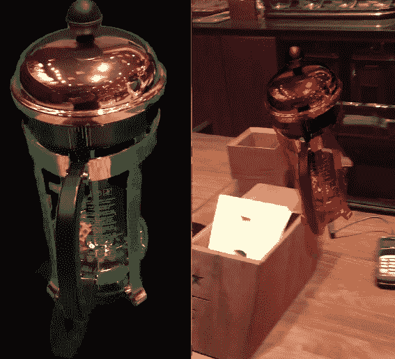
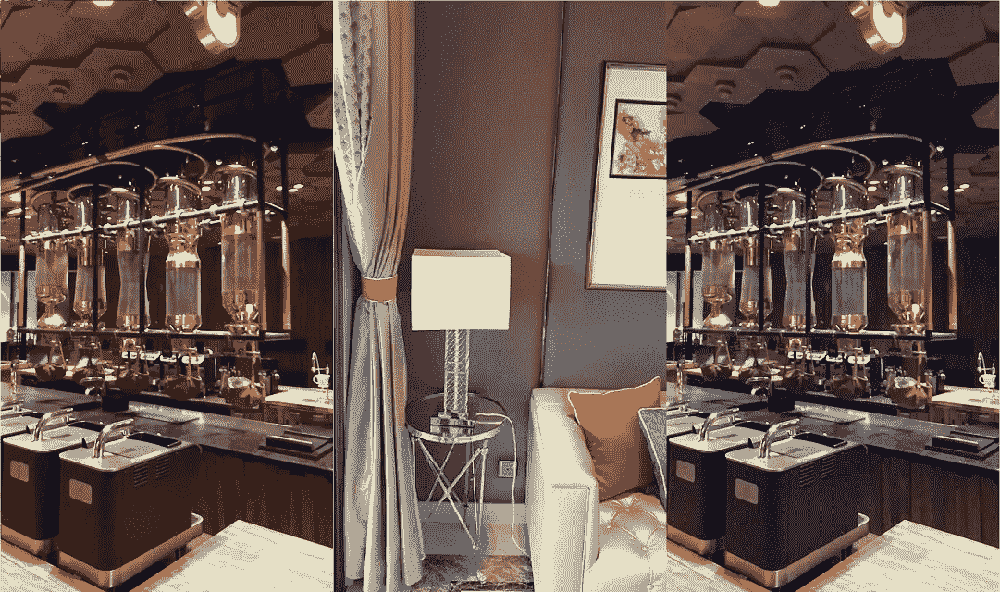
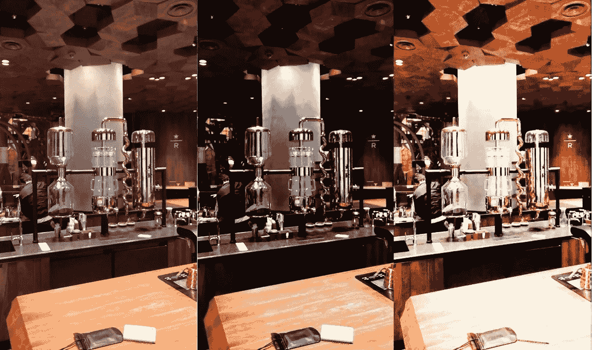

# 想要一杯更浓的咖啡吗

> 原文：<https://medium.com/hackernoon/ar-for-a-richer-cup-of-coffee-227465e8b626>

*阿里巴巴工程师为咖啡爱好者设计的最新技术*

上海的星巴克保留烘焙和品尝室于 2017 年开业，是世界上第一家具有增强现实(AR)体验的零售咖啡店。这项 AR 技术由阿里巴巴的 AR 平台 Laboratory X 开发，客户可以一边品尝拿铁咖啡，一边探索商店，了解关于咖啡的一切，包括咖啡来自哪里以及如何制作。尖端的 AR 技术基于人工智能(AI)，星巴克已经应用它来创造真正独特的咖啡馆体验。

*AR technology used to glance into Starbucks’ huge copper roasting cask*

# AR 解释道

AR 是一种实时结合现实和虚拟内容的图形技术。让我们以参观星巴克为例。如果顾客将他们的手机指向咖啡机，那么它将被识别为咖啡机，并且在它上面覆盖一个交互式按钮。

这个内容叠加的过程涉及到 AR 技术的三个原理:

识别物体(即寻找咖啡机)

呈现覆盖的内容(即在咖啡机上绘制交互按钮)

跟踪所识别的对象(即，当用户移动他们的电话时，确保交互式按钮“粘”在咖啡机上)

跟踪和渲染技术已经相对成熟和发达。然而，识别物体是增强现实应用的主要技术障碍。

# 看不清楚

AR 的需求要求在客户端实时执行识别，以获得最高效的体验。客户端计算方法识别不易受模式影响的较大对象，例如 Starbucks 桶，并使用各种数据处理策略来实现最终迷人的结果。与访问服务器的方法不同，客户端计算不受网络速度的限制，因此响应速度快，体验稳定。

但是，有几种类型的对象会给 AR 系统的识别带来困难，具体来说:

从不同的角度看，金属表面反射出不同的图案。

透明表面，如中空和透明容器。

环境或设备的变化增加了一致识别物体的难度，例如不同型号的智能手机及其功能。

为了克服这些困难，建立了基于云的深度学习识别服务器。

# 云识别

图像上的深度学习应用现在相对成熟，以下相关模型已用于星巴克 AR 体验:

图像分类模型:这种有很高的感知能力，但不能确认目标位置。

目标检测模型:这种模型感知能力较低，但能准确确认目标位置。

通过结合两种模型的优点，大多数对象可以被对象检测模型识别，而分类模型可以用于更难识别但可以给出图像中的估计位置的对象。

# 图像合成

图像合成的主要目的是教会机器区分前景和背景，而不是获得可测量的物理结果，如物体的大小。

图像合成已经成为一种有用的工具来克服场景多样性引起的物体识别问题。它可以用于通过收集多个目标对象图像的信息来自动识别目标对象。这是在绿色屏幕背景下完成的，然后背景被移除，目标颜色被切换到与背景相似的分布。

机器学习和深度学习都需要海量的数据，需要花费大量的时间和精力去收集。由于对象(如透明和反光的咖啡壶)可能出现在场景中的任何位置，因此训练数据尽可能多样化以涵盖所有可能的场景非常重要。

*Image synthesis process for target object recognition*

*Color transforming image example*

虽然这些方法只能用于基本的增强现实应用，但对于更大规模的应用来说，仍然存在一些悬而未决的问题。

# 颜色和图像模拟

AR 目标识别很大程度上依赖于设备摄像头分辨率。因此，对于大规模的星巴克应用程序，适应用户不同的智能手机型号和规格至关重要。这可以通过简单地使用许多不同型号的智能手机收集数据来克服，但这不是一种现实的方法。相反，现有的图像被切换到来自其他智能手机的模拟图像，使用两个自动化的过程:

1.  纯色转换:使用图像 B 作为参考，此过程转换图像 A 中的颜色分布，使其与图像 B 的颜色分布统一。

*Example pure color transformation image simulation*

2.响应曲线模拟:这个过程用摄像机 B 的响应曲线代替摄像机 A 的响应曲线来模拟来自摄像机 B 的图像。

*Example response curve simulation image simulation*

# 更多增强现实应用

这种 AR 技术的应用将现实与虚拟内容结合起来，并允许星巴克保留烘焙和品尝室重塑咖啡店。独特的 AR 体验为客户提供了真正出色的体验，他们可以通过熟悉自己的智能手机来钻研咖啡世界。

这种线上和线下零售的结合为独特的 AR 零售体验提供了无限的可能性，毫无疑问，未来将被用于多个行业和平台。

(Original article by Yang Xiaoyi 杨攸奕)

# 阿里巴巴科技

关于阿里巴巴最新技术的第一手深入信息→在**上搜索 [**【阿里巴巴科技】**](http://www.facebook.com/AlibabaTechnology)**