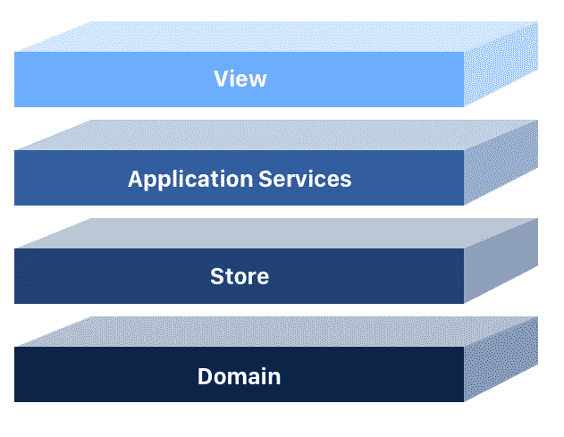
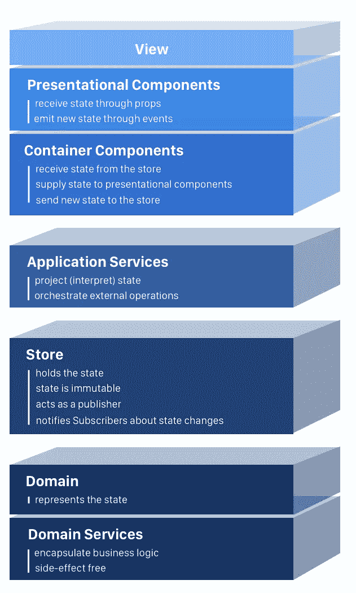
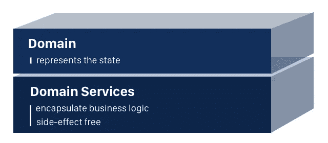
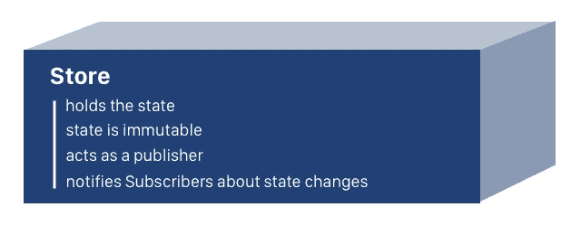
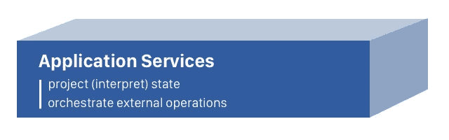
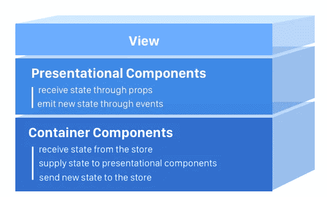

# 你需要知道的 4 层单页应用程序

> 原文：<https://medium.com/hackernoon/architecting-single-page-applications-b842ea633c2e>

# 让我们从头开始构建一个 React 应用程序，探索领域及其服务、商店、应用程序服务和视图。

The four layers of single page applications — by [Alberto V](https://dribbble.com/AlbertoV)

每个成功的项目都需要一个清晰的架构，所有团队成员都理解这个架构。

想象你是团队的新成员。技术负责人介绍了路线图中即将出现的新应用的建议体系结构:

The four layers of single page applications (detailed)

他谈到了要求:

> 我们的应用程序将显示文章列表。作为用户，我将能够创建、删除和喜欢文章。

然后他让你去做！

# 好的，没问题，让我们开始架构吧

我选择了 [Create React App](https://github.com/facebook/create-react-app) 和 [Flow](https://flow.org) 进行类型检查。为简洁起见，应用程序没有样式。

作为先决条件，让我们谈谈现代框架的声明性本质，触及状态的概念。

# 今天的框架是声明性的

React、Angular、Vue 是[声明式](https://tylermcginnis.com/imperative-vs-declarative-programming/)，鼓励我们使用功能性编程的元素。

你见过翻书吗？

> 翻页书是一本有一系列图片的书，这些图片从一页到下一页逐渐变化，所以当快速翻页时，这些图片看起来是有生命的……[1]

现在让我们检查 React 定义的一部分:

> 为应用程序中的每个状态设计简单的视图，当数据发生变化时，React 将有效地更新和呈现正确的组件……[2]

也是 Angular 的一部分:

> 使用简单的声明性模板快速构建功能。用你自己的组件扩展模板语言… [3]

听起来很熟悉？

框架帮助我们构建由视图组成的应用程序。视图是状态的表示。但是状态是什么呢？

# 国家

状态代表应用程序中发生变化的每一条数据。

你访问一个 URL，这是 state，发出一个 Ajax 调用来检索电影列表，这也是 state，你把信息持久化到本地存储，同上，state。

状态将由**不可变对象**组成。

[不可变架构](http://enterprisecraftsmanship.com/2016/05/12/immutable-architecture)有很多好处，一个是在视图级别。

这里引用了 React 的[优化性能](https://reactjs.org/docs/optimizing-performance.html)指南:

> 不变性使得跟踪变更变得便宜。一个改变总是会产生一个新的对象，所以我们只需要检查对该对象的引用是否已经改变。[4]

# 领域层

域描述了状态并保存了业务逻辑。它代表了我们应用程序的核心，对于视图层应该是不可知的。Angular，React，Vue，应该没关系，不管选择什么框架，我们都应该能够使用自己的域。

The domain layer

因为我们正在处理不可变的架构，我们的领域层将由实体和领域服务组成。

在 OOP 中存在争议，尤其是在大规模应用中，当处理不可变数据时，贫血域模型是完全可以接受的。

> 对我来说，Vladimir Khorikov 的这个[课程](https://www.pluralsight.com/courses/refactoring-anemic-domain-model)让我大开眼界。

为了显示文章列表，我们首先要建模的是**文章**实体。

所有类型为 **Article** 的未来对象都是不可变的。流可以通过将每个属性设为只读来[实施不变性](https://flow.org/en/docs/react/redux/#typing-redux-state-immutability-a-classtoc-idtoc-typing-redux-state-immutability-hreftoc-typing-redux-state-immutabilitya)(参见每个属性前的加号)。

Article.js

现在让我们使用工厂函数模式创建 **articleService** 。

> 看看@mpjme 的这个[视频](https://www.youtube.com/watch?v=ImwrezYhw4w)吧，里面有很棒的解释**。**

由于在我们的应用程序中只需要一个 **articleService** ，我们将把它导出为一个 singleton。

**createArticle** 方法将允许我们创建 **Article** 类型的[冻结对象](https://developer.mozilla.org/en-US/docs/Web/JavaScript/Reference/Global_Objects/Object/freeze)。每篇新文章将有一个唯一的自动生成的 id 和零喜欢，让我们只提供作者和标题。

> 方法冻结一个对象:也就是说，防止新的属性被添加到它里面。[5]

**createArticle** 方法返回一个“maybe”**Article**类型。

> [也许](https://flow.org/en/docs/types/maybe)类型会让你在操作一个 **Article** 对象之前检查它是否存在。

如果创建文章所需的任何字段验证失败， **createArticle** 方法返回 null。有些人可能认为抛出一个用户定义的异常更好。如果我们强制这样做，而上层没有实现 catch 块，程序将在运行时终止。

**的 updateLikes** 方法将帮助我们更新一篇现有文章的赞数，方法是返回一份包含新赞数的副本。

最后， **isTitleValid** 和 **isAuthorValid** 方法防止 **createArticle** 处理损坏的数据。

ArticleService.js

验证对于保持数据的一致性非常重要，尤其是在领域级别。我们可以从纯函数中组合出我们的**验证器**服务。

Validators.js

出于演示的目的，请对这些验证持保留态度。

> 在 JavaScript 中，检查一个对象实际上是否是一个对象并不容易。:)

我们现在有我们的领域层设置！

好的一面是，我们现在就可以使用我们的代码，与框架无关。

让我们看看如何使用 **articleService** 来创建一篇关于我最喜欢的一本书的文章，并更新它的赞数。

domain-demo.js

# 商店层

创建和更新文章产生的数据代表了应用程序的状态。

我们需要一个存放这些数据的地方，商店是这项工作的最佳人选。

The store layer

这种状态很容易用一组文章来模拟。

ArticleState.js

**ArticleStoreFactory** 实现了发布-订阅模式，并将 **articleStore** 作为单例导出。

商店保存文章，并对它们执行添加、删除和更新不可变操作。

> 请记住，商店只经营商品。只有 **articleService** 可以创建或更新它们。

有兴趣的可以订阅和退订**文章库**。

articleStore 在所有订户的内存中保存一个列表，并通知他们每一个变化。

[ArticleStore.js](https://gist.github.com/intojs/3acd875bf72c42c559e80e0495039bb5#file-articlestorefactory-js)

我们的商店实现对于演示目的是有意义的，允许我们理解它背后的概念。在现实生活中，我推荐使用类似 [Redux](https://redux.js.org/) 、 [ngrx](https://github.com/ngrx) 、 [MobX](https://github.com/mobxjs/mobx) 或者至少是[可观察数据服务](/bucharestjs/the-developers-guide-to-redux-like-state-management-in-angular-3799f1877bb)的状态管理系统。

好了，现在我们已经设置了域和商店层。

让我们为商店创建两个文章和两个订阅者，并观察订阅者是如何得到更改通知的。

store-demo.js

# 应用服务程序

这一层对于执行与状态流相邻的各种操作非常有用，比如 Ajax 调用从服务器或状态预测中检索数据。

The application services layer

不管出于什么原因，设计师会要求所有作者的名字都是大写的。

我们知道这个要求有点傻，我们不想让它污染我们的模型。

我们创建了**articleiservice**来处理这个特性。该服务将获取一个状态，即作者的名字，并对其进行投影，将它的大写版本返回给调用者。

ArticleUiService.js

让我们来看一个如何使用该服务的演示！

app-service-demo.js

# 视图层

现在我们有一个完全正常工作的应用程序，不依赖于任何框架，随时可以被 React 投入使用。

视图层由表示组件和容器组件组成。

表示组件关注事物的外观，而容器组件关注事物的工作方式。详细的解释请看丹·阿布拉莫夫的[文章](/@dan_abramov/smart-and-dumb-components-7ca2f9a7c7d0)。

The view layer

让我们构建 **App** 组件，由 **ArticleFormContainer** 和 **ArticleListContainer 组成。**

App.js

现在让我们创建 **ArticleFormContainer。**有反应，有棱角，不要紧，形态复杂。

> 查看 [Ramda](http://ramdajs.com) 库以及它的方法如何增强我们代码的声明性。

该表单接受用户输入，并将其传递给 **articleService** 。该服务从该输入创建一个**文章**，并将其添加到**文章存储库**，供感兴趣的组件使用。所有这些逻辑主要存在于 **submitForm** 方法中。

ArticleFormContainer.js

注意， **ArticleFormContainer** 返回用户看到的实际表单，即表象的 **ArticleFormComponent** 。该组件显示容器传递的数据，并发出类似 **changeArticleTitle** 、 **changeArticleAuthor** 和 **submitForm** 的事件。

[ArticleFormComponent.js](https://gist.github.com/intojs/4a41a3817de53c9c8767d11d96d61d79)

现在我们有了创建文章的表单，是时候列出它们了。**文章列表容器**订阅**文章库**，获取所有文章并显示**文章列表组件**。

ArticleListContainer.js

**文章列表组件**是一个表示组件。它通过道具接收物品并渲染**物品容器**组件。

ArticleListComponent.js

**ArticleContainer** 将文章数据传递给表示的 **ArticleComponent** 。它还实现了 **likeArticle** 和 **removeArticle** 方法。

**likeArticle** 方法通过用更新的副本替换商店中现有的文章来更新喜欢的数量。

**removeArticle** 方法从存储中删除文章。

ArticleContainer.js

**文章容器**将文章数据传递给**文章组件**并显示。它还通过执行适当的回调，在点击 like 或 delete 按钮时通知容器组件。

> 还记得作者名字要大写的疯狂要求吗？

**ArticleComponent** 使用来自应用层的 **ArticleUiService** 将一段状态从其原始值(没有大写规则的字符串)投射到所需的值，即大写字符串。

ArticleComponent.js

# 干得好！

我们现在有了一个全功能的 React 应用程序和一个健壮的、定义清晰的架构。任何加入我们团队的人都可以阅读这篇文章，并放心地继续我们的工作。:)

你可以在这里查看完成的 app [，在这里](https://intojs.github.io/architecting-single-page-applications/)查看 GitHub 库[。](https://github.com/intojs/architecting-single-page-applications)

如果你喜欢这个指南，请为它鼓掌。如果你想帮我改进它，我对你的评论很感兴趣。 [@danielDughy](http://twitter.com/danielDughy)

[1][https://en.wikipedia.org/wiki/Flip_book](https://en.wikipedia.org/wiki/Flip_book)
【2】[https://reactjs.org](https://reactjs.org/)
【3】[https://angular . io](https://angular.io/)
【4】[https://reactjs.org/docs/optimizing-performance.html](https://reactjs.org/docs/optimizing-performance.html)
【5】[https://developer . Mozilla . org/en-US/docs/Web/JavaScript/Reference/Global _ Objects/Object/freeze](https://developer.mozilla.org/en-US/docs/Web/JavaScript/Reference/Global_Objects/Object/freeze)