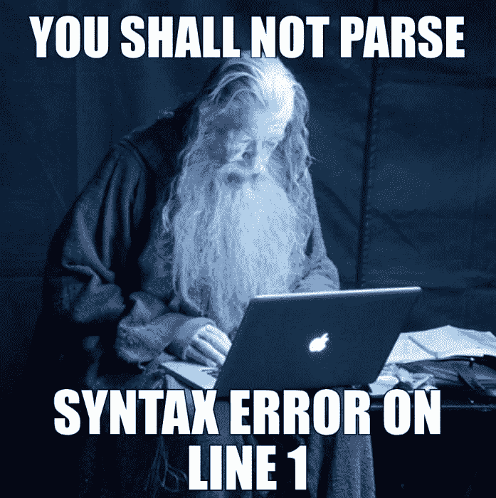
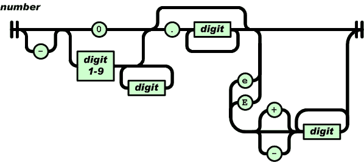
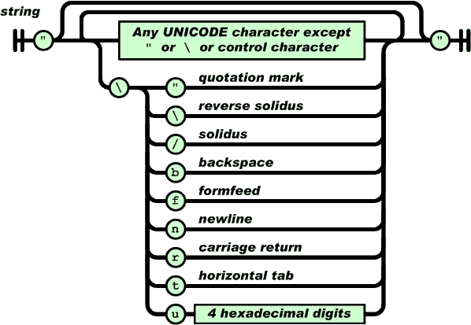

# arc second:JavaScript 解析变得简单

> 原文：<https://medium.com/hackernoon/arcsecond-parsing-in-javascript-made-easy-af1894bdcec9>

Gandalf should have used arcsecond

我最近开始认真尝试学习 Haskell(任何以前尝试过的人可能都会同意，通常需要尝试几次才能破解它)。在 Haskell 提供的许多很酷的东西中，有一个令人惊叹的解析库，它附带了一组标准的包，名为[**【Parsec】**](https://wiki.haskell.org/Parsec)**，**，让您可以描述如何用看起来像自然语言的方式解析复杂的语法。

下面是如何使用 Parsec 实现 CSV 解析器。如果您不理解所有的语法，也不要担心，关键是整个解析器只用四行代码就指定了。

If you want to read more checkout [http://book.realworldhaskell.org](http://book.realworldhaskell.org)

然而，这篇文章不是关于 Haskell，[而是我写的一个名为 **arcsecond** 的库，它基于 Parsec](https://github.com/francisrstokes/arcsecond) ，目标是给 JavaScript 带来同样的表现力。

# 解析器组合子

**arcsecond** 是一个解析器组合子库，在这个库中可以通过组合简单的解析器来构建复杂的解析器。最简单的解析器只匹配特定的字符串或字符:

然后可以用库中的*组合器*将它们组合在一起。

然后新的解析器可以用于文本:

## 组合子

组合子是它变酷的地方。在 **arcsecond** 中，组合子是一个更高阶的解析器，它接受一个或多个解析器作为其输入，并返回一个新的解析器，这个解析器以某种方式组合了这些解析器。如果你已经在 react 中使用了*高阶组件*，比如 ***连接*** 、 ***与路由器*** ，或者 ***与样式*** ，那么你已经熟悉这个想法了。

如上所示，*的 sequenceOf 是一个组合器，它将按顺序使用每个解析器解析文本，并将它们的结果收集到一个数组中。*

****choice*** 则相反，会按顺序尝试它的每个解析器，并使用第一个匹配的解析器。这个库包含更多，像 ***many*** ，它接受一个解析器作为参数，并使用该解析器尽可能多地匹配，将结果收集到一个数组中:*

*您可以使用 ***sepBy*** 来创建一个解析器，该解析器匹配由*另一个解析器*匹配的内容所分隔的项目。*

****between*** 将让您匹配发生在*两个其他解析器*之间的项目。*

## *简化的功能*

***arcsecond** 利用了 curried 函数。如果你不知道什么是 curried 函数，可以看看我的文章“[制作函数式编程点击](https://hackernoon.com/making-functional-programming-click-836d4715baf2)”。如果你现在真的不能被打扰，在另一个标签中打开它，阅读这个执行摘要。*

*curried 函数是这样一种函数，如果它接受多个参数，它将返回一个接受下一个参数的新函数。用一些代码更容易看出:*

*上面可以看到， ***curriedAdd*** 是先用 1 调用的。因为它随后返回一个函数，我们可以继续用 2 调用它，最终返回实际的结果。*

*我们可以使用 ***curriedAdd*** 来创建一个新函数，只需用一个参数调用它，然后将结果赋给一个变量。作为一种语言，JavaScript 将函数视为一等公民，这意味着它们可以被传递和赋给变量。*

*这个原则是 **arcsecond，**的核心，库中的每个函数都是这样定义的。 ***sepBy*** 采用两个解析器——第一个是分隔符解析器，第二个是值解析器。因为它是 curried，所以只需提供第一个参数，就可以很容易地创建一个更具体的组合子，如***commaSeparated***。*

> *如果你不习惯，可能会觉得奇怪。但是作为一名软件开发人员，一个很好的教训是不要对你不能立即理解的事情产生下意识的不良反应。通常都有一个原因，你会发现发现这个原因比忽视它更有价值。*

# *错误处理*

*如果你试图解析一个格式不正确的字符串，你会得到某种错误信息。 **arcsecond** 使用一种特殊的数据类型叫做 an*，也就是*一个值或者一个错误。这就像一个 ***的承诺*** ，既可以拒绝，也可以解决，但没有不同步的暗示。然而在一个 ***或者*** 中，“已解决”类型被称为右*，“已拒绝”类型被称为左*。*****

******解析*** 的返回类型是一个要么。您可以像这样获得值或误差:***

**然而，如果你没有更多的功能代码，这可能不适合你的代码库。出于这个原因，还有另外两个选择。首先是将*转换成 ***许诺:******

**或者您可以使用 ***toValue，*** 它必须包含在一个 try/catch 块中:**

# **更复杂的东西:JSON**

**让我们用 arcsecond 为 JSON 创建一个解析器来测试一下它。**

> **[*单击此处跳过，在一个文件中查看完整的 JSON 解析器*](https://gist.github.com/francisrstokes/4d5f5b2de9644cf547799e3ac85fc6e2)**

## **价值观念**

**JSON 只有 7 个可能的值:**

*   **线**
*   **数字**
*   **真实的**
*   **错误的**
*   **空**
*   **排列**
*   **目标**

**所以要编写一个 JSON 解析器，我们只需要为所有这些值编写解析器。**

## **类型**

**为了让我们的解析器有用，我们需要能够识别我们解析了什么，最好的方法是将结果放入数据类型中，这将为我们提供一个与 JSON 树交互的公共接口。每种类型都有一个*类型*名称、一个*值*和一个 *toString* 函数来漂亮地打印结构。**

**有了我们的类型，让我们从最简单的解析器开始: ***真*** ， ***假*** 和 ***空*** 。这些只是文字字符串:**

> ****arcsecond** 中的解析器有一个 ***map*** 方法——就像数组一样——它允许您转换解析器匹配的值。使用 ***映射*** 我们可以将匹配的值放入上面定义的数据类型中。**

**数字有点复杂。JSON 规范有一个铁路图，展示了如何解析一个数字:**

****

**Credit: https://json.org**

**铁路上的岔道显示了可选性，所以可以匹配的最简单的数字是 0。**

**基本上是这样的数字:**

*   ***1***
*   ***-0.2***
*   ***3.42e2***
*   ***-0.4352E-235***

**在 JSON 中都是有效的，而像 *03.46* 这样的东西是无效的，因为铁路上没有允许这样做的路径。**

**如果你花时间通读一下 ***numberParser*** ，你会发现它与上图几乎是 1:1 的关系。**

**接下来让我们试试弦乐。字符串是双引号之间的任何内容，但它也可以包含转义引号。**

*****any thing except***解析器在这里非常方便，与 JSON spec 网站上的图片相比，它尤其具有表现力。**

****

**Credit: [https://json.org](https://json.org)**

**这样就只剩下数组和对象，这两者都是陷阱，因为它们基本上只是 ***jsonValue 的容器。*** 为了说明这是如何出错的，我们可以先以“错误”的方式编写数组解析器，然后看看如何解决它。**

**我们可以使用 ***空格*** 解析器——它匹配零个或多个空格字符——来确保数组括号和逗号操作符允许可能存在的任何(可选)空格。**

**因为 ***数组解析器*** 是根据***JSON 解析器*** 定义的，而***JSON 解析器*** 是根据 ***数组解析器*** 定义的，所以我们遇到了*引用错误*。如果我们把 ***arrayParser*** 的定义移到 ***jsonParser*** 下面，我们还是会有同样的问题。我们可以通过将 ***jsonParser*** 封装在一个特殊的解析器中来解决这个问题，这个解析器被恰当地命名为***recursiveParser***。[对***recursiveParser***的参数是一个 thunk](https://en.wikipedia.org/wiki/Thunk) ，它将允许我们引用还不在作用域内的变量。**

**实现 ***arrayParser*** 实际上非常简单——就像方括号中用逗号分隔的 JSON 值一样简单。**

**对象只是稍微复杂一点。对象中的值是成对的字符串(一些其他 JSON 值)，用冒号作为分隔符。**

**仅此而已。 ***jsonValue*** 可以用来解析一个完整的 JSON 文档。完整的解析器可以在这里找到。**

# **奖金解析器:CSV**

**因为我在 Haskell 中打开了 CSV 解析器，所以让我们看看它在 **arcsecond** 中会是什么样子。我将保持它的最小化，并放弃创建数据类型来保存值，以及一些 Parsec 版本也没有的额外增强。**

**结果应该是一个数组的数组——外部数组保存“行”,内部数组包含行的元素。**

# **结论**

**有相当多的 **arcsecond** 的关键特性在这篇文章中没有提到，包括它[可以解析上下文敏感语言](https://en.wikipedia.org/wiki/Context-sensitive_grammar)的事实，以及解析模型是基于一个[幻想土地兼容单子](https://github.com/fantasyland/fantasy-land)。这个项目的主要目标是给 JavaScript 带来与 Parsec 相同的表达能力，我希望我已经做到了。**

**[请在 github 上查看该项目以及所有的 API 文档和示例](https://github.com/francisrstokes/arcsecond)，下次当你发现自己在编写一个难以理解的意面正则表达式时，想想[**arc second**](https://github.com/francisrstokes/arcsecond)——你可能用错了工具！您可以通过以下方式安装最新版本:**

> ****npm i arcsecond****

**[在 twitter @fstokesman 上给我打电话](https://twitter.com/fstokesman)，给这篇文章一个👏如果你觉得有趣！我可能会写一篇关于 **arcsecond** 内部如何工作的后续文章，敬请关注。**