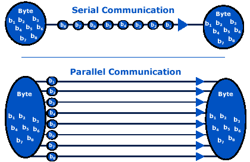

# 使用 NodeJS 读取 Arduino 串行监视器

> 原文：<https://medium.com/hackernoon/arduino-serial-data-796c4f7d27ce>


> 这是一篇关于如何从 arduino 读取串口值到 in [NodeJS](https://hackernoon.com/tagged/nodejs) 的简短教程文章。

# **动机**

因此，在我参与的一个项目中，我必须从我的节点控制台中的串行监视器获取数据，然后使用 web 套接字在基于 web 的应用程序中显示数据。但是，我很难弄清楚如何获取数据，我探索并找到了 [serialport](https://www.npmjs.com/package/serialport) npm 模块，但它给出的输出是缓冲区的形式，不是我想要的确切单词。花了一些时间后，我终于明白了如何去做。因此，我分享这一点，以便它可以帮助任何人试图这样做。

# arduino 和其他外设如何与笔记本电脑通信？

在大多数情况下，答案是“串行通信”。在串行通信中，数据可以通过电线“串行”逐位发送。
下图一目了然，清晰地展示了串行和并行通信。



记住这篇文章的主要焦点，我将在这里停止讨论，直接进入正题。不过，如果你想了解更多关于串行通信的内容，可以参考[维基百科](https://en.wikipedia.org/wiki/Serial_communication)如果你想了解 arduino 中的串行通信，可以参考 arduino 的[官网。](https://www.arduino.cc/reference/en/language/functions/communication/serial/)

# 关于我的项目！

我用 arduino 做了一个自来水浪费检测系统。这是基于一个简单的想法，结合雨水模块和超声波传感器。


**超声波传感器与水浪费检测有什么关系？** 很简单，使用雨水模块，我在感应是否有水滴落在上面，但是，即使水滴落在雨水模块上，也不能得出浪费水的结论。可能的情况是，一个人正在从水龙头喝水，不知何故一些水落在模块上。显然，我不想在这种情况下启动我的水浪费检测系统。
因此，为了防止错误输出，当雨滴模块感应到水浪费时，超声波传感器用于检测附近是否有人。这个想法很简单，如果水龙头是关着的，这意味着水没有被浪费(天才！)，如果水龙头是开着的，一个人在它的附近(比如 70 厘米)，这也意味着水没有被浪费(这个人可能正在使用)。但是，如果水龙头开着，附近没有人，这显然意味着水被浪费了，探测器现在可以发出警报。


因此，基本上这个项目结合使用雨滴模块和超声波传感器来检测水的浪费。
[这里下载代码](https://drive.google.com/file/d/1K2GR_Udl4kT7z_0gJZtiB2dLcLeIOvwo/view?usp=sharing)

# 所需输出…


这是串行监视器上的输出，我打算在我的节点服务器上获取，然后使用 web sockets，给出关于 tap 的实时更新。让我们为它写一个脚本:)

一个很好的问题是，我们能把硬件和 JavaScript 结合起来吗？最初，JS 并不打算与硬件一起使用，但是现在这种语言已经取得了很大的进步，是的，它可以被使用。
阅读这篇有趣的文章:[node bots——JS 机器人的崛起](http://www.voodootikigod.com/nodebots-the-rise-of-js-robotics/)。

# 入门—安装串行端口库

serialport 库为结合硬件项目和 JavaScript 提供了强大的支持。

> 想象一个你可以编写 JavaScript 来控制搅拌机、灯、安全系统甚至机器人的世界。没错——机器人！感谢 Node Serialport，这个世界就在这里。

访问[此链接](https://www.npmjs.com/package/serialport)获取完整的 API 文档。

所以，首先，就像我们对待任何节点模块一样，我们会安装它。

```
$ npm install --save serialport
```

这个节点模块下载完了，我们终于可以开始了:)

# 打开端口并读取值

就像在 arduino 程序中一样，在任何真正的通信发生之前，我们需要打开端口。这可以通过下面这段代码来完成。

```
var SerialPort = require('serialport');var serialPort = new SerialPort('/dev/ttyACM0', {
    baudrate: 9600
});
```

您必须写下您的端口名称，而不是`/dev/ttyACM0`。它在 windows 上类似于`COM17`，或者在基于 UNIX 的系统上类似于上面提到的。

既然端口已经打开，我们终于可以插入 arduino 并使用下面的代码获取数据了。

```
// Switches the port into "flowing mode"
serialPort.on('data', function (data) {
    console.log('Data:', data);
});// Read data that is available but keep the stream from entering //"flowing mode"
serialPort.on('readable', function () {
    console.log('Data:', port.read());
});
```

**牛逼！！！我们已经完成了代码，让我们尝试一下。**

```
$ node filename.js
```


Wait! What!?

这就是我之前所说的。它不是给出文本，而是给出数据缓冲区。

**不用担心！**
文本数据很容易解析获得。使用下面给出的代码来这样做！

```
// Require the serialport node module
var serialport = require('serialport');
var SerialPort = serialport.SerialPort;// Open the port
var port = new SerialPort("/dev/ttyACM0", {
    baudrate: 9600,
    parser: serialport.parsers.readline("\n")
});// Read the port data
port.on("open", function () {
    console.log('open');
    port.on('data', function(data) {
        console.log(data);
    });
});
```

好吧，让我们运行这段代码！


Yay! It worked!

# 结论

本文主要是关于 JavaScript 和硬件的，重点是使用 NodeJs 与串口通信。希望它能帮助你，以防你像我一样被困在数据缓冲区中。

> 非常感谢你保持冷静，一直读到最后。
> 一切顺利，快乐编码！
> 有任何疑问或者需要任何帮助都可以联系我:
> 邮箱:madhavbahl10@gmail.com
> 网页:[http://www.madhavbahl.tech/](http://www.madhavbahl.tech/)Github:[https://github.com/MadhavBahlMD](https://github.com/MadhavBahlMD)LinkedIn:[https://www.linkedin.com/in/madhavbahl/](https://www.linkedin.com/in/madhavbahl/)