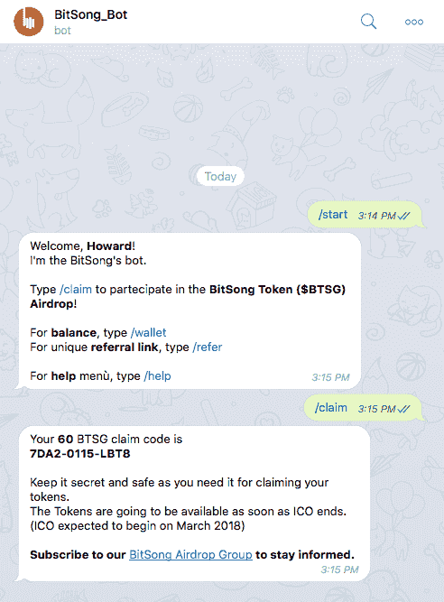
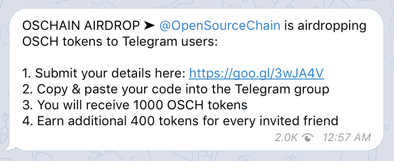
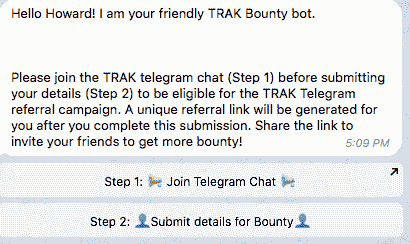
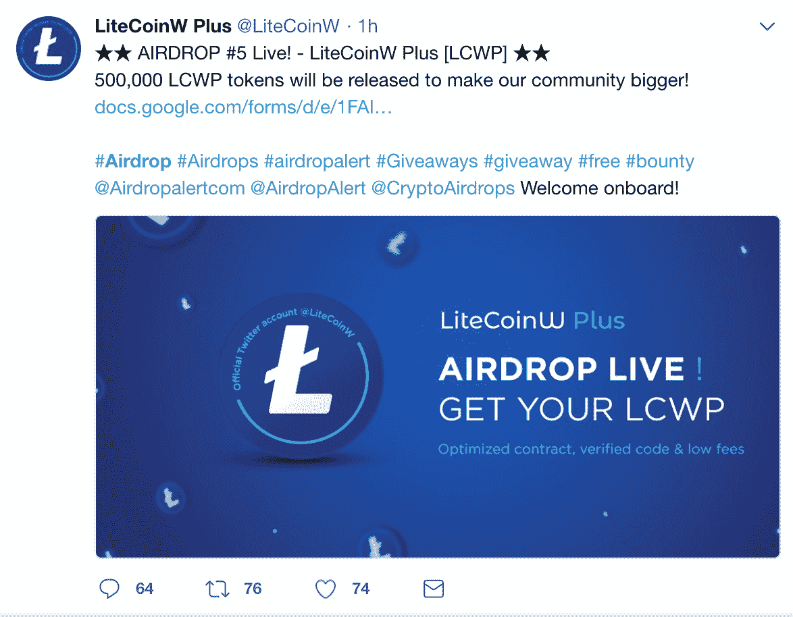
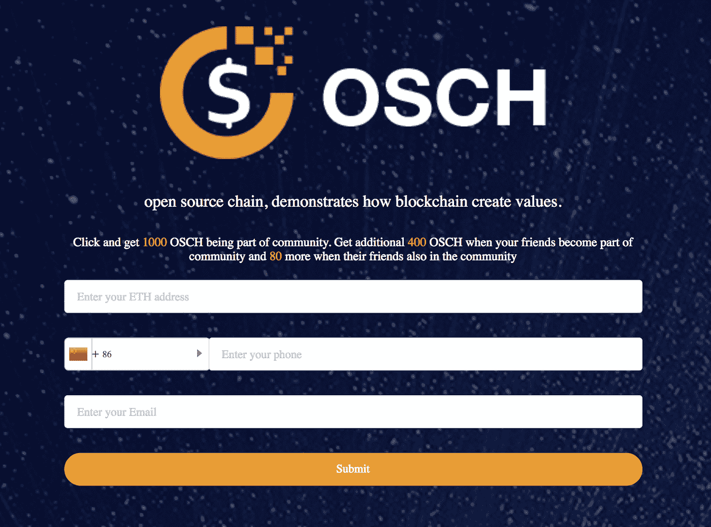

# 空投是安全交易吗？

> 原文：<https://medium.com/hackernoon/are-airdrops-security-transactions-7cfc55e64a15>

又来了。发行代币的公司正在想尽一切办法规避证券法。经营 ICO 的新时尚方式是，在不向公众披露任何信息的情况下，私下向一小群鲸鱼(价值 100 万美元或更多的加密资产)出售代币，然后向任何注册电报集团的人空投一船代币。

空投的真正目标是创造一大批代币持有者，以更好地促进在交易所上市，并创造更多流动性。交易所喜欢这一点，更有可能将 1 万人持有的代币上市，而不是 100 个投资者持有的代币。

甚至还有一个新的[网站](https://airdropalert.com/)来汇总所有的空投物资。派对才刚刚开始。数以百万计的加密投资者将获得数以百万计的免费代币，只因为他们注册了一个网站，并成为一个他们实际上并不关心的新团体的自豪成员。

Searching [Twitter](https://twitter.com/search?q=%23Airdrop&src=tyah&lang=en) with the #airdrop hashtag reveals thousands of free offers for investors.

那么，这为什么会是与非合格投资者的证券交易呢？毕竟，该公司正在免费赠送公用设施代币。然而，根据美国证券交易委员会的说法，事实证明没有免费证券或[“免费股票”这样的东西。](https://www.sec.gov/news/headlines/webstock.htm)

美国证券交易委员会不断提醒市场说，大多数公用事业代币是证券，他们的销售方法证明了这一点。允许根据规定 D 向合格投资者进行小规模私人销售。该公司可以私下向投资者披露它想要什么。这种私下出售完成后，代币不会神奇地转变成公用代币:它们仍然是证券。

免费是一个非常吸引人的概念。然而，要求用户或投资者加入一个 Telegram 聊天群，会立刻让“免费”这个词变得虚假，因为用户向公司提供了一些有价值的东西(尽管不是现金)。他们提供的价值是加入了一个群，现在可以联系了。

一些公司支付高达 1 美元在他们的小组中获得一个电报用户。毕竟，庞大的电报群是一个流行 ICO 的明确信号。因此，告诉投资者来加入并获得免费的安全令牌是向未经认可的投资者出售证券，无论他们是否根据银行保密和美国爱国者法案确认了他们对 OFAC 的 ID。

在这种情况下，该公司在进行“免费”空投时，并没有依赖于《证券法》登记的豁免那些得到良好建议的人可以利用监管众筹或监管 A+豁免进行空投，这将是合法的。然而，他们会如何评价这些免费的安全令牌呢？

该公司似乎可以根据以前的销售和限制证明安全令牌的合理基础。例如，如果预售以 1 美元的价格出售了具有规则 D 下的一年交易限制的安全令牌，那么规则 A+下的免费令牌可以被估价为 2 美元，因为它没有交易限制。啊哈！这是一件好事，因为根据 A+规定，高达 5000 万美元的安全令牌可以“免费”赠送给任何美国消费者。

很明显，美国证券交易委员会将仔细审查所有这些空投，并可能发布公告，提醒市场注意这种做法。这可能是下一只掉下来的鞋子。

本文由霍华德·马克斯和萨拉·汉克斯共同撰写。Sara Hanks 是 CrowdCheck 的联合创始人兼首席执行官，是一名律师，在企业和证券领域拥有 30 多年的经验。CrowdCheck 为在线资本形成提供尽职调查、披露和合规服务。其服务通过披露和尽职调查程序帮助企业家和项目发起人，向投资者提供他们需要的信息，以做出明智的投资决定和避免欺诈，并帮助中介机构避免责任。

*莎拉之前的职位是两党国会监督小组的总法律顾问，负责监督问题资产救助计划(TARP)。在此之前，Sara 作为全球最大的律师事务所之一 Clifford Chance 的合伙人工作了多年。在高伟绅律师事务所工作期间，她为世界各地的公司提供资本市场交易和公司事务方面的建议。萨拉在伦敦诺顿罗氏律师事务所开始了她的职业生涯。后来，她加入了美国证券交易委员会(Securities and Exchange Commission ),并作为国际企业融资办公室(Office of International Corporate Finance)的负责人，领导团队起草法规，为管理融资过程制定了新一代规则。*

*Sara 在牛津大学获得法律学位，是纽约州和 DC 律师协会的成员，也是英格兰和威尔士最高法院的初级律师。她曾担任 SEC 小型和新兴公司顾问委员会的联合主席，该委员会最近结束了任期。她持有 65 系列证券执照，是注册投资顾问。萨拉是一位阿姨、军嫂、滑雪者、自行车手、园丁和动物爱好者。*