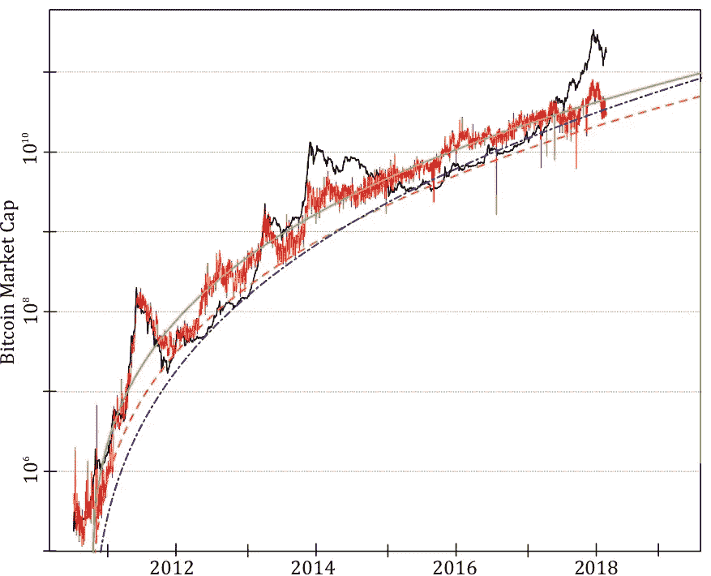

# 比特币泡沫可以预测吗？

> 原文：<https://medium.com/hackernoon/are-bitcoin-bubbles-predictable-6aa5b830f41a>

## 比特币的基本估值和比特币泡沫的诊断

Visualization of the bitcoin price

*斯潘塞·惠特利、迪迪尔·索尔内特、托拜厄斯·a·胡伯、马克斯·雷朋、罗伯特·n·甘特纳*——*基于我们最近发表的* [*论文*](https://arxiv.org/abs/1803.05663) *。*

自从 2008 年中本聪发布以来，[比特币](https://hackernoon.com/tagged/bitcoin)发展迅猛，加密货币已经成为一种新兴的资产类别。2017 年底，比特币的价格达到近 20，000 美元的峰值，但现在位于 8，500 美元左右。比特币的爆炸性增长和波动性加剧了关于加密货币内在或基本价值的辩论。虽然许多人声称比特币是一个骗局，其价值最终将跌至零，但其他人认为，比特币将进一步大幅增长和被采用，他们经常将其与黄金等价值储存手段的市值相提并论。通过比较比特币和黄金——这是基于比特币协议中内置的数字稀缺性的类比——一些市场分析师预测比特币价格高达每比特币 1000 万美元。鉴于比特币的疯狂轨迹，许多人想知道它接下来会走向何方。

虽然正在出现关于加密货币估值的学术文献，例如，将比特币协议的一些技术特征，如“工作证明”系统，视为比特币的价值来源，但另一种估值可以基于其用户网络——用户/节点越多，网络就越有价值。20 世纪 80 年代，Metcalfe 提出网络的价值与节点数量的平方成正比。现在，如果梅特卡夫定律在这里成立，比特币的基本面估值实际上可能比股票估值更容易——股票估值依赖于各种倍数，如市盈率、市净率或价格现金流比率——因此可能预示着泡沫。

在这里，我们开发了一种比特币泡沫和崩溃的诊断方法，该方法结合了梅特卡夫定律(Metcalfe's law)和对数周期幂律奇点(LPPLS)模型，梅特卡夫定律将为比特币提供基本价值，对数周期幂律奇点模型已被开发用于检测泡沫。当两个指标一致时，这提供了一个令人信服的迹象，表明[泡沫](https://hackernoon.com/tagged/bubble)和即将到来的修正。更多细节，请看我们的[论文](https://papers.ssrn.com/sol3/papers.cfm?abstract_id=3141050)。

## 比特币的基本估值

梅特卡夫定律指出，网络的价值，在这种情况下是市场资本总额(cap)，与用户数量的平方成正比，即与所有用户相互连接时的连接数有关。为了形象化这一点，图 1 以对数标度显示了比特币市值与用户数量的关系，其中与斜率 2 的线性关系符合梅特卡夫定律。线性回归拟合提供了 1.7 的估计值，远小于 Metcalfe 的值 2。这将意味着，例如，对于 100 万用户，典型的用户将连接到“仅仅”10，000 个其他用户，而不是 100 万。

Figure 1: Scatterplot of the bitcoin market cap versus the number of active users, with logarithmic scales

然而，更有趣的是直接比较梅特卡夫定律预测的市值和真实市值，如图 2 所示。特别是，我们将蓝色和橙色的虚线解释为基本面支撑位，而红色和绿色的粗线，其参数由图 1 中的回归给出，位于基本面和泡沫水平之间。

Figure 2: Comparing bitcoin market cap (black line) with predicted market cap based on various generalized Metcalfe regressions of active users.

无论如何，市值的预测值表明当前(截至 2018 年 3 月的第一周)至少高估了四倍。此外，假设用户持续增长(其增长率实际上正在下降)，基于 Metcalfe 的 2018 年底市值预测分别为 770 亿、390 亿和 640 亿美元，仍远低于当前水平。仅从这一点来看，目前的市场看起来与 2014 年初的市场相似，当时市场经历了一年的横盘和下行。换句话说，需要有一些独立的基本发展来证明如此高的估值是合理的，这是我们所不知道的。

## 比特币泡沫:普遍的不可持续增长？

众所周知，比特币的历史被壮观的泡沫和崩溃打断。我们能够识别四个主要泡沫，对应于市值与其估计基本面价值的巨大向上偏离。这四个泡沫在图 3 和图 4 中突出显示——在某些情况下，在不到 6 个月的时间里增长了 20 倍！在所有情况下，泡沫的破裂都归因于基本面事件:比如，2011 年，比特币交易所 Mt. Gox 遭到黑客攻击，导致加密货币价格下跌 88%。2013 年，中国禁止金融机构使用比特币，这导致比特币的市值下降了 50%，两周后 Mt. Gox 关闭。类似地，在 2017 年底，韩国监管机构威胁要关闭当地的加密货币交易所，这引发了价格的急剧下跌。然而，第四个也是最近的泡沫要长得多，导致泡沫破裂的触发因素似乎是比特币 20，000 美元的历史最高价格。换句话说，比特币是在自身重量下崩溃的。

Figure 3: The upper triangle represents the market cap of bitcoin with four major bubbles indicated by bold colored lines, numbered, and with bursting dates given. The lower triangle shows the four bubbles scaled to have same log-height and length with the same color coding, and with pure hyperbolic power law and LPPLS models fitted to the average of the four bubbles, given in dashed and solid black, respectively.

有趣的是，尽管这些泡泡的高度和长度差异很大，但当缩放到相同的对数高度时，几乎普遍的超指数增长是显而易见的。而且从这个意义上来说，就像沙堆一样，一旦成比例的气泡变得足够陡峭(所谓的休止角)，就会雪崩。换句话说，导致崩溃的是系统本身的不稳定；崩溃的瞬间原因是次要的。这一关键见解被纳入对数周期幂律奇点(LPPLS)模型，该模型由 Didier Sornette 及其合作者开发。

与金融和经济学中根深蒂固的观点形成鲜明对比的是，金融泡沫可以被描述为不可预测的现象，因为资产价格被假设为遵循随机游走，LPPLS 模型捕捉到了根本不同的见解，即[金融市场具有可预测的成分](https://arxiv.org/abs/1404.2140)。根据 Sornette 的假设，崩溃的根本原因应在前期确定，LPPLS 模型捕捉到不可持续的超指数价格加速，这意味着价格的增长率自行增长。随着投机狂热加剧和泡沫成熟，市场接近临界点，受到羊群行为和模仿行为中正反馈的驱动，此时任何微小的扰动都可能引发崩盘。

从形式上看，该模型如下所示:

其中 *p_i* 为资产价格， *t_c* 对应泡沫， *ε(t)* 为噪声。当应用于比特币时，LPPLS 允许人们检测泡沫的特征，如图 3 所示。

现在，给定基于上述广义 Metcalfe 回归提出的比特币基本价值，我们将市值与 Metcalfe 价值(MMV)比率定义为实际市值除以 Metcalfe 支持预测的市值。如图 4 所示，泡沫是 MMV 在支撑位 1 以上的持续背离。在我们的论文中，我们表明这些泡沫不仅被 LPPLS 模型很好地模拟，而且该模型为 2017 年的修正提供了有用的预警信息，在回测时，产生了包含真实崩溃时间的置信区间。

Figure 4: Market-to-Metcalfe value ratio (MMV) over time. The apparent bubbles, which radically depart from the fundamental level 1, are colored.

总之，通过将广义梅特卡夫定律(它提供了基于网络特征的基本值)与对数周期幂律奇点(LPPLS)模型相结合，我们能够开发出丰富的泡沫及其崩溃诊断，这些泡沫和崩溃打断了加密货币的历史。通过这样做，我们能够诊断出四个不同的泡沫，即高高估时期和类似 LPPLS 的轨迹，随后是崩盘或强劲的修正。这与秘密市场遵循随机游走且本质上不可预测的观点形成了鲜明对比。此外，除了能够事后识别泡沫之外，考虑到一致的 LPPLS 泡沫特征和已证实的预警潜力，LPPLS 还可用于提供事前预测。我们基于 Metcalfe 的分析表明，当前比特币市场的支持水平在 220-440 亿美元之间，至少比当前水平低三倍。鉴于加密货币的高度相关性，其他加密货币的短期走势很可能会受到比特币修正的影响(反之亦然)，无论其自身的相对估值如何。

欲了解更多信息，请参阅论文《比特币泡沫可以预测吗？结合广义梅特卡夫定律和 LPPLS 模型”，作者是斯潘塞·惠特利、迪迪尔·索尔内特、托拜厄斯·胡伯、马克斯·雷朋和罗伯特·甘特纳，本文基于此:【https://arxiv.org/abs/1803.05663】T2