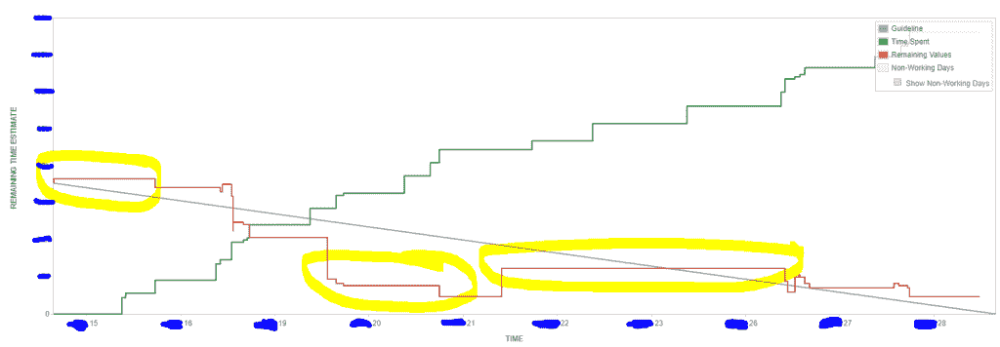

# 燃尽图有用吗？

> 原文：<https://medium.com/hackernoon/are-burndown-charts-useful-7e5317ddd33d>

当从头开始开发一个产品时，你可能会认为你需要一个燃尽。你想知道在你发布之前还有多少工作要做吗？这就是烧毁的要点。你希望能够说——五周后我就可以完成了。但是它从来不是这样的。最终发生的情况是你的热情保持不变——或者相反，因为你发现了新的需求。那么，燃尽图有用吗？

# 快速调查

这不是一个真正的调查——但是在四个以 [burndown](https://hackernoon.com/tagged/burndown) 图表开始的[敏捷](https://hackernoon.com/tagged/agile)团队中——只有一个团队还在正确地使用它(如果我们的 sprint 评论是可靠的话)。我听到的一个主要的抱怨是燃尽图没有用，自从被管理层引入后就再也没有被使用过(没错，它不是由团队引入的，而是由管理层引入的)。

快速提问:谁认为**管理层**应该**将** *新流程*引入团队？没有人吗？好吧。我猜这是你的第一个信号，燃尽图对团队没有用。**没有人**想被**强迫**填写一些基于时间的图表，你会在冲刺结束时查看。老实说，我的团队从纸笔烧毁转向了基于 JIRA 的烧毁，因为我们**没有**发现它**有用**。除了*向管理层汇报*之外，我们不使用它。

# 有用

为什么大多数团队没有发现烧毁的用处？嗯，我相信是因为有太多的数据需要收集。你可能认为这只是你必须画的一条小线——但是你需要估计每个人对他们的任务真正做了多少工作。最后，当你使用纸和笔时，你只能在任务完成时画一条线。这也完全没问题。JIRA 的工作原理是，当你还有几个小时，你记录下你的工作——它会把图表下移。有点作用。但是你会在我下面的例子中看到为什么它也不能真正工作。

我认为我们没有发现 burndowns 有用的另一个原因是，我们没有在冲刺的最后回顾它。我们应该是——但是有人总是忘记带(或者打印出来)。我们应该讨论平点，找出问题所在，以及如何改进。下面举个例子。

如果我们有一个追溯，包括我们的烧毁，首先你可以看到记录的小时数远远大于下降的小时数。为什么？这个问题很适合你的回顾展。对我们来说，我们已经知道这个问题没有烧毁。我们正在做的故事有很多 bug，所以有很多工作要做同样的任务。如果你愿意，你可以在回顾展上讨论这些事情。但是只有你的团队觉得有用才有用。

# 努力与回报

我谈到了投入的精力。我谈到了潜在的回报。我没说的是它真正的样子。假设你每次烧毁都画了那条线。你团队中的某个人有责任。他们需要跟踪人们前一天做了什么，然后得出这个估计。也许你只有在完成一项任务后才会下去？有些团队就是这么做的。降低心理复杂度。

但这值得努力吗？从我的经验来看，除非有人想做——没有人会去做。没有人会为烧毁负责，因为谁想成为一名画线条的工程师？

至于奖励？你在回顾会上错过了什么吗？什么事？没有吗？如果是的话——一次烧毁**会让你回过头来说“啊哈”吗？如果没有——我会说你可以**跳过**烧毁。**

# 总和

如果你愿意付出*的努力*，他们很擅长展示还剩下*多少努力*以及*问题领域*是什么。过一会儿，你可能会发现你的团队在回顾会和一周中说得太多了，以至于这些数据基本上是**没有**用的。这完全没问题。团队成长，超越度量和图表。不要让管理层胁迫你去做你不需要的事情。

*原载于 2018 年 7 月 2 日*[*www . alexaitken . NZ*](https://www.alexaitken.nz/blog/are-burndown-charts-useful/)*。*