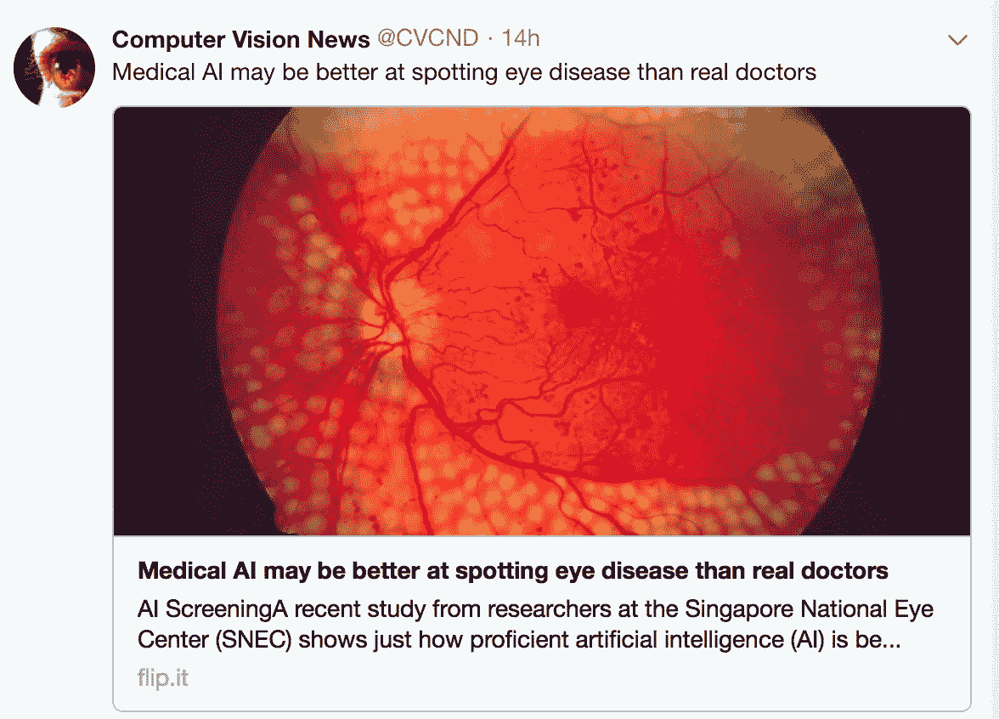

# 计算机比医生强吗？

> 原文：<https://medium.com/hackernoon/are-computers-better-than-doctors-2e07a05ae7ea>

## 电脑现在会看到你吗？从 ChexNet 论文中学到的肺炎诊断…

*作者* [*朱迪·吉乔亚*](https://medium.com/u/53ba2bb84284?source=post_page-----2e07a05ae7ea--------------------------------) *&* [*斯蒂芬·博尔斯特曼*](https://medium.com/u/7f53283275d3?source=post_page-----2e07a05ae7ea--------------------------------)

2017 年 12 月，我们(培训中的放射科医生、工作人员放射科医生和人工智能实践者)讨论了我们作为人工智能世界中的知识专家的角色，在此进行了总结[https://becoming human . AI/radiologists-as-knowledge-experts-in-a-world-of-artificial-intelligence-summary-of-radiology-ec63a 7002329](https://becominghuman.ai/radiologists-as-knowledge-experts-in-a-world-of-artificial-intelligence-summary-of-radiology-ec63a7002329)。在 1 月份，我们讨论了用于疾病诊断的[深度学习](https://hackernoon.com/tagged/deep-learning)算法的性能，特别关注斯坦福集团的论文— **CheXNet:利用深度学习对胸部 X 射线进行放射科医生级别的肺炎检测。**我们继续对 journal club 产生巨大兴趣，有 347 人注册，其中 150 人于 2018 年 1 月 24 日签名参与讨论。

这篇论文已经修改了 3 次，可以在这里找到[https://arxiv.org/abs/1711.05225](https://arxiv.org/abs/1711.05225)。像许多声称具有超人表现的深度学习论文一样，这篇论文在新闻媒体、几篇博客文章、reddit 和 twitter 上广泛传播。

请注意，医学人工智能论文越来越多地报道了超人表现的发现。例如，[这篇文章](https://futurism.com/medical-ai-may-better-spotting-eye-disease-real-doctors/)表示“医学人工智能可能比真正的医生更擅长发现眼病”

为了帮助评论 ChexNet 论文，我们成立了一个由**作者**团队组成的小组(论文中列出的大多数作者都出席了会议，谢谢！)，卢克博士([博客](https://lukeoakdenrayner.wordpress.com/2018/01/24/chexnet-an-in-depth-review/))和帕拉丝博士([博客](/@paras42/dear-mythical-editor-radiologist-level-pneumonia-in-chexnet-c91041223526))，他们对使用的**数据**提出了批评，杰瑞米·霍华德(数据分析竞赛网站 [Kaggle](https://www.kaggle.com/) 的前任总裁兼首席科学家，医疗成像公司 [Enlitic 的前任 CEO，](https://www.enlitic.com/news.html)，深度学习教育网站 fast . ai 的现任 CEO)提供了对深度学习**方法论**的见解。

在这篇博客中，我们总结了审查医学人工智能论文的方法。

## 放射学 101

ChexNet 论文回顾了人工智能与 4 名训练有素的放射科医生在诊断肺炎方面的表现。肺炎是一种临床诊断——患者会出现发烧和咳嗽，并可以通过胸部 x 光检查(CXR)来确定肺炎的并发症。患者通常会进行血液培养以补充诊断。CXR 上的肺炎不容易与填充肺叶空间的其他发现区分开来——特别是脓、血、液体或称为肺不张的萎陷肺。因此，解释这些研究的放射科医生可以互换使用浸润、实变和肺不张等术语。

## 给我看看数据

本研究使用的数据是 ChestX-ray14 数据集，这是最大的公开可用成像数据集，由 30，805 名不同患者的 112，120 张正面胸部 x 射线照片组成，并扩展了 ChestX-Ray 8，由 Wang 等人描述[。艾尔](http://openaccess.thecvf.com/content_cvpr_2017/papers/Wang_ChestX-ray8_Hospital-Scale_Chest_CVPR_2017_paper.pdf)。每张 x 光照片都标有 14 种不同病理标签中的一种或多种，或“无发现”标签。

通过挖掘[放射学](https://hackernoon.com/tagged/radiology)报告中的文本，使用自然语言处理(NLP)对射线照片进行标记。个案标签不是由人指定的。

> **评论**:标记医疗数据仍然是一个巨大的挑战，特别是因为放射学报告是与医嘱医生沟通的工具，而不是图像的描述。例如，在带有中心导管、气管造口术导管和胸腔导管的 ICU 影片中，可能报告为“稳定的导管和导管”,而没有详细描述 CXR 上的每个个体发现。这可能被 NLP 误归类为没有发现的研究。在这个数据集上，这种图像-报告不一致的情况发生率很高。
> 
> 此外，NLP 技术和/或标记方案可能会忽略可报告的结果，这可能是由于 14 个标记之一之外的错误或病理。该论文声称的 90%+ NLP 挖掘准确性似乎并不准确。(中小企业、LOR、JH)。小组成员之一 Luke 回顾了数百个例子，发现 NLP 标记与图像相比总体准确约 50%,肺炎标记更差——30-40%。
> 
> 杰瑞米·霍华德指出，使用旧的 NLP 工具会导致不准确，因为数据集中“没有发现”的情况占优势，扭曲了数据——他不认为在这个数据集中正常发现的精度可能会比随机发现有所提高。看肺炎标签，只有 60%的准确率。许多差异可以追溯到核心的 NLP 方法，他将其描述为“严重过时且已知不准确”。他认为用更现代的自然语言处理系统来重新描述标签是合适的。

Chest Xray showing a tracheostomy tube , right internal jugular dialysis line and diffuse infiltrates likely pulmonary edema. The lines and tubes for an ICU patient are easily reported as “Stable”

斯坦福小组通过让 4 名放射科医生(1 名专门从事胸部成像，3 名非胸部放射科医生)为通过分层随机抽样创建的训练数据子集分配标签来应对标记挑战，每个标签至少有 50 个阳性病例，最终 N=420。

> **评论**:胸部 x 光检查包含许多只有一张 x 光片的病人，但是那些有多项研究的病人往往有很多。虽然文本挖掘报告可能与临床信息相匹配，但分配的标签和影像学外观之间的任何不匹配都会损害数据集的预测能力。
> 
> 此外，这些标签实际上意味着什么？奥克登-雷纳博士质疑这些标签的含义——它们是指放射性肺炎还是临床肺炎？在免疫功能低下的患者中，肺炎的 x 线摄影可能是阴性的，主要是因为患者不能对病原体产生免疫反应。这并不意味着肺炎的临床诊断是不准确的。因此，影像学表现和临床表现/诊断不匹配。
> 
> 肺炎、实变、浸润和肺不张这四个标签的紧密程度带来了新的复杂性。肺炎是实变的子集，浸润是实变的超集。虽然数据集将这些标记为 4 个独立的实体，但对放射医师来说，它们可能根本不是独立的。在执行图像分类任务时，让专家查看图像是非常重要的。

在这个[博客](https://lukeoakdenrayner.wordpress.com/2018/01/24/chexnet-an-in-depth-review/)上看到一个关于数据问题的很好的总结，来自卢克，他是小组成员[之一](https://lukeoakdenrayner.wordpress.com/2018/01/24/chexnet-an-in-depth-review/)。

## 模型

CheXNet 算法是 121 层深度 2D 卷积神经网络；一个**接一个**黄&刘。Densenet 的多重剩余连接减少了参数和训练时间，允许更深入、更强大的模型。该模型接受大小为 224 像素乘 224 像素的矢量化二维图像。

Densenet connection

为了提高对 CheXNet 输出的信任度，在[周等人](https://people.csail.mit.edu/bzhou/publication/Zhou_Learning_Deep_Features_CVPR_2016_paper.pdf)之后使用了类激活映射(GRAD-CAM)热图。这允许人类用户“看到”射线照片的哪些区域为最高概率标签提供最强的 Densenet 激活。

> **评论** : Jeremy 指出，将图像调整为 224x224 像素大小并添加随机水平翻转的图像预处理是相当标准的，但仍有潜在的改进空间，因为有效的数据扩充是改进模型的最佳方式之一。图像尺寸缩小到 224x224 是一个已知的问题-从 Enlitic 的研究和实践经验来看，更大的图像在医学成像中表现更好(SMB:2017 年 RSNA 骨龄挑战赛的多名前 5 名获奖者的图像尺寸接近 512x512)。霍华德先生认为没有理由再让这种规模的模特留下来了。关于型号选择，Densenet 型号已经足够，但是 [NasNets](https://arxiv.org/abs/1707.07012) 在过去的 12 个月中比旧型号有了显著的改进(50%)。
> 
> 使用了预先训练的 Imagenet 权重，这很好&这是一种标准方法；但是杰瑞米认为，如果我们有一个医疗图像网络来对一个自动编码器进行半监督训练，或者有一个 T2 的暹罗网络来对 T4 的病人进行交叉验证，那就太好了——留下了改进的空间。想象一下 Imagenet 由狗、猫、飞机和火车的彩色图像组成——我们在 X 射线上获得了很好的结果？虽然聊胜于无，但任何在任何模态的医学图像上训练的**预训练网络都可能表现优异。**

斯坦福团队的**最佳想法**是同时在多个标签上进行训练——最好是建立一个预测多个类别的单一模型——这违反直觉，但在深度学习模型中得到证实，并且可能是他们的模型产生比先前研究更好结果的原因。**您对模型进行适当训练的类别越多，您可以预期的结果就越好**。

## 结果

[F1 分数](https://en.wikipedia.org/wiki/F1_score)用于评估 CheXNet 模型和斯坦福放射科医生。

Calculating F1 score

每位放射科医生的 F1 分数是通过将其他三位放射科医生视为“地面事实”来计算的 ChexNet 的 F1 分数是针对所有 4 名放射科医生计算的。添加了一个[引导计算](https://en.wikipedia.org/wiki/Bootstrapping_(statistics))以产生 95%的置信区间。

CheXnet 的结果如下:

Results

从结果来看，ChexNet 优于人类放射科医生。不同的 F1 分数可以被解释为暗示对于每项研究，4 位放射科医师似乎对发现意见不一致。然而，有一个异常值(rad 4-F 值为 0.442)是受过胸科训练的放射科医生，他们的表现比 ChexNet 更好。

此外，与以前的出版物相比，CheXNet 在所有 14 种病理学上具有最先进的(SOTA)性能。

在我的搜索中，由穆亚东教授领导的北京大学计算机科学与技术研究所机器智能实验室的表现优于斯坦福小组。代码是开源的，可以在这里获得——[https://github.com/arnoweng/CheXNet](https://github.com/arnoweng/CheXNet)

Results from various implementations of ChexNet

> **评论** —各种评估认知契合度的研究表明，缺乏临床信息或之前的比较可能会影响人类的表现，从而影响人类的表现。此外，在这篇论文的最新版本之前，人类的表现对机器的评分是不公平的。

## 临床意义

大多数标记为气胸的 cxr 都有胸管，必须提出一个问题:“我们是在训练 Densenet 识别气胸还是胸管？”

## **同行评议**

卢克·奥克登-雷纳医学博士，一位在人工智能和深度学习方面有专长的澳大利亚放射学家，他是我们小组中的独立成员[评估了 ChestXRay-14 数据集](https://lukeoakdenrayner.wordpress.com/2017/12/18/the-chestxray14-dataset-problems/)和 [CheXNet](https://lukeoakdenrayner.wordpress.com/2018/01/24/chexnet-an-in-depth-review/) 。他赞扬了斯坦福团队在讨论论文方法论时的开放和耐心，以及他们修改论文以纠正对评估放射科医生有偏见的方法论缺陷的意愿。

## 摘要

对于第二届人工智能杂志俱乐部，我们分析了医学人工智能论文的渠道。你必须确保你问的是正确的临床问题，而不是为了做某事而做算法。此后，了解您的数据是否有助于回答您的问题，详细了解数据是如何收集和标记的。

为了确定人的水平或超人的表现，确保基线度量是足够的，而不是对一个群体有偏见。

Pipeline for AI in medicine

该模型似乎为专家提供了类似人类的性能，或者为训练较少的从业者提供了比人类更好的性能。这符合研究结果和 Enlitic 的经验。我们不应该对此感到惊讶；在卷积神经网络中的研究始终如一地报告了接近人类或超人的性能。

## 外卖

1.  在医疗数据的标记中存在着严重的缺陷。
2.  不要忘记你的结果的临床意义。
3.  接受同行评审，尤其是在医学和人工智能领域

这些是关于标记医疗数据问题的最佳推文——也就是不要气馁，尝试医学深度学习。

Labeling challenge

期刊俱乐部非常成功，所以如果你是医生或人工智能科学家，请加入我们的 [https://tribe.radai.club](https://tribe.radai.club) 继续关于人工智能和医学的对话。你可以在这里听这个记者俱乐部的录音:【https://youtu.be/xoUpKjxbeC0[。我们的下一位嘉宾是](https://youtu.be/xoUpKjxbeC0)[蒂姆尼特·格布鲁](https://www.microsoft.com/en-us/research/people/tigebru/)，他在 2018 年 2 月 22 日使用谷歌街景图像进行美国人口家庭预测。她将在**发表演讲，使用深度学习和谷歌街景来估计美国各地社区的人口构成(**[http://www.pnas.org/content/114/50/13108](http://www.pnas.org/content/114/50/13108))。

## 即将推出

对于 journal club，我们开发了一个人类对人工智能的比赛，用于解释在 [https://radai.club](https://radai.club) 托管的数据集中的 cxr。我们将很快公布众包标签的结果，并进行详细分析，以检查模型性能是否有所改善。

## **说谢谢**

在此，我要感谢小组成员，包括[杰瑞米·霍华德](https://medium.com/u/34ab754f8c5e?source=post_page-----2e07a05ae7ea--------------------------------)、[帕拉丝·拉哈尼](https://medium.com/u/7d86917f81d4?source=post_page-----2e07a05ae7ea--------------------------------)、[卢克·奥克登-雷纳](https://lukeoakdenrayner.wordpress.com/)和[斯坦福大学 ML 团队](https://stanfordmlgroup.github.io)。感谢 ACR RFS AI 顾问委员会成员包括 [Kevin Seals](https://medium.com/u/c5e52d8f6dbb?source=post_page-----2e07a05ae7ea--------------------------------) 。

## 进行了文章更正

1.  这篇文章提到了杰瑞米·霍华德(前[Kaggle](https://www.kaggle.com/)CEO)——更新为“ka ggle 总裁兼首席科学家”
2.  文章指出 *NLP 在该数据集上的性能不太可能比 random 有所提高。杰里米澄清说，正常结果的精确度不可能比随机结果的精确度有所提高*

 [## 美国的医疗保健

### 这个国家医疗保健人性化的一面。

healthcareinamerica.us](https://healthcareinamerica.us)