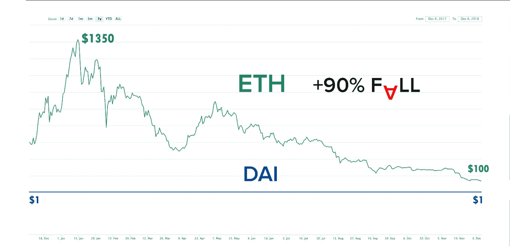

# 戴继续盯住疯狂的熊市；但是怎么做呢？

> 原文：<https://medium.com/hackernoon/are-crypto-collateralized-stablecoins-ticking-bombs-83a1dc9ffdf5>

加密抵押稳定债券锁定加密资产，如 ETH 作为抵押品——价值高得多——以支持其稳定的令牌。通过这种方式，每当支持加密资产的价值低于稳定令牌的价值时，挂钩就会被打破，从而导致系统崩溃。因此，许多人认为这种稳定的硬币就像定时炸弹，随时可能被引爆。

然而，对过去一年市场价格的简要回顾显示，最著名的加密抵押稳定币戴，即使在支持它的加密资产以太的价值比其峰值价格低十分之一时，也坚定地维持其联系汇率。因此，第一段提出的论点似乎与事实相差甚远。

我们错过了什么吗？

事实上，加密抵押的稳定债券确实有打破其挂钩的风险，然而，这种风险远低于人们普遍认为的程度。

但是为什么呢？

智能合约发行加密担保的稳定债券可以被视为银行发放贷款。如前所述，他们要求抵押品的价值远远高于他们提供的贷款。因此，如果抵押品价值下降到低于贷款价值的水平，系统就会崩溃。

但是，这还不是故事的全部！

智能合同不会让抵押品贬值到低于甚至等于贷款的价值。一旦抵押品的价值低于贷款价值的 1.5 倍，智能合约就会主动将抵押品拍卖(或以固定价格出售)，作为回报，只接受本地 stablecoins。

例如，以太值 200 美元，John 锁定 1 个以太以获得价值 100 美元的稳定硬币。现在，假设乙醚价格跌至 180 美元、160 美元等等。一旦价格达到 150 美元，智能合约就会将所有抵押品进行拍卖，以强制结清约翰的贷款。可能会出现愿意以稍微便宜一点的价格购买约翰乙醚的买家，他们提供价值 100 美元的稳定可卡因。随后，约翰的贷款结清了。他三分之二以上的财产将用来偿还他的贷款，其余的还给他。因此，约翰的贷款在他的抵押品价值变得太接近他的稳定收入之前就结清了。

那么，风险到底在哪里？系统到底能不能崩溃？

答案是肯定的。

当且仅当抵押品的价格下跌如此之快，以至于没有人愿意购买价值 100 美元的稳定债券，以便在拍卖中出价并获得贷款的 150 美元抵押品的一部分时，该系统才会崩溃，因为他们担心在购买稳定债券并结清贷款的短时间内，抵押品价值会跌至 100 美元以下。

值得一提的是，大多数参与这些拍卖的人都是机器人，对他们来说，每次拍卖哪怕有 1%的收益都绰绰有余。这些机器人能够在很短的时间内完成上述所有步骤。因此，一枚加密抵押的稳定硬币的系统崩溃就像几分钟内损失三分之一的价值一样可能。

总之，风险确实存在，但可能性不大；而且，你看不到住在街上的人，因为确实有地震的危险，但可能性不大，是吗？