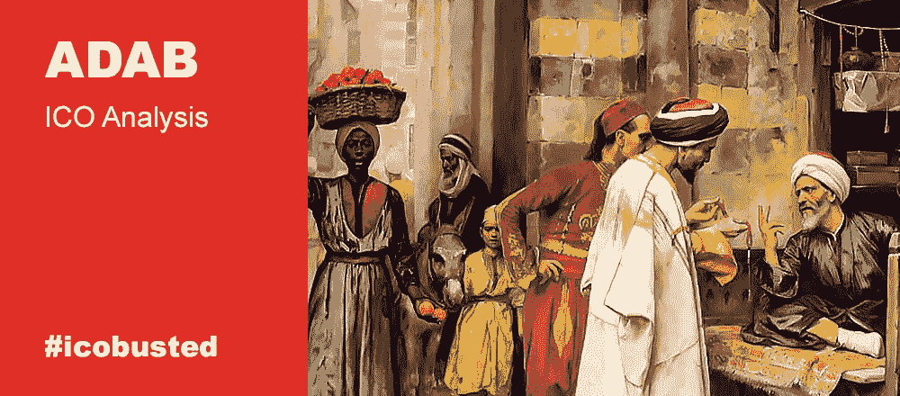

# 加密交易所忽略了 20 亿美元的穆斯林市场吗？—#我完蛋了

> 原文：<https://medium.com/hackernoon/are-crypto-exchanges-overlooking-the-2-billion-muslim-market-icobusted-d392ddac1be4>

*专栏作者是* [*亚历山大·萨维金*](https://howtotoken.com/blockchain-experts/) *，我们的投资专家、*[*Howtotoken*](https://howtotoken.com)*的联合创始人。在#icobusted，我们将扫描市场，寻找最新、最引人注目的即将推出的 ico，并对它们进行深入分析，我们的重点将是这些项目背后的商业概念的可行性。这不会涉及前 ICO/ICO 价格差距，没有对团队的喘息和抱怨，也没有代码检查。在这里，我们将试着把每一件事都分解开来，看看当且仅当该产品能够交付时，该产品是否有任何市场前景。*

如果您对我们的新形式有任何反馈，我们将不胜感激，因此请在评论区畅所欲言，发表您的意见——您对哪些部分最感兴趣，以及我们如何改进这些主题，让您对它们更感兴趣。要了解我们的最新动态，请关注我们:

*   [推特](https://twitter.com/howtotoken)
*   [脸书](https://www.facebook.com/groups/howtotoken/)
*   [电报](https://t.me/icobusted)

或者只订阅我们的电子邮件简讯(以接收仅通过电子邮件分发的更新和独家材料):

# ADAB ICO

今天，我们看到的是一个符合伊斯兰教法的伊斯兰加密交易所。是的，这又是一个加密交换，而且几乎只是一个利基解决方案。无论如何，这个利基市场在传统市场上正经历着来自公众的大量需求，这也会对密码世界产生影响。在传统市场上，有许多符合伊斯兰教法的新兴伊斯兰交易所，事实上，世界上可能有伊斯兰加密交易所的一席之地。第一个站台是 ADAB。

# 产品

# 与传统密码交换的异同

诚然，大多数密码交换都有高度的相似性，但也有一些带有额外特殊特征的情况，比如 ADAB 和 T21。虽然包括西方世界的大多数金融工具，但伊斯兰金融服务确实符合伊斯兰教法，这意味着一些基于活动的投资选项不在市场上列出，同时利率也在重新考虑，以防止高利贷。就 ADAB 限制而言，它看起来是这样的:

1.  基于 riba 的操作(禁止任何形式的利率)。
2.  与赌博有关的操作。
3.  与 haram 商品(酒、猪肉等)相关的活动。
4.  涉及 gharar(不确定性)的操作，如预测市场。
    *加上这些为边界决定:*
5.  公司的主要活动不应与 Shariah 原则相冲突。
6.  公众对该公司的看法应该主要有利于穆斯林世界。

伊斯兰教的一些分支认为加密货币本身是被禁止的，而另一些分支则欣然接受。在这种环境下，ADAB 成为伊斯兰社会进步部分和神秘世界之间的中间人。产品本身并不是一个全新的想法。世界各地都可以找到很多符合 shariah 的交易所，但这是第一个用于 cryptoworld 的交易所。

# 筹资和预算分配

50%的财务资源分配给项目的运营和开发费用，20%分配给营销费用(这似乎是加密交换项目的常见比例)。他们的硬上限是 18，700，000 美元，而软上限只有 2，500，000 美元。开发费用应该占预算的 20%。有了这笔钱，我们可以估算出开发成本的最低预算约为 50 万美元，这相当苛刻。但是，这是足够合理的，可能的外包金额从 [10 BTC 开始。](https://www.quora.com/How-much-investment-is-needed-to-develop-a-cryptocurrency-exchange-platform)

# 市场

随着全球股票传统股票市场达到 100 万亿美元，这个市场的 shariah 合规对应部分估计约占整体的 1%。数字可能会有所不同，但考虑到这一比例以及加密市场的总价值约为 2000 亿美元，理论上，ADAB 的市场规模可能达到 20 亿美元。

应用相同的比例后，我们可以比较全球 5000 万加密用户[粗略估计的 1%](https://www.quora.com/How-many-people-are-currently-investing-in-cryptocurrencies)(对于 ADAB，这可以使 50 万潜在加密用户认为 Shariah 合规性至关重要)和 800 万币安客户。因此，通过了解 Bincance 的市值(约 1，450，000，000 美元)，我们可以推断出在可能的未来，ADAB 的潜在市值为 9，000 万美元。

我们还应该考虑到加密交易领域的大幅增长，而全球趋势显示停滞不前，因此这一比例可能会再次发生变化。此外，随着最近[穆斯林社会对加密货币的看法发生变化](https://www.independent.co.uk/life-style/gadgets-and-tech/news/bitcoin-islamic-law-muslims-cryptocurrency-market-permissible-sharia-news-price-surge-a8302761.html)，这一数字可能会大幅增加。

还值得一提的是，对于清真活动没有一个*统一的*方法(因为伊斯兰教中不同的团体对于什么是可接受的有不同的意见)，所以随着 ADAB 成为第一个密码交易所，它可能会为那些可以使市场更有组织的人创建一个标准，同时排除所有可能因此产生的冲突。

# 摘要

虽然缺乏实质性的创新(在技术和商业意义上)，ADAB 似乎是一个坚实的利基项目，似乎已经找到了一个领域的先驱。随着市场地位的稳固，ADAB 可以通过增加其听觉覆盖面或为其已经忠诚的用户创造额外的服务来进一步发展自己。所以说到底，这是一个专业化的项目，有进一步发展的潜力，有非常有利的起步条件。

*利弊*

(+)潜在的小众领导。
(+)稳定发展的合理预期。
(+)潜在的市场价值和重要性，作为这种口径的其他项目的指南。又一个密码交换。
(-)创新方面没什么新意。
(-)符合伊斯兰教法的令牌的基础是未知的领域，因此仍然存在许多不确定性。

如果一切都保持紧张和专注，投资者应该考虑这个可能的利基领导者。

有用的资源:

1.  [马来西亚证券委员会标准和道琼斯方法之间的 shariah 股票筛选方法比较:Nur hamizah binti najib、Iffah raihan bt hamid、Seri nadhirah bt nasarudin 和 Buerhan saiti 的重要评估](https://www.researchgate.net/publication/269928092_THE_COMPARISON_OF_SHARIAH_SCREENING_METHODOLOGY_FOR_STOCKS_BETWEEN_MALAYSIA_SECURITY_COMMISSION_CRITERIA_AND_DOW_JONES_METHOD_A_CRITICAL_ASSESSMENT)
2.  [Seif I . Tag El-din 从伊斯兰角度看证券交易所](https://pdfs.semanticscholar.org/9406/3d5103d9b6ff5c86b2cd9d509946fef7ab41.pdf)
3.  [Sharia 股票筛选:基金经理的难题](https://www.cognizant.com/InsightsWhitepapers/Sharia-Stock-Screening-A-Fund-Managers-Conundrum.pdf)
4.  [伊斯兰金融——希拉里·奥斯本披露的符合伊斯兰教法的资金内幕](https://www.theguardian.com/money/2013/oct/29/islamic-finance-sharia-compliant-money-interest)
5.  [丹麦贾韦德的伊斯兰教法和比特币法特瓦](https://bravenewcoin.com/news/sharia-law-and-bitcoins-fatwa/)

*所有材料仅供参考。任何材料都不应被解释为投资建议。*

*原载于 2018 年 8 月 29 日*[*howtotoken.com*](https://howtotoken.com/for-traders/are-crypto-exchanges-overlooking-the-2-billion-muslim-market/)*。*