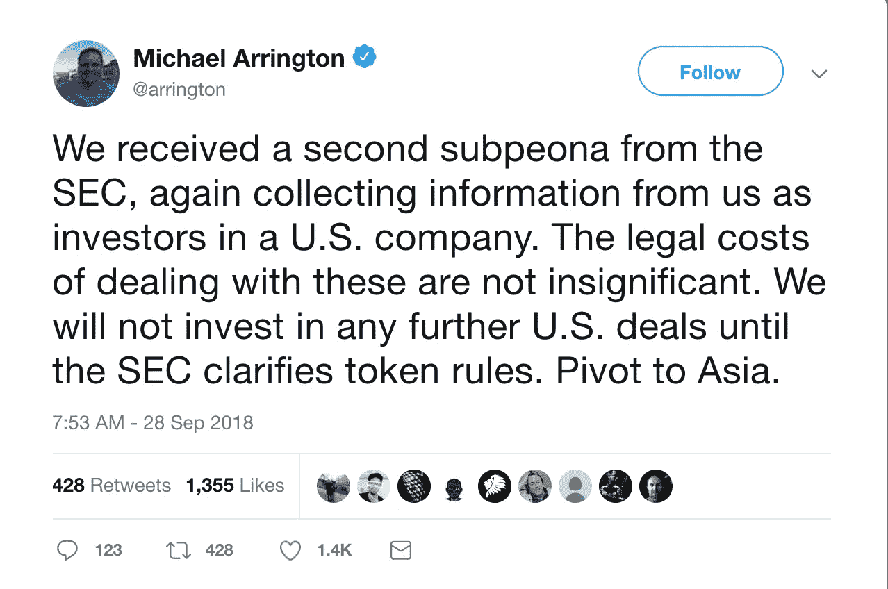

# 加密投资者是否违反了 RICO 法案？

> 原文：<https://medium.com/hackernoon/are-crypto-investors-running-afoul-of-the-rico-act-229af1c3b864>

The RICO Act allows the US government to seize businesses associated with criminal activity in order to prevent organized crime. Its original purpose was to target the Mafia, but could the RICO Act be used for investors in illegal crypto businesses?

华尔街日报[在 9 月 28 日发表了一篇文章](https://www.wsj.com/articles/how-dirty-money-disappears-into-the-black-hole-of-cryptocurrency-1538149743?mod=hp_lead_pos8),讲述了流行的加密交易所是如何从已知的诈骗犯那里洗钱的。报告显示，调查人员已经追踪到近 9000 万美元的洗钱资金。

虽然调查提供了有关这些交易所洗钱过程的信息，其中最引人注目的是美国的无账户交易所 ShapeShift，但这篇文章主要是作为一个合法化因素:不受监管的交易所的已知问题现在已经产生了已知的后果。这些交流被用于非法目的的可能性不再仅仅是一种可能性，而是一种现实。

这篇文章的另一个有趣的方面是当记者采访 ShapeShift 的投资者之一，潘迪拉资本的保罗·维拉迪特塔基特时。当被问及他是如何做出投资 Shapeshift 的决定时，Paul 说“我信任 Erik。我知道埃里克不是第一次创业。”尽管埃里克之前因违反证券法而受到美国证券交易委员会(SEC)的制裁，但这很容易在谷歌搜索中找到。更糟糕的是，潘迪拉资本解释说，他们与律师交谈过，律师告诉他们，交易加密货币不需要任何形式的监管。ShapeShift 筹集了资金，并继续以匿名账户为中心的商业模式，为大规模欺诈敞开了大门。

投资者有责任审查他们的投资，他们不能投资于欺诈性的企业。为什么不投资[丝绸之路](https://www.fbi.gov/contact-us/field-offices/newyork/news/press-releases/ross-ulbricht-the-creator-and-owner-of-the-silk-road-website-found-guilty-in-manhattan-federal-court-on-all-counts)，著名的网上毒品黑市？当然，如果政府没有关闭它，投资者如果早期投资的话，本可以看到非常可观的回报。

有一个很好的理由，你没有听说投资者资助利润丰厚，但非法的企业，这是所谓的诈骗影响和腐败组织法，或 RICO，这是在 1970 年签署的。这部法律的出台是为了有效地追捕黑手党，并合法地没收他们的资产，包括房地产、银行账户和与有组织犯罪“有关联”的企业。

然而，有组织犯罪的定义可以扩大到包括电信诈骗和资助恐怖主义和诈骗者的金融公司。政府只需要证明在一家企业中有两起诈骗案，你就大功告成了。等等，这意味着证券交易委员会可以援引 RICO 法案，没收 ShapeShift 投资者的资产，这些投资者投资了两家没有按照监管要求正确注册的加密交易所？活跃在加密领域的风险投资基金的投资者应该感到担忧。一些风险投资公司的有限合伙人包括教师工会和大学基金会。哎哟！

9 月 28 日的下一个公告来自迈克尔·阿灵顿，他是 TechCrunch 的创始人，他的对冲基金 XRP 投资于加密货币业务。迈克尔通过推特宣布，由于收到美国证券交易委员会的第二张传票，他将不再投资美国区块链公司。第二个？

迈克尔说得有道理。每次收到传票，对传票做出适当回应的成本在 5 万至 50 万美元之间。成本主要是律师费，但也包括会计师和专门以 SEC 要求的格式检索数据的供应商。迈克尔的解决方案很简单:不要投资美国公司，避免美国监管机构的传票。然而，这并没有真正解决他的问题。为什么？

如果这些外国企业与美国人做生意，那么迈克尔并没有真正逃脱美国证券交易委员会的监管。他们仍然可以传唤他的公司。看看 1Broker 就知道了，这是一家总部位于太平洋一个小岛群的公司，由于 SEC 对该平台的调查，其网站上周被 FBI 查封。

人们真的认为美国是唯一拥有安全规则和司法系统的国家。尽管证交会比许多监管机构更加直言不讳，但这并不意味着其他司法系统没有密切关注这一领域。你可以打赌他们是。

迈克尔的声明“在美国证券交易委员会澄清象征性规则之前，我们不会投资任何进一步的美国交易”是一条措辞强烈的推文，在网上引起了轰动，我相信这是有意的，但它最终忽略了更广泛的监管问题。规则需要更明确吗？为支持非法活动的企业提供资金会导致传票，并可能导致进一步的执法行动。对我来说这似乎很简单。

迈克尔的下一步是回应传票，改变基金的使命，只投资于遵守法律限制并在法律范围内经营的经过适当审查的企业。不这样做的惩罚是:响应 RICO 法案，没收他的基金资产。不是一个有趣的过程。

StartEngine 是一个领先的股权众筹平台，已经帮助 250 多家公司筹集了超过 8000 万美元。我们目前也在筹集资金。加入已经投资我们的近 3500 名 StartEngine 所有者。 [*这里投资 start engine*](https://www.startengine.com/own?utm_source=Medium)*。*

*欲了解更多信息，请查看我们的* [*发行通告*](https://www.sec.gov/Archives/edgar/data/1661779/000114420419013344/tv515967_253g2.htm) *。*