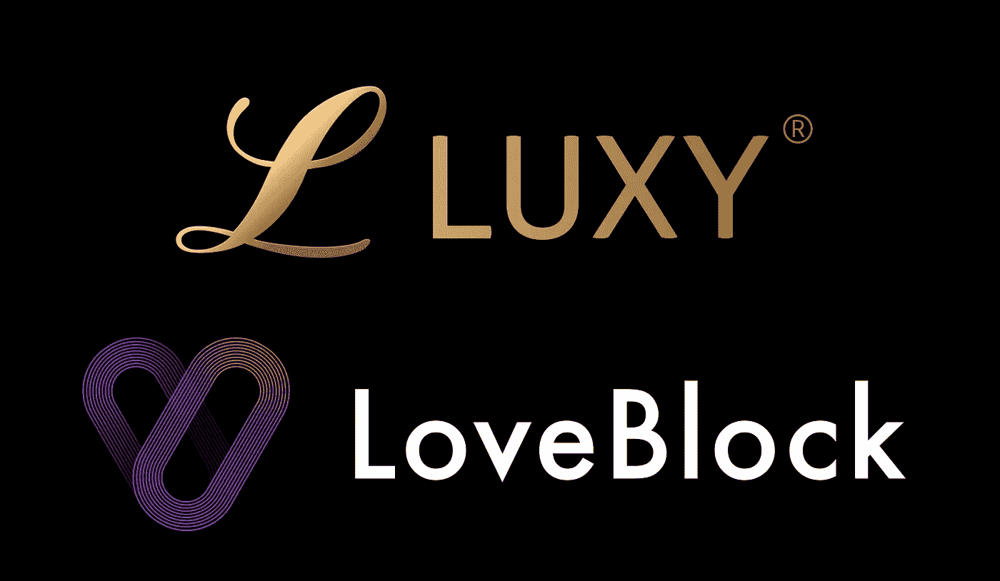

# 约会应用正在扼杀浪漫吗？

> 原文：<https://medium.com/hackernoon/are-dating-apps-killing-romance-25e0ab512627>

刷、刷、刷、刷……这概括了今天的[约会应用](https://hackernoon.com/tagged/dating-apps)。无休止的刷卡导致几个匹配，然后更少的匹配你决定有意义的谈话，最终一个或两个人你亲自见面。

这些第一次约会往往是强迫和判断。你对将要见面的人知之甚少，而且你们每个人都试图强迫初次约会。最终，不太可能有两个人真正合得来。尤其是当 Tinder 这样的应用程序上有无穷无尽的可行选项时——在那里滑动半个小时就可以很容易地查看数千个类似的个人资料。

这种只强调视觉吸引力的快速约会已经导致人们厌倦了今天主要的在线约会网站。用户保持率处于历史最低点，研究表明，通过这些应用程序进行面对面交流的人比以往任何时候都少。

除此之外，还有非常普遍的伪造个人资料、钓鱼和约会欺诈问题——据 FBI 估计，这些诈骗每年造成的损失超过 2 亿美元。

幸运的是，有一些新的创新玩家正在寻求逆势而上。

LoveBlock.one 是最新的技术创新，有助于扭转趋势，彻底改变约会行业。通过使用[区块链](https://hackernoon.com/tagged/blockchain)技术，LoveBlock 能够以前所未有的方式保护用户数据。此外，欺诈、虚假个人资料和骗子将通过 LoveBlock 在整个行业中被清除。one 区块链允许多个约会应用程序相互链接并共享骗子的安全数据，将他们从每个系统中清除。

LoveBlock 还与高端约会应用 LUXY 合作，这是许多合作关系中的第一个。

Luxy 是一个高端约会平台，它将用户安全和验证置于其他平台的任何方法之上。这并不奇怪，毕竟奢侈品是给成功和富有的人准备的。因此，安全是重中之重。

越来越多的约会平台加入到对欺诈者采取行动的行列中，他们活动的空间就会变得越来越小。多年以来，网上约会是一种常见的活动，帮助数百万人找到了爱情。它也将通过其便利性在未来继续存在。如果人们能够点燃篝火，创造一个浪漫的环境，这总是取决于参与其中的人们。这也可以通过电话和别人聊天来实现。

如果未来的爱情寻求者可以专注于此，而不必担心他们写信的人是不是他或她声称的那个人，那就太好了。

[www.loveblock.one](http://www.loveblock.one)

[www.facebook.com/theloveblock](http://www.facebook.com/theloveblock)

www.twitter.com/theloveblock

【www.t.me/theloveblock 