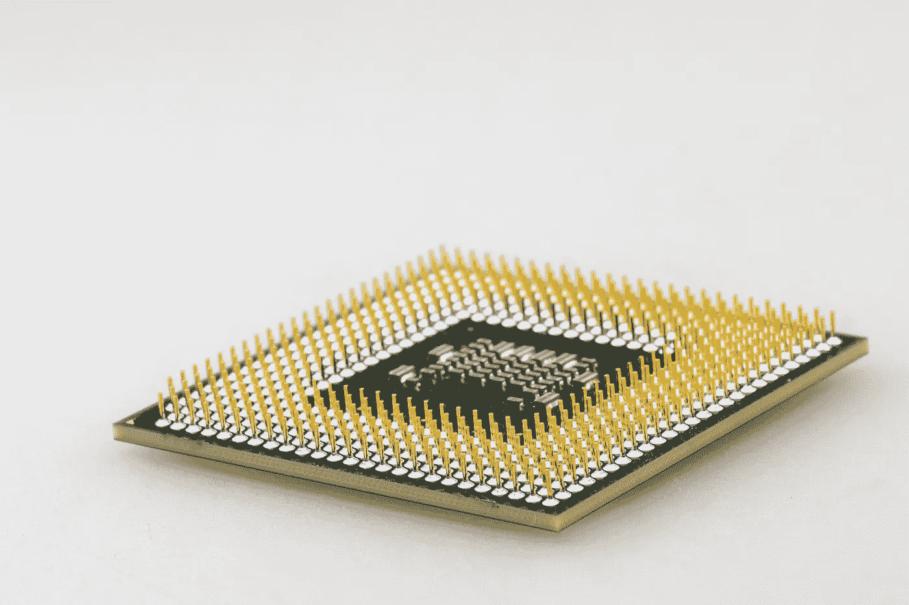
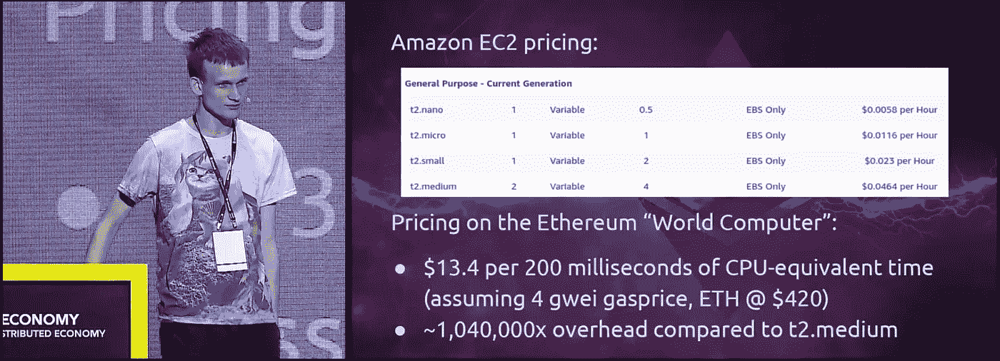

# 通用区块链是正确的解决方案吗？

> 原文：<https://medium.com/hackernoon/are-general-purpose-blockchains-the-right-way-forward-1bd167e8b915>

今天的公共区块链被称为“世界计算机”。最著名的是比特币，这是第一种基于分布式公共账本的加密货币。

比特币的独特之处在于，它是第一种以不可信、去中心化的方式解决双重消费问题的加密货币。比特币本身取得了区块链，并将其用于一个单一的目的:一种点对点的、去中心化的电子现金。**就这样**。

第二个最著名的区块链可以说是以太坊。

以太坊就像比特币一样采用了区块链，但它渴望做得更多:创造一台通用的、去中心化的世界计算机。

为了实现这一目标，他们建立了一个强大的基础设施，能够以智能合同的形式运行复杂的操作。以太坊功能的两个“杀手级应用”例子是 ICOs(2017 年一年 6.8 美元的 T2 市场！)和 Cryptokitties(交易虚拟资产。在这种情况下，可爱的猫)。

以太坊是一个令人惊叹的工程壮举——一台通过智能合约的庞大生态系统工作的全球世界计算机。

但是有一个警告。

# 通用与专用

在计算机硬件的世界里，大致有两种类型的硬件:通用硬件和专用硬件。

“通用”硬件的一个很好的例子是我们常见的计算机 CPU。这些芯片是任何电脑和智能手机的核心，足够灵活，可以处理任何类型的工作。

Computer CPU

通用系统的好处在于，它能让创造者只用软件就能解决大多数任务 CPU 能处理你交给它的任何形式的任务。

缺点:CPU 是万能的，但不是万能的。如果您正在处理图形渲染或加密货币挖掘等性能密集型任务，CPU 速度缓慢且效率低下。

另一方面，你有“专门的”硬件。这一类的一个很好的例子是 GPU。

GPU 是为渲染图形而设计的，是世界上最好的硬件。

专用硬件的优势在于，您可以针对一组特定的问题定制您的解决方案，以比通用解决方案更低的运营成本获得显著的性能优势。

弊端？专用硬件只擅长它被构建来做的工作。

我们可以看到比特币矿工将这一点发挥到了极致——专用于开采比特币的 ASIC 芯片，仅此而已。

# 通用区块链的问题是

事实是，今天的区块链还不能很好地扩展。我们在比特币上看到了这一点，在以太坊上看到了 10 倍。

问题是，工作证明区块链不善于扩大规模，尤其是如果你的目标是成为一个通用的世界计算机——区块链瑞士军刀。

举例来说，今天，以太坊公共网络与传统云计算(亚马逊 AWS)相比效率低得惊人:

一个中型亚马逊 AWS 实例的每小时成本:0.04 美元

以太坊世界电脑每小时成本:41.6 万美元

Vitalik’s talk at Deconomy 2018

如您所见，我们谈论的是 1，040，000 倍的开销。

但是，如果扩展区块链的正确解决方案不是有一个单一的万能链，而是为每个特定的用例创建专门的链，会怎么样呢？与其将一个区块链扩展到极致，我们为什么不按需添加更多呢？

本质上，这是我们在过去几年中一直在构建的市场——今天，我们有数百个独立的项目来处理各种区块链用例，**但吸引所有注意力的是通用平台。**

很难说什么是正确的解决方案，但听起来有很大的潜力来分别处理区块链的每个用例，并通过组合数百个不同的区块链来实现真正分散的“世界计算机”，每个都为不同的利基构建。

采用这种方法，你自动获得的每个区块链的流量比我们使用以太坊获得的流量要少。此外，这种方法开放了技术多元化:每个项目都可以根据所述项目的独特需求，以他们选择的任何方式自由地处理自己的技术和可伸缩性问题。

例如，如果我们为代币和众筹销售创建一个单独的区块链会怎么样？如果它是分散的，并且背后有足够的采矿力量，这样的解决方案在代币和众筹方面将比以太坊更有效率。更重要的是，更简单的区块链更容易获得，因为它只做几件事。这就是比特币本身如此优雅的原因——它只做一件事:交易数字货币。

A Bit “coin”?

# 多元化是好的

对支持分散经济的框架采取多元化的方法是保持真正的分散化的好方法。

今天，如果我们拥抱以太坊，我们就拥抱维塔利克。但是，如果我们接受区块链的“多元化”，我们就接受了整个经济。

这并不是说以太坊和通用区块链没有立足之地。相反，以太坊和其他平台对于许多用例来说是很好的解决方案，尤其是那些不需要引导区块链的项目。但是对一个地方的信任应该有个限度。

**在市场能够真正支持许多区块链之前，我们需要破解区块链的互操作性，这正是我们在** [**Safebit**](http://safebit.io) **所做的工作。来看看我们吧:)**

