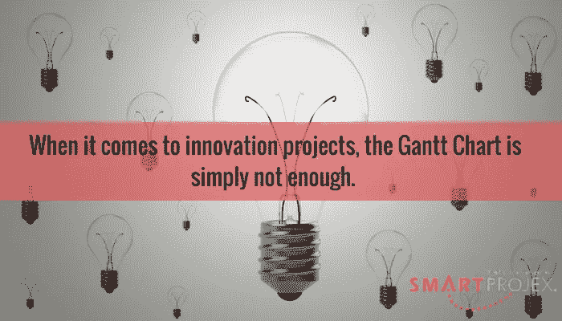

# 创新项目更复杂吗？

> 原文：<https://medium.com/hackernoon/are-innovation-projects-more-convoluted-b0866e36b999>

你在尝试创造性地思考，为你的公司想出一些新的东西吗？你是不是工作太快，没有时间思考项目管理？你不确定你或你的团队下一步应该做什么吗？你是否花了太多时间搜索电子邮件、文件或成本估算，却因为记不起放在哪里而找不到？你也没有真正的项目经理…因为每个人都在为项目工作…

在一个速度可能至关重要的世界里(尽管运气可能也同样重要)，跳过典型的项目管理步骤，继续前进是很有诱惑力的。

目前有两种广泛使用的方法可以用来管理大型项目。瀑布法以创建甘特图为中心。我认为，当接下来的步骤是迭代的，并由最后步骤的结果驱动时，这种方法并不好用。敏捷方法可能更好，但是这意味着什么呢？[敏捷](https://hackernoon.com/tagged/agile)的味道太多了。

如果没有这两种方法中的一种，也可以选择让项目尽你所能地展开——不要太关注项目管理。这就是 Trello 或 SmartSheet 等软件工具派上用场的时候了。或者甚至是一个[谷歌](https://hackernoon.com/tagged/google)电子表格或 base camp——只是为了让每个人都在同一页面上。

我已经尝试了几乎所有的方法。但是当我在做任何需要不断调整、适应不断变化的信息、或者想出一些创新的东西的项目时，我想要另一种方法。我需要的不仅仅是特雷罗或谷歌电子表格。我和一些不能指望理解更复杂事物的人一起工作，比如吉拉。甘特图肯定是行不通的。但是我需要一种方法来跟踪成本和工作。

有一些传统的项目经理认为，项目管理的根本没有改变，所以没有必要修复任何东西。很明显，编写 PMBOK 指南的人相信使用甘特图方法仍然有很大的价值，这可以从教授这种方法的页数中得到证明。我认为创新项目对于这种方法来说太复杂了，我们需要别的东西。

[创新项目对于甘特图来说太复杂了。我们需要别的东西点击推文](https://twitter.com/intent/tweet?url=http://www.smartprojex.com/?p=3212&text=Innovation%20projects%20are%20simply%20too%20convoluted%20for%20the%20Gantt%20Chart%20approach.%20We%20need%20something%20else&via=smartprojex&related=smartprojex)

我不想陷入复杂项目和复杂项目之间的细微差别。我选择了令人费解的这个词，因为它可以表示错综复杂、曲折、困难、精细、复杂或错综复杂。所有这些词都可以应用到我看过的一些项目中。从我的角度来看，他们描述了今天的许多项目。那么，创新团队面临哪些项目管理问题？

# 创新项目就是没有太多的清晰度。

希望对最终目标有一些了解，团队可以就他们为什么要做这个项目达成一些共识。但是在项目执行的大部分时间里,“如何做”这个部分经常是模糊的。各队凭感觉飞行。人们只需要在飞行中调整。

所以，推迟详细规划是有道理的。从一开始就制定一个基本的游戏计划。理解期望。然后，花更多的时间在重要的事情上。始终关注哪些后续步骤具有最高价值。

你的创新项目是否缺乏清晰度？给你一个建议:永远关注下一步最有价值的事情。点击发微博

更不明确的是，要记录所有的项目文件、人员信息、模板、决策和问题，以便每个人都知道在哪里可以找到需要的东西，这是一个挑战。

# 你需要能够在团队不失控的情况下利用变化。

虽然团队通常调整得很快，但也有太快的时候。需要有一个节奏，允许专注的工作，在那里实现并交付价值，然后团队可以重新调整并找出如何最好地利用迄今为止的学习所呈现的任何新价值。

以冲刺的方式工作——两周是一个很好的时间，但是如果你的项目进展缓慢或快速，你可能需要调整这个时间长度。在冲刺阶段，不要让变化干扰你完成工作的注意力。(如果是真正的重大变化，本指南可能会有例外。)在冲刺的最后，休息一下，看看发生了什么。从中吸取教训。弄清楚它将如何帮助你提高。

# 你可能工作得太快了，以至于想跳过基本的项目控制技术。

我去过那里。这就是有节奏和明确的过程有所帮助的地方。你何时以及如何看待风险？谁在考虑您的采购合同中的任何要求是否得到满足？特别是，这是一项法律要求，如果没有人注意这一点，你可能会将你的公司置于危险之中。不要跳过基本的项目控制过程。

# 你可能根本没有一个熟练的项目经理。

如果每个公司都有资源为其所有的项目工作雇佣一个专门的项目经理，那不是很好吗？有时候就是不行。如果你感到绝望，打电话给我，也许我可以和你团队里的人一起复习基础知识。

# 你可能会面临严重的预算限制。

例如，很容易读到关于理查德·布兰森(Richard Branson)和埃隆·马斯克(Elon Musk)的新闻报道，并认为我们这个世界上的创新公司可以获得无限的资金。但是我们知道这不是真的。大多数公司迟早都要面对预算紧张的现实。尤其是当事情进展顺利时，如果你不注意，成本可能会失控。

所以，这意味着你的流程的一部分需要包括一些预算管理。我在这里写了一篇关于这个问题的博客。

创新项目需要有效的方法论吗？如果你这么认为，那我们就聊聊吧。

在阅读这八课的电子书课程时，您将学习如何建立项目管理流程，引导您的团队走向成功。

[**即时下载**](https://smartprojex.com/cart/?add-to-cart=5555) **>**