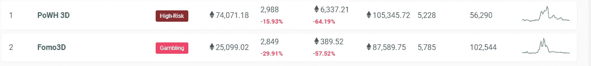

# 以太坊很多流行的去中心化应用只是庞氏骗局吗？

> 原文：<https://medium.com/hackernoon/are-popular-decentralized-applications-for-ethereum-just-ponzi-schemes-f1303075e6d9>

Bernie Madoff

过去一周左右，我一直在关注以太坊网络上发生的一个有趣现象:以太坊网络上庞氏骗局游戏的使用量急剧上升。这些去中心化的应用程序(dApps)分别是 [PoWH 3D](https://powh.io/) 、 [Fomo3D](https://exitscam.me/) 和 [FOMO Short](https://fomoshort.me/play) 。

据 [DappRadar](https://dappradar.com/dapps) 统计，PoWH 3D 在过去 24 小时内拥有 2988 名用户。Fomo3D 在过去 24 小时内有 2849 个用户。hours 肖特在过去 24 小时内有 752 名用户。

这些游戏是字面上的庞氏骗局。

token 项目咨询公司图灵咨询集团的成员 Sid Kalla 在谈到这些游戏时说:

> “从本质上来说，他们似乎采用了 2009 年至 2011 年流行的按出价支付拍卖模式的理念，只不过他们不是以出价出售‘真实’产品，而是不出售任何有形或有实际价值的东西。”

请注意，这些庞氏骗局游戏比 IDEX、福克德尔塔和 Bancor 等分散式交易所拥有更多的用户。

我的一个主要担忧是公众会误解这些信息。与我交谈过的许多非加密货币行业的人认为，所有加密货币和区块链只对非法交易和庞氏骗局有用。以太坊最流行的骗局是庞氏骗局，这一事实只会让他们的观点更加大胆。

> 以太坊预示着一场全球金融革命。相反，我们得到了美化庞氏骗局。这个 ***真的是我们被承诺的*** 金融革命吗？

甚至以太坊的创始人维塔利克·布特林也认为我们还有很长的路要走。去年 12 月，他在推特上问道:

> “我们为多少没有银行账户的人提供了银行服务？我们为普通人创造了多少抵制审查的商业？
> 我们创造了多少有实际用途的 dapps？
> 实际上做任何有趣事情的智能合约中储存了多少价值？有多少委内瑞拉人实际上受到了我们的保护，免受恶性通货膨胀的影响？
> 现实中微支付渠道的实际使用量到底有多少？”

无论你是在以太坊网络上构建 dApps，还是在加密货币/区块链团队中工作，或者只是对加密货币感兴趣，这些都是你应该问自己的问题。

作为一个社区，我们应该比简单的庞氏骗局更好——在很大程度上，我认为我们比这更好。我很清楚许多新技术的第一次使用案例包括赌博，以及其他令人讨厌的事情。但现在我们也需要开始专注于为大量用户提供重要价值的 dApps。

这就是为什么我正在从事像 [Datum](https://datum.org/) 、 [IDEX](https://idex.market/) 和 [BitDiem](https://www.bitdiem.com/) 这样的项目，因为我仍然相信 dApps 将能够真正以一种巨大的方式积极地影响人们的生活。这就是我的愿景。

如果你喜欢这篇文章，请跟我来，给这篇文章 50 个掌声！