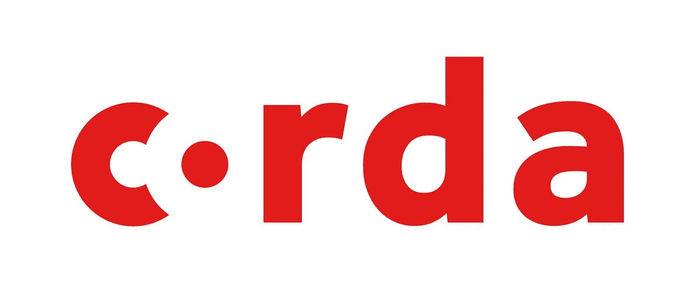

# 智能合同准备好大规模采用了吗？

> 原文：<https://medium.com/hackernoon/are-smart-contracts-ready-for-mass-adoption-86a11d0705b1>

智能合约之父尼克·萨伯(Nick Szabo)曾将智能合约比作自动售货机，因为它们具有自动性。当你把适量的硬币投入机器，无论如何你都会得到你的汽水罐。一旦设置了初始参数，智能合同也将执行，而不管外部事件或当事人意图的改变。

Monax 网站给出的定义更加准确:“托管在区块链上的脚本，代表单方面承诺提供基于发送给脚本的交易确定的执行。让我们分解这个定义，以便更好地理解智能合约的不同方面:

-智能合同是一个**脚本** …

基本上，智能合同是一个计算机程序，与任何其他程序一样。使用的编程语言取决于平台，或者更确切地说，取决于托管智能合约的区块链。目前，最受欢迎的智能合约平台是以太坊(ether eum ), Solidity 是其最常用的语言。

- … **主持区块链** …

一旦程序完成，它就被部署(或编译)并存储在区块链中。然后为该智能合约发布一个地址(十六进制)。这是交易将被发送以激活合同的地址。

重要的是要记住，自比特币诞生以来开发的区块链可以执行智能合约中包含的代码。区块链不再是简单的分散记录(如比特币区块链)，它们也是“图灵完整的”，这意味着它们能够执行更复杂的程序(例如智能合约)。

- … **并由交易激活。**

无需进入太多的细节，智能合约的程序包含一个或几个功能，这些功能将由用户账户发送的交易激活。这些函数是命令，或者按照 Monax 的定义是“确定的执行”,可以自动操作或者通过外部事务操作。

这两个定义揭示了智能合同的技术方面，以及其执行的自动和不可阻挡的性质，但它们没有提及其与现实世界的互动和实际法律后果。

正如我们目前所知，人类之间的契约在执行时极其复杂。许多在签订合同时不可预见的事件不能纳入合同。这就是为什么我们有法院和法官，他们的作用是解释合同，并试图根据新的因素推断出双方的最初意图。

“Code is Law” — source: Shutterstock

在创建合同时，不可能在智能合同中编码不可预见的事件。但智能合同会自动执行条款，而与当事人的意图无关，这就给法官的解释留下了空间。这就是为什么人们通常认为法典就是法律，即合同法典是适用于合同的唯一法律，即使该法典有缺陷并且没有反映当事人的意图。

但是，由于智能合同是在一个(不断发展的)国家和国际法律框架中实施的，因此守则不可能是适用于组织人际关系的合同的唯一法律。出于这个原因，智能合约需要变得可适应或可更新。

让我们比较一下传统合同和智能合同，以便更好地理解它们的主要区别:

smart contracts

从上表中我们可以看出，智能合同正在改进我们的 good hold 纸质合同的许多功能，但对于这些智能合同在人类日常关系中的应用，有两个要点仍然存在问题:

*   智能合约的可读性很差。
*   由于合同的立即和不可撤销的执行，合同不可能适应外部事件。

我们将讨论这两点，并描述目前正在测试的允许大规模采用智能合约的解决方案。

我们怎样才能让智能合同具有可读性？

Clark、Bakshi 和 Braine 在他们题为“智能合同模板:基础、设计前景和研究方向”的文章中，通过区分智能合同的技术和法律方面，首次定义了智能合同。换句话说，他们认为，在区块链上执行和存储的代码，他们称之为**、**的“智能合同代码”，以及这项技术的法律实现，他们称之为**、**的“智能法律合同”，应该分开分析。

**智能合约代码**

智能合同代码专指作为智能合同的计算机程序。

这篇文章的目的显然不是深入编程语言的细节。然而，给你一个实际上是智能合同的概述似乎很有趣。如果我们以在以太坊区块链上创建令牌为例，使用的语言是 solidity，这是在该平台上编程最常用的语言。

此示例摘自以太坊网站上提供的一个教程，对应于一个非常简化的令牌创建版本。

Source: Ethereum

如您所见，智能合约的名称是“MyToken ”,它由两个函数组成。函数“MyToken”(与契约同名，也称为“构造函数”)在创建智能契约期间仅使用一次，以初始化条款，即例如确定将投入流通的令牌的数量，并将它们存储在区块链上创建的存储空间中。

第二个功能称为“转移”，当被触发时，将启动令牌从一个用户到另一个用户的转移。这些功能通过用户从其外部账户发送的交易激活。这个存储智能合同信息的存储空间是通过“映射”创建的。

请注意，即使 solidity(源自 Javascript)是迄今为止以太坊上最常用的智能合约编程语言，也可以用其他语言进行编码，如 Snake(源自 Python)、LLL 或 XML。

**智能法律合同**

“智能法律契约”一词指的是智能契约发展的法律环境，因此与 Ian Grigg 提出的李嘉图契约概念直接相关。李嘉图合同背后的理念是将传统合同与软件相结合，以轻松管理执行和解释阶段(1)。通过扩展，智能法律合同的概念首先指的是**智能合同模板**，其目标与李嘉图合同相同，但也包括智能合同的自动执行(2)。

(1)李嘉图契约

Ian Crigg 将李嘉图合同定义为“单一文件，即 a)由任何发行人向受益人提供的合同，(b)由受益人持有并由发行人管理的有价产权，c)易于被人阅读(如纸质合同)，(d)可由程序(如数据库)读取，(e)以数字方式执行，F)包含服务器上的密钥和信息，以及 g)链接到单一安全标识符”。

简而言之，这是一份用英文书写的 PDF 文档上的标准合同，但该合同的一些条款(例如，双方的名称、地址、价格)是可变的，并通过加密过程直接链接到数据库。你肯定在不知情的情况下看到了这些合同。

李嘉图契约体现了几个利益:

1 — **从合同中自动提取和存储数据**:如下图所示，文档和数据被提取并提交到一个加密哈希(如 SHA-1)中，从中组织和存储信息。李嘉图合同框架中使用的哈希原理与工作证明流程中使用的哈希原理相同，因此，如果不彻底更改最初获得的哈希，合同中订立的条款将无法更改。

2 — **安全性**:李嘉图合约包括文件发行人的加密签名。该签名包含在散列中，因此不产生不同的散列就不能被修改。

3 — **可由人类协商**:你不需要理解合同背后的加密部分就可以使用合同。可以通过律师和你的客户协商。由于它的执行不是自动的，所以它不是一个智能合同，双方还可以重新协商合同并使其适应新的事件。

Source: This picture is licensed under the [Creative Commons](https://en.wikipedia.org/wiki/en:Creative_Commons) [Attribution-Share Alike 4.0 International](https://creativecommons.org/licenses/by-sa/4.0/deed.en) license.

**OPENBAZAAR**

OpenBazaar 是一个去中心化、开源的电子商务网站。OpenBazaar 与我们目前使用的传统电子商务平台(亚马逊、易贝、Leboncoin……)的区别在于，Openbazaar 不适合通过从每笔交易中收取佣金来撮合买家和卖家。你将下载并安装一个软件(Openbazaar 协议),而不是访问一个网站，该软件允许你访问一个与你有相同目标的同行网络，购买或销售。交易和支付在网络成员之间直接完成，而不需要通过电子商务平台来实现，也不需要通过信用卡公司/PayPal 来支付。对于大多数分散式应用程序，您不必公开您的个人信息。

我们在这里提到 OpenBazaar 是因为他们使用李嘉图契约来连接网络成员。

通过下载 OpenBazaar 协议软件，你将能够创建一个广告，描述你想要出售的房产并提出价格，就像你在任何传统电子商务网站上所做的那样。这个广告然后被发送到网络上，这样每个成员都可以通过简单的关键字搜索来访问它。如果两个成员就价格达成一致，该软件将创建一个李嘉图合同，其中包括双方的加密签名，并将其发送给网络的第三方成员，即调解人，调解人的任务是检查合同并创建一个 multisig 比特币账户。

Source: Openbazaar

智能合约的不同之处在于，这种合约不会自动生效，双方可以自由地不买也不卖。它的执行总是依赖于签署它的各方(以密码方式)和关系调解人的意愿，这就引出了最后一个概念:智能合同模板。

**(2)智能合同模板**

智能合约模板的概念在由 Clark、Bakshi 和 Braine 撰写的论文的第二部分中描述如下:“智能合约模板基于 Grigg 的李嘉图合约的三重架构，即文本、设置和代码。在这种架构中，从法律文本中收集关键操作设置(…)，并将其转换为智能合同的代码，从而实现自动执行。”

根据同一份报告，智能合同模板必须满足五个条件:

1.  一种创建和编辑法律文档的方法，包括特定于每种法律情况的法律文本和参数。这些方法已经存在，从简单的 Word 或 PDF 文档到更先进的软件，如 [contract Express](http://www.contractexpress.com/) (由汤森路透开发)。
2.  用于存储、访问和传输法律文件的标准格式。该条件旨在允许交易对手之间以所有人都能接受的格式转让合同，如 JSON、XML 或 Markdown。
3.  执行智能合同的协议(有或没有签名)。
4.  用于将智能法律合同(法律文本)链接到智能合同代码(智能合同的计算机语言)的方法，以创建能够适应创建它的法律环境的合同。一个解决方案可以像李嘉图合同所使用的那样，即实现智能法律合同的加密哈希，该哈希将存储在智能合同代码中。
5.  使智能合同可访问并以其适用的司法管辖区的法律可接受的形式使用的方法。这正是目前试图提高 CommonAccord(T4)的挑战，Common accord 是增强合同知识的通用语言 (Clack)或[法律术语](https://legalese.com/)。

**R3 CORDA 面料**

所有这些元素似乎都已被 R3 Corda“fabric”收集，该公司打算使用智能合同模板连接银行，并大幅加快交易流程。

在 Barclays 组织的[演示中，Smart Contract Template 的主要创建者之一 Lee Brain 这样描述 R3 Corda“fabric ”:](https://declara.com/content/N16domz5)

“它们提供了一种优雅的方式将法律协议中的文本与相应的业务逻辑联系起来。我向您强调，法律文件流程可能会冗长、繁琐且需要手动操作。智能合同模板可以简化所有这一切，因为它们是为重用而设计的模板，所以它们可以推动行业采用可依法强制执行的标准”(……)“这具有巨大的潜力，使银行能够通过使用通用组件来共同化整个行业的成本，这是在一个有数十亿页法律协议的领域进行范式转变的潜力。”

Source: Corda

R3 的想法是建立一个封闭的银行网络，依靠一个或几个区块链存储所有的交易和法律合同。

最终目标是从交易流程中移除所有后台/中台办公室、存管机构、CSD 和 CCP，这些在 2008 年危机后 G20 决定的金融法规(MIFID、EMIR、BASEL……)颁布后变得极其繁琐。

这些智能合同模板之所以有效，是因为它们所取代的合同是高度标准化的，还因为所有法律条款都是在网络级别预先协商好的。只有当双方能够在上游讨论其他条款时，这种安排才有可能。

出于这个原因，智能合同模板非常适合区块链财团，这是一个封闭的区块链，所有参与者都是已知的和选定的。因此，Corda 是一个平台，在这个平台上，R3 联盟的所有成员都能够交换智能合同以达成交易。但他们用于双边谈判的 ISDA 主协议(银行谈判的金融衍生品交易合同，银行希望用智能合约模板取代)的所有法律条款，都是在行业层面预先达成一致的。

我们真的能让智能合同更加灵活吗？

除了实现智能合同模板之外，使用封闭式区块链还有几个优点。它给其成员提供了在区块链定制合同的可能性，甚至在需要的时候[更新合同。即使存在一些解决方案，这些特征对于存储在公共/开放区块链上的智能合约也是不可能的。](https://docs.corda.net/contract-upgrade.html)

对于托管在诸如以太坊之类的公共账本上的智能合约来说，问题确实不同，因为不可能修改已经部署的合约条款，即由以太坊虚拟机编译的合约条款。

在这种智能契约中引入一些灵活性的唯一方法是将数据从契约的逻辑中分离出来，要么通过[为它们中的每一个创建不同的契约](https://monax.io/docs/solidity/solidity_7_updating_solidity_contracts/)，要么通过[使用库](http://solidity.readthedocs.io/en/latest/contracts.html#libraries)来外包逻辑。但是，这两种选择实施起来都很复杂，不足以涵盖复杂法律合同的所有法律细节，也不足以解决在区块链可以自由查阅的合同的保密问题。

**CommonAccord**

这就是为什么“CommonAccord”等倡议试图找到替代解决方案来简化智能合同的使用。如果我们总结一下其发明者之一 James Hazard 的话，“CommonAccord 可以被描述为一个法律文件社区，类似于 GitHub 上的民法 3.0，与基于区块链的分散交易系统兼容”。

更确切地说，“CommonAccord 是一种面向对象的编程语言，它支持创建一个被编纂的法律文本的综合系统。CommonAccord 的目的是使文档非常灵活，以至于文本的很大一部分都消失了，只给各方留下具体要点的协商和非常清晰的关系。这些关系可以在任何时候转化为法律文件，以执行审计或签署。”

因此，CommonAccord 的目标是创建所有人都认可的标准化法律文本，并存储在可免费访问的数据库中，如软件的 Github 或商业交易的 Incoterms。这将开启一个世界，律师和每个人都可以通过组合预先写好的文本来起草合同(和智能合同)，就像程序员现在处理代码一样。律师都应该开始学习一门编程语言，因为他们职业的“优步化”正在快速到来。

**结论:**

智能合同已经成为现实，但只适用于在封闭网络中交换的非常标准化的行业特定合同。我们还远远没有在日常生活中主流地采用和应用这些合同，但事情正在快速发展，我们应该为这场不可避免的革命做好准备。