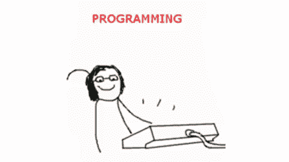
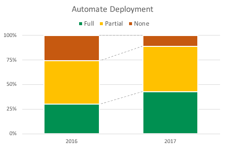
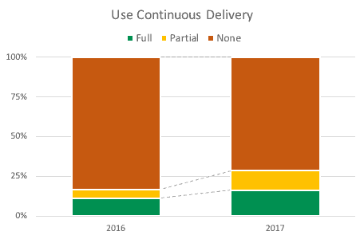
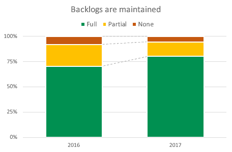
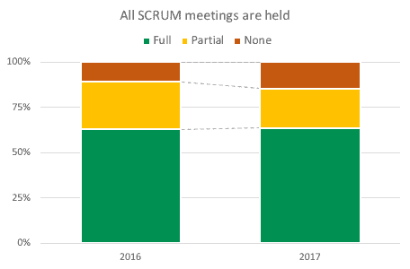
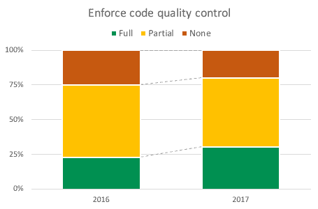

# 我们在软件开发方面越来越好了吗？

> 原文：<https://medium.com/hackernoon/are-we-getting-better-at-software-development-74e84d470770>

## 我们的开发最佳实践基准显示了零碎的改进

Following best practices or typing away blindly?

部署自动化正在迅速普及。**积压** **梳理**正在进一步完善。代码质量控制和自动化测试正在改进，但是仍然没有被大多数团队完全采用。这些只是我们从年度发展最佳实践基准[重新校准中获得的 3 条经验。](https://hackernoon.com/tagged/benchmark)

请继续阅读一些有趣的**统计数据**以及它们告诉我们的关于[软件开发](https://hackernoon.com/tagged/software-development)走向的信息。最后的奖励:快速**自我评估**来衡量你自己的团队。

**什么是开发最佳实践？**

15 年来，我和我在软件改进小组(SIG)的同事们一直致力于为我们的客户评估代码、架构和开发实践的质量。

我们开始只是给出一个专家的判断，基于我们观察到的和我们自己的软件开发直觉告诉我们的。

随着我们收集了更多的观察资料，获得了更多的经验，我们决定拿出我们的科学技能(🎓)并构建结构化评估模型。该模型收集了一系列关于给定团队应用了哪些开发实践的检查，但是也为团队何时完全、部分或根本不应用那些实践设置了阈值。我们已经使用这个模型很多年了，为团队提供客观的反馈和与同行的比较。

Ten best practices for effective software development. *We described our structured evaluation model for software development best practices at length in the* [@OReillyMedia](http://twitter.com/OReillyMedia) *book “Building Software Teams”.*

**评估模型的年度更新**

大约每年一次，我们用我们在过去一年中收集的观察和评估来更新我们的基准存储库，并使用这些额外的数据来调整模型。

这种年度更新也是研究数据和寻找趋势的绝佳时机。我们在软件开发方面越来越好了吗？我们刚刚完成了最新的校准，这是我们了解到的开发最佳实践的趋势。

**第一课:更多的团队应用部署自动化**

我们通过查看团队是否有快速的、可重复的、最好是全自动化的部署过程来度量部署自动化的实践。

例如，一个只需按一下按钮就能部署每个新版本的团队将在这一实践中获得满分，编码为*完全应用*。但是一个团队需要经历有限数量的记录良好的手动步骤，将被评分为*部分应用*。

More teams fully apply deployment automation (43%, was 30%) and fewer teams do not apply deployment automation at all (11%, was 26%).

如图表所示，更多的团队完全应用了部署自动化实践(43%，30%)，更少的团队根本没有应用部署自动化(11%，26%)。

这是一个重要的积极趋势，反映在**持续集成**(每次变更后自动编译和测试)和**持续交付**(每次变更后自动部署)的趋势中，如下图所示。

Full or partial adoption of continuous integration (currently 68%) has significantly improved, but still lags behind compared to deployment automation (currently 89%). For continuous delivery, adoption has also improved significantly, but still has a long way to go (currently 29%).

尽管这两种实践的趋势同样积极，但它们的采用仍然滞后。特别是对于持续交付，绝大多数团队(以及他们所属的组织)还有很长的路要走。

**第二课:几乎所有的团队都整理了他们的积压工作**

Nearly all teams (95%, was 92%) maintain product and sprint backlogs and a significantly larger portion of teams applies this best practice fully (80%, was 71%).

积压工作整理的最佳实践已经被广泛采用，71%的团队努力维护产品和 Sprint 积压工作，22%的团队至少部分地这样做。随着团队完善他们的待办事项整理，完全采用增加到 80%。只有一小部分团队(5%，低于 8%)根本不做任何积压工作整理。

事实上，我们评估的大多数敏捷-Scrum 最佳实践显示了改进，或者稳定的高采用率。只有一个小小的例外:

More teams do not stick to the discipline of holding all meetings prescribed by Scrum (15%, up from 11%).

如图所示，很少团队坚持 Scrum 规定的会议纪律(计划，每日站立，回顾，回顾)。这可能不是一件坏事*本身*，因为更有经验的团队被鼓励调整他们的会议节奏以适应他们自己的需要。

**第三课:代码质量控制和测试正在改进**

Fewer teams are failing to enforce consistent code quality standards (20%, down from 25%). Fewer teams fail to run automated test at each commit (41%, down from 48%).

质量控制是专业软件开发的重要部分。然而，代码质量控制和自动化测试的最佳实践仍然只被少数团队完全应用。

为了评估代码质量控制，我们观察团队是否使用清晰的编码标准工作，系统地审查代码(对照这些标准和良好设计的原则)，以及是否执行自动化的代码质量检查。代码质量控制的全面采用有所增加(从 23%上升到 31%)，但是**仍然有 20%的团队在没有适当的质量控制的情况下生产代码**。

为了评估测试实践，我们观察团队是否有自动化回归测试套件，该套件在每次变更后都被一致地执行。这种实践的全面采用正在增加(从 29%上升到 33%)。没有经过适当的回归测试就更改代码的团队比例正在迅速下降，但仍然是惊人的 31% (低于 48%)。

**变好了吗？**

所以我们的问题: ***我们在软件开发方面越来越好了吗？*** 可以回答: ***可以，但是速度适中。***

对于一些实践来说，指针在过去的一年中似乎没有移动太多(例如，记录足够多的内容，管理第三方组件，使用 SMART 需求和面向目标的度量)。我不会用平线图来烦你。

我们确实在许多实践中看到了显著的进步，尤其是部署自动化、持续集成、代码质量控制和自动化测试。这是一个令人难以置信的好消息！

但我们还没到那一步。就我个人而言，我对不到三分之一的软件开发团队遵循质量和测试最佳实践感到有点震惊，因为采用这些最佳实践可以用有限的努力带来直接的好处。

> 不到三分之一的软件开发团队遵循质量和测试最佳实践

**你能做什么？**

*   **评估你自己的团队:**如果你想了解更多，或者想让我们评估你的团队，请给我写信。要快速进行自我评估，您可以参加[这项调查](https://docs.google.com/forms/d/e/1FAIpQLSfLy4HwxoWpC3TKqsmxvI5JIGzPwWgvJb_X_RylioGsWF3pIQ/viewform?usp=sf_link):

*   保持对软件质量趋势的了解:如果你有兴趣了解更多软件质量方面的长期趋势，你很幸运。SIG 的软件质量 10 年回顾即将到来。如果你想在它发布时得到通知，请在 Medium 或 twitter 上关注我。

[*Joost Visser*](https://www.linkedin.com/in/jstvssr)*是* [*软件改进小组*](https://www.sig.eu/) *(SIG)的 CTO，Radboud 大学大型软件系统教授，著有《O'Reilly 图书* ***构建可维护软件*** *和* ***构建软件团队*** *，并领导*

感谢 [Lodewijk Bergmans](https://medium.com/u/49e805b994b5?source=post_page-----74e84d470770--------------------------------) 处理和绘制数据！

 [## 构建软件团队

### 为什么软件质量差会持续困扰各行各业大大小小的企业？部分问题在于…

shop.oreilly.com](http://shop.oreilly.com/product/0636920048565.do)