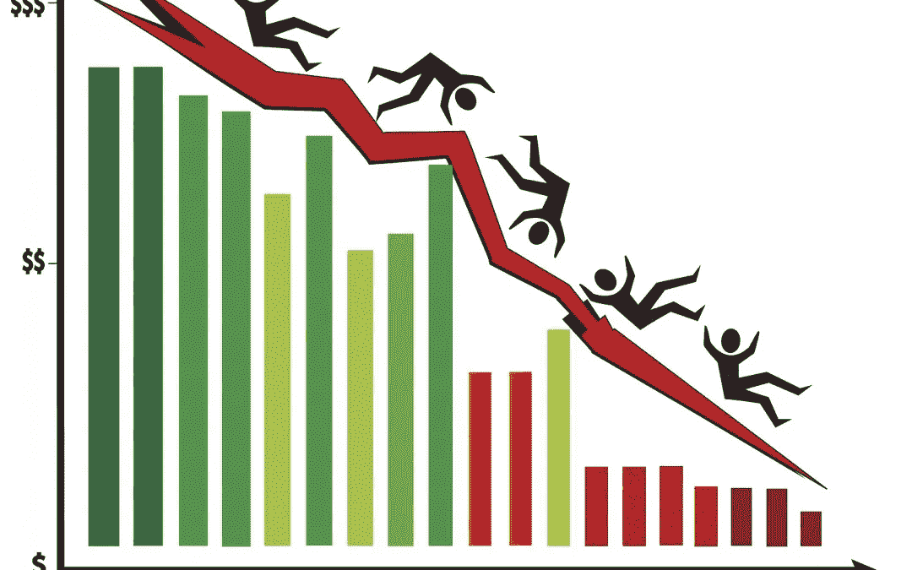

# 我们正在走向另一场衰退吗？

> 原文：<https://medium.com/hackernoon/are-we-heading-towards-another-recession-558b0278c70>

从技术上讲，衰退的指标是以 GDP 衡量的连续两个或两个以上季度的经济负增长。但是，让我们根据 2008 年席卷全球经济和美国经济的原因，更深入地看看是什么导致了衰退。

***“最富有的 1%拥有世界一半的财富”*** ，这是《卫报》最近的一个标题，与瑞士金融服务公司瑞士瑞信银行的一份报告相吻合。另一端， ***占全球劳动人口 70%的人，仅占全球财富的 2.7%。******进一步统计，世界上最富有的 500 人的财富在去年增加了 1 万亿美元，而最下层人民的收入仍然停滞不前*** (与通货膨胀率一致)。今天，全球不平等达到了 100 年来的最高水平，数十亿穷人无法意识到几十年来世界经济的增长。

这些差异将如何影响未来的经济？大多数经济学家认为收入不平等对经济增长有长期的负面影响。从广义上讲，收入不平等减少了穷人受教育的机会，而且这种趋势会一代一代地扩大。这些人仍然没有技能，减少了一个经济体的人力资本，这对经济和整个世界来说确实是一个坏兆头。火上浇油的是，它降低了工人的专业化，甚至困扰着他们基于健康的生产力和增长。

在一个更经济的解释中，收入不平等导致经济中的金融不稳定。通过鼓励消费者和公司承担过度风险和补贴抵押贷款市场，它推动了杠杆(银行贷款的水平)。我们将在本文后面讨论次级贷款和疯狂贷款。现在，让我们理所当然地认为，新技术通过淘汰技术上不熟练的工人、增强健全工人的能力，推动了越来越多的不平等。

我不是在指责新技术的出现，而是每当新技术出现时，总是给经济带来破坏的系统。我强烈谴责我们的社会和学术结构，它没有给予所有居民平等的条件，并创造了不利于新技术的不利气氛。

现在让我们谈谈工作。随着人工智能的出现，难怪在未来 10 年内，大多数仅限于人类的工作将被机器人取代。

自动驾驶汽车消除了公共汽车、出租车和卡车司机。高阻力工业机器人淘汰装配线和工厂工人。自动电话接听和计算机已经开始淘汰电话接线员、电话推销员和接待员。从股票交易员、医生、邮政工人、士兵和警卫到厨师、厨师甚至调酒师；人类的工作将很快被经济高效的机器人取代。我建议你看一段视频，展示亚马逊 Go 的运作，一家几乎没有员工的商店，你走进去，得到你想要的东西，然后离开。

【https://youtu.be/NrmMk1Myrxc】T5**T6**

很大一部分首席执行官和商人认为机器人对工作没有威胁，没有什么可担心的。一份报告称， ***“人工智能只会取代工人，提高一些工作的生产率，而对其他工作没有影响。人们将开始使用人工智能来提高自己的生产力，从而创造一场工作方式的革命。”***

但基于过去的经验和更现实的调查研究观点， ***每增加一个机器人，就确定会减少 5.6 个工人的就业。在美国，预计到 2030 年将有 1400 万在餐馆工作的人、800 万零售售货员和收银员以及 150 万汽车司机失业。***

***“大规模失业怎么办？这将是一个巨大的社会挑战。机器人不能做得更好的工作会越来越少。这些都不是我希望发生的事情。这些只是我认为可能会发生的事情。”；埃隆·马斯克说。***

与 2008 年相比，上述情况最可预测的结果之一将是，大多数中低阶层的人将在短期内变得没有技能和无法就业，或者可能在更长的短期内失业。不满和痛苦的阴云将包围世界经济，为我的下一个问题铺平道路。

在这种情况下，政治家们将如何行动？这是因为远离政治，经济学永远无法发挥作用。让我告诉你 2008 年之前发生了什么。由于收入停滞引起的人民不满造成的短期混乱，政治家们试图通过增加消费来提供短期缓解。

这是因为联邦银行疯狂放贷，试图刺激美国经济的投资。微不足道的利息并没有产生投资，而是吸引了次级借款人，他们贷款买车、买房，并且不担心还贷。后来，这成为银行系统崩溃和衰退发生的主要原因。

让我们希望这不会再次发生。政治家和政府包括银行系统现在必须准备好应对类似的情况。而不是试图通过消费来刺激收入下降和失业的压力；他们应该努力在人们实际工资下降的情况下实现平衡。我希望我们的系统不要再次陷入不平等、失业和人工智能的恶性循环。希望经济衰退不会再次袭击我们。

感谢你阅读这个家伙！鼓掌来激励和跟随得到更多这样的东西！☺