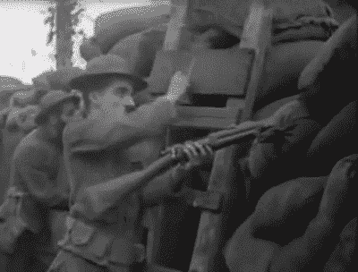

# 矿工不控制比特币！

> 原文：<https://medium.com/hackernoon/are-we-still-talking-about-hash-wars-baaa5859e0fe>

由于我们仍在讨论哈希战争，我不想评论整个 BCHABCDEFG 骗局，但我想给你指出正确的方向。

有一种普遍的误解，认为矿工控制着比特币。

而如果你认为[矿工](https://hackernoon.com/tagged/miners)控制[比特币](https://hackernoon.com/tagged/bitcoin)，我不能生你的气，这也不是一个可以理解的超直观概念。

矿工共识只有在他们开采有效区块时才相关。如果他们开采不同的“硬币”，用户没有义务转换。

一个矿工可以花费数十亿美元在能源和杂凑率开采区块上…但是如果它不遵守你同意的规则，你可以拒绝这些区块。

运行节点的人是**独立的验证者**，根据当前的共识规则检查一切。

(你可以阅读更多相关内容👇)

 [## #比特币力量平衡海报

### 向下滚动阅读标准纯文本文章的内容。点击此处下载全分辨率 PDF…

medium.com](/@The1Brand7/the-bitcoin-balance-of-power-poster-91271ab31b86) 

**TL；DR —没有节点，没有共识。**

如果你想更好地理解这一点，可以看看皮埃尔·罗查德(Pierre Rochard)关于比特币治理的演讲。

# 我将用一剂霍皮铵来结束这次概述

比特币的价格比去年便宜了 84%,但它更成熟、更发达、更便宜，等等

活着是多么美好的时光啊……..

不要说我从未为你做过任何事。