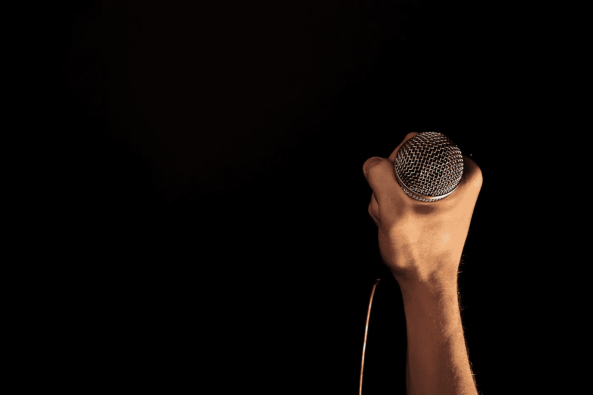

# 你在做你引以为豪的工作吗？

> 原文：<https://medium.com/hackernoon/are-you-doing-work-youre-proud-of-f58375dbb47d>

## 几年后，我明白了做好工作的重要性。

我在为一个金属乐队制作单曲，我把时间看得比工作质量更重要。

虽然整个会议进行得很顺利，但我知道我本可以在最后的交付上做得更好。混音听起来还不错。没什么特别的，但也没什么可怕的。一切都很平衡，但我肯定可以花更多的时间让它更重更有侵略性。吉他没有很好地翻译到每一个扬声器系统，鼓可能会更有力。

(对于不懂音频术语的外行来说，这只是 A+和 C 之间的区别)。

然而，由于整个工作耗时太长，预算又如此之少，我决定听从我内心的企业家，而不是我内心的艺术家。

内心的企业家在说:

> 伙计…你现在挣的还不到最低工资。你投入的时间比预算允许的要多得多。跟踪和编辑已经花了太长时间了！如果你想继续盈利，你需要尽快完成这张专辑。时间就是金钱，伙计。你永远也拿不回来了。这不是他们在商学院教你的！

然而，我内心的艺术家恳求我:

> *但是……但是……但是……这是一件你参与的艺术作品，它将会永远流传下去！你不能无视它！你必须确保尽你所能贡献出最高质量的作品。从长远来看，谁在乎你是否多花了两个小时？如果你最终得到了你引以为豪的东西，那就不是浪费时间！*

当然，在这种情况下，**内在艺术家是对的。尽管我知道这听起来不太好，但我还是想尽快结束这个项目。**

具有讽刺意味的是，对于内在艺术家*和内在企业家*来说，这都是一个*双输*的局面。

艺术没有达到应有的水平，正因为如此，乐队没有回来。因为获得回头客是任何生意的命脉，忽视我内在的艺术家实际上让生意变得更糟。

作为一名创意人员，我们不断地在从工作中获得的创意满足感和商业可行性之间周旋。工作需要有足够的创造力来满足我们的艺术需求，同时仍然有足够的需求来支付我们的账单。

但是，不要把自己艺术上的完美伪装成拖延的借口。成为一个不切实际的完美主义者只是拖延和永远无法完成你的艺术的另一种方式。

在那个时刻，你的工作质量和你所拥有的技能会有一个最佳结合点。如果你知道十年后你会以此为荣，即使你的技能在那段时间里已经一飞冲天，工作感觉像是那个时代的孩子，那么它仍然是好工作。

如果你可以回顾过去，自豪地说你当时已经尽力了，那就是你知道你已经找到了最佳时机。

现在做你为之自豪的工作，你将永远为之自豪*。*

## 我帮助创意人员建立他们的网络形象，教他们如何在网上推广自己，这样他们就可以接触到更多的粉丝，做他们喜欢的事情，增加收入。如果这听起来像是你感兴趣的事情，[来打个招呼，下载你的 80/20 蓝图，在这里主宰你的在线存在。](https://audioissues.lpages.co/bbenediktsson-sign-up/)