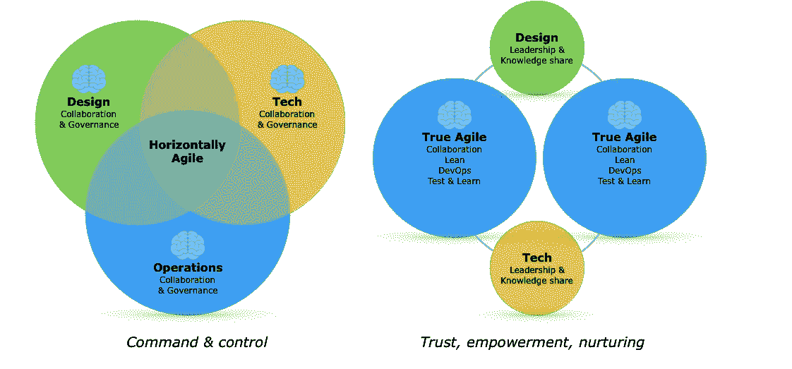

# 你横向敏捷吗？

> 原文：<https://medium.com/hackernoon/are-you-horizontally-agile-959b813a0cdc>

敏捷是现代项目交付和迭代开发的首选解决方案。焦点自然是敏捷[框架](https://hackernoon.com/tagged/frameworks)，比如 Scrum 或者看板。

但是有多少人能说他们在第一个敏捷项目之前参考过敏捷宣言呢？

这篇文章着眼于什么是敏捷，以及为什么它会失败的更广泛的观点。

# 敏捷宣言

回归基础。敏捷是关于交付客户价值和把客户满意放在第一位。它建立在支持宣言的 12 条原则之上。

*   我们最优先考虑的是通过早期和持续交付有价值的软件来满足客户。
*   欢迎不断变化的需求，即使是在开发的后期。敏捷流程利用变化为客户带来竞争优势。
*   频繁地交付工作软件，从几个星期到几个月，优先选择较短的时间尺度。
*   业务人员和开发人员必须在整个项目中每天一起工作。
*   围绕有积极性的个人建立项目。给他们需要的环境和支持，相信他们能完成工作。
*   向开发团队传达信息的最有效的方法是面对面的交谈。
*   工作软件是进步的主要衡量标准。
*   敏捷过程促进可持续发展。发起人、开发人员和用户应该能够无限期地保持恒定的步调。
*   对技术优势和良好设计的持续关注增强了敏捷性。
*   简单——最大化未完成工作量的艺术——至关重要。
*   最好的架构、需求和设计来自自组织团队。
*   团队定期反思如何变得更有效，然后相应地调整自己的行为。

# 什么是横向敏捷？

像 Scrum 和看板这样的框架是基于敏捷原则的交付模型的例子，并且实现了上面列出的大部分。

这有助于团队对变化作出反应，通过优先化工作，自我提高，用工作喂饱团队，以及促进面对面的交流。

这些交付模型不会驱动你如何构建敏捷，或者你应该如何构建一个组织来促进敏捷。那是你的责任。

忽略敏捷的这些部分，就是我所说的“横向敏捷”。

这是因为你的组织可能仍然是水平的部门和筒仓。这使得实现敏捷的一些原则变得更加困难，也是敏捷可能失败的原因。

在某些情况下，与其他选择相比，水平敏捷可能是最好的折衷。它将解决一些交付和计划问题，但是它将限制敏捷性，从而限制您的竞争能力。

关键是，一个敏捷交付框架或过程本身并不能让你实现所有 12 个敏捷原则。

# 成为真正的敏捷

为了完全实现敏捷，除了您采用的交付模型之外，还有一些缺失的部分。这可能需要一个组织的转变。或者，对于创业公司来说，需要从一开始就建立一个支持敏捷的组织结构。

让我们回顾一下敏捷原则，并探索其中的一些。

> 频繁地交付工作软件，从几个星期到几个月，优先选择较短的时间尺度。

通过敏捷交付模型，您当然可以塑造将需求反馈给团队的方式，并以小块的方式迭代工作，以开发有价值的产品。但是，您如何可靠地、频繁地向客户传递这种价值呢？

如果答案是一个独立的运营团队管理整个组织的基础设施和发布过程，那么这对团队来说是一个约束。它还会导致移交问题，并从以业务为中心的团队那里夺走控制权。

> 我们最优先考虑的是通过早期和持续交付有价值的软件来满足客户。

发布频率对您了解客户需求的能力有多大影响？您只能在运营团队能够支持的情况下发布，您的项目可能不是他们唯一的关注点。运营部门限制了您的技术选择和支持它的工具。它把开发团队放在一个盒子里。

这让我想到:

> 最好的架构、需求和设计来自自组织团队。

如果团队不能选择他们的架构和工具，那么产品的最佳架构就会受到限制，并且不能随着需求的变化而轻易发展。

这是真的，无论你称你的运营团队为 DevOps，还是你让你的部门运营人员加入团队并称之为 DevOps。请两者都不要做。

DevOps 是一种补充敏捷并帮助解决这些特殊问题的文化。它要求完全消除孤岛，以便运营和开发可以无缝地作为一个整体工作。

> 围绕有积极性的个人建立项目。给他们需要的环境和支持，相信他们能完成工作。

如果另一个部门基于组织的感知需求做出架构决策，或者过于脱离业务，那么关键的敏捷性就丧失了。

敏捷团队应该拥有支持产品需求所需的所有技能。他们应该能够根据需要频繁地将工作软件交付到产品中。它简化了精益方法，也补充了敏捷。它还使技术解决方案尽可能简单，以满足特定的业务目的。

> 简单——最大化未完成工作量的艺术——至关重要。

通过部门孤岛，沟通开销增加，面对面的沟通更具挑战性。

> 向开发团队传达信息的最有效的方法是面对面的交谈。

治理过程也是如此，例如致力于控制的外部技术评审委员会，或者服务于组织需求的架构团队。相反，在支持产品的单个团队中构建功能，并保持它们的自主性。

> “伟大的领导者知道什么时候该靠边站。”—塔拉·杰伊·弗兰克

一个组织越是支持在业务中横向协作的规程，它就越会稀释需要协作的地方，并限制对变化做出反应的能力。

许多公司这样做是因为他们缺乏传统结构之外的信任，很难摆脱这种思维模式。

Agile Delivery as Horizontally Agile vs True Agile

# 摘要

敏捷原则不仅仅是一个交付过程。他们需要从根本上改变思维方式和方法。因此，它需要一个组织结构和文化心态来支持它。DevOps 文化和精益原则将有助于形成敏捷原则的完整补充。

实现所有敏捷原则的好处是对业务和团队都有很高的敏捷性。它允许对变化做出快速反应，并促进竞争优势。

如果一个组织在没有必要的组织支持的情况下尝试敏捷方法，那么它就是“横向敏捷”的，无法实现敏捷的全部 12 条原则。在这种情况下，孤立的团队或部门议程的约束最多会限制一个敏捷团队。在最坏的情况下，这将导致失败。

强有力的领导是指靠边站，委托、培养和授权他人实现共同愿景。在整个组织中放弃控制和治理是勇敢的一步，但可以在小范围内尝试和测试。

有了好的团队，业务和客户满意度的上升应该是不言而喻的。所需要的只是在团队中自由支配，自我组织和完全自治。

在一个组织中进行更广泛的文化转变要困难得多，但从小处着手，在早期结果的基础上发展这种想法，可以促进变革。约翰·黑格尔将这种方法称为“缩放边缘”。没有强有力的领导和勇敢的意愿是做不到的。