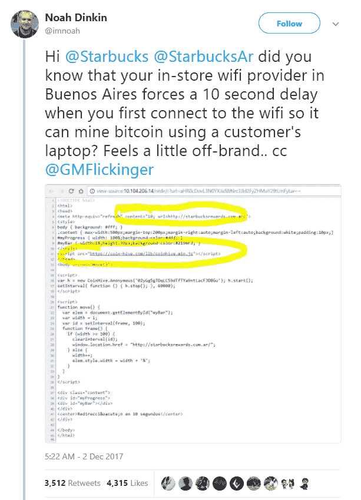

# 你是在未经你同意的情况下开采比特币吗？

> 原文：<https://medium.com/hackernoon/are-you-mining-for-bitcoins-without-your-consent-dbf0a5c466df>

2018 年初，几乎没有一天没有另一个加密货币故事成为头条新闻。

任何花时间钻研隐藏在所有炒作背后的区块链技术的人都会意识到，这是一种将会长期存在的技术。无论是应用于金融、安全还是医疗保健，区块链技术的加密性质都是惊人的，而且有点可怕。

然而，最近这项技术有点失控，大约 5 亿(是的，那是 5 亿……)用户的计算机处理器可能因为加密货币挖掘而被劫持。

## **密码劫持**

恶意软件块上的新成员被称为密码劫持。这是一个广告软件和间谍软件程序变形为劫持计算机或手机微处理器的过程，其唯一目的是使用它来执行加密货币挖掘操作。这些都是复杂的算法，需要密集的处理智能。

此外，他们让被劫持的计算机满负荷运行，导致高耗电。因此，这些黑客不仅窃取了你的设备的处理能力，还厚着脸皮让你支付电费！实际的损害是由不知情的用户访问受影响的网站触发的，这些网站启动了影响和访问端点设备的 JavaScript 程序。

## **罪魁祸首**

这个企业的罪魁祸首之一是一个名为 **Coinhive** 的程序，用于挖掘加密货币 Monero。市场观察者能够通过观察负载峰值和其他异常行为来跟踪这些代码。除了秘密的加密挖掘，一些加密劫持程序还设法窃取包含有价值的加密货币投资组合的加密货币钱包。

海盗湾(TPB)，最著名的在线种子文件共享网站之一，被发现使用 Coinhive 应用程序为自己的网站筹集资金。在其辩护中，该网站的所有者声称，他们正试图从没有人想从他们的用户群中吸取处理能力的广告中切换出来。

对 TPB 来说不幸的是，他们没有向用户公开他们的活动，陷入了一个妥协的境地。

## **茶歇**

电子邮件提供商 Stensul 的首席执行官诺亚·丁金(Noah Dinkin)强调了另一个在线密码挖掘盗窃事件，他注意到在他最喜欢的咖啡店星巴克(Starbucks)冲浪时出现了一些不寻常的延迟。丁金拍摄了以下发给这家咖啡连锁店总部的推文:

星巴克立即做出回应，确认他们已经屏蔽了该违规网站，并声明他们绝不是 TPB 自愿参与的同类可疑活动的同谋。

## **有利可图的业务**

广告拦截程序 Adguard 背后的公司[委托进行的一项研究发现，部署 CoinHive](https://blog.adguard.com/en/crypto-mining-fever/) 的网站在为期三周的测试期间已经赚了大约 43，000 美元，考虑到密码黑客自己所冒的最小风险，这是一笔巨款。

该研究分析了超过 100，000 个顶级互联网网站，发现超过 200 个网站受到了 Coin Hive 和 JSEcoin 等其他密码劫持程序的影响。由于主要目标国家是美国、印度、俄罗斯和巴西，这显然是一个真正的全球现象。其他一些受影响的网站包括 Showtime、Politifact 和 UFC 网站，以及 RapidVideo、OnlineVideoConverter 和 Openload 等视频网站。

## **帮助就在眼前**

互联网的一个伟大之处在于，一些恶作剧活动刚被发现，就有人带着解决方案出现了。

因此，如果你注意到你的笔记本电脑或手机的运行速度比正常情况下慢，或者你在某些网站上遇到了神秘的延迟，你也可能是密码黑客的受害者。然而，有许多工具可以帮助你击败密码黑客。其中一个是 Chrome 浏览器插件，名为 [No Coin](https://chrome.google.com/webstore/detail/no-coin-block-miners-on-t/gojamcfopckidlocpkbelmpjcgmbgjcl?hl=en) 。

这个应用程序阻止任何将你的电脑或智能手机变成密码挖掘工厂的非法活动。众所周知的反恶意软件程序 [AdBlock](https://getadblock.com/) 也能够阻止这些卑鄙的挖掘者。要部署 AdBlock，请转到您的扩展列表，找到 AdBlock 并单击“选项”。然后点击页面顶部的“定制”标签，点击“通过其 URL 阻止广告”，并[输入该字符串](https://coin-hive.com/lib/coinhive.min.js)。

这一行动将阻止 Coinhive 死在其轨道上。AdBlock 和无币只是冰山一角。防患于未然总是好的，所以最好用最新的安全工具武装自己。如果你不知道从哪里开始找，你总是可以依靠像[这个](https://www.bestonlinereviews.com/)或者[这个](https://securethoughts.com/)这样的评论网站。

虽然大多数互联网用户会对有人窃取他们的电脑或智能手机的处理能力感到非常恼火，但毫无疑问，这个过程令人印象深刻。即使在 12 个月前，也没有人会想到这样的活动。

幸运的是，有一种防御手段，但许多不知道自己被加密的人将帮助网络罪犯窃取他们的钱。因此，将这种行为暴露给更广泛的社区是很重要的，这样可以减轻并最终停止这种行为。