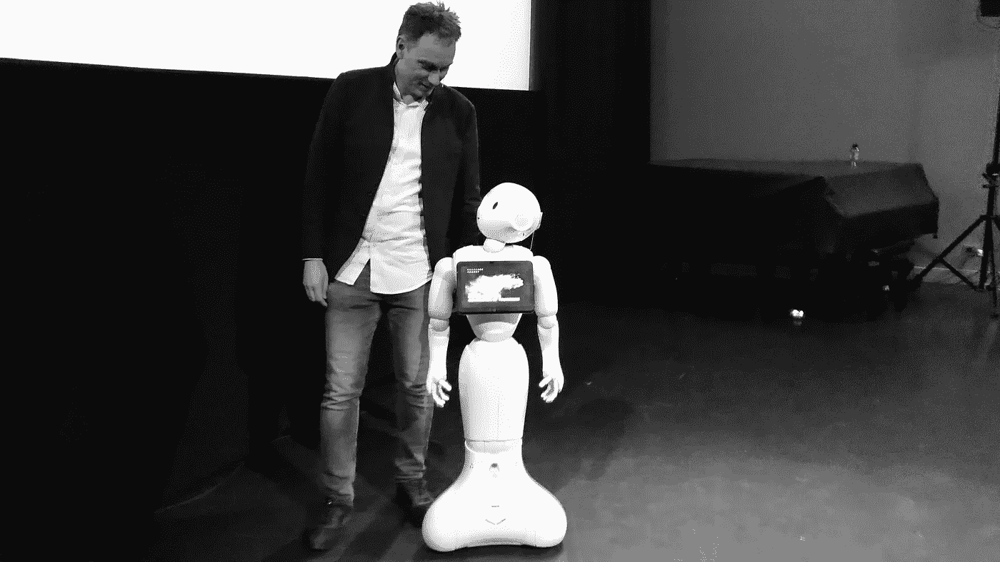
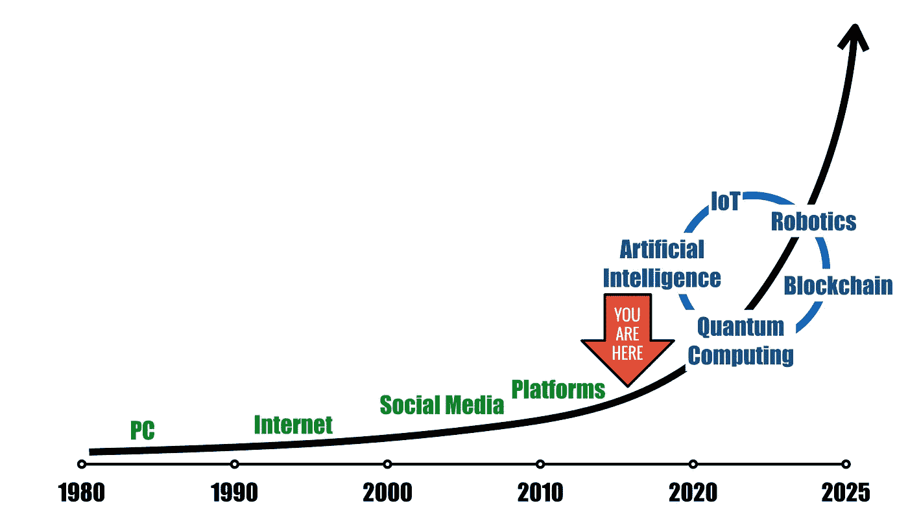

# 你准备好迎接人工智能的未来了吗？

> 原文：<https://medium.com/hackernoon/are-you-ready-for-an-artificially-intelligent-future-b9df618d53b4>

## 你应该知道的“第四次工业革命”

上周我参加了一个活动，活动的标题是“赋予明天的一代力量”。我被邀请做主题演讲，当组织者通知我将由*软银*的人形机器人[佩珀](https://www.ald.softbankrobotics.com/en/robots/pepper)介绍我时，我感到非常兴奋。

我以前在日本的机场和购物中心见过“辣椒”,我一直很好奇。和佩珀一起站在舞台上的想法似乎很有趣。它将让我们领略下一代将如何与智能机器互动。

尽管 Pepper 已经存在好几年了(它们是在 2014 年首次推出的)，但软银的机器人在这次活动中吸引了所有的注意力。

一整天，参与者不断提到我与 Pepper 的互动。

然而，有趣的是，这种关注并不是积极的。我们略显尴尬的遭遇经常被用来证明人工智能驱动的“第四次工业革命”的故事被大大夸大了。

# 这是怎么回事？

许多与会者认为 Pepper“很可爱”，但指出人形机器人甚至还没有接近取代人类。

当然，这是正确的。但是，用 Pepper 的“缺陷”来证明“人工智能”和“机器人技术”不会很快改变我们的生活和工作方式是短视的，而且可能是危险的。

为什么？

首先，Pepper 并没有被设计成一个自主的人形机器人。设计师最初的想法是创造一个可以成为日常伴侣或帮助企业发展更好的消费者体验的机器人。

但是，关于“不屑一顾”的论点，还有一些更令人担忧的东西。对当前创新步伐的怀疑似乎基于三个错误的假设。

## #1 —不要期待“完美”

我在讨论中意识到，人工智能、区块链和机器人领域的许多最新技术发展都被淡化或忽视，因为这些技术的当前版本尚不完善。

然而，等待完美并不是最明智的做法。首先，当(目前不完善的)技术被更广泛地部署时，你可能会错失良机。历史上不乏这样的例子:当新的不完善的技术出现时，公司未能足够迅速地采取行动，发现自己被更具冒险精神的竞争对手甩在了后面。

> 等待完美意味着错过机会或者更糟。

此外，即使这些技术并非完美无缺，与我们目前的经验和工作方式相比，它们也很可能提供重大改进。

自动驾驶汽车是一个热门的例子。这种汽车发生事故的事实本身并不令人惊讶。然而，真正的问题是，这种由机器控制的汽车是否比由人驾驶的汽车发生的事故少。

> 经验从小就告诉我们，不要期望别人做得尽善尽美，所以为什么要要求技术做到如此完美。

## #2 —不要低估创新的速度和范围

另一个论点是，Pepper 的“表现”表明，今天的创新周期与过去的创新周期没有明显不同。新技术的发展和大规模传播以前发生过很长一段时间，这一事实被认为是对当前技术进步持更谨慎看法的一个原因。

但这就好比说，向“自动驾驶汽车”的过渡要 50 年才会发生，因为那是从马车向汽车过渡的时间。

这种观点认为当前的数字技术是理所当然的，低估了我们在过去 10 到 15 年中所经历的发展。

以智能手机为例。

> 通过这些手机，我们联系得如此紧密。我们甚至经常没有意识到我们的口袋里有一台非常强大的计算机，使我们能够不断地消费和创建内容，并与人们联系。

即使我们可能不总是喜欢它，我们的生活已经贯穿了数字技术(及其所有的优点和缺点)。

在这方面，数字革命不同于早期的技术变革。

> **变化的速度越来越快(意味着适应新技术的时间越来越少)，而且这种变化的范围越来越全球化(意味着技术发展是具有全球影响的全球性事件)。**

## #3 —不要孤立地评价技术

怀疑的争论往往集中在特定技术的局限性上，无论是机器人(像佩珀)还是区块链。

当然，当你孤立地看待某项技术时，发展往往会令人失望。因此，某种新技术的广泛采用可能永远不会实现(我越来越多地听到和读到这些有着巨大前景的技术，但很快就消失了)。

然而，这里的错误是孤立地看待技术的发展。

当前技术变革不同于以往技术革命的另一个方面是，我们生活在一个多重、重叠技术进步的时代(这意味着人工智能、区块链和智能机器等新技术之间的协同作用加速了它们的效果)。

> 这些技术相互促进，当它们结合在一起时，有可能改变我们的生活、工作和娱乐方式。

> 新技术和可能不完美的技术的结合将带来未来的体验。

# 我们做什么呢

当然，很难对技术发展做出预测。但有一点是肯定的:

> **明天的一代没有选择。**

成为技术悲观主义者或唱反调者毫无意义。

技术的指数增长不允许我们被动地采取“等着瞧”的方法。

我们不应该等待完美。我们还应该停止将旧的社会和经济模式应用于新的数字技术。

更好的策略是将我们自己淹没在“数字世界”中。

我们目前正在进入 IoT(物联网)的世界。将会产生越来越多的数据。机器将变得更加智能，更加互联，让“自动驾驶汽车”的例子变得越来越现实和相关。

The Exponential Growth of Technology

将确定区块链技术、人工智能和机器人的其他用例。耐人寻味的是，“非技术”行业正日益受到数字技术的影响。想想市场营销和法律服务。

我们都需要积极参与关于未来技术的讨论。

> **我们必须一起创造明天的世界。**

我深信，越多的人参与创造明天的技术，我们未来的体验就会越好。积极参与将帮助我们更好地为自动化和互联的未来做准备。

*感谢您的阅读！请点击*👏*(想点多少次就点多少次)下面，或者留言评论。*

*每周都有新故事。因此，如果你关注我，你不会错过我关于数字时代如何改变我们生活和工作方式的最新见解。*