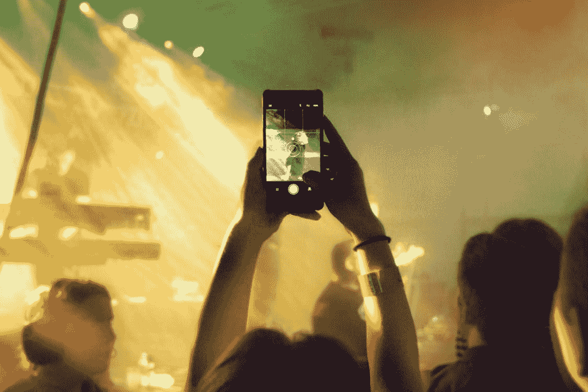
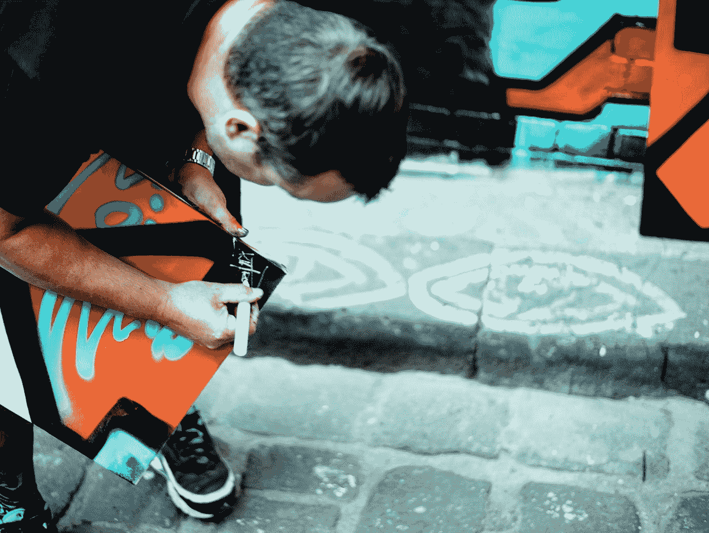
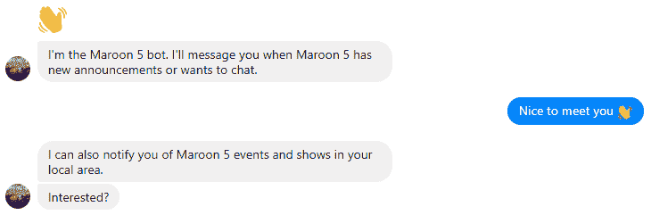
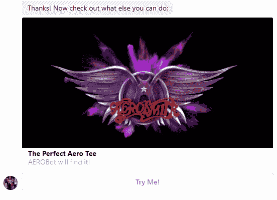
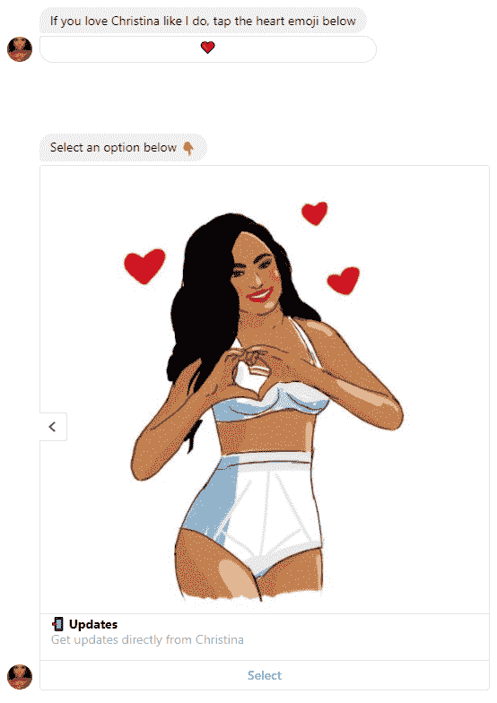
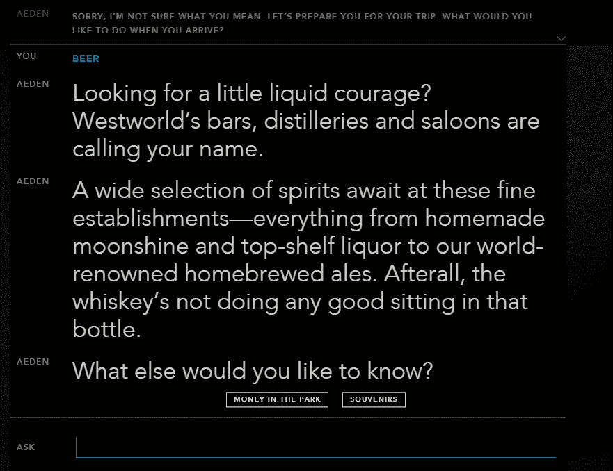
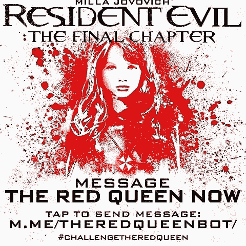

# 你准备好成为 2018 年的数字名人了吗？用个人品牌聊天机器人关心你的粉丝

> 原文：<https://medium.com/hackernoon/are-you-ready-to-be-digital-celebrity-in-2018-aa9364660024>

## 对于粉丝来说，还有什么比与偶像对话更好的呢？

允许粉丝与明星交谈的聊天机器人仍然无法履行其面对面会议的职责，从参观音乐会、观看电影或仅仅是回复信件的乐趣。但是他们可以改变许多人的生活。

心满意足的粉丝——这对任何名人来说都是一件乐事，尤其是如果你不必投入太多精力的话。众所周知，准备模仿与粉丝进行个人交流的 SMM 专家经常在 Twitter、Instagram、Snapchat 等社交媒体上代表名人回答问题。那些自己回答的名人遇到了巨大的信息流，他们与粉丝沟通的频率要低得多。毕竟，球迷的过度关注可能会干扰职业活动，更不用说侵犯隐私甚至侵扰了。

很明显，聊天机器人可以通过提供非人性化但全天候的与粉丝和追星族交流的可能性来解决这个问题。他们可以做很多事情——播报新闻、推广广告、回答常见问题或展示视频和音频。

这是粉丝和偶像之间数字交流的逻辑延伸。一封信，一场音乐会，一次面对面的会议，一个电视节目，YouTube 上的一次采访，对评论的回应——聊天机器人成为所有这一切的下一个逻辑延续，不仅仅是粉丝的答录机。

不仅是名人，他们的经纪人也相信这一点。Interscope 的数字营销主管克里斯·莫蒂默(Chris Mortimer)称 Facebook Messenger 是艺术家接触崇拜者的重要渠道。据消息来源 eMarketer 称，2019 年后，超过四分之一的人类将使用这些程序进行即时通讯。

从商业角度来看，通过聊天机器人进行交流几乎是合理的。首先，受众的高忠诚度至关重要——在最初的 10 分钟内，打开的百分比可能高达 75%,这主要取决于电子邮件和其他类型的联系。在 FB Messenger is 平台上有超过 100，000 个机器人，允许企业与客户实时通信。

这使得启动病毒机制成为可能。在一首《感冒》发行之前，魔力红的聊天机器人向所有订户发送了这首歌的 10 秒钟的剪辑。

许多音乐人通过 Facebook Messenger 使用聊天机器人通知他们的音乐会:50 Cent，Aerosmith，Snoop Dogg 和 Kiss 是第一批，今天这份名单包括几十名表演者。

许多名人对聊天机器人产生了极大的兴趣，他们开始称之为主要的和唯一的互动方式。首先谈谈女演员兼歌手克里斯蒂娜·米兰的聊天机器人，她成为这项技术的第一个支持者。由于个性化的回答，米兰的球迷有了与真正的女演员聊天的感觉，而不是自动聊天机器人。

为了达到这种效果，这位女演员定期与她自己的聊天机器人交流，并逐步改进它。没有必要手动实现这一过程——由于机器学习领域的成就和对真实语言的识别，[在很短的时间内](https://brn.ai/blog/why-revolution-of-ai-bots-blockchain-is-the-future-of-business/)聊天机器人将能够从公开来源收集有关个性的必要信息，通过视频和音频分析发音，然后提高模仿的质量。

现在想象一下，这样的聊天机器人可以帮助明星成为她自己的全息摄影或混合现实世界中的虚拟副本！我们只需要在活跃的聊天机器人上添加一个视觉图标和语音界面，粉丝们就可以在世界任何地方实现他们的梦想，而无需摘下虚拟现实耳机。根据 Gartner 和 [Juniper](https://www.juniperresearch.com/researchstore/innovation-disruption/chatbots/retail-ecommerce-banking-healthcare) 的研究，到 2020 年，聊天机器人将参与 85%的客户业务互动。

哪一天会迫使粉丝花时间与聊天机器人交流？

1.聊天机器人给粉丝一种感觉，他们真的在和他们可爱的名人说话。

2.聊天机器人不断向粉丝发送关于名人兴趣的有用链接:关于书籍、音乐、事件，甚至关于心情。

今天的名人它是一个品牌，然后同样的问题站在他们面前。消费者能与品牌沟通吗？聊天机器人可以很好地应对这种巨大的信息流，同时提供大规模和个性化的互动。

此外，直接从粉丝接收的信息允许分析和改进通信策略。听众对新专辑的反应如何？他们喜欢这个新角色吗？他们对新会议的期待有多强烈？现在所有这些问题都不会悬而未决，直接接触让名人[关注他们的观众。](https://brn.ai/blog/rise-chatbots-ecommerce-rebirth-hype/)

还有一种情况，聊天机器人成为与名人交流的唯一方式。在当今世界，不存在的人物有时比演员、作家、音乐家或其他人拥有更多的粉丝，他们站在虚拟人物的背后。

可以是文学人物、电子游戏中的英雄、漫画中的超级英雄和视频电影中的主角。聊天机器人允许他们的粉丝接触可爱的创作，挽救与喜欢的人的关系。

大型工作室积极利用聊天机器人推广电视剧和电影。电视剧《西部世界》的聊天机器人用机器人维持虚拟公园的存在幻觉，《生化危机》中的红皇后聊天机器人让粉丝们感受到了保护伞公司的浮躁。

但是，即使像索尼这样严肃的工作室(红皇后的机器人客户，为《生化危机》的新部分做广告)也会在创建聊天机器人的过程中出错。在 bot 发布一年后，它没有回答，留下了没有回应的问题。

为不同的名人创建一个刻板的聊天机器人不是办法。只有有个性的聊天机器人才能吸引粉丝的注意，否则可能会产生相反的效果。

许多公司将他们的营销策略建立在为名人创建聊天机器人的基础上，但结果是每个下一个聊天机器人都只是前一个的复制品。在开发明星聊天机器人的过程中，不要忘记个性化方法和了解自己粉丝群的重要性。

当演员进入角色时，聊天机器人继续保持对不同系列、专辑和名人的兴趣，不要让他们感觉到一个角色的诅咒。

如果你和名人一起工作或者有你自己的粉丝，给他们机会和你接触！地址给我们和 [**创造你自己的数字明星免费白标版大脑(收入分成模式)**。](https://brn.ai/de/botfabrik)

BRN。AI 公司已经准备好接受一个聊天机器人创造的所有技术方面，你应该只决定你将如何与你的崇拜者沟通。

现在开始，第一个演示聊天机器人将在几天内准备就绪。提高你的受欢迎程度，有了聊天机器人，你就会成功，就会有很高的退出率。

[**亚历克斯·加勒特**](https://www.linkedin.com/in/techfunder/) CEO [大脑(brn.ai)](https://brn.ai/)