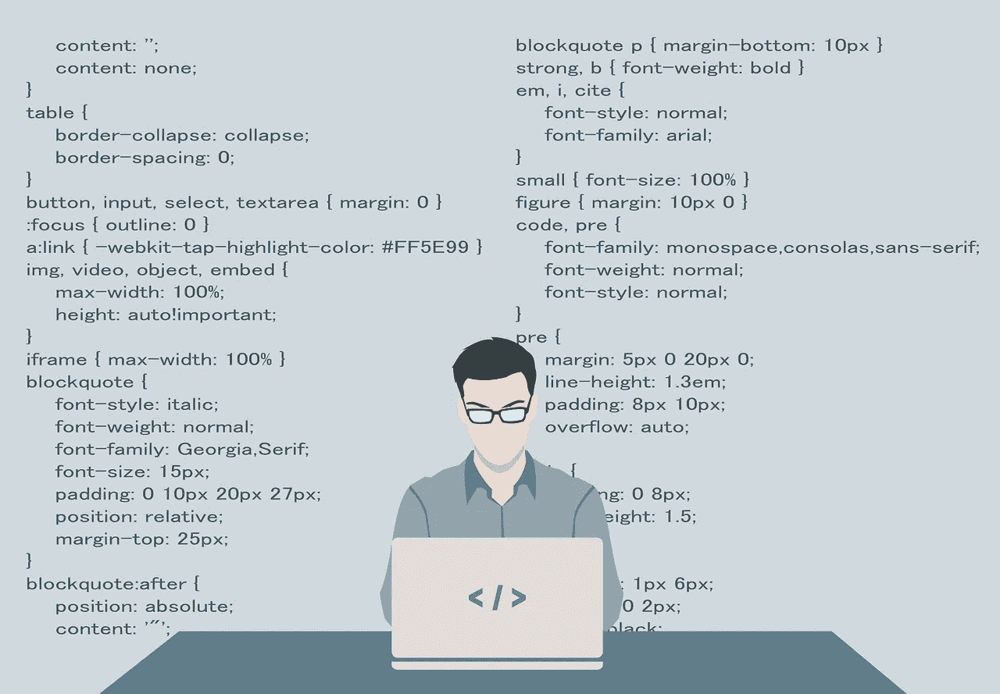

# 你想成为一名程序员吗？

> 原文：<https://medium.com/hackernoon/are-you-trying-to-become-a-programmer-a42a97b38c49>

似乎现在每个人都在努力学习如何编码。但是，您可以从哪里获得一些编程帮助呢？我们会给你一些理由 [**知道如何编码是最简单的方法之一**](https://hackernoon.com/whats-the-benefit-of-learning-how-to-code-e6062ffe5a76#5683e0ee36a7) 消除你的负面看法。

学习如何编程不仅意味着你能够解决问题，为你的需求和标准创造解决方案，而且还意味着你有能力为人们创造解决方案。

根据 1896 年伟大的发明家尼古拉·特斯拉的话，“我认为没有一种激动能像一个发明家发现你的大脑展现成功的更多创造时那样穿透你的心灵。

“拥有编码能力会让你成为科技行业的投资者和利益相关者，而不是普通消费者。”

# 结论

不管你是对学习 HTML 5 感兴趣，还是对通过 Python 进行机器学习感兴趣。在你喜欢的主题上获得你需要的帮助是提高你编程技能的最快方法。因此，一定要找到合适的社区来帮助你的编程之旅，这样你才能成为更好的开发者。