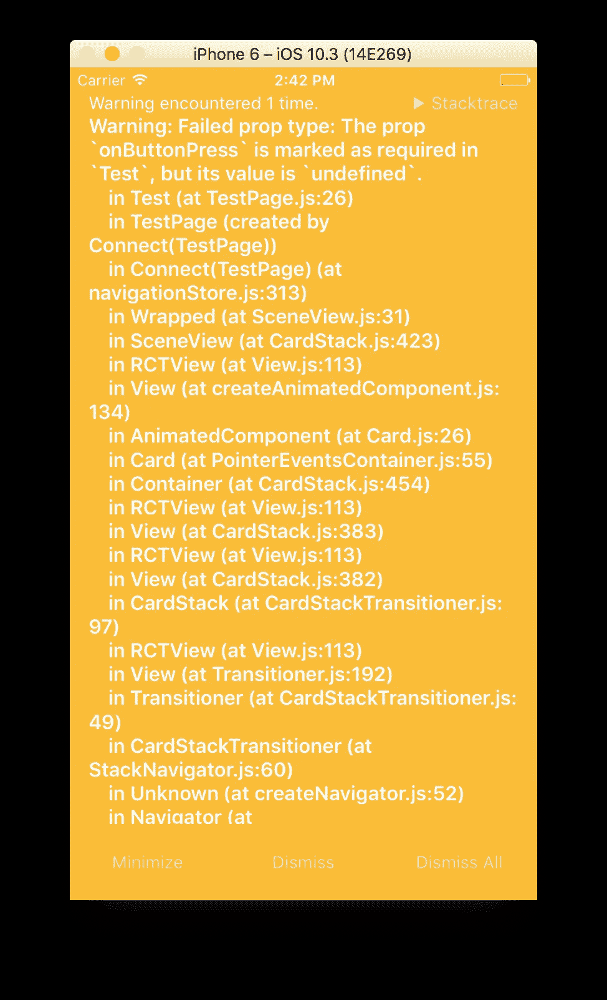

# 你在 React Native 中使用 PropTypes 了吗？

> 原文：<https://medium.com/hackernoon/are-you-using-proptypes-in-react-native-6067e2e5b526>

Photo by [chuttersnap](https://unsplash.com/photos/kDDHfgS7Gjo?utm_source=unsplash&utm_medium=referral&utm_content=creditCopyText) on [Unsplash](https://unsplash.com/search/photos/prop-code?utm_source=unsplash&utm_medium=referral&utm_content=creditCopyText)

在[之前的文章](http://adhithiravichandran.com/index.php/2018/03/17/props-and-state-in-react-native-explained-in-simple-english/)中，我们了解了*道具*和*状态*之间的区别，以及如何在 React/React 本地应用中使用它们。

在本文中，我们将深入探讨 *PropTypes* 。

当您编写大型应用程序时，数据验证起着关键的作用。React 通过 *PropTypes* 支持数据验证。它是 React 的内置类型检查器。

> 可以使用 PropTypes 对组件中的属性进行类型检查。

# 我真的需要定义 PropTypes 吗？

您可以定义没有*属性类型*的组件。但是，如果没有 *PropTypes* 或某种形式的类型检查，我们就会面临向组件传递错误数据类型的风险，这可能会导致应用程序崩溃或出现一些意外行为。

我强烈推荐在 react 本机组件中使用 *PropTypes* ，以避免给用户带来意想不到的问题。

# 定义组件的属性类型

让我们看看下面的例子。组件' *MyComponent* '有一组已定义的*属性类型*。

这里的道具是用各自的*道具类型*定义的，用于类型检查。

在上面的例子中有不同类型的验证器(字符串、数组、函数、数字、布尔值等等..).这使您能够声明一个*属性*是一个特定的 Javascript 类型。

任何使用这个组件的人现在都会知道所有的*道具*和它所需要的各自类型。当不正确的数据类型被传递给组件时，React 会在控制台上抛出一个错误。这将使我们能够在开发期间捕捉错误。

# isRequired —这是必需的吗？

在我们的例子中，组件 *MyComponent* 需要所有的*道具*。默认情况下，组件的*属性*是可选的。通过添加 *isRequired* 关键字，我们可以确保如果*属性*没有提供给组件，就会生成警告。

对组件中的道具使用*是必需的*总是安全的，以确保我们没有遗漏组件所需的任何*道具*。

当你开始编码一个组件时，总是很容易将所有的道具都标记为必需的。这有助于处理代码中的空情况，并确保您不会忘记将 *props* 传递给组件。

如果你不使用 *isRequired* ，那么另一个选项就是给你的道具设置默认值。

当您没有将一个必需的*属性*传递给组件时，会生成如下警告。这确保了开发人员不会遗漏组件所需的任何*道具*。

Sample warning generated by react on missing a required prop.

# 什么是 defaultProps？

可以使用*默认道具*将默认值分配给道具。当一个组件没有收到它的 props 时，它就求助于已经分配的*默认 Props* 。

在上面的代码片段中，您可以看到所有的默认值都被分配给了 *MyComponent* 的 props。如果您已经将您的道具标记为必需，则没有必要分配 defaultProps。

> 提示:始终为所有可选属性定义显式的 defaultProps。

有趣的是，使用 *PropTypes* 的类型检查发生在 *defaultProps* 被赋值之后。所以它也检查分配给属性的默认值。整洁！

下次编写组件时，确保使用 React 的 *PropTypes 添加类型检查。*

本文最初发表于[http://adhithiravichandran.com/](http://adhithiravichandran.com/)和[https://codeburst.io/](https://codeburst.io/why-you-should-use-proptypes-in-react-native-e6f5ef78e7dd)

如果您喜欢这篇文章，请关注我以获得更多关于 React Native 和 ReactJs 的教程和文章。