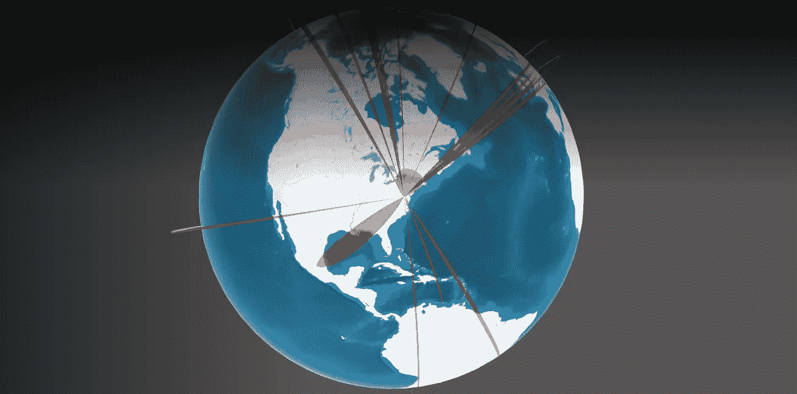
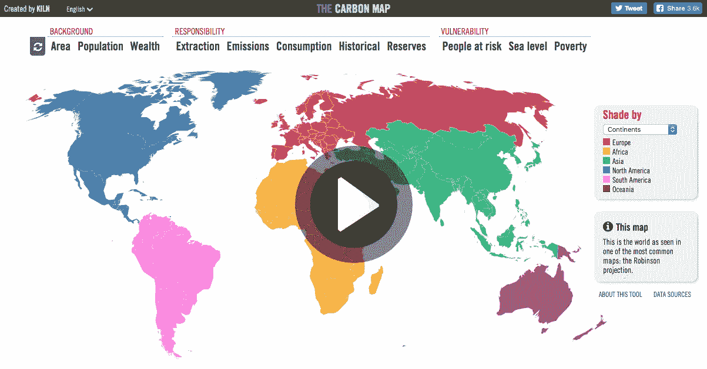
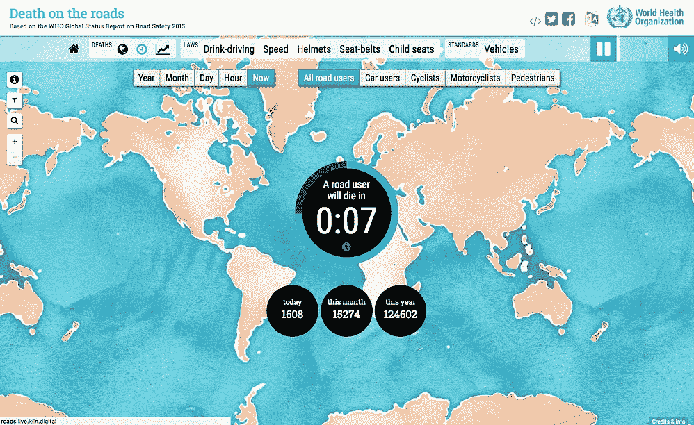
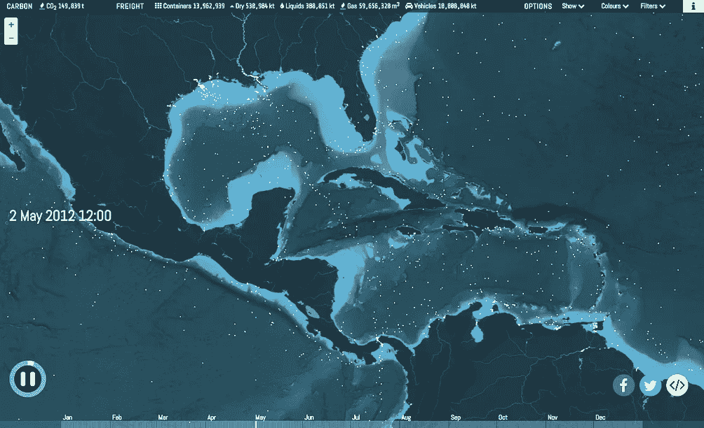
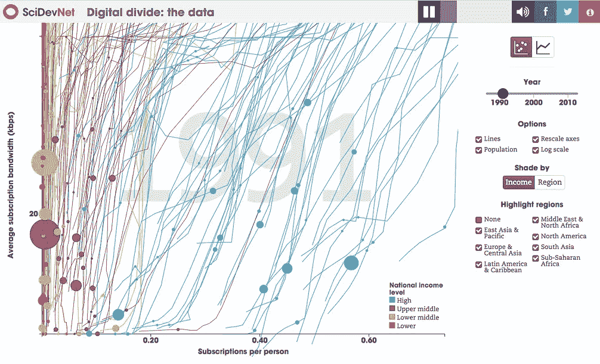
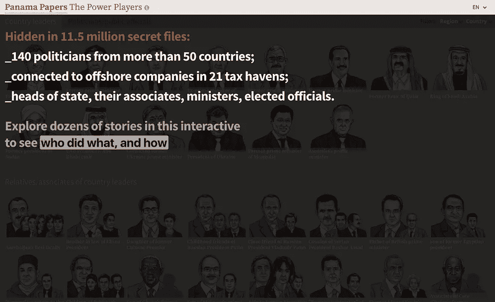

# 你是在做副业还是在创业？

> 原文：<https://medium.com/hackernoon/are-you-working-on-a-side-project-or-a-startup-569ae7f6ac0>

You don’t have to plan on global domination from day one of your startup!

[*大卫·弗兰科尔*](https://twitter.com/dafrankel) *，管理合伙人*

并不是每一个科技产品或服务都应该是一项业务，更小的一部分应该是风险投资支持的初创公司，许多潜在的 1 亿美元公司失败了，因为他们筹集了资本，好像他们会成为 10 亿美元的独角兽。问题是，一开始很难判断一个想法能有多大。用于 Altair 微型计算机的操作系统、用于学术论文的搜索算法或用于哈佛学生的社交网络会成为我们这个时代的三大标志性科技公司，这一点并不明显。

那么一个不确定自己最终规模的创业公司应该如何进行呢？

小心点。

如果你已经建立了一个吸引追随者的框架，或者一个受到许多人喜爱的产品，并希望扩大规模，我们的投资组合公司[floride](https://flourish.studio/)是一个值得回顾的案例研究。

# 繁荣的起源

[floride](https://flourish.studio/)是一款创意工具，可以轻松将电子表格转换为世界一流的响应可视化、地图和交互式演示，无需编码。我相信它有能力取代 PowerPoint，成为商务会议的视觉通用语言，尽管它最初只是一份报纸的一次性公益项目。

[The Carbon Map](http://www.carbonmap.org/) was one of Kiln’s first projects

[邓肯·克拉克](https://twitter.com/theduncanclark?lang=en)，前《卫报》记者/编辑*和计算机科学家罗宾·休斯顿几年前相遇，当时他们正在合作一个非营利项目[，该项目使用数据可视化来帮助教育人们气候变化的危险](https://en.wikipedia.org/wiki/10:10)。项目完成后，两人分道扬镳，但邓肯继续着迷于新闻和 Javascript 的结合。12 月中旬的一个晚上，邓肯设想了一幅地图，通过使国家的大小与其碳排放量成比例来扭曲这些国家。他发短信给罗宾，看看这样的图形在技术上是否可行，到了平安夜，罗宾交付了一个原型。*

*他们把这个特别的图形作为谷歌赞助的系列的一部分给了《卫报》,它的动态设计使它成为包装中最受欢迎的作品。*

*《卫报》立即要求更多，于是一家名为[窑](https://www.kiln.digital/)的设计咨询公司诞生了。*

# *让薪水成为你的向导*

*窑炉演示是一个技术奇迹，非政府组织、智库、大学和其他拥有大量数据的组织都争着要与他们合作。但是问题仍然存在——这将会成为一个多大的企业？*

********

*A [small sample](https://www.kiln.digital/) of the projects completed by Clark and Houston.*

*许多企业家会试图根据早期的成功和令人印象深刻的客户名单来筹集资金。罗宾和邓肯采取了一种更保守的方法，并有机增长，随着定制图形的收入开始允许，他们慢慢减少了全职工作的承诺。最终，在合作开始四年后，他们有了足够的财力来专门开发窑。*

*窑并不是诞生于一股创业热情，而是，一份稳定的薪水和远离创业跑步机的愿望。“几年前我有过一次创业，那并不是一次失败，十年后它倒闭了，但也不是一次巨大的成功，”休斯顿说。“如果一切都不尽如人意，初创公司可能会变得非常痛苦。”*

# *一路学习*

*窑的漫长酝酿期也导致了产品的重大改进。例如，这两个人没有充分意识到开发一个工具让任何人都可以使用巧妙的数据呈现来讲述故事是多么困难。在一个流程图会阻碍大学毕业生的世界里，一个动态的、数据驱动的设计工具需要被精心制作。*

*他们还对自己的客户群了如指掌。他们认为主要用户是记者，但事实证明创意机构对这个工具更感兴趣。*

*付费用户的稳定需求也强调了这样一个事实，即他们花费了过多的时间来重写类似的代码，他们应该很好地将关键的用户界面概念抽象到一个框架中。有一次，一名顾问告诉二人组，“你们目前经营的东西作为家庭手工业很有潜力。”他们决定拓宽视野，寻找由索尔·克莱因和乔治·亨利领导的一轮风险投资，以帮助蓬勃发展充分发挥潜力。最初，我们很高兴在伦敦的 local globe 向这个了不起的团队介绍这对组合。*

# *你不能像经营小企业一样经营创业公司*

*我不是这种模式的典型粉丝，也不会建议大多数创始人遵循这种模式。所有的创业公司都是从小规模开始的，但是像经营小企业一样经营创业公司是愚蠢的。成功的转变需要观念的彻底转变，这很少有人能做到。*

*我相信邓肯和罗宾正在采取正确的步骤，并希望他们很快会与 MailChimp 和 Shopify 一起被提及，成为在开发可扩展的、市场领先的技术资产之前以咨询起家的企业的非凡例子。他们有这个机会，部分是因为他们在公司早期没有孤注一掷。*

*如果你不确定你的产品是否具有风险规模，或者创业生活的艰苦是否适合你，那么 Flourish 是一个很好的学习榜样。如果您需要一个[全功能数据可视化框架](https://flourish.studio)，它们也是最佳选择。*