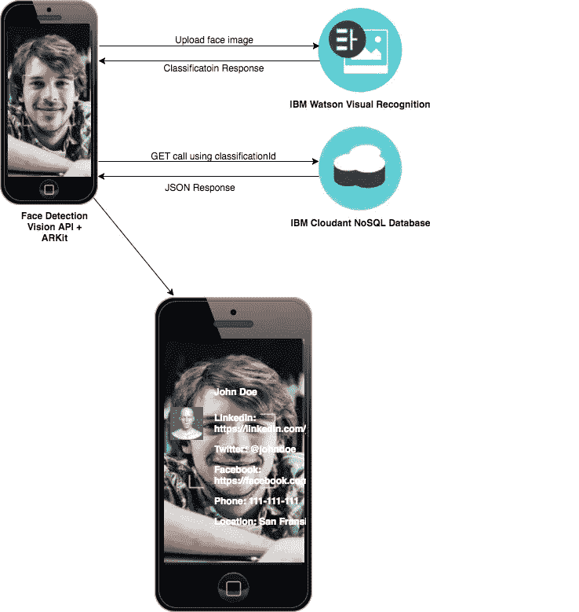
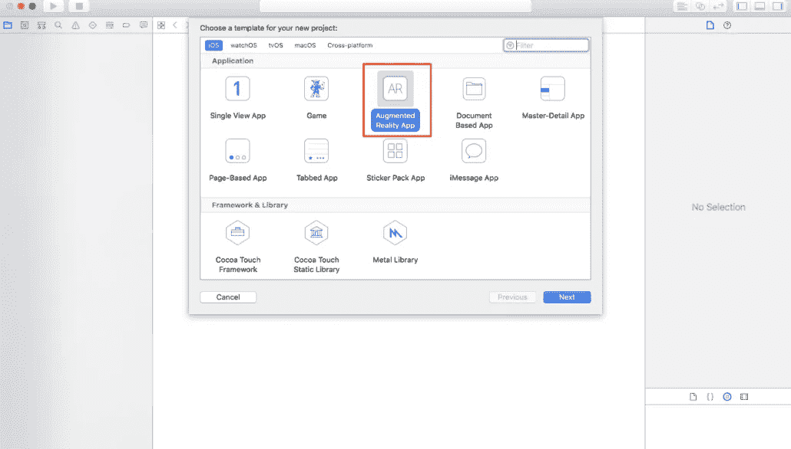
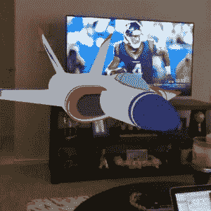

# ARKit 101:如何使用人脸识别构建基于增强现实(AR)的简历

> 原文：<https://medium.com/hackernoon/arkit-101-how-to-build-augmented-reality-ar-based-resume-using-face-recognition-b28941aee2fb>

苹果公司宣布， [ARKit](https://hackernoon.com/tagged/arkit) 将于 6 月在 2017 年 WWDC 举行的公司活动上在 [iOS](https://hackernoon.com/tagged/ios) 11 上发布，随着 2017 年 9 月 19 日 iOS 11 的发布，ARKit 成为其中的一部分。用户可以下载包含 iOS 11 的 Xcode 版本 9.0.1，并开始创建基于增强现实的项目。

# 什么是 ARKit？

ARKit 通过结合设备运动跟踪、场景处理、相机场景捕捉和显示便利性，简化了制作 AR 体验的任务。增强现实(AR)将 2D 或 3D 对象添加到相机视图或实时视图中，以便这些对象看起来像是真实世界的一部分。您可以使用 ARKit 功能在您的应用程序或游戏中产生 AR 体验。AR 游戏在人群中非常受欢迎，如 Pokemon go，僵尸快跑，Ingress 等。

ARKit 使用遵循右手惯例的世界和相机坐标，这意味着 x 轴向右，y 轴向上，z 轴指向观众。为了追踪世界坐标，ARKit 使用了一种称为视觉惯性里程计的技术，这种技术是从 iOS 设备的运动感应硬件合并的信息与手机摄像头可见场景的视觉分析的结合。世界追踪也分析和理解场景的内容。使用击中测试方法，它可以识别平面水平或垂直的相机图像和跟踪其位置和大小。

世界跟踪并不总是给你准确的指标，因为它依赖于设备的物理环境，而这并不总是一致或难以衡量。为了 AR 体验，在相机视图中映射真实世界时，总会有一定程度的误差。为了构建高质量的 AR 体验，我们需要考虑以下因素:

*   **为可预测的照明条件设计 ar 体验:**世界追踪需要清晰的图像分析，为了提高 AR 体验的质量，我们需要设计一款能够更好地分析细节的照明应用。
*   **使用追踪质量信息提供用户反馈:**当设备运动与清晰图像结合时，ARKit 可以提供更好的反馈。利用这一点，可以指导用户如何解决低质量的跟踪情况。
*   **为平面检测留出时间以产生清晰的结果，当您获得所需的结果时，禁用平面检测**。ARKit 基于随时间推移的平面检测来改进其位置和范围。飞机第一次检测到位置及其范围可能不准确，但 ARKit 会随着时间的推移了解飞机何时留在场景中。

# ARKit 术语

*   SceneKit 视图:它是 interface builder 对象库中的一个组件，主要用于 3D 图形渲染，类似于 GLKit 视图，允许您快速设置场景的许多定义属性
*   ARSCNView:ARSCNView 是一个类，它是一个 SceneKit 视图，包含一个 [ARSession](https://developer.apple.com/documentation/arkit/arsession) 对象，该对象管理创建增强现实(AR)体验所需的运动跟踪和图像处理。
*   ARSession: ARSession 对象管理运动跟踪和图像处理
*   ARWorldTrackingConfiguration:ARWorldTrackingConfiguration 类提供高精度的运动跟踪，并启用一些功能来帮助您相对于现实世界的表面放置虚拟内容。
*   SCNNode:场景图形的结构元素，表示 3D 坐标空间中的位置和变换，您可以将几何图形、灯光、摄像机或其他可显示的内容附加到它上面。
*   SCNPlane:指定宽度和高度的矩形单面平面几何体。

# 概观

在这篇博客中，我将解释如何快速开始创建增强现实(AR)应用程序，并使用面部识别建立 AR 体验。AR 应用程序可以识别你的脸，并在相机视图中显示你的 3D 模拟版本和你的专业信息。应用程序中使用的组件有:

*   iOS 视觉模块
*   IBM Watson 视觉识别 API
*   iOS 11 ARKit
*   IBM Cloudant 数据库来存储信息。
*   Xcode 版本高于 9.0.1

# 体系结构



# 如何

# 步骤 1:在 Xcode 中创建项目

如下图所示，从 Xcode 创建一个增强现实应用程序。



# 步骤 2:配置和运行 AR 会话

一旦项目设置完毕，我们需要配置并运行 AR 会话。已经设置了一个包含 ARSession 对象的 ARSCNView。ARSession 对象管理运动跟踪和图像处理。要运行此会话，我们需要向会话添加 ARWorldTrackingConfiguration。以下代码使用配置设置会话并运行:

```
@IBOutlet var sceneView: ARSCNView!override func viewWillAppear(_ animated: Bool) {super.viewWillAppear(animated)*// Create a session configuration*let configuration = ARWorldTrackingConfiguration()configuration.planeDetection = .horizontal*// Run the view’s session*sceneView.session.run(configuration)}
```

以上代码将平面检测配置添加到水平，并运行会话。

**重要提示**:如果你的应用需要 arkit 作为其核心功能，使用你的应用的 Info.plist 文件的[UIRequiredDeviceCapabilities](https://developer.apple.com/library/content/documentation/General/Reference/InfoPlistKeyReference/Articles/iPhoneOSKeys.html#//apple_ref/doc/uid/TP40009252-SW3)部分中的 ARKit 键，使你的应用只在支持 ARKit 的设备上可用。如果 AR 是你的应用的次要功能，使用 [isSupported](https://developer.apple.com/documentation/arkit/arconfiguration/2923553-issupported) 属性来决定是否提供基于 AR 的功能。

# 步骤 3:向检测到的平面添加 3D 内容

一旦设置了 ARSession，您就可以使用 SceneKit 在视图中放置虚拟内容。该项目有一个名为 ship.scn 的示例文件，您可以将它放在资产目录的视图中。以下代码将 3D 对象添加到 SCNView 中:

```
*// Create a new scene* let scene =SCNScene(named:”art.scnassets/ship.scn”)!Setthe scene to theviewsceneView.scene= scene
```

以下代码的输出将为您提供一个 3D 船对象到真实世界的视图。



# 步骤 4:使用视觉 API 进行人脸检测

一旦您测试了 3D 在摄像机视图中的工作情况，我们就可以使用 vision API 设置面部检测了。vision API 将检测面部，裁剪面部，并将文件发送到 IBM 视觉识别 API 以对面部进行分类。

```
*// MARK: — Face detections*private func faceObservation() -> Observable<[(observation: VNFaceObservation, image: CIImage, frame: ARFrame)]> {return Observable<[(observation: VNFaceObservation, image: CIImage, frame: ARFrame)]>.create{ observer inguard let frame = self.sceneView.session.currentFrame else {print(“No frame available”)observer.onCompleted()return Disposables.create()}*// Create and rotate image*let image = CIImage.init(cvPixelBuffer: frame.capturedImage).rotatelet facesRequest = VNDetectFaceRectanglesRequest { request, error inguard error == nil else {print(“Face request error: \(error!.localizedDescription)”)observer.onCompleted()return}guard let observations = request.results as? [VNFaceObservation] else {print(“No face observations”)observer.onCompleted()return}*// Map response*let response = observations.map({ (face) -> (observation: VNFaceObservation, image: CIImage, frame: ARFrame) inreturn (observation: face, image: image, frame: frame)})observer.onNext(response)observer.onCompleted()}try? VNImageRequestHandler(ciImage: image).perform([facesRequest])return Disposables.create()}}
```

# 步骤 5:使用 IBM 视觉识别 API 对人脸进行分类

使用 IBM 视觉识别 API，您可以从上面上传裁剪后的人脸，API 将进行分类并向您发送一个 JSON 响应。要使用 IBM Watson 视觉识别 API，您可以注册到 IBM Bluemix 控制台并创建一个视觉识别服务。然后，您应该能够创建凭证，您可以在调用 API 时使用这些凭证。您可以在应用程序中使用 Watson SDK 来使用 VisualRecognitionV3 API。在这里的[上执行以下指令。](https://github.com/watson-developer-cloud/swift-sdk)

```
private func faceClassification(face: VNFaceObservation, image: CIImage, frame: ARFrame) -> Observable<(classes: [ClassifiedImage], position: SCNVector3, frame: ARFrame)> {return Observable<(classes: [ClassifiedImage], position: SCNVector3, frame: ARFrame)>.create{ observer in*// Determine position of the face*let boundingBox = self.transformBoundingBox(face.boundingBox)guard let worldCoord = self.normalizeWorldCoord(boundingBox) else {print(“No feature point found”)observer.onCompleted()return Disposables.create()}*// Create Classification request*let fileName = self.randomString(length: 20) + “.png”let pixel = image.cropImage(toFace: face)*//convert the cropped image to UI image*let imagePath = FileManager.default.temporaryDirectory.appendingPathComponent(fileName)let uiImage: UIImage = self.convert(cmage: pixel)if let data = UIImagePNGRepresentation(uiImage) {try? data.write(to: imagePath)}let visualRecognition = VisualRecognition.init(apiKey: Credentials.VR_API_KEY, version: Credentials.VERSION)let failure = { (error: Error) in print(error) }let owners = [“me”]visualRecognition.classify(imageFile: imagePath, owners: owners, threshold: 0, failure: failure){ classifiedImages inprint(classifiedImages)observer.onNext((classes: classifiedImages.images, position: worldCoord, frame: frame))observer.onCompleted()}return Disposables.create()}}
```

# 步骤 6:更新节点以放置 3D 内容和文本

一旦人脸被视觉识别 API 分类，API 的响应就是一个 JSON。视觉识别的响应有一个分类 id，然后使用它从 IBM cloudant 数据库中获得更多关于分类的信息。使用分类 id 检索数据，JSON 响应如下所示:

```
{“_id”: “c2554847ec99e05ffa8122994f1f1cb4”,“_rev”: “3-d69a8b26c103a048b5e366c4a6dbeed7”,“classificationId”: “SanjeevGhimire_334732802”,“fullname”: “Sanjeev Ghimire”,“linkedin”: “https://www.linkedin.com/in/sanjeev-ghimire-8534854/",“twitter”: “https://twitter.com/sanjeevghimire",“facebook”: “https://www.facebook.com/sanjeev.ghimire",“phone”: “1–859–684–7931”,“location”: “Austin, TX”}
```

然后我们可以用这些细节更新 SCNNode 作为子节点。SCNNode 是`A structural element of a scene graph, representing a position and transform in a 3D coordinate space, to which you can attach geometry, lights, cameras, or other displayable content` 。对于每个子节点，我们需要定义它的字体、对齐方式和材料。材质包括 3D 内容的属性，如漫反射内容颜色、镜面反射内容颜色、双面等。例如，要显示上述 JSON 中的全名，可以将数组添加到 SCNNode 中，如下所示:

```
let fullName = profile[“fullname”].stringValuelet fullNameBubble = SCNText(string: fullName, extrusionDepth: CGFloat(bubbleDepth))fullNameBubble.font = UIFont(name: “Times New Roman”, size: 0.10)?.withTraits(traits: .traitBold)fullNameBubble.alignmentMode = kCAAlignmentCenterfullNameBubble.firstMaterial?.diffuse.contents = UIColor.blackfullNameBubble.firstMaterial?.specular.contents = UIColor.whitefullNameBubble.firstMaterial?.isDoubleSided = truefullNameBubble.chamferRadius = CGFloat(bubbleDepth)*// fullname BUBBLE NODE*let (minBound, maxBound) = fullNameBubble.boundingBoxlet fullNameNode = SCNNode(geometry: fullNameBubble)*// Centre Node — to Centre-Bottom point*fullNameNode.pivot = SCNMatrix4MakeTranslation( (maxBound.x — minBound.x)/2, minBound.y, bubbleDepth/2)*// Reduce default text size*fullNameNode.scale = SCNVector3Make(0.1, 0.1, 0.1)fullNameNode.simdPosition = simd_float3.init(x: 0.1, y: 0.06, z: 0)
```

要更新 SCNNode:

```
private func updateNode(classes: [ClassifiedImage], position: SCNVector3, frame: ARFrame) {guard let person = classes.first else {print(“No classification found”)return}let classifier = person.classifiers.firstlet name = classifier?.namelet classifierId = classifier?.classifierID*// Filter for existent face*let results = self.faces.filter{ $0.name == name && $0.timestamp != frame.timestamp }.sorted{ $0.node.position.distance(toVector: position) < $1.node.position.distance(toVector: position) }*// Create new face*guard let existentFace = results.first else {CloudantRESTCall().getResumeInfo(classificationId: classifierId!) { (resultJSON) inlet node = SCNNode.init(withJSON: resultJSON[“docs”][0], position: position)DispatchQueue.main.async {self.sceneView.scene.rootNode.addChildNode(node)node.show()}let face = Face.init(name: name!, node: node, timestamp: frame.timestamp)self.faces.append(face)}return}*// Update existent face*DispatchQueue.main.async {*// Filter for face that’s already displayed*if let displayFace = results.filter({ !$0.hidden }).first {let distance = displayFace.node.position.distance(toVector: position)if(distance >= 0.03 ) {displayFace.node.move(position)}displayFace.timestamp = frame.timestamp} else {existentFace.node.position = positionexistentFace.node.show()existentFace.timestamp = frame.timestamp}}}
```

# 来源

你可以在这里找到 GitHub 链接[。](https://github.com/sanjeevghimire/ARBasedResumeWithFaceRecognition)

# 演示

这个输出显示了一个模拟的 3D 人脸和关于这个人的专业细节。

# 结论

随着 ARKit 在 iOS 11 上的发布，有无限的机会来构建将虚拟数据映射到现实世界场景的解决方案。就我个人而言，我认为增强现实是市场上的一项新兴技术，来自不同行业的开发人员正在不同的应用程序上进行试验，如游戏、建筑、航空等。随着时间的推移，增强现实将变得成熟，我认为在可预见的未来，这将是科技行业的另一件事。

# 油管（国外视频网站）

# 参考链接

*   [沃森软件开发套件](https://github.com/watson-developer-cloud/swift-sdk)
*   [人脸识别模块](https://github.com/NovaTecConsulting/FaceRecognition-in-ARKit)
*   [ARKit iOS 11](https://developer.apple.com/arkit/)
*   [IBM 视觉识别](https://www.ibm.com/watson/services/visual-recognition/)
*   [IBM Cloudant 数据库](https://www.ibm.com/cloud/cloudant)
*   [GitHub](https://github.com/sanjeevghimire/ARBasedResumeWithFaceRecognition)