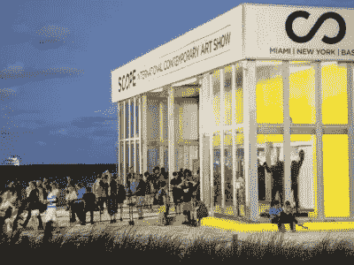

# 区块链巴塞尔艺术展指南

> 原文：<https://medium.com/hackernoon/art-basel-miami-on-the-blockchain-7e78535e7d7e>

风投、机构投资者和家族理财室齐聚南海滩，与克里斯托、加尔文·哈里斯、卡斯科、迪·安特伍德和佐德一起参加为期一周的狂欢

如果你所有的加密朋友下周都要去佛罗里达，那是因为世界上最时髦的艺术展，迈阿密巴塞尔艺术展，将聚集 77，000 名粉丝、名人、收藏家、机构投资者、家族办公室和风险投资家，参加为期一周的关于分散艺术的史诗派对和讲座

将有来自 268 家画廊的 4000 名艺术家展示他们的作品，但真正的故事将在下班后在弹出式夜总会、超时尚酒店的电梯里展开: [Soho Beach House](https://www.sohobeachhouse.com) 、 [W South Beach](https://www.marriott.com/hotels/travel/miaws-w-south-beach/) 、 [Delano](https://www.morganshotelgroup.com/delano/delano-south-beach/eat-drink/doheny-room) 、[迈阿密海滩版](https://www.editionhotels.com/miami-beach/basement/)、[枫丹白露](https://fontainebleau.com/nightlife/miami-beach-nightclubs)、 [1 家酒店](https://www.1hotels.com/south-beach)、[法纳](http://www.faena.com/miami-beach/)、[普利茅斯](http://www.theplymouth.com)

今年宣布的头条包括加尔文·哈里斯，卡斯科，迪·安特伍德，动作布朗森和佐德！去年，我整天做梦/李·伯里奇、鲍勃·摩西、比约克、郭文、克劳德·冯·中风、Cut Copy、迪普洛、道格·E·弗雷什&糖山帮、雷泽少校、马库斯·舒尔茨、帕丽斯·希尔顿、里克·罗斯、吴唐家族、2 Chainz、50 Cent 演出。

巴塞尔艺术中心于 12 月 5 日至 12 月 9 日在迈阿密会议中心举行，卫星展不断延伸，包括迈阿密艺术、迈阿密水上艺术、迈阿密语境艺术、现代艺术指导、迈阿密艺术博览会、Faena Festival、迈阿密河艺术博览会、NADA、PINTA、普里兹姆艺术博览会、PULSE、迈阿密红点、SCOPE、Spectrum、Superfine！而且无题。要了解巴塞尔艺术展是什么样的，请查看 Florum Fashion 的 2017 年画报评论。

当交易数字化时，我会在*的 SCOPE 艺术展上发言:新技术、银行和艺术市场的未来*，并在推特上发布所有的恶作剧 [@contentnow](http://www.twitter.com/contentnow) 。

以下是 crypto 的内容:

**时间:12 月 5 日星期三，晚上 6-8 点/8-10 点
内容:哈斯兄弟的贝斯博物馆开幕派对
地点:**贝斯博物馆，2100 Collins，33139 **方式:**[https://thebass.org/event/member-reception-haas-brothers/](https://thebass.org/event/member-reception-haas-brothers/)

**时间:12 月 5 日星期三晚上 10 点
地点:Die Antwoord
地点:**佛罗里达州迈阿密西北第一大道 2136 号 Soho Studios，邮编:33127 **方式:**[https://www . see tickets . us/event/Die-Antwoord-at-Soho-Studios/373623](https://www.seetickets.us/event/DIE-ANTWOORD-at-Soho-Studios/373623)

**时间:12 月 5 日星期三晚上 11 点
内容:盖伊·拉利伯特的咏叹调，亚历克斯·内里:玛利亚·卡拉丝致敬
地点:**柠檬城工作室，261 NE 73rd 号，33138 **如何:**[https://www.residentadvisor.net/events/1189938](https://www.residentadvisor.net/events/1189938)

**时间:12 月 6 日，星期四，晚上 9-6 点**
**内容:艺术去中心化，分布式杰作的世界**扰乱了一个 640 亿美元的市场。以视觉艺术家 [Vesa](http://www.artforcrypto.com) 为特色。
下午 2 点至 3 点，与《福布斯》的瑞秋·沃尔森(Rachel Wolfson)和艺术家 Jesselyn Contreras、Johnny Dollar、Carrie Eldridge 和 Rob Charles 一起进行艺术表演
下午 3 点 15 分至 3 点 45 分，与华尔街的乔丹·弗伦奇(Jordan French)、Ausum Ventures 的杰里米·加德纳(Jeremy Gardner)、Bluesky Capital 的安德里亚·莱塞(Andrea Lecesse)、Lex Capital 的亚历克斯·门多萨(Alex Mendoza)、Kryptal Group 的埃德娜·袁(Edna Yuan)、Park Capital Partners 的亚历山大·洛帕廷(Alexander
**地点:**尼基比奇，1 Ocean Drive，Miami Beach，33139
**方式:**[https://www . eventbrite . com/e/art-decentralized-the-world-of-distributed-manights-区块链-art-registration-51810706217](https://www.eventbrite.com/e/art-decentralized-the-world-of-distributed-masterpieces-blockchain-art-registration-51810706217?fbclid=IwAR0Cms7Q0d8i3HHLCHcbcm8McVZR7rhLjbtACbv2oK5N1NJoWv7OkJUOf-o)

**时间:12 月 6 日星期四晚上 10 点
内容:布朗森行动
地点:**佛罗里达州迈阿密西北第一大道 2136 号 Soho 工作室，邮编 33127 **方式:**[https://www . see tickets . us/event/Action-Bronson-at-Soho-Studios/373655](https://www.seetickets.us/event/ACTION-BRONSON-at-Soho-Studios/373655)

**时间:12 月 6 日星期四晚上 11 点-凌晨 5 点**
**内容:Zedd 巴塞尔版在 LIV**
**地点:**位于枫丹白露 4441 号的 LIV 夜总会
**方式:**[https://www . tixr . com/groups/LIV/events/Zedd-Basel-Edition-11166](https://www.tixr.com/groups/liv/events/zedd-basel-edition-11166)

**时间:12 月 6 日星期四晚上 11 点-上午 8 点
内容:e 11 even**
**G-Eazy 巴塞尔版地点:** E11EVEN，29 NE 11 Street
**方式:**[https://www . tixr . com/groups/11 Miami/events/art-Basel-G-Eazy-11073](https://www.tixr.com/groups/11miami/events/art-basel-g-eazy-11073)

**时间:12 月 7 日，星期五，晚上 10-12 点**
**内容:** **由万事达卡举办的范围艺术展，当交易转向数字:新技术、银行和艺术市场的未来**与琪琪·德尔瓦莱、SVP 数字未来、万事达卡·卡蒂亚·费舍尔、技术和企业律师费舍尔·卡塔洛蒂·凡妮莎·格雷莱特、执行董事、Consensys Elena Zhavelev、《福布斯》撰稿人和创始人、新艺术学院、科技记者 Martine Paris、《金融科技时报》
**其中:**

**时间:12 月 7 日，星期五，上午 10-11:30**
**内容:艺术家对话——克里斯托、托马斯·萨拉切诺和汉斯·乌尔里希·奥布里斯特**，克里斯托最著名的大型环境装置作品包括加州和日本的雨伞、柏林的包裹式国会大厦和意大利伊塞奥湖的浮动码头，他将谈论
**地点:**迈阿密海滩会议中心，礼堂，西大厅，1901 会议中心大道，迈阿密海滩 33139

**时间:12 月 7 日周五下午 2:30–3:30**
**内容:艺术市场谈——区块链能解决哪些艺术问题？**与 Ruth Catlow、Furtherfield/DECL 伦敦、Matt Hall、Cryptopunks 纽约、Harm van den Dorpel、艺术家柏林和 Orit Gat、作家纽约、伦敦——分散化金融网络的社会和政治含义是什么？区块链是筹款的可靠来源吗？艺术家在艺术实践中是如何运用它的？
**地点:**迈阿密海滩会展中心，礼堂，西大厅，1901 会展中心大道，迈阿密海滩 33139
**方式:**免费，对公众开放，或观看直播:【facebook.com/artbasel】T42

**时间:12 月 7 日星期五下午 4:30-5 点
内容:布莱恩·凯利，美国消费者新闻与商业频道 CryptoProExpo 上的快钱主题演讲** 本次会议提供了市场更新和基本面，如何设立加密基金，如何识别包括 sto 在内的区块链投资机会，以及艺术、加密和区块链的交集
**其中:**
**如何:**[https://cryptoproexpo.com/miami-art-week-2018](https://cryptoproexpo.com/miami-art-week-2018/?fbclid=IwAR3WRQgzHSNHEQVzJCGJIRN95AYaG7oKXEboSXvWmnY9LAVw_hOJXOMIsIA)

**时间:12 月 7 日星期五晚上 9 点-凌晨 5 点
内容:DJ Jazzy Jeff**
**地点:**散兵坑，迈阿密海滩 1218 号 14 号球场 33139
**方式:**[https://www . eventbrite . com/e/Jazzy-Jeff-at-foxol-bar-art-Basel-2018-tickets-52617016914【T22](https://www.eventbrite.com/e/jazzy-jeff-at-foxhole-bar-art-basel-2018-tickets-52617016914)

**时间:12 月 7 日，星期五，晚上 10 点–凌晨 5 点
内容:Saint Vie+Coss+Mateo**
**地点:**迈阿密海滩版酒店地下室，柯林斯大道 2901 号
**方式:**在列表应用中

**时间:12 月 8 日周六下午 3 点-早上 7 点
内容:Rakastella feat Dixon+DJ Tennis**
**地点:**历史悠久的弗吉尼亚关键海滩
**方式:**[https://www . eventbrite . com/e/Rakastella-2018-by-innervisions-life-and-death-tickets-46128112426](https://www.eventbrite.com/e/rakastella-2018-by-innervisions-life-and-death-tickets-46128112426?aff=efbevent&fbclid=IwAR2A2jSHTiXlBTXpMx2XPJTVTxAS0OyhwotbOU8mcTRuJ2EHf2dd7erBkQQ)

**时间:12 月 8 日星期六，晚上 8 点
内容:空中派对**
**地点:**尼基海滩，1 号海洋大道
**方式:**[https://www.eventbrite.com/o/fly-by-airthereum-18269671711](https://www.eventbrite.com/o/fly-by-airthereum-18269671711?fbclid=IwAR0cGEPlARAfQEBshs0XWISJj4q0EvKk-tEuaTpUicoIPt_HM5KrV309S7c)

**时间:12 月 8 日周六晚上 10 点-凌晨 3 点
地点:卡斯科
地点:**佛罗里达州迈阿密西北第一大道 2136 号 Soho 影城 33127 **方式:**[https://wl . see tickets . us/event/2018-BLNK-CNVS-巴塞尔-Pass/373660](https://wl.seetickets.us/event/2018-BLNK-CNVS-Basel-Pass/373660?afflky=BLNKCNVS)

**时间:12 月 8 日周六晚上 9 点-凌晨 3 点
什么:DJ Jazzy Jeff**
**地点:**球拍，迈阿密海滩西北 24 街 150 号 33127
**方式:**[https://www . eventbrite . com/e/Jazzy-Jeff-at-rack-art-Basel-2018-门票-5261660687](https://www.eventbrite.com/e/jazzy-jeff-at-racket-art-basel-2018-tickets-52616606687?aff=ebdssbdestsearch)

**时间:12 月 8 日周六晚上 10 点至凌晨 5 点
内容:贝多因人+盖伊·拉利伯特**
**地点:**迈阿密海滩版酒店地下室，柯林斯大道 2901 号
**方式:**在列表应用中

**时间:12 月 8 日周六晚上 11 点-凌晨 5 点**
**地点:加尔文·哈里斯巴塞尔版 LIV**
**地点:**枫丹白露 4441 号 LIV 夜总会
**方式:**[https://www . tixr . com/groups/LIV/events/Calvin-Harris-Basel-Edition-11066](https://www.tixr.com/groups/liv/events/calvin-harris-basel-edition-11066)