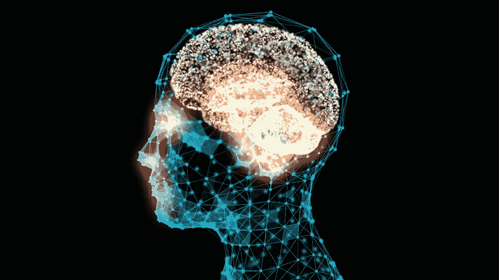

# 人工生物学

> 原文：<https://medium.com/hackernoon/artificial-biology-d8fd977f245e>

## 人工智能正在制造更聪明的人类

在最近由金融[工程](https://hackernoon.com/tagged/engineering)公司 Markov 的联合创始人在*数据驱动投资者*发表的一篇[帖子](/datadriveninvestor/can-ai-identify-a-financial-bubble-5c64cca809e8)中，帖子的作者 Gerardo Lemus 解释了一个[人工智能](https://hackernoon.com/tagged/artificially-intelligence)软件如何识别市场泡沫，这与量化金融模型制作者的普遍赞誉相反。引用莱穆斯先生的话:

> 因为聚类(数据点在图表上紧密重合的行为)是一种无监督的人工智能技术，(软件)不知道它指的是泡沫，所以严格来说，它只说“所有这些数据点看起来都相似。”仍然需要一个人来理解它是否是一个泡沫。

必须说，这种承认是对科技企业家经常采用的更常见的边缘错觉观点的一种令人耳目一新的诚实突破。他们还指出了我几年前写的关于的一些东西，这是我的第一部小说*千禧年转世*的中心主题，在某种程度上也是其续集中篇小说*去中心化的王国*(它们本身是几乎完整的三部曲之一，名为 [*《千禧年三部曲*](https://www.amazon.com/gp/bookseries/B07HMLQ8VZ/ref=dp_st_1517516048) )。也就是“知道”某事的问题，或者，如果你喜欢，那么在另一种意义上，“存在”的问题。这些问题对于人工智能实体变得超人的概念至关重要，这一概念在我们的社会中普遍存在，即使是最无畏的企业家([认为:埃隆马斯克](https://www.vanityfair.com/news/2017/03/elon-musk-billion-dollar-crusade-to-stop-ai-space-x))也私下怀有这种恐惧。

在过去几百年左右的时间里，社会经历了很大程度的进化，以至于对我们大多数发达国家的人来说，现在的生活与过去大不相同。勒内·笛卡尔在 17 世纪假设“我思故我在”当我们深入思考这句话时，我们经常忽略的是，知识和思考的过程不是永恒的；相反，正如历史所显示的，它是修正性的和流畅的。我们不断地调整自己对已知和未知的概念——事实上，这个过程很好地标志着进化过程本身。这样做，我们控制思维过程的认知能力也发生了一定程度的变化。

因为知识大多以意识的盛行为标志。意识反过来又由我们整天所想所想组成(潜意识思想的程度不受影响，但这些甚至是由我们具体的潜在知识决定的)。

对我们中世纪的祖先来说，是像城市火灾这样的事情破坏了整个社区，或者在此之前，瘟疫也可能做同样的事情，集中娱乐了他们的思想。这是工业船长的少女们的好色之梦，以及她们那天晚上可能获得的晚餐，正如《塞缪尔·佩皮斯日记》为我们方便地证实的那样。在某种程度上，这仍然适用，但在越来越大的程度上，它不再适用了。

毕竟，随着现代消防设备越来越先进，大多数时候我们并不太担心火灾会在建筑物中蔓延；我们也不太关心现代医疗保健的瘟疫。也许年轻的少女总是会受到年长的绅士的喜爱，就像充满葡萄酒的宴会会满足他们下班后的安排一样，但这些方面在今天比以前占据了更多精确导向的焦点。你在 Tinder 上遇到一个约会对象，一扫就走；同样，一份比萨饼订单，甚至是一份波斯美食，也只是一个点击的工作。

这意味着虚拟空间，比如那些在线的，被云占据的，正在以某种方式干扰我们的思维和存在的概念。我们正在变成——在行为、感觉和认知上——与我们祖先非常不同的动物。我们的世界居住着一种完全不同的维度的概念实现，这与时空的假设概念非常相似。在这种情况下，我们的个人生物硬盘驱动器似乎变得比几年前更加庞大。事实证明了这一点，现在，我们可以制造能进行最基本思考的机器；事实上，在许多方面，我们的祖先也是如此。

虽然人工智能技术可能还赶不上人类智能思维的能力，但它们让我们比以往任何时候都更聪明。正如莱穆斯含蓄地承认的那样，人类能够识别市场泡沫。听起来可能很奇怪，但这根本不是我们的祖先能够成功做到的事情。