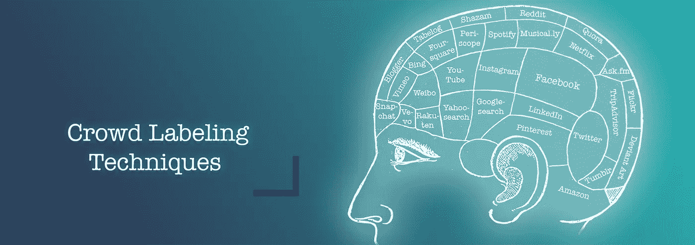
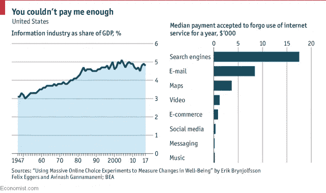
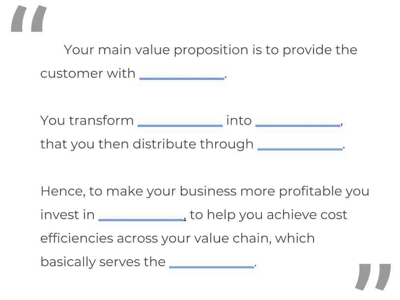
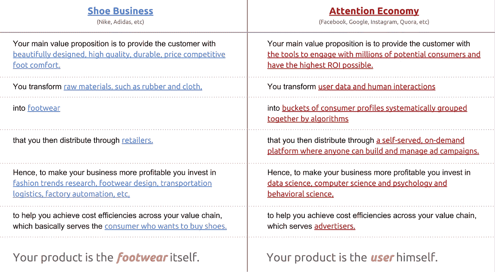
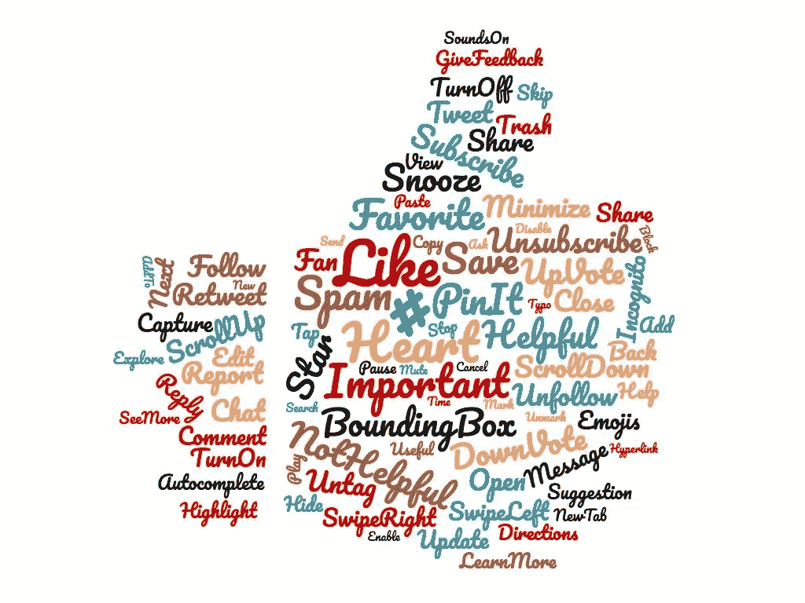
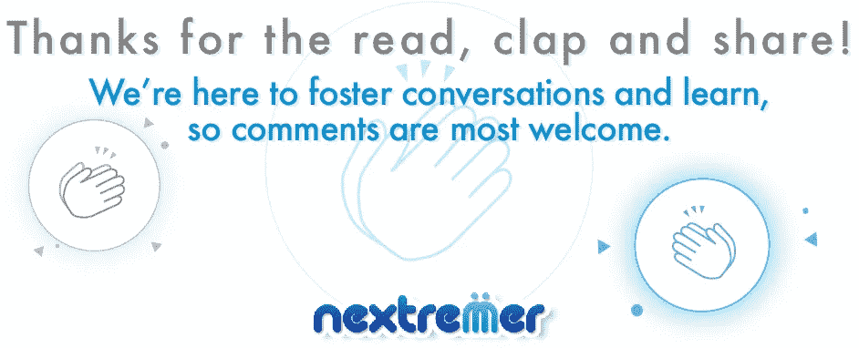

# 人工智能:就在你眼皮底下的 9 种人群标签技术—简介

> 原文：<https://medium.com/hackernoon/artificial-intelligence-9-crowd-labeling-techniques-right-under-your-nose-intro-44825cc49b6c>

## 科技公司让用户给自己的数据贴标签的巧妙方法

Image by [Dania Wijarnako](https://medium.com/u/ab96af267a74?source=post_page-----44825cc49b6c--------------------------------)

这个帖子是关于机器[学习](https://hackernoon.com/tagged/learning)和数据标注的。它将带你参观一些最有趣的**技术，**就在我们眼皮底下**，**被谷歌、LinkedIn 或[脸书](https://hackernoon.com/tagged/facebook)等公司用来让用户标记他们的数据。这是对这些实践背后的创造者的巨大创造力的赞扬，也是对那些淹没在数据中并努力找出如何理解这些数据的人的一个教训。因为看到科技公司如何通过为用户提供便利和严格的统计研究，找到为客户、用户尤其是他们自己创造价值的方法，真的很棒。

# 这个帖子怎么看？

当我开始收集信息时，我并没有预料到这个项目会有这么多的贡献，但我认为他们每个人都为你现在正在阅读的文档增加了巨大的价值。虽然这是一项持续的努力，因为数据工程师和人类科学专家在大脑黑客方面不断取得进展。第一个版本总共包含 10 个条目(intro + 9 技术),在本文结尾的链接中提供。每本书都包含一种群组数据标注技术，以及如何构建自己的版本的示例。

第一篇文章解释了这项研究的背景，以及我们在使用科技公司提供的服务时所注释的数据的性质。说完这些，我们开始吧。

# 用户与客户

在注意力经济的绝大多数情况下，用户和顾客是独立的利益相关者。这一切都可以追溯到你使用脸书、谷歌的搜索和谷歌的套件、苹果的 iOS、YouTube、亚马逊购物、LinkedIn、Musical.ly、Instagram、Pinterest、Reddit、Snapchat……所支付的价格，当然是零。

想想看，你得到了一个世界一流的电子邮件服务，拥有你能想象到的所有功能，几乎 100%的可靠性，15GB 的免费存储空间，而 Gmail 却不花你一分钱。你可以无限制地播放任何音乐类型、观看节目、教程、视频博客，还可以免费观看 YouTube 上的无限内容。你可以在 LinkedIn 上创建一个专业档案，找到一份薪水更高的工作，创造有价值的线索，建立专业的人际关系网，增加你的收入。虽然模式是一样的，但你不会有任何收获。在脸书上，你可以与你关心的人保持联系，查找和举办活动，为自己的企业创建页面，建立品牌，管理追随者等等，一切都是免费的。

How much would you accept to forgo Search or E-mail? — Source: The Economist.

众所周知，这些公司通过广告赚钱，但是他们到底是如何将我们用户在他们平台上所做的转化为真金白银的呢？

为了掌握这一点，让我们分解业务的本质，以便我们可以确定其关键方面:

A business model in just a couple of lines.

现在，为了说明这一点，让我们比较一下传统制鞋商**和脸书制鞋商**的业务。

Brick & Mortar retail v.s. the Attention Economy at a glance.

所以你有它。我们用户不仅不是顾客，在免费在线服务方面，我们和我们的行为**是** [**产品**](/futuresin/monetizing-us-76c5e0b31986) 。

# 行为数据与显性数据

通常，我们认为数据是图片、视频、聊天对话或推文，但事实是，这仅仅触及了表面。安装在我们手机上的应用程序和浏览器中的扩展能够实时跟踪我们的每一个动作。花在(大概是看着)手机某个屏幕上的秒数，单词“棒极了”或“妈妈”在消息应用程序上使用的次数，整个搜索历史，评论，喜欢，分享，心，戳(还记得那些吗？)、标签、观看的图片以及看了多长时间，都可以很容易地从用户的数字足迹中提取出来并混合在一起。我们将这种数据称为**行为数据**，而不是图片、视频和对话，我们将它们称为**显性数据**。

基于这一定义，我们可以从一个新的角度看待科技公司收集的数据:行为数据描述了 ***用户如何使用*** 平台中可供他们使用的工具。因此，通过有计划地引入对这些工具的改变，**服务提供商可以设计系统的方法来捕捉行为模式，这些行为模式反映了用户的思考方式和根据某些提示采取的行动**。通过这样做，服务提供商可以将万亿字节的用户交互数据转化为可操作的见解和自动化的内容监管引擎，从而增加参与时间并最终增加利润。对于服务提供商来说，在 A/B 测试和分析中加倍努力是显而易见的，这些测试和分析实现了机器学习，根据行为将用户聚集在一起。换句话说，随着用户的每一次点击，他都愿意告诉科技公司他是如何思考的，他的大脑是如何被黑客攻击的。

# 你来这里做什么

既然我们已经讨论了我们正在谈论的数据类型的基础知识，以及为什么它与公司给它贴标签相关，那么让我们深入到让用户给它贴标签的**技术**中。

Every single traceable interaction between user and interface is a potential source of high quality, labeled data for ML.

引言| [1。P2P 连接方案](https://journals.nextremer.com/9-crowd-labeling-techniques-right-under-your-nose-1-p2p-connection-schemes-1b680588f1bf) | [2。投票系统](https://journals.nextremer.com/9-crowd-labeling-techniques-right-under-your-nose-2-voting-systems-f4cdd4e768ad) | [3。内容分类](https://journals.nextremer.com/9-crowd-labeling-techniques-right-under-your-nose-3-content-categorization-mechanisms-e99f9d9c13d4) | [4。收视率。以下为搜索结果](https://journals.nextremer.com/9-crowd-labeling-techniques-right-under-your-nose-4-viewership-48c288fc73e2) | [6。自动完成](https://journals.nextremer.com/9-crowd-labeling-techniques-right-under-your-nose-6-autocomplete-and-image-text-suggestions-c414f3e3ee92) | [7。直截了当的问](https://journals.nextremer.com/9-crowd-labeling-techniques-right-under-your-nose-7-straightforward-asking-3d902692de3e) | [8。纠正人为错误](https://journals.nextremer.com/9-crowd-labeling-techniques-right-under-your-nose-8-correction-of-human-mistakes-5da548be774d) | [9。数据标注工具](https://journals.nextremer.com/9-crowd-labeling-techniques-right-under-your-nose-9-provide-data-labeling-tools-as-a-service-98dfd1c2c4ee)

我通常把[写在这里](https://journals.nextremer.com/)，所以请随意看一看，并像世界末日一样鼓掌(这样你就可以教灵媒给你展示更多的……嗯，我。)

***天子之后👏雨，跟着我们上*** [***中***](http://journals.nextremer.com)*[***LinkedIn***](https://www.linkedin.com/company/17883234/)***和*** [***推特***](https://twitter.com/Nextremer_glob) ***。****