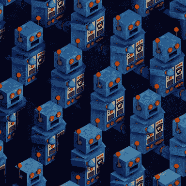
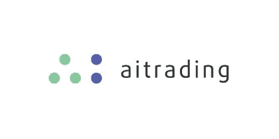

# 人工智能:今天和明天

> 原文：<https://medium.com/hackernoon/artificial-intelligence-ai-today-and-tomorrow-6e65bad829c4>

由于人工智能只是在最近几年才成为我们日常话题的一部分，我们可能会倾向于认为它是一个年轻的概念，是在最近的发现之后。

这门学科的先驱是英国数学家和逻辑学家艾伦·图灵，他早在 1950 年就开始提出机器能够思考的观点。

六年后，达特茅斯学院数学教授约翰·麦卡锡声称:“智力的任何其他特征的学习的每一个方面，原则上都可以如此精确地描述，以至于可以制造一台机器来模拟它。”

> *“我们一天中多次使用人工智能”*

然而，近年来，人工智能的发展速度比以前快得多，今天，**我们在一天中多次使用人工智能——往往甚至没有意识到这一点。**

# 简而言之，人工智能是计算机科学的一个特定领域，旨在创造不仅能够工作和思考，而且能够像我们人类一样行动和反应的机器。

从我们的角度来看，人工智能通常与恐惧联系在一起，即这门学科越进步，机器人就越容易取代人类的活动。

出于这个原因，许多人不想承认人工智能如何对人类生活的进步做出巨大贡献，并且忍不住将这门学科与失业的概念联系起来。

由于我们大多数人仍然没有意识到人工智能已经如何改变了我们的生活，因此很难认识到这项技术已经极大地改善了我们的工作方式，并将继续这样做。

> *“亚马逊、苹果和谷歌已经在生产中实现了人工智能，但我们没有注意到这一点”*

## 一些小公司和创业公司是在人工智能本身的基础上创立的。一些其他更大的公司，甚至是财富 500 强公司，已经决定通过在他们当前的产品和服务中实施人工智能来改变他们的活动。

这方面的例子可以在苹果、亚马逊和谷歌这些科技巨头身上找到。

> 苹果首次宣布，将在 2016 年底前向人工智能迈出第一步。例如，对图像和手写识别技术的研究已经做到了这一点。

> 就他而言，mazon 一直受益于人工智能算法，通过提供有针对性和差异化的购买建议，进一步壮大其电子商务帝国。

> 最终，谷歌已经在许多产品中应用了人工智能，从谷歌翻译到 2015 年宣布的文件库 TensorFlow，它通过分解计算机存储的数据量来帮助计算机做出决定。

# 对人工智能有什么期待，在这个 2018 年？

与迄今为止所做的相比，它似乎将以更加切实的方式影响我们的生活。

## 人工智能算法分析大量数据，这些数据迄今为止一直是人类的一个大问题，因为很难以快速准确的方式进行检查，以避免重大错误。

由于这个原因，金融行业是从这一学科已经取得的进步中受益最大的领域之一，并且似乎在不久的将来充满了取得更大成就的潜力。

事实上，由于这个世界的极端量化性质以及它所呈现的大量历史数据，很少有行业比金融更适合人工智能应用，也更有前途。

## 机器学习是人工智能的一个特定分支，在欺诈检测中特别有用，能够成功发现可疑的活动和行为，并将其标记出来，供安全团队监控和分析。

人工智能在训练“机器人顾问”方面也一直占据主导地位，机器人顾问是一种算法，可以根据用户给出的输入(说明他们的目标和风险承受能力)来校准详细的金融投资组合。

在不久的将来，人工智能将在金融现实的其他方面发挥关键作用:它将改善银行的客户服务和对话界面，它将加强数据安全，并将提供更准确的数据分析。

就交易活动而言，由于许多不同的原因，人工智能可能是破坏性的，也可能是有益的。

> 人工智能可以完全消除交易者最大的敌人:他们的情绪。

首先，它可以完全消除交易者最大的敌人:他们的情绪。即使是最专业的交易者也是人，如果事情不像预期的那样发展，他们也会紧张，把大量的时间扔进垃圾桶，努力监控市场的动向，研究不同的机会和可能性。

机器没有感情，最重要的是，有从过去的经验中学习的能力。他们记录所有的事件，存储它们，并加以阐述，以便能够利用这些知识更好地预测未来的市场变化和事件。

根据它们收集的信息，计算机能够做出极快的交易决策，一旦市场变动就做出反应，根据出现在它们面前的场景，朝着与预期不同的方向变化。

## 作为人类，这种快速反应是不可能的，因为无论我们多么有经验，我们仍然必须思考我们的决定，并获得正确的证据，以完全确定我们正在采取正确的行动。

我们不是机器，我们的记忆也不能储存大量的数据，当需要使用它们的时候才想起它们。

人工智能可以实时监控所有发生的交易，我们可以同意，这对地球上的任何人来说都是绝对不可能的。

## 这是一个事实:人工智能已经进入我们每个人的生活，并迅速成为我们不可或缺的。

*有趣的文章？想了解更多吗？*

# 加入 AITrading 社区

## [电报频道](http://t.me/aitrading_en)

## [脸书](http://facebook.com/aitrading.official)页

## 订阅[推特](http://twitter.com/aitrading_en)

## 我们现在在 LinkedIn 上