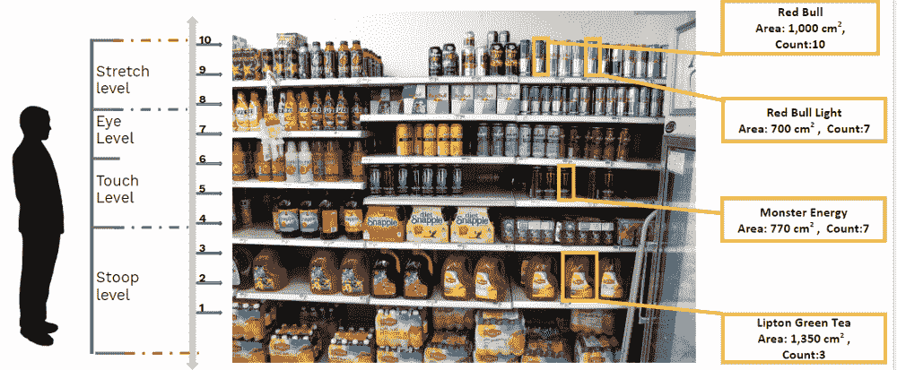

# 我们如何教会我们的人工智能学习零售货架监控

> 原文：<https://medium.com/hackernoon/artificial-intelligence-for-retail-shelf-monitoring-258f8c8d697c>

Source: Blue Yonder Blog

人工智能[技术](https://hackernoon.com/tagged/technology)和深度[学习](https://hackernoon.com/tagged/learning)算法的最新进展正在改变零售业。有了由数千个货架图像组成的大量数据集，公司现在可以利用人工智能来更好地监控他们的零售货架。人工智能将帮助识别货架上的产品状况，如可用性，分类，空间，定价，促销等等。它将授权公司立即采取纠正措施。人工智能算法通过提供准确的股票可见性洞察，肯定可以提高货架图的合规性。公司将能够监控和基准断货的持续时间，这将导致更好的店内产品放置。

## 它将如何工作

外勤人员的日常工作不会有太大变化，除了他们在必须与分析小组分享的图片质量方面将有更多的灵活性。当前行业有许多影响最终洞察力的瓶颈，其中未能分析不清晰的图像是一个主要问题。这导致公司检索新图像以进行新分析的时间和成本增加。现场代理只需点击所有相关货架的图片，并将其输入人工智能系统。现场代理点击货架图片时遇到的阻碍是零售审计流程中的另一个障碍。这也是由人工智能处理的，因为该系统变得高度可扩展，并且在摄影时由于障碍物导致的图片丢失可以忽略。

Source: Innovation is everywhere

人工智能算法将分析所有类型的输入，并提供见解。它分析低质量图像的能力将提高最终结果的可信度。传统系统很难分析不清晰/弱光图像，而人工智能则不是这种情况。外观相似的产品之间的混淆是另一个有争议的问题，这可以通过使用人工智能来解决。

KARNA AI 利用人工智能的力量创建了 SHELF WATCH，这是一种人工智能货架分析服务，可以为现场代理提供灵活性，为公司提供可扩展性。货架观察将消除传统零售审计过程中的所有僵局，目前这种僵局正在侵蚀消费品组织的收入。通过分析零售审计过程中的每个利益相关者，可以充分理解其优势的程度。

**外勤特工**

销售代表在收集图片和视频形式的数据时面临重大挑战。零售商之间的堆叠模式缺乏统一性，这导致在库存方向、照明和定位方面出现不同类型的图片。现场代理努力保持他们收集的数据的一致性，因为这种不标准的图片需要更长的时间来分析。在追求标准图像的过程中，外勤特工容易受到其他类型的人类感知偏差的影响。

货架观察帮助现场代理灵活地在任何方向、光线或位置拍摄所有可能的照片。这种灵活性是允许的，因为货架观察不依赖于标准的统一图像来给出准确的输出。通过使用最先进的人工智能算法，Shelf Watch 能够分析即使是最失真的图像，因为它使用了人工智能包识别技术。

**零售商**

合规性审计对零售商来说也是一项艰巨的任务。遵守预设的货架图是零售商和品牌之间的服务协议的一部分。如果在最终评估中发现零售商因展示的产品太少或产品定位不正确而违反协议，可能会受到处罚甚至终止合同(在极端情况下)。

由于货架观察允许现场代表灵活地收集数据，它还将帮助零售商遵守服务协议，因为代理收集的所有图像都会进行分析，而不管货架上产品的光线、位置和方向。这可以避免零售商获得虚假的审计报告，因为即使他们的货架在位置和照明方面没有堆叠好，货架监控也会检测货架上的所有物品，从而减少由于数据收集不良而导致的不合规事件。

**品牌**

最后，消费品公司将从我们的人工智能解决方案中受益最多。他们将能够通过使用智能凝视进行货架物体检测来分析来自零售审计的所有类型的图片。智能凝视将有助于缩短输入数据和最终见解之间的时间差。这促使公司在必要时采取及时的纠正措施。

如果您想了解更多关于 Karna AI 和我们的行业解决方案，请通过我们的[网站](https://www.karna.ai/)与我们联系。