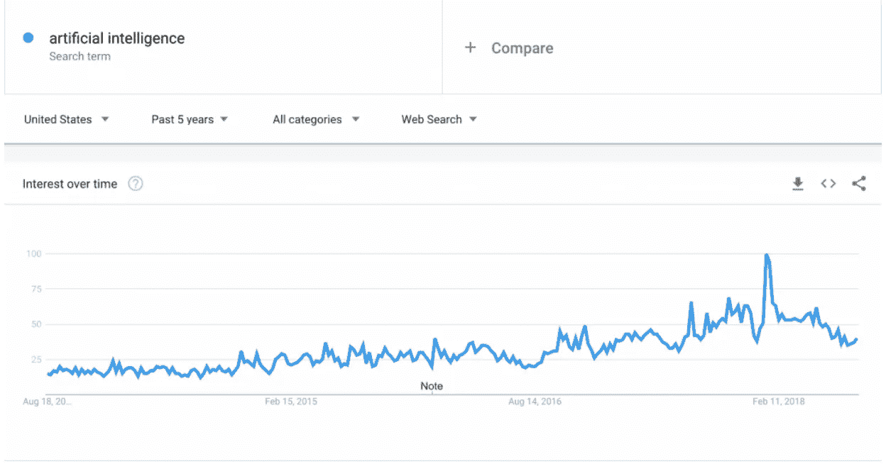
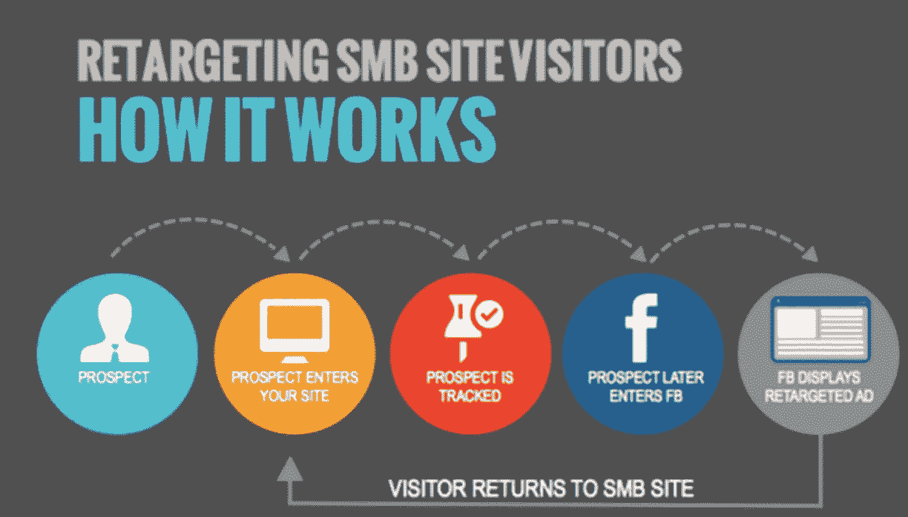
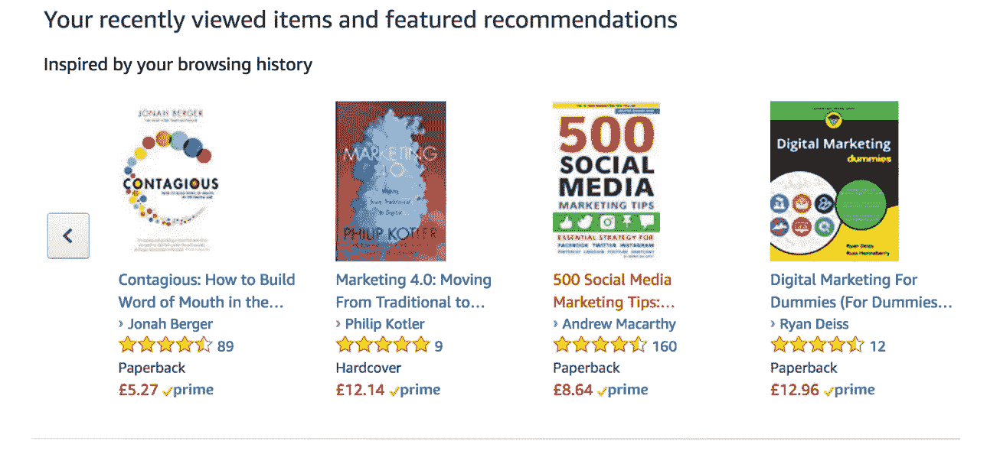
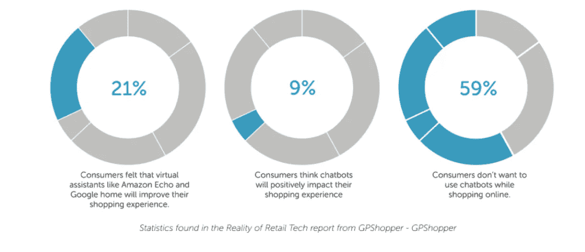
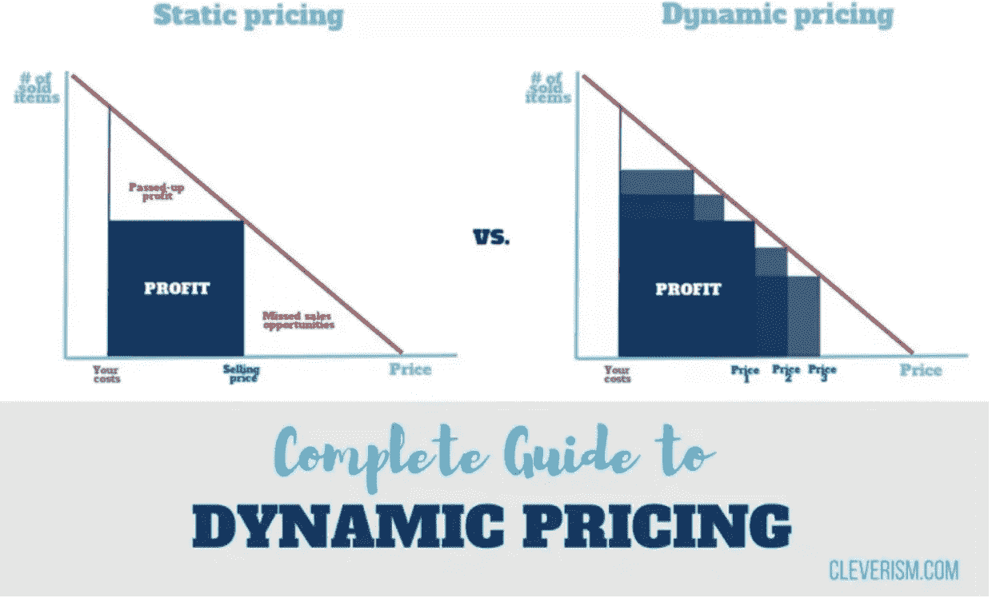

# 电子商务中的人工智能与人类智能

> 原文：<https://medium.com/hackernoon/artificial-intelligence-vs-human-intelligence-in-ecommerce-3035a6877c07>

电子商务中的人工智能与人类智能

电子商务人工智能的使用案例正在增加。但是人工智能在哪些方面有利于电子商务世界呢？嗯，简而言之，人工智能让电子商务所有者能够自动化任务，并根据预期结果改善他们完成任务的方式。

这样，他们可以最大限度地提高生产力和沟通能力。

Source: [https://trends.google.com/trends/explore?date=today%205-y&geo=US&q=artificial%20intelligence](https://trends.google.com/trends/explore?date=today%205-y&geo=US&q=artificial%20intelligence)

对于营销人员和电子商务所有者来说，人工智能的发展速度对于完成通常情况下需要人工输入的任务至关重要，而人工输入显然需要更长时间。

人工智能的崛起最终意味着我们——作为人类——有更多的时间将精力集中在其他任务上。

但是请记住，人工智能的好处不仅仅在于它完成任务的速度，还在于它发展的效率水平，因为计算机能够学习如何改进它完成任务的方式。

在本帖中，我们将看看电子商务人工智能的许多不同用例，并将它们与人类智能进行比较。

让我们开始吧！

# 个性化

面对电子商务世界中的所有竞争，你是如何脱颖而出的？你如何确保顾客选择你而不是你的竞争对手？

一些供应商选择通过他们的产品或定价来使自己与众不同。然而，许多电子商务企业主没有做的是提高他们向客户和潜在客户提供的个性化水平。

理解电子商务中的个性化意味着理解你的每个客户都是不同的，有不同的需求。

不理解个性化的企业通常会写一些乏味的产品文案，试图对所有人都适用，但实际上对谁都不适用。

顾客体验对购物者来说很重要，那些感觉自己获得了个性化体验的人更有可能花钱。

个性化购物体验包括根据他们的需求、兴趣和以前的购买历史来定制他们的购物体验。

可以想象，在实体店，个性化更容易。顾客走进商店，你问他们几个简单的问题，问他们对什么感兴趣，然后直接带他们去看最适合他们的产品。随着时间的推移，随着你越来越了解你的客户，这个过程变得很直观。

然而在网上，这就更难了。你没有和顾客坐在一起，你看不到他们在看什么。在这种情况下，个性化最好由人工智能计算机来完成。

人工智能可以使用用户的 IP 地址来跟踪他们上网的地方，并使用这些信息向他们提供直接的消息或广告。

想想你在谷歌上搜索某样东西，几天后却在广告中看到了同样的东西。

来源:[*https://www . quora . com/How-come-脸书-is-able-show-me-ads-for-something-I-was-searching-on-Google*](https://www.quora.com/How-come-Facebook-is-able-to-show-me-ads-for-something-I-was-searching-on-Google)

上图是一个重新定位活动的例子，当你访问一个网站时，你看到的是你看过的特定产品的广告。

你还可以使用人工智能，根据顾客过去购买的物品，为他们可能想要购买的产品提供建议。

这在亚马逊上很常见，他们使用个人的浏览和购买历史来预测他们可能感兴趣的其他产品。

# 利用人工智能扩展电子商务客户服务

网上购物的最大好处之一是你可以在自己的时间里购物，而不必与客服代表交谈。尽管如此，这并不意味着用户永远不想与任何人交谈。

其实完全相反。许多访问者可能会对他们将要购买的产品或运输细节有具体的问题。

这就是为什么成功的电子商务企业会在客户支持团队上投入大量资金。但在它开始侵蚀你的利润之前，你只能雇佣这么多的客户支持代表。

AI 出现了。人工智能使电子商务所有者能够通过使用聊天机器人等工具来扩大他们的客户服务工作。聊天机器人是编程机器人，可以帮助购物者在线购物。在许多情况下，它们的反应是如此的程序化，以至于用户很难知道是人还是机器人在回应它们。

丝芙兰使用聊天机器人与他们的客户交谈，并为他们提供他们可能喜欢的产品的精彩建议。然后，Sephora 可以使用这些数据来个性化每个客户的体验，就像我们在前面提到的那样。

使用人工智能来帮助您的电子商务客户支持的最大好处是能够扩展工作。正如我们所提到的，当你的顾客购物时，你并不在场——你甚至不知道他们会在一天中的什么时候购物，需要你的支持团队的帮助。

正因为如此，实施人工智能意味着你可以一周 7 天、一天 24 小时拥有“支持代理”来帮助你的客户。

来源:https://www.osiaffiliate.com/blog/ecommerce-chatbots/

即使人工智能计算机当时无法解决问题，你也可以对它进行编程，让它在下一个机会到来时，立即向第一个在线的人工支持代理发送紧急警报。

虽然聊天机器人不能取代真正的人与人之间的互动，但对于那些容易解决但占用支持人员时间的小任务来说，它们是一个很好的替代品。该技术为电子商务所有者提供了专注于其他重要任务的自由，这意味着您的客户支持部门可以扩展，而不必雇用越来越多的支持人员。

# 使用电子商务人工智能来帮助你的产品定价

我们在 Prisync 博客上已经多次抒情地让你明白，如果你想最大化你的利润，最有效的方法之一就是通过使用 [AI 在你的电子商务商店上创建一个动态定价](https://blog.prisync.com/artificial-intelligence-dynamic-pricing/)功能。

动态定价的理念是，价格不是一成不变的，而是会发生波动。

来源:https://www.cleverism.com/complete-guide-dynamic-pricing/

动态定价与人工智能的使用配合得最好，因为它确保电子商务所有者不必每次都手动检查他们商品的价格。如果不使用人工智能动态定价软件，为了改变你的价格，你必须手动跟踪你的竞争对手收取的费用，并得出你自己的结论，即你下一步应该收取什么费用。

显而易见，这种方法非常耗时，而且不能充分利用你的时间。

因此，在这些情况下，使用[人工智能动态定价工具](https://prisync.com/)不仅可以了解你的产品应该收取多少费用，还可以了解何时收取。然后将这些数据与你自己的人类智慧结合起来，理解如何以新的价格点营销你的产品。

# 外卖食品

毫无疑问，人工智能会一直存在，因此，我们将在未来几年看到指数级的进步，尤其是在电子商务领域。

随着争夺客户注意力的竞争加剧，电子商务供应商需要找到更好的方法来服务他们的客户。

如果你想使用智能数据来预测你的客户可能想要什么，在他们的定价过程中帮助他们，并优化你的价格，以收取他们愿意支付的价格，那么就考虑在你自己的电子商务业务中使用人工智能。

你已经开始在自己的企业中使用人工智能了吗？请在下方留言评论。

*原载于 2018 年 8 月 15 日*[*blog.prisync.com*](https://blog.prisync.com/ecommerce-artificial-intelligence/)*。*