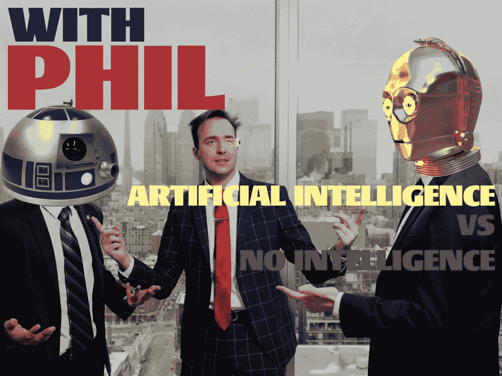
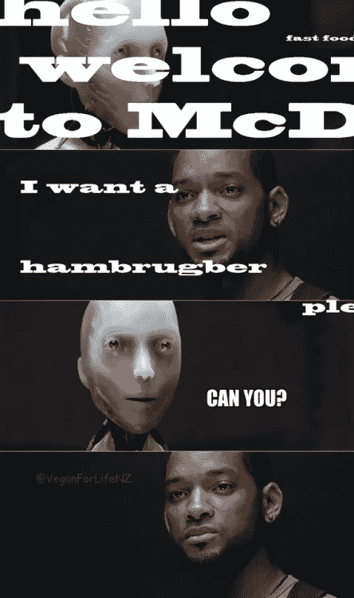

# 人工智能 vs 无智能

> 原文：<https://medium.com/hackernoon/artificial-intelligence-vs-no-intelligence-f495ee024e83>

Me in the middle

因此，我在 2 月 9 日至 10 日的周末参加了一个名为 Connect IT 的会议。这是一个由瑞尔森大学举办的会议，主要讨论年度主题。去年的会议是关于金融科技在金融业的崛起，今年的会议是关于人工智能的，像其他所有创新一样，也有危险。

我真的和你一样为人工智能在社会上做出点贡献而激动。我是一名商科学生，对工程或技术一无所知，但主题演讲人真的很投入。人工智能真的很酷！我终于可以像乔阿金·菲尼克斯在他 2013 年的电影《她》中那样行事，而不是像一个毛骨悚然的家伙那样在床上睡觉(等等，我们现在不都这样吗？).太不可思议了。这不像近 7 年前每个人都被语音识别所吸引，Siri 已经过时了。不不，人工智能真的会在每个人的生活中，并且实际上把 AI 作为他们唯一的朋友。

演讲者，来自部落规模的 Geoffrey Hunter，正在谈论人工智能和语音识别有一天会是什么样子。我们不再需要像亚马逊的 Echo 这样的设备来告诉我们巧克力蛋糕应该放多少克糖，或者告诉我们明天的天气，它将读取我们的思想，观察我们的日常生活，并了解我们的日常生活方式。

**旁注:**政府并不像人们认为的那样监视我们，摄像头和语音识别设备只记录最近的 3 秒钟，如果设备没有听到“Ok Google”或“Alexa”的话，它就会破坏你说话的录音。所以不，不要听现在互联网上流传的迷因，你很好。

McDonald’s planning to destroy a few thousand jobs in a few years

不管怎样，回到人工智能有多神奇。当你将在办公室工作，完成演示时，它会到达一个特定的时间(你自称的打卡时间)时，人工智能设备会说类似这样的话，“嘿，菲尔，很棒的演示，但既然你要向苹果公司的首席财务官推销这个，你可能需要在第四张幻灯片上详细说明下一个财年需要减少的成本。”除了你大学四年级的教授，没有人会给你这样的推荐信，而四年级的教授甚至没有时间给你推荐，所以将军。

这是下一个大爆炸，就像触摸屏手机在 2007 年问世一样。但是，正如我以前说过的，这将是一个危险。我不是唯一一个记得马克·扎克伯格和埃隆·马斯克在 AI over Twitter 上的牛肉的人。这就像极客行业的米克·米尔对德雷克！**Zucc**完全是为了 AI，并希望明天接受它进入社会，而 Elon(gated) Musk(rat)在看到他的一辆自动特斯拉撞车后知道会发生什么。谁对谁错？都不是。

AI 要来了，我们挡都挡不住。尽管有些人喜欢它，有些人不喜欢，但它很快就会真正进入我们的生活。有一个问题我们要问自己:一旦 AI 机器人将加入社会，像类人机器人一样，我们是将它们作为一个整体接受，还是与之展开一场革命或战争？这些不是我们可以关掉的机器人，它们有自己的思想。想想看，如果像美国这样的强大国家在 50 年前还不能接受非白人，我们将如何接受机器人成为我们的朋友？这就是危险所在，战争甚至可能因此升级。它不会像第一次和第二次世界大战那样，而是一场网络战(因为朝鲜和美国届时将摧毁 99%的世界)。

你可以评论说我又疯又蠢，没有打这篇文章所需的知识。你可能是对的。我确实提到了我是一名商科学生，而不是下一个科技巨头。我只是写我的想法，和大家分享我的想法很棒。我只是说 AI 有危险。我可能会购买谷歌或亚马逊或苹果发布的任何具有人工智能功能的产品，我不会从地球上消失，只会把我的烤面包机视为“技术”

不管怎样，回到会议上。有两个案例比赛，我和我的团队不得不提出，我们没有赢，但这没关系。我不得不称赞这个团队举办了一次不可思议的活动，我真的等不及明年的会议了。谢谢你的食物，我狼吞虎咽地吃了 3 个三明治(每位代表限吃 1 个)。

作为对我的读者的一个建议，我想说的是，你必须参加在这个城市或这个国家举行的这样的会议。如果你是学生，可以在校园里找到它们，或者查看 meetup.com 的科技聚会，那里总有适合每个人的东西。

说完，这是我的另一篇文章！非常感谢你的阅读，请分享和传播菲尔的话，我和你们一样在学习。

下周见，干杯。