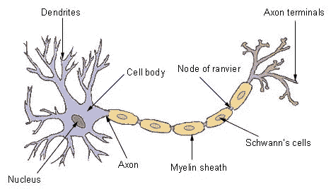
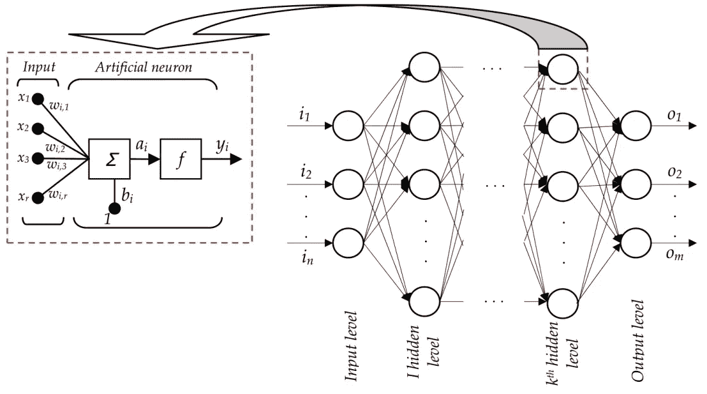
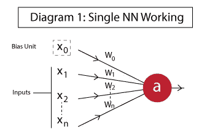
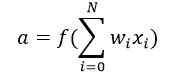

# 人工神经网络:人工智能革命的开端

> 原文：<https://medium.com/hackernoon/artificial-neural-network-a843ff870338>

根据维基百科的说法:一个[人工](https://hackernoon.com/tagged/artificial) **神经网络**是一组相互连接的节点，类似于大脑中神经元的巨大**网络**。

当我们听到神经网络这个词时，我们会想到什么，这显然是最近的趋势。每当我们听到神经网络，我们脑海中就会浮现出下面这张图片

Biological Neuron

第一张图展示了生物神经元。它是我们神经系统的基本组成部分。我们身体的基本功能是通过神经网络实现的。头部神经元接收来自我们大脑的信号，根据信号的强度，它通过连接到头部神经元的不同神经元，执行正确的任务。

因此，人工神经网络基本上是一种想象的模型，或者我们可以说是受人脑的启发。让我澄清一下，我们大脑中的神经网络并不像我们刚刚看到的人工神经网络那样简单，也复杂得多。虽然我们可以构建一个复杂的神经网络，但我们大脑的神经结构要复杂得多，而且尚未被探索。

从数学上讲，人工神经网络是高度复杂的复合函数，为计算机提供了计算非线性问题的能力。

神经网络包括信息进入神经网络的输入信号或神经元层，我们可以从网络中获得结果的输出信号神经元层，以及中间的许多不同的隐藏层。

A single Neuron

1.  **x1，x2，…，xN:** 神经元的输入。这些值可以是输入层的实际观测值，也可以是某个隐藏层的中间值。
2.  **x0:** 偏置单元。这是添加到激活函数输入的常数值。它的工作方式类似于截距项，通常值为+1。
3.  **w0，w1，w2，…，wN:** 每个输入的权重。注意，即使偏差单位也有权重。
4.  **答:**神经元的输出，计算如下:

**f is the activation function**

神经网络是自动驾驶汽车、图像识别软件、推荐系统、人工智能无人机监控、OCR(光学字符识别)、声音的光谱表示、文本和语音分析等产品的核心。

# 人工神经网络的类型

目前在深度学习的神经网络架构中主要使用 6 种类型的神经网络

1)前馈神经网络

2)基本上用于长短期记忆(LSTM)项目的递归神经网络

3)卷积神经网络

4)径向基函数神经网络

5) Kohonen 自组织神经网络

6)模块化神经网络

根据隐藏层，我们可以将它们分类为

1)两层神经网络(1 个隐藏层)

2)三层神经网络(2 个隐含层)

3)复杂神经网络

所以，神经网络越大越好。

**关注** [**NITW 技术评论**](https://www.facebook.com/NITWTechnoreview/) **获取更多更新**