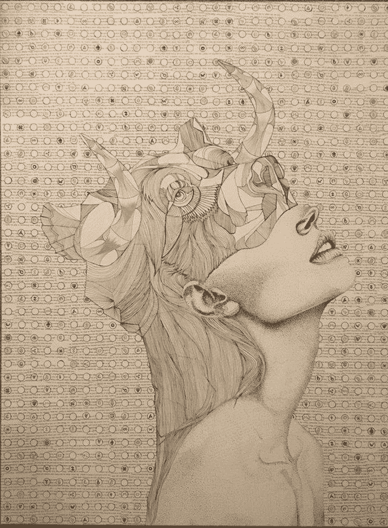
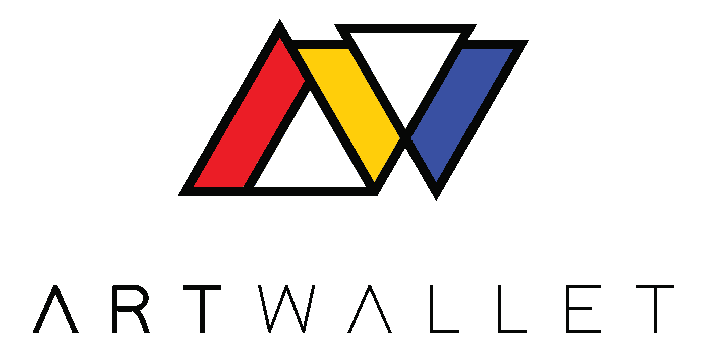
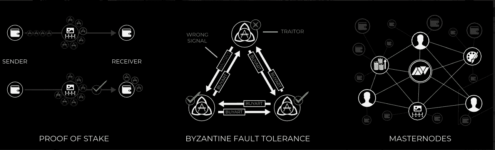
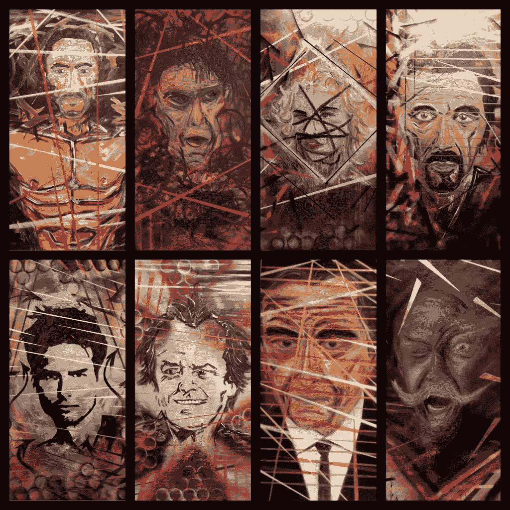
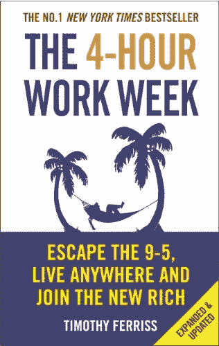
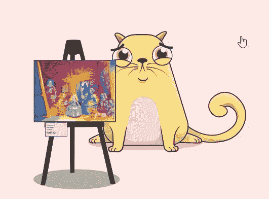

# 艺术品市场——你曾经想拥有一件艺术杰作吗？这可能是你的机会..

> 原文：<https://medium.com/hackernoon/artwallet-have-you-ever-wanted-to-own-an-art-masterpiece-well-this-could-be-your-chance-c80884712a6d>

## 我不是艺术鉴赏家，但我知道一个伟大的区块链用例，当我看到一个。

Crypto Trading Art from /r/CryptoCurrency

加密怀疑论者喜欢认为加密货币市场被严重高估，因为加密项目几乎没有真实的用例或有形的价值来证明旺盛的估值。

热衷者倾向于用一些例子来反驳，比如人们——尤其是那些贫困的人——使用加密技术向他们在海外的家人汇款，以避免与西联汇款(Western Union)等支付服务相关的高昂费用。还有一个例子是，比特币被用作保值手段，以对冲极端的恶性通货膨胀，这在委内瑞拉和 T2 等国家是可以看到的。

由于 crypto 的高信噪比，有一些鲜为人知的 [crypto](https://hackernoon.com/tagged/crypto) 项目已经在幕后悄悄建立起来，它们慢慢地被现实世界采用。一个在争论中脱颖而出的项目包括 [Factom](https://www.factom.com/) ，它刚刚[宣布了他们 mainnet 上的第一个活客户。](https://factomize.com/factom-has-first-1-million-transaction-customer-live-on-mainnet-with-more-to-come/)

actom 是一个完全去中心化的公共[区块链](https://hackernoon.com/tagged/blockchain)平台，它以诚实和不可改变的方式记录重要文档和数据的存在。Factom 的客户包括国土安全部以及比尔和梅林达盖茨基金会。

数据存储不是世界上最性感的话题，也不是你通常想在第一次约会时提起的话题，然而，由于它与区块链技术有关，它实际上是天作之合。

区块链的一个主要核心特征是记录在构成区块链的每个区块中的交易的不变性。这意味着存储在块中的所有最终交易都是防篡改的，不能被修改，因此通过自然扩展，使用区块链存储、验证和记录重要文档的存在是一个很好的用例。

# 艺术 x 加密

这是我们艺术世界与技术相遇的起点，在一个相对未受技术革命影响的市场中，尤其是与其他行业相比，这种相遇带来了巨大的创新和颠覆潜力。

就美术而言，首要问题是鉴定和核实名作的出处。每年都有模仿著名艺术家伪造的假冒艺术品进入艺术市场。

# 艺术走廊

这就是 ArtWallet 加入竞争的原因，它超越了 Factom 提供的数据，专门迎合了区块链艺术行业的需求。ArtWallet 更进一步，专门为他们的艺术平台生态系统创建了一个名为“DNAChain”的区块链。

ArtWallet 是一个新的加密项目，旨在建立一个生态系统，将艺术和加密世界融合在一起，形成一种新的创新、颠覆性和高效的方式来购买、出售和交换艺术杰作。

## **ArtWallet 的生态系统**

为了确保进入 ArtWallet 生态系统的杰作的真实性，我们采用了多签名流程，邀请世界一流的艺术权威和专家对每件杰作进行审核和检查。

在这个过程结束时，每个艺术品的“DNA”被存储在分散的文件存储系统中，以确保没有单个实体能够篡改或修改认证出处数据——也就是*“艺术品的 DNA”*。每件艺术品的 DNA 将包括高分辨率图片、标题、艺术家姓名、创作日期、来源国、真品证书和其他相关数据。

Core Features of DNAChain

## 艺术杰作的部分所有权

一旦一件杰作被认证为真品，该艺术品将经历所谓的“首次艺术品出售”过程，在这个过程中，将进行拍卖，用代表艺术品中一件作品和部分份额的代币来基本上证券化艺术品。

例如，如果一幅毕加索的画进行了首次艺术发行，该艺术品可以用 100 个代币进行证券化，其中每个代币代表毕加索杰作的 1%的部分所有权。

随着英国艺术家林肯·汤利(Lincoln Townley)最近[在一个周末通过社交媒体为加密货币](https://www.express.co.uk/news/uk/1011049/cryptocurrency-bitcoin-blockchain-Lincoln-Townley-artist-fine-art-Venice-Biennale-London)出售了一整套艺术品，显然会有对 ArtWallet 平台何时上线的需求。

Lincoln Townley’s “Icon Collection”

## 首次艺术发行

首次艺术发行可以被认为是艺术领域的“反向 ICO”

首次公开募股让艺术家、画廊、博物馆、私人收藏家和任何杰作的所有者将他们杰作的一部分*或全部*标记出来并出售，而不是通过举办“ICO”来筹集资金，让艺术家投入时间和精力来创作杰作。

将蓝筹股和投资级名作标记的能力将有助于开放艺术市场，使任何愿意购买一小部分名作的人都可以这样做，从而使艺术市场民主化。

简而言之，像你和我这样的普通人——*——*将能够进入艺术市场，而不会失去我们的衬衫来购买和拥有一件杰作，这曾经只有富人和名人才能拥有！

## 或许是时候重组艺术行业了？

随着技术的崛起，我们已经看到了许多全球行业的经济增长、创新和创造力的爆炸式增长。

随着个人电脑的出现，这为大众编码和构建软件打开了一个巨大的通道和机会。这种特权不再仅仅局限于政府、大学、公司或其他有能力购买和存放编程和编码所需的老式大型计算机的人。

这场革命导致其他行业和部门被颠覆，如写作和出版业，人们能够连接到互联网，通过外部网站、出版物甚至自己的博客来写作、创作和分享他们的作品。

亚马逊、Wordpress 和 Medium 等出版物网站极大地促进了这种转变，业余作家可以在这些网站上自由地向世界分享他们的作品。这造就了今天许多著名的畅销书作家，如果他们被局限在行业的旧标准和惯例中，他们可能永远也见不到光明，比如休豪伊、塔克·马克斯、蒂姆·费里斯等等。

Tim Ferriss: From Blogger to New-York Times Best Selling Author

由于优步、AirBnB、YouTube 以及脸书、推特和 Instagram 等社交媒体平台的崛起，其他行业也被大大颠覆了。

这些颠覆性的创新带来了更大的价值、机会和财富，这些价值、机会和财富被大众和那些有足够勇气采取行动的人所分享。那些在这些行业的顶端拥有巨大权力和影响力的人和公司，他们的影响力被削弱，利润被挥霍。

随着越来越多的人成群结队地进入这些市场——无论是作为生产者还是消费者——这创造了一个爆炸性的增长和一种全新的经营方式。艺术市场在采用技术和改变方式方面一直很慢，但是随着区块链技术的引入，我们可以看到潮流的转变。

## 非实物和收藏品市场！

不可替代的收藏品市场在规模上远远大于艺术品市场。这一点并没有被重量级的加密公司忽视，因为在今年 5 月对 Cryptokitties 进行大量投资之后，他们已经把钱花在了实处。

知名基金如安德森·霍洛维茨和[联合广场风险投资](http://www.usv.com/blog/cryptokitties-1)与天使投资人弗雷德·厄尔萨姆(比特币基地的联合创始人)和纳瓦·拉维坎特(AngelList 的创始人)一起领先。

ArtWallet 已经意识到，如果他们的努力取得成功，他们将面临巨大的潜力，这就是为什么他们声明艺术市场*只是*的开始，他们打算成为一个不仅迎合艺术，也迎合收藏品市场的平台。

## 走向

我很高兴看到 ArtWallet 如何发展，因为艺术行业已经停滞了相当一段时间，似乎区块链技术有潜力让艺术界变得更好。

ArtWallet 可能是扰乱艺术品市场的解决方案，它为更多的观众打开了大门，就像科技公司为世界各地的其他行业所做的那样，为所有市场参与者带来了更多的机会和巨大的价值。

*如果你想了解更多关于 ArtWallet 的信息，请点击以下链接:*

**网址:**[www . art wallet .](http://www.artwallet.io)io
**电报:**[https://t.me/artwallet](https://t.me/artwallet)
**推特:**[https://twitter.com/artwallet](https://twitter.com/artwallet)