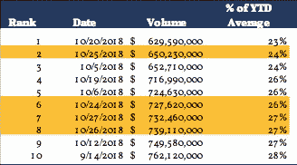
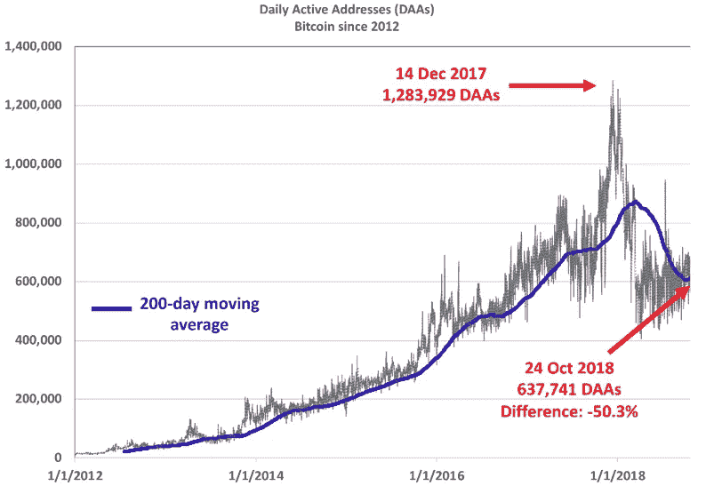
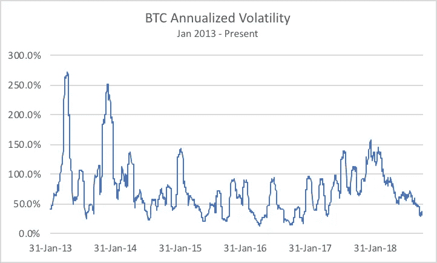

# 随着一个重大里程碑打击比特币，现在会发生什么？

> 原文：<https://medium.com/hackernoon/as-bitcoin-hits-a-major-milestone-what-happens-now-21ddfd4f8b1f>

*前言:我这篇文章的目的是回顾加密市场最近的事件，从我们在过去一周遇到的两个数据点开始，然后回顾过去一年，以了解 2017 年抛物线牛市的开始和结束。然后，我们将看看最后一波密码投机者发生了什么，以及谁——如果有人的话——将取代他们。最后，也是最重要的，我们将试图了解在他们进入之前需要发生什么。*

========================================

过去一周有两件事引起了我们的注意——一件我们认为是非常好的/看涨的，另一件则肯定不是。

让我们先把坏消息说完。

**首先，坏消息**

除非出现意外和不太可能的举动，否则本周将标志着一个在过去六年中只有两次先例、自 2015 年 11 月以来从未发生过的时刻。

不幸的是，你现在不得不把香槟锁在地窖里，因为这将是一个我们很快就会忘记的事件。为什么？**假设其价格保持在当前区间，那么在 2018 年 11 月 1 日，比特币的 12 个月追踪回报率将首次从正变为负。的确是万圣节恐怖秀。**

Source: Coinbase Market Data

我会用这个小桌子来跟进。我认为没有比这更好的方式来说明过去五年来一直被加密的狂野之旅了:

如你所见，任何在 2013 年 1 月购买了第一枚[比特币](https://hackernoon.com/tagged/bitcoin)的人，那一年都过了一个非常快乐的圣诞节。相反，那些在 2014 年 1 月进入市场的人，在这一年结束时，袜子里装着一大块煤(或者完全是一大块别的东西)。

你可能会问，我为什么要提这个？这并不是因为我喜欢纠结于负面因素。毕竟，我的父母总是鼓励我在任何挫折或失望中寻找积极的一面。也许这是因为我是在中西部的北部长大的，那里的天气总是很糟糕。

尽管如此，事实仍然是，我们是在一个显著停滞的时期达到这一里程碑的。我没有开始积极交易密码，因为我预计它会很无聊。恰恰相反。毕竟，我最喜欢的加密名言之一来自 BitMex 的创始人 Arthur Hayes，他最近指出**“对加密而言，数量和波动性的下降比白酒和止痛药更致命”**。然而，正如下面的图表所示，我们在这里。

事实上，比特币的年化波动性现在已经低于或相当于许多美国最大的科技股，包括苹果(AAPL)和网飞(NFLX)。

*Source: Kosmos Research, Coinbase, NASDAQ*

不足为奇的是，这与:

(1)近几个月来，比特币交易区间越来越窄。事实上，当我最后一次在一个小时前查看价格时，24 小时的变化正好是 0.0%。我们尽量不要整天盯着股票，但这对我来说还是第一次。

(2)交易所交易量正在跌落悬崖。仅以 BTC 为例，见下表，显示了 2018 年最低的 10 个日成交量:

是的，你没看错表格:年初至今最慢的 10 天中有 4 天发生在上周，10 天中有 9 天发生在本月。从这个角度来看，今年 1 月 1 日的交易额超过 110 亿美元。

太好了——所以市场陷入了一个无法摆脱的困境。作为投资者，这对我们有什么帮助？

暂时不要想这个问题。首先，让我告诉你们上周的一次谈话，那次谈话让我们的心情大为开朗。

***现在，好消息***

在一片黑暗中(但绝对没有繁荣，抱歉，麦嘉华)，我的合伙人最近找到了他的一个朋友，一位驻伦敦的宏观对冲基金经理。加密市场喜欢纠结于“机构资金墙”何时到来。这个人是那堵墙不可分割的一部分。所以我们总是有兴趣听听他对 crypto 的想法，如果他有的话。

毕竟，像大多数宏观基金经理一样，他没有太多时间去投资一个资本总额不以万亿美元衡量的资产类别。就在 2017 年秋天，他承认对密码“几乎一无所知”，并且缺乏花时间学习更多知识的带宽或动力。

但这一次，对话有所不同。他告诉我们，他已经开始阅读了空间和有问题。如果他在学习曲线上努力向上，我们强烈怀疑他并不孤单。我们的朋友不是那种在一个话题上浪费时间或精力的人，除非他发现了一个令人信服的机会。对我们来说，这比我们在 Crypto Twitter 上读到的任何东西都更是一个看涨的市场信号。

最重要的是，我们发现有趣的是，这场对话发生在比特币一年期追踪回报率即将跌至负值之际。

然而，在过去一年发生的事情的背景下，考虑这两个数据点很重要——一个好，另一个不太好。让我们简要回顾一下 2017 年密码市场发生了什么，以及原因。

**过去是(不是)序幕**

像大多数贪婪驱动的泡沫一样，比特币历史性的 2017 年走势起步缓慢。1 月 1 日，BTC 的交易价格还不到 1000 美元，而在 3 月底，它只值几美元。

但是在第二季度发生了一些事情——到 6 月底，BTC 的价值增加了 250%。三个月后，它的价值又翻了一番。当然，12 月是狂热达到高潮的时候。价格在不到三周的时间里翻了一倍，在最终崩溃之前几乎触及 20，000 美元。

现在，一些人可能会认为，首次公开募股(ico)引发了市场狂热。在某种程度上，我们同意这一立场。毕竟，最初是 ICO 狂热让 crypto 成为人们关注的焦点，并迫使主流投资公众予以关注。

然而，更仔细地看，我们会认为 2017 年下半年出现了一个更重要的趋势。机构进入市场的传言——以及看似是机构进入市场的步骤——最终将比特币推入了抛物线状的结局。

**比特币的注释(近期)历史**

Source: Coinbase/Coinigy

与此同时，比特币期货合约的宣布，加上有关华尔街兴趣的头条新闻和迫在眉睫的变化的惊人预测，共同推动了一种自我实现的资产价格越来越高的叙事。

CNBC, December 2017\. Boo-yah!

歇斯底里在 2017 年 12 月 18 日达到顶峰。前一天，比特币在比特币基地刚刚创下 19783 美元的历史新高。

两周前，芝加哥商品交易所和 CBOE 期货交易所宣布了比特币期货合约的推出日期。可以预见的是，随着新进入者在“机构资本之墙”到来之前涌入，加密资产市场出现了大幅波动，外界普遍认为“机构资本之墙”即将到来，并将推动比特币达到新的高度。那个月的前两周，比特币的价格翻了一番。

CBOE 期货于 12 月 10 日首次亮相，首日交易上涨 19%。由于交易所的“熔断机制”规则，交易被暂停了两次。市场继续买入，屏息等待一周后 CME 的推出。

芝加哥商品交易所合约大张旗鼓地开盘，然后……下跌了 2%。这是失败的期望的体现。

**而这仅仅是痛苦的开始。机构资金从未真正到来，也没有推动这个泡沫**。

简而言之，2017 年几乎完全是零售驱动的列车，迟到的赌客在脱轨中被碾压。机构资本还没有入党。

**众所周知的“金钱之墙”在哪里？**

今天去任何一个秘密会议或大会，同样的问题都会被问到。它会像咒语一样被重复——在小组讨论中，在主题演讲中，以及在后台偷偷摸摸的谈话中:

*“机构什么时候进来？？?"*

我们就像等在电话旁的青少年，盯着它，就像卢克·天行者盯着达格巴上的 X 翼战斗机一样…只是*希望*它响。来吧，贝莱德，给我们点爱！

有大量不同但可信的理论来解释什么可能会将比特币推低至 5800 英镑的价格下限，这一价格下限自 6 月底以来一直得到很好的保护。另一方面，我们在该领域以及“加密媒体”中交谈的聪明人相当一致地认为，下一轮牛市将由广泛的机构采纳——“金钱之墙”驱动，在这种愿景的大多数排列中，这种采纳是在期待已久的比特币 ETF 的基础上实现的。虽然我们喜欢做反向投资者，但在这一点上我们完全同意。

对于长期散户来说，对这个问题的第一反应可能是翻白眼。为什么？举一个具体的例子，猜猜这些标题的出版日期。

第一篇文章来自英国《金融时报》，写于 2018 年 8 月 12 日。《华尔街日报》的报道发表于一年多前。

你看，我们以前来过这里，我们仍然在等待机构的到来。

我们都知道对《华尔街日报》文章的反应——见上图。市场对英国《金融时报》最近的文章反应如何？

Source: Coinbase/Coinigy

具有讽刺意味的是，机构资本是点燃另一次秘密登月所需的火箭燃料，这一信念现在比去年更加坚定。那么，为什么机构进入的可能性在 2017 年推动了这种狂热，为什么今年没有起到推动作用？

实际上，这一切都要追溯到我们从友好的英国对冲基金大亨**那里收到的具体询问:“此时此地，谁在购买比特币？”**

**市场心理学的重要性**

我见过的一些最聪明的人正在夜以继日地开发加密资产的有效估值方法。这是一项艰巨的任务，因为加密不同于人类历史上的任何其他资产。市值(不好意思，CoinMarketCap)一般没啥用。我们在经济学 101 中学到的某些方程，如 MV=PQ，更好，但也有其局限性。

所以 crypto 还没有一个普遍接受的估价标准。但是我们有很多代理人。其中之一是测量在给定时间点区块链的生态系统中有多少活跃用户。我们称之为每日活跃地址(DAAs)，它记录了某一天参与交易的比特币(或其他令牌)钱包的数量。比特币[区块链](https://hackernoon.com/tagged/blockchain)上的 DAA 很容易追踪。

Source: Coinmetrics.io

仔细看看这张图表。让它深入人心。

实际上，活跃钱包的数量是 10 个月前的一半。

现在，如果你在 2018 年 10 月下旬读到这篇文章，你很可能已经在加密市场呆了一段时间。你可能享受了 2017 年牛市的一部分，甚至可能是全部，即使在今年下跌后，你仍然坐在显著上涨的顶部。你将长期参与其中。

但现在，想象你是那些决定加入 2017 年 12 月伟大的密码购买狂潮的可怜灵魂之一——就在图表的顶部。也许你很聪明，只是投资了你净资产的一小部分。又或许你没那么聪明，把房子抵押出去‘全押’了。

如果你决定#HODL，像 Twitter 上所有其他业余爱好者一样，你会面临 61%的未实现亏损。你认为你现在对 crypto 有什么感觉？你会买更多吗？平均降低你的成本基础？

很可能不是。你可能在诅咒那个让你开一个比特币基地账户的朋友，并且想知道你怎样才能把钱赚回来。你肯定是在告诉任何愿意听你咆哮的人，他们也应该远离你。

虽然我们承认这是一个不完美的衡量标准，但让我们假设这些 2017 年 12 月的新 DAAs 中的每一个都相当于一个迟到者。如果是这样的话，那么超过 60 万人在最近的加密崩溃中被烧毁，并带着他们的投资组合离开了市场。

对于一个市值低于 2500 亿美元的资产类别来说，这是一个很大的数字。如果有可能的话，这将需要很多好消息才能让他们回来。如果有什么不同的话，我们认为这一钱包统计低估了最终用户，因为许多在交易所进行的交易在被记录到区块链之前就已经被扣除了。

更糟糕的是，这些人可能会成为下一级冒险者的密码大使。这种痛苦现在正在进一步加剧，因为从本周开始，那些在 12 个月前——甚至是在上次抛物线上涨之前——购买的人现在也在水下。

在许多方面，这是一个古老的故事:资产崩溃，人们损失金钱，因此这一次更加谨慎。然而，鉴于遭受损失的投资者比例，这场大屠杀的规模几乎是前所未有的。

"**这里谁在买比特币？**“我们被问到。答案是直接而明显的:**没有人**。

边缘散户买家——那些试图在 2017 年第四季度抢在“大型机构资金”前面的人——并不存在。那么剩下谁呢？

**金钱之墙……再一次**

你是否和我们一样厌倦了这个比喻？

我们这里说的不是芝加哥的高频交易员，也不是日本的“渡边太太”。这里指的是真正的分配器。养老基金。主权财富基金。捐赠基金。资产池达到 12 位数或更多的发电站。

这些组织由天生厌恶风险的人管理，他们知道投资新的和未经测试的市场意味着巨大的职业风险。投资组合经理很少因为购买德国国债或美国国债而被解雇。任何在 2017 年 12 月做多加密的基金经理现在可能都在掸去简历上的灰尘。

由于没有散户投资者，而且在一次重大的上行突破重振 FOMO 之前，他们也没有真正的回归前景，加密技术历来在这个市场上蓬勃发展，**正是这些机构将不得不担水开始工作。**

我桌上没有水晶球，我也不会假装知道什么时候会这样。这种演变的时间取决于密码市场的内生和外生因素。然而，我们确实有信心说，下一轮加密牛市不存在其他火花。

**我们到了吗？**

火花点燃之前必须满足两个条件:

(1)机构必须具备参与密码市场的**能力**

(2)机构必须有**愿望**参与密码市场

具有讽刺意味的是:在 2017 年，这种愿望肯定是存在的。在华尔街工作过，我可以证实银行家和交易员都在密切关注这个市场，在很多情况下，他们都亲自参与了。但他们没有专业参与的能力，因为关键的基石——合格的托管人、可信的交易对手和(在某些情况下)杠杆——根本不存在。(记住，职业风险是自然界最强大的力量之一。)

现在，不到一年后，情况发生了逆转。在过去的十个月里，加密团体已经突飞猛进地改进了它的基础设施。来自真实的、活生生的回答顾客问题的人(*谢谢，比特币基地！你怎么这么久才来，币安？！？)*对于完全许可的托管解决方案，这个市场的发展速度比以往任何时候都要快。

然而，尽管机构现在有能力进入——随着波动性、交易量和回报率都蒸发了，欲望已经离开了大楼。

*It’s a sad day when Apple stock carries more vol than crypto…*

那我们该怎么办？

我们已经确定，散户投资者无法将加密市场从目前的稳定状态中拯救出来，而机构资本最终将提供所需的推动力。然而，需要一些东西让他们离开观望，进入这一资产类别。

虽然可以肯定地说，比特币交易所交易基金肯定有助于增加市场采用，但我们不认为这是加密市场真正想要或需要的 *deus ex machina* 。

根据世界银行的数据，发达经济体的机构投资者目前管理着超过 100 万亿美元的资产。想想那 50 个基点的资本会对加密市场产生什么影响。

这些资金不会在一夜之间分配完毕——每个机构都需要做出自己的决定。为了进行分配，机构必须相信加密资产最终成为了一种值得投资的资产类别。

但其他事情正在发生，远远超出了密码交易所的范围。自 Satoshi 的白皮书向世界发布以来，股票和固定收益市场上首次出现乌云。

如果华尔街对股票或公司债券失去兴趣，会发生什么？那资本去了哪里？

在适当的情况下，比特币甚至可以被视为安全港吗？

我认为这是非常可能的，在我们的下一篇文章中，我们将仔细看看这是如何发生的。

========================================

**我在**[**Kosmos Capital Management**](http://www.kosmoscap.com)**工作，该公司积极交易新兴类别的数字资产。在 Twitter 上关注我** [**@kvirgil**](http://twitter.com/kvirgil)

========================================

**免责声明:本专栏中的任何内容都不是投资建议，您绝对不应该这样理解。做投资决定时，不要依赖我的建议，也不要依赖任何人的建议。做自己的研究是在任何市场成功的关键。**

========================================