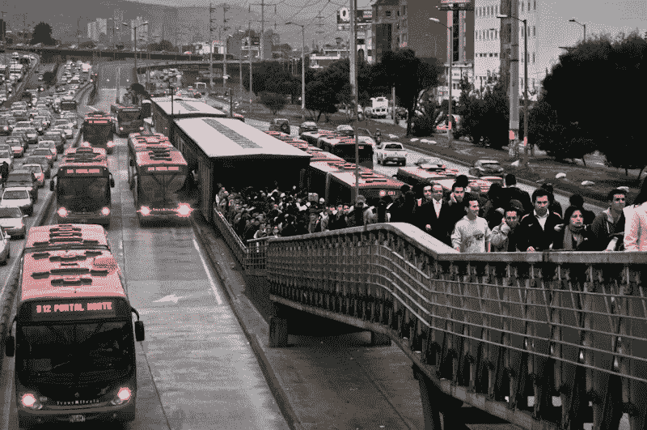
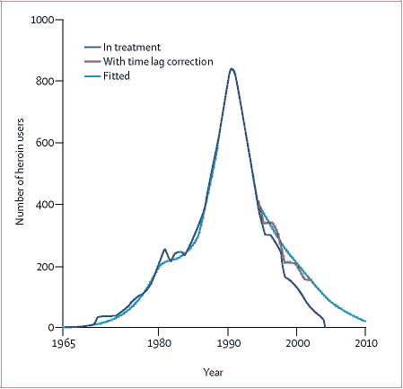
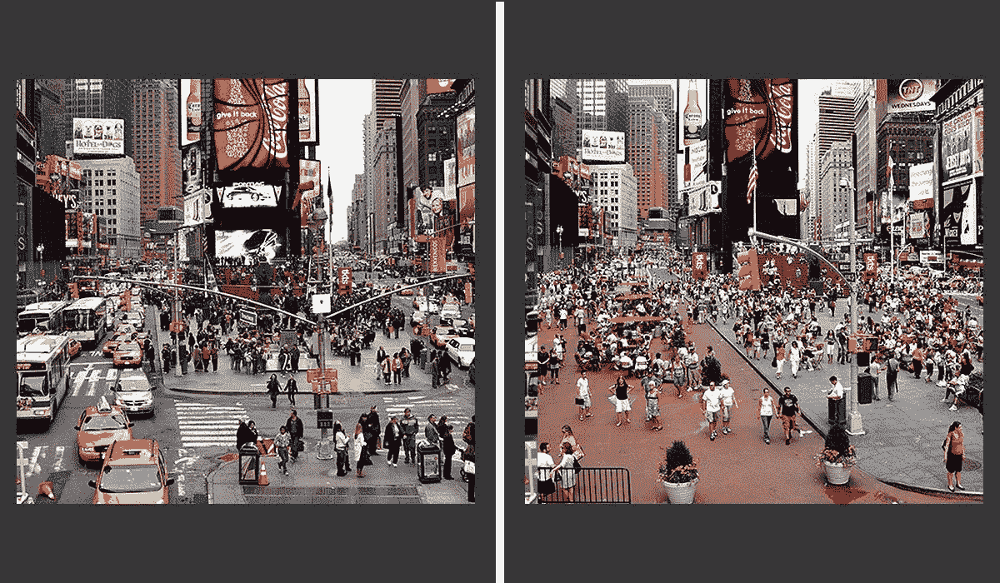

# 随着城市的发展，国家逐渐衰落。

> 原文：<https://medium.com/hackernoon/as-cities-grow-nations-will-die-14124014d10e>

# 民主是为城市设计的

现在世界人口的 54%生活在城市，每天都有更多的人搬到城市。但是，随着选民和权力集中在大都市地区，国家会阻碍城市发展吗？毕竟，民主是用来统治一个城市的——雅典。也许我们对民主制度的延伸超过了它的本意？我们能让民主以最佳的规模——城市——运行，同时找到一些其他的方式在联邦层面上组织起来吗？

Athens from [here](https://upload.wikimedia.org/wikipedia/commons/thumb/e/e2/Athens_Roman_Agora.jpg/800px-Athens_Roman_Agora.jpg)

# 城市是高效的

市长正在成为新的总统，并可能越来越多地成为全球化、城市化世界进步的领导者，使国家成为一个次要结构，只处理国际、跨领土和安全问题(以及在较小程度上的立法)。

许多事情表明这座城市(或者更准确地说，T2 大都市地区)作为一个可治理的机构运转得更好——而且[大多数人现在都住在其中的一个城市](http://www.un.org/en/development/desa/news/population/world-urbanization-prospects-2014.html)。

## 1.)接近政客= >问责制

根据定义，市长住在她或他的选区内。如果市长无视这些选民，他们可以在一小时内到达他们的家门口。这就产生了责任。在这种规模下，社区领袖可能会站在解决选民问题的最前沿，而不是职业政客。城市有一个规模，领导者的首要任务是帮助人们。

Bogota’s innovative Transmilenio by [Flickr user Oscar Amaya](https://www.flickr.com/photos/oskam/6253700043/in/photolist-awBR9x-awEyKQ-y4G9n-eF57da-y4G3M-9u7Btf-rRYqgM-rTHmh3-6rDD2C-sbfR8V-wwMy1-9QcA7n-6rzy8P-4z4MLV-sbaoyJ-revcit-rTRDd2-8VGpY7-sbiQQP-s91HqA-fbNgv-gTArzs-s91Vcb-y4G6L-y4Gcs-4Yi69w-reuKTR-reiCbE-56581s-sba6im-sbfvYH-5x2PaD-8X6zWA-5657M1-sbiytF-sb9RLm-reisnS-reuW5c-sba5pN-s91T4y-xd1HH-rTRe88-pjarV-s921W7-sbfeYr-sbipsp-sba1uJ-rTJoVE-bDw55i-4yseuS)

例如，巴黎开始向其居民提供自行车共享服务，这可以说是在丹麦和荷兰进行初步试验后第一个大规模的自行车共享系统。波哥大通过创新的公共交通系统解决了穷人的通勤时间，现在通过全球市长会议传播到西雅图和其他城市。

## **2。)共命运= >同质利益**

城市是一大群拥有相似价值观和兴趣的人。污染、腐败或糟糕的公共交通将直接或间接地影响每个人，因为他们都生活在城市里。当公民团结一致时，就会有更少的时间浪费在如此不一致的利益(枪支管制、堕胎)之间的争吵和妥协上，从而使妥协变得毫无意义，而有更多的时间在稍微不同的利益之间做出明智的妥协。

Cleaning up the Platzspitz drug scene in Zurich from [here](http://politicsofsin.50megs.com/H/swiss.heroin.summary_lancet.367.1830-4_2006.html)

也许城市的规模是人类决策最有效的规模，因为每个人仍然可以看到彼此并相互联系——并看到他们投票支持的政策的直接后果。在纽约市，居民们得到了绝缘、防雨和太阳能的补贴，以分散桑迪飓风后实施的电网。尽管苏黎士在 90 年代初在社会上是保守的，但它向海洛因成瘾者提供美沙酮，以清除欧洲最大的公开毒品场所。

## 3.)一个目的= >重点

一个国家必须一心多用，平衡外交政策和国内事务。另一方面，从定义上来说，市政府专注于自身——没有什么可以分散它的注意力，因为城市以外的一切都由国家政府处理。这种强烈的关注感让城市专注于他们最擅长的事情:改善选民的生活，帮助创新开花结果。例子包括三藩市(紧随马萨诸塞州之后)为其居民提供 T4 全民医疗保险。在汗/彭博的领导下，纽约市重塑了城市规划模式，以更快的速度改善居民的生活。

Khan/Bloomberg improvements in Time Square, New York City from [here](http://www.earthpowernews.com/wp-content/uploads/2014/02/before-after2.jpg)

众所周知，在全球化的 21 世纪，城市将成为主导的政治底盘，因为大多数人将生活在其中，在环境、社会和技术水平上引领他们的国家。民主过去和现在都对城市很有效。

“城市优先”的模式当然存在问题。一个明显的例子是城市精英忽视农村人口的腐败。然而，首都遥远的政客们忽略了城市人口和农村人口。另一个问题是，如果我们真的回到像中世纪的阿姆斯特丹或威尼斯那样的城市国家，许多集中的效率将会消失，因为城市将不得不担心安全、维持供应等问题。旧金山和洛杉矶的势力范围的边缘在哪里？

这里有一个警告，过于极端和真正回归民族国家可能会导致其自身的问题:将任何地区分割成太多的小自治城市会导致像我们在加利福尼亚州面临的住房危机这样的问题，这在一定程度上是因为城市只关心自己的利益，而不是更大区域的利益。交通、水、不平等、无家可归也是如此。

# 国家效率低下

西方国家似乎越来越不正常，越来越不能代表其选民的意愿。与此同时，城市和地方政府在许多方面更加积极，在环境、社会问题、医疗、教育和金融领域引领创新。

相比之下，这个国家有许多缺点。

**距离:**国家政治家远离选民，在选举周期之外感受不到来自选民的直接压力。越来越多的西方领导人被指责迎合游说者而不是他们的选民。为什么？游说者也在首都——只要政客们想，他们就能得到他们的关注。但是德克萨斯州的选民不会去华盛顿示威。一个来自巴西南部的人不会坐三天的汽车去巴西利亚。

**复杂性:**有些问题没有人人都能接受的解决方案。有时候，太多不同的利益无法捆绑成一个妥协方案。为 3.5 亿 1B 人找到一个可接受的解决方案很困难。这就是政治僵局的来源。波兰农民可能会觉得被西班牙游说者提议的农业法律疏远了。

缺乏重点:当一百万个挑战都需要关注时——从国际威胁和灾难到抽象而真实的国内挑战——制定一个能帮助你的选民的议程可能会很吵。一个国家同时掌管太多的事情。

# 历史先例

最古老的城市比最古老的国家历史更悠久是有原因的。古代王国从城邦开始:首先在国内小范围内证明治理体系和政策，然后扩展到周围的领土。历史标准是创新(例如民主)从城市向外流动。

相比之下，自上而下的民主国家可以说是历史上最近的产物:1776 年的美国，1848 年的欧洲大部分国家，以及二战后的其他地方。在治理的整个时间线上，这个将民主扩展到整个国家的实验是一个相对短暂的实验，我们已经尝试了 150 年。这项实验在 20 世纪产生了喜忧参半的结果:和平和财富，但也有战争、饥荒和贫困。我们不应该想当然地认为这是统治我们国家的最佳方式(即使民主在城市中确实运转良好)。尽管在联邦层面上存在强烈的利益分歧，我们也许能够找到解决方案。

当我们在 19 世纪创造国家时，我认为我们匆忙地将民主模式传播得太薄了。我们假设对城市起作用的东西会对更大范围的国家，联合国，银河系线性起作用。国家是 19 世纪过度扩张的产物。我预测，我们自然会重新关注民主决策的最佳规模:城市。

# 下一步是什么？

Photo from [NASA](https://eol.jsc.nasa.gov/SearchPhotos/photo.pl?mission=ISS028&roll=E&frame=24360)

现在大多数人都住在城市里，我们可以转向人类规模的大都市立法和公民生活，创造更加灵活、高效和公平的社会。我预测，在下一个世纪，我们将看到世界各国越来越失去它们的立法权和执行权，只不过是城市之间的交流平台和建设共享项目的资金池，没有一个城市能够单独做到这一点。在这种新的平衡中，我们的角色分配是:

*   城市自治他们的市民，并像今天一样不断试验改进。但他们将越来越多地为内部公民生活制定自己的法律，并亲自监督企业“公民”(这将减少因缺乏距离而进行游说的危险)。
*   国家通过在城市之间传播成功实验的结果来使城市彼此结盟。因为立法的重担越来越多地落在城市身上，国家获得了一个新的清晰的目标:他们用共享的资金建设城市的共同项目。共享基金将用于运输、研究、星际探索和防御——尽管防御的需求可能会减少，因为城市一般不会渴望战争，但国家会。因此，运输、研究和太空计划将占据新国家的大部分时间。

当前的反全球化趋势(及其黑暗的表亲民族主义)是这种分权需要的信号。例子包括(这里简化了很多)波兰农民不想屈从于布鲁塞尔的意志，英国脱欧者希望从欧盟获得主权，特朗普的农村选民不满华盛顿的政策，等等。这些权力下放的趋势是由对低效率的不满和城乡人口之间不断变化的权力平衡所驱动的。但是，将权力从全球和地区协议中分散出去，回到单一民族国家并不能让社会变得更加公平。只有当我们将这种权力下放运动进行到底时，这种紧张关系才会得到解决:在城市和大都市区层面赋予高效决策的权力。反全球化不是最终状态——最终，反民族主义会随之而来。

人类社会的最佳尺度是城市。随着城市人口在本世纪进一步膨胀，城市将越来越多地自我管理，而国家将重新用于城市之间的调解，同时将人类社会扩展到地球以外。这种重新分权将是积极的——导致更少的战争、更快的进步和更公平的社会。

# 信用

**感谢**Eryk salvag gio、 [Can Olcer](https://humbot.io/) 、Laura Erickson、Zebulon Reynolds 和其他所有人阅读本文的草稿。**也读** [为什么城市一直在增长，公司一直在消亡，而生活却一直在变快](http://longnow.org/seminars/02011/jul/25/why-cities-keep-growing-corporations-always-die-and-life-gets-faster/)。 ***原贴*** *于*[*swissnexSF*](https://nextrends.swissnexsanfrancisco.org/back-to-the-city/)*和 nikodunk.github.io/cities*