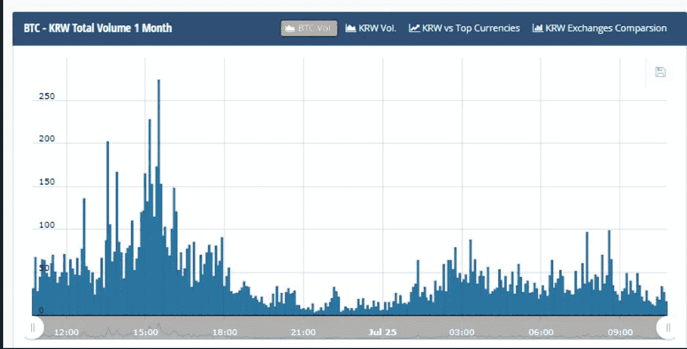
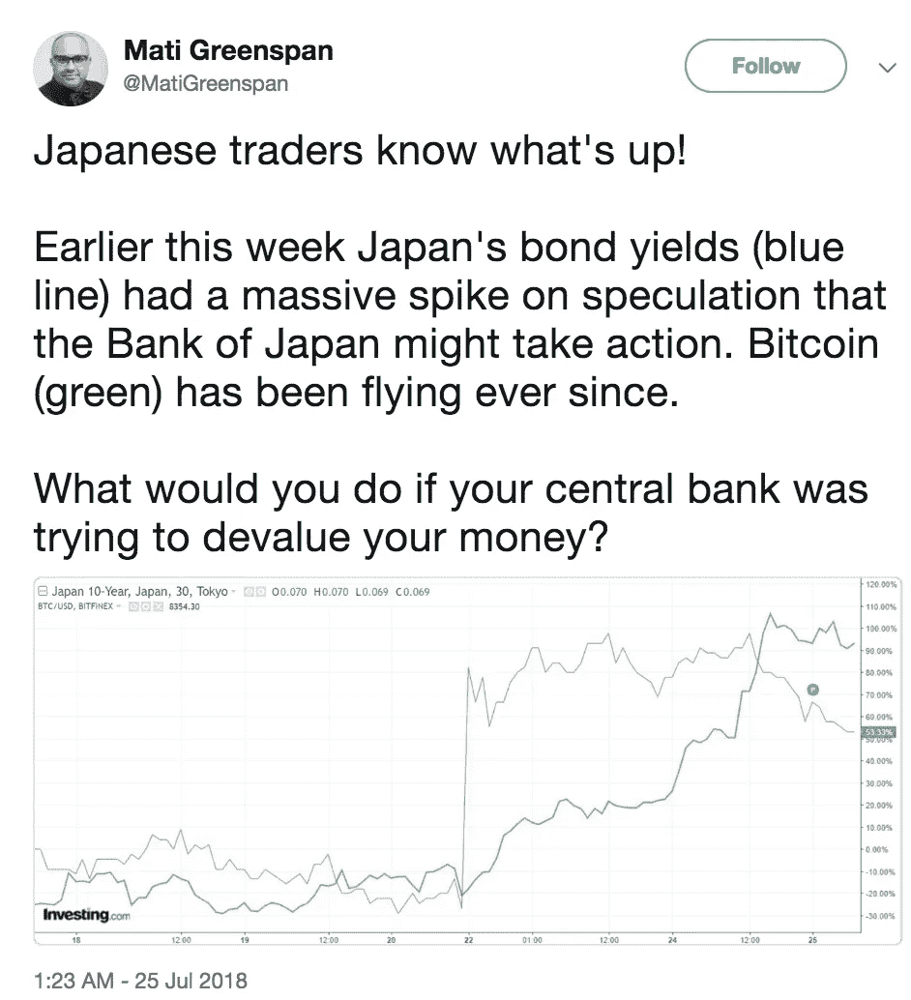

# 亚洲市场推动比特币达到 8000 美元及以上？

> 原文：<https://medium.com/hackernoon/asian-markets-driving-bitcoin-to-8-000-and-beyond-cb6bf2c5e4a2>

由于贝莱德(Blackrock)等机构基金的兴趣日益浓厚，以及对美国证券交易委员会(SEC)目前正在审议的比特币 ETF 提案的猜测，比特币最近飙升至 8000 美元。

这两个指标似乎都指向美国市场，推动比特币价格升至 8000 美元水平。然而，最近的报告显示，亚洲市场实际上是比特币近期交易量的主要来源。

EToro 高级分析师马体·葛林斯潘在推特上分享了他的想法，他说:

> *8000 美元以上的飙升绝对是由东亚引领的。看看飙升时(图中 13:30-15:00)以日元和韩元计算的比特币交易量。*
> 
> *相比之下，美元交易量只有小幅上升，USDT (tether)在整个波动过程中保持不变。*[*pic.twitter.com/fHdD8gRTTL*](https://t.co/fHdD8gRTTL)
> 
> *—马体·格林斯潘(@马蒂斯·格林斯潘)*[*2018 年 7 月 25 日*](https://twitter.com/MatiGreenspan/status/1022026519231774720?ref_src=twsrc%5Etfw)

第一张图显示比特币/日元交易量约为 1.1 万。

同样，韩国市场也经历了自己的飙升，随后在 7 月 23 日出现了一波稳定的交易量。

BTC/美元交易量仅经历了一个小高峰，随后交易量平平。

**日本政府贬值日元**

日本政府让日元贬值可能是日本最近比特币交易量激增的关键原因。正如在委内瑞拉和中国等国家看到的那样，国家货币贬值通常会导致公民将他们的钱转移到黄金、债券或比特币等其他资产类别，以保持或升值估值。

长期以来，韩国和日本一直大力采用比特币和区块链技术。两国的零售商、科技公司(如三星)甚至航空公司都采用了比特币。可以说，日本政府在接受比特币方面走得最远，正式承认比特币为合法货币。

这种认识可能会导致公民在日元疲软时期将比特币视为理想的货币替代品。

# 结论

比特币的价格会上涨多少还有待观察。然而，清楚的是，尽管最近价格飙升的催化剂主要是美国的事件(ETF 公告和贝莱德探索比特币),但交易量图表似乎表明，亚洲市场最渴望带我们进入另一轮加密牛市。

*原载于 2018 年 7 月 26 日*[*【cryptopotato.com*](https://cryptopotato.com/asian-markets-driving-bitcoin-to-8000-and-beyond/)*。*