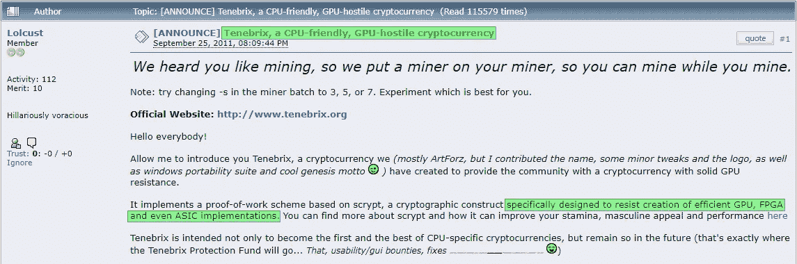
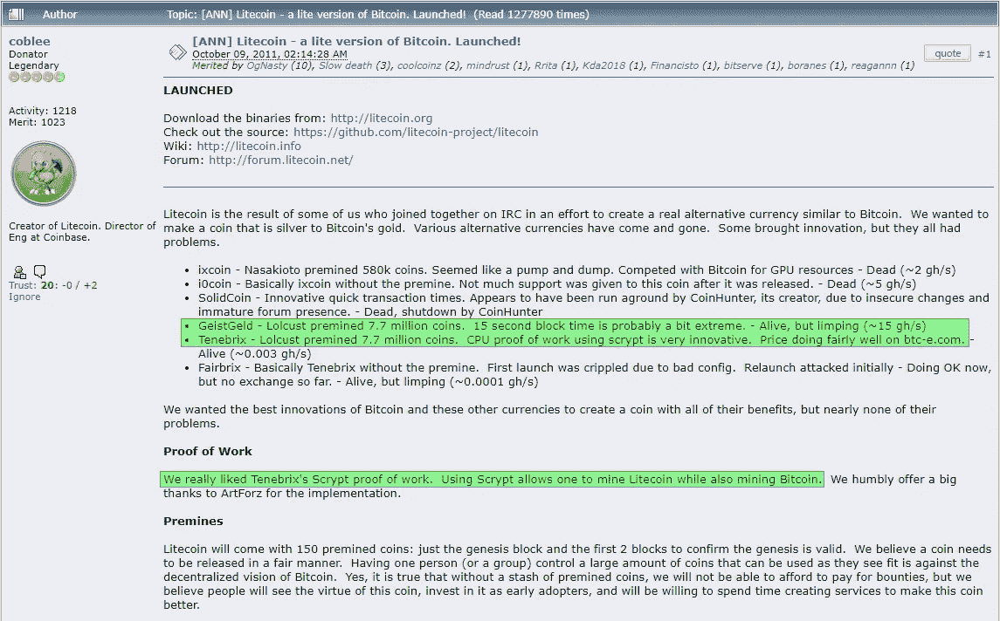

# ASIC 电阻不过是个区块链流行语

> 原文：<https://medium.com/hackernoon/asic-resistance-is-nothing-but-a-blockchain-buzzword-b91d3d770366>

## 改变比特币的工作证明是徒劳的

# 介绍

在最近也是最重要的改变比特币工作证明的努力之后，我认为这将是一个很好的机会，通过搁置它来从社区获得更多的印象分。我将讨论硬件专业化的更广泛的话题*(“ASIC 抵抗”)*，试图抵抗专业化硬件的技术和逻辑缺陷，围绕这一点的一些历史，然后我将触及我希望是短命的*(和猫腻)*关于除了两个半人之外没有人想要的工作验证算法更改的动议。

自从第一种替代货币——加密货币诞生以来，人们就一直需要将它们与比特币区分开来，否则旁观者*(你的硬币所吸引的人)*会很明显地认为它只是一个复制品。出于一个原因，他们是另一种选择，你不希望他们认为这只是一个拷贝，因为这样他们就会认为这是一个拷贝。

## 什么是[硬币](https://hackernoon.com/thats-not-bitcoin-that-s-bcash-f730f0d0a837)？

*哦就像比特币一样，我们复制了它。*

## 如果其他人都在用比特币，我为什么要用它？

*它有更好的名字？*

这绝对不是一个好的理由，所以我们需要用更好的理由来取代那个非常糟糕的回复。似乎值得注意或令人信服的东西，而不仅仅是新出现的东西。我不会解释所有这些，但这里有一些常用的:

*   更快的确认时间*(莱特币)*
*   更大的块*(*[*BCash*](https://hackernoon.com/thats-not-bitcoin-that-s-bcash-f730f0d0a837)*)*
*   环保*(以太坊*)
*   更好的隐私 *(Monero)*
*   **抗 ASIC**

# 那么什么是 ASIC 电阻呢？

*现在就挖掘* ***你*** *能做的，意下如何？* ***好听吗*** *？这种挖矿的目的是为了阻止人们不公平地分享权力，这样你就可以分享乐趣，也可以赚些钱。再者，它会让我们区块链的* ***更加分散*** *”，我们知道你不知道这到底意味着什么但它会起作用，我们保证。*

这都是胡说八道，原因很简单，但为了涵盖所有角度，我会给你整个纲要。

# 索引

## **1:** [**总览**](/@StopAndDecrypt/b91d3d770366#4e3b)

*   **哈希&挖掘:**哈希分块，像彩票一样检查哈希
*   **通用处理:**你的电脑 CPU 是通用的
*   **应用特定处理:**和**集成电路是这种处理的一种变体**
*   **有意的复杂性:**无意的后果

## **2:** [**特殊化抵抗策略**](/@StopAndDecrypt/b91d3d770366#d7ae)

*   **不同…但相同:**替代但公平的算法
*   **内存密集型算法:**使用计算机的不同部分
*   **外部预言:**由开发人员/社区定期更改
*   **编程变更:**由代码周期性改变

## 3: [**一切从哪里开始，为什么还在**](/@StopAndDecrypt/b91d3d770366#e520) 左右

*   来自过去的爆炸:一点点历史
*   什么时候会结束？一个美好的未来

## 4: [后期开采要求低进入壁垒](/@StopAndDecrypt/b91d3d770366#fdd6)

*   **大联盟挖掘:**结束游戏
*   **不要柠檬？:**没有柠檬水

## 5: [改变比特币的 PoW 解决不了任何问题](/@StopAndDecrypt/b91d3d770366#83d9)

*   **暂时缓解永无止境的假警报**
*   **硬分叉本质上缺乏共识** *(极少例外)*

## 6:结论

# 哈希、采矿和小刀与剪刀

## 哈希和挖掘

哈希是将数据打乱的行为。你拿任何你想要的东西，把它放进一个盒子里，然后随机的 0 和 1 就出来了。它提供了一些功能，但一般来说，它让你在分享输出的同时对输入保密。哈希*算法*是一组用于生成哈希的特定指令。它们可以简单到乘以 5 然后除以 2。这里的警告是，这是完全可逆的。你只需乘以 2，然后除以 5，计算机可以极快地完成这种猜测。如果你想让输入保持秘密，你需要更强大和不可逆的东西。我们可以添加更多的步骤，但重要的是*种*步骤。还记得高中那些数字模式识别测试吗？

计算机也很擅长这些，不管你把它们做得多复杂。如果你要标准化一个哈希算法，让每个人都可以使用，如果你想让输入保持秘密，你需要做更多的*。要使一个过程不可逆，需要把数字从数学领域中拿出来,“玩”它们……很多。这让我们想到了比特币的哈希算法，即 [SHA256](https://en.wikipedia.org/wiki/SHA-2) 哈希算法。有很多资料可以解释这是什么，但我宁愿让你自己来做，直接跳到演示。*

*进入[这个网站](https://www.movable-type.co.uk/scripts/sha256.html)并输入以下内容，你会看到输出是相同的。*

**

*[https://www.movable-type.co.uk/scripts/sha256.html](https://www.movable-type.co.uk/scripts/sha256.html)*

*看到输出都不一样了吗？现在你已经明白了要点，继续在`**blockdata**`之后添加随机值，直到输出散列以`**aaa**.`开始，这就是挖掘的全部。这只是通过反复试验的猜测。你可以在这个[视频](https://www.youtube.com/watch?v=bBC-nXj3Ng4)中找到我上面描述的更多细节，并且你可以在这里观看有人手动执行 SHA256 算法。*

## ***通用加工***

*对一串数据运行 SHA256 对于计算机来说是一个非常简单的过程。你正在阅读的计算机中的 CPU 可以做到这一点，因为 CPU 的构造就像一把多功能小刀，能够执行许多不同类型的请求。试着把这些蓝点想象成 0 或 1，整个机器就是一个 CPU:*

**

*获取块数据并对其进行哈希运算不需要所有的机器，只需要特定的部分。你的 CPU 可以做到这一点，但其余的空间和能量被浪费了，留下了很大的改进空间。所以让我们创造一些更具体的东西。*

## *特定应用程序处理*

**

*ASIC 代表专用集成电路。它是硬件专业化的一种*类型*，但不是唯一的一种。这是在这个问题上混淆的原因之一，因为这是一个普遍的误解。类似于把所有的电子音乐都叫做“Techno”。Techno 只是电子音乐的一个单一流派，ASICs 只是硬件专业化的一个单一种类。*

*类似地，ASIC 电阻只是**硬件专用电阻**中的一种*类型*，所以从现在开始我不会使用 ASIC 的误称，我将针对它是什么来解决它。请忽略这篇文章的标题，它只是想用你自己的误解来引诱你。*

*我倾向于相信，在读到这里并看到下面的图片后，你会明白的。专用硬件被设计成做一件事，并且做好一件事。当你去掉了 CPU 所有无用的附加功能，你最终会得到更高效、更专业的硬件。*

**

## *有意复杂性*

*复杂性是抵抗的本质，但它并不总是以同样的形式出现。与上面的简单算法相比，专门化抵抗的一般目标是使设计一个硬件变得困难，这样人们被迫使用 CPU 或 GPU。*

*逻辑如下:*

1.  *如果很难专门化，就不可能或者不值得专门化，迫使挖掘在通用硬件上进行。*
2.  *对于寻求扩大业务的矿商来说，购买大量通用硬件将更加昂贵。*
3.  *如果采矿业务扩张放缓，小型企业不会被淘汰，国内的人们也可以参与进来。*
4.  *这将使采矿*保持分散*。*

*从。如果 SHA256*

****

**这个问题，以及上面的逻辑，是在某些时候，如果你的硬币足够成功，它*将*值得为它设计专门的硬件。然后，您最终会遇到这样一种情况:专用硬件的生产供应非常集中，但以后会更加集中。**

****

**.**

# **2:专业化抵抗策略**

**在不进入技术术语的情况下，我想回顾一下通常被宣传的不同类型的抵抗策略。**

## **不同…但相同**

****

**这是一堆中最简单的，因为它解释了自己。一些算法使用与 SHA256 相同的 CPU/GPU“部件”,在计算难度或制造成本方面没有真正的区别。其他一些算法使用 CPU 的多个部分，其中一些可能需要更高的成本来创建特定的硬件，但最终还是达不到要求。这些的唯一真正目的是说“他们不为这些制造专用集成电路”，这样你就可以在家里使用你的电脑了。这很好，直到你的硬币开始变得有价值，一家公司决定制造专用硬件。Litecoin 尝试过这个，现在他们有专门的采矿硬件。**

**下面这篇文章很好地阐述了这一点以及我在这里讨论的其他内容:**

** [## 加密货币挖掘的现状

### 对于博客的新成员，我是 Sia 的首席开发人员，这是一个基于区块链的云存储平台。大约一年前…

博客. sia.tech](https://blog.sia.tech/the-state-of-cryptocurrency-mining-538004a37f9b) 

## 内存密集型算法

我认为这不值得单独讨论，但它是如此普遍，我需要提到它，否则有人可能会评论说“你只讨论了 CPU，那么使用计算机不同部分的东西呢..比如拉姆？”

主板将不同种类的硬件连接在一起，是的，所以不是所有的计算都发生在 CPU 内部。一些算法被设计成需要更多的 RAM 来生成更多的散列。这一切都是为了防止显卡被用来挖矿。它不能阻止任何人为它制造专用硬件，这就是它的不足之处。充其量，它作为一个紧急硬分叉算法是有用的，因为还没有人为这种算法制造专用硬件。在几乎所有其他情况下，它都缺乏实用性。正在开发的硬币 [Grin](https://github.com/mimblewimble/grin/blob/master/doc/pow/pow.md) ，利用了 Mimblewimble 隐私技术，使用了这种算法，如果它成为可行的*加密货币 T6(或者被认为是这样的价值)T7，公司将开发硬件。*

## 外部 Oracle

这实际上是“相同的，但是不同的”，除了有不止一个算法，并且它们在开发者和/或社区空闲时改变。这些可以间隔地提前计划，新算法直到最后一刻才决定，或者它可能只是当“他们”感觉采矿集中化变得“令人担忧”时的一时冲动。

莫内罗就是这样。从一个典型的抵抗算法开始，比特大陆最终为它开发了专门的硬件，所以“他们”决定自发地派生并改变算法。这当然很好，但是这里最重要的区别是，无论任何人试图告诉你什么，这都不是分散的。任何人都可能被收买，被勒索，甚至更糟，如果硬币变得足够有价值，任何种类的“投票”机制都有可能成为游戏。此外，这不可能永远持续下去。网络不能一直关闭旧节点，只是为了硬分叉到一个新的算法。你需要一套健壮的、不可变的代码向前发展，这样基础设施就可以建立在网络之上，不会被绝望中自发的硬分叉所破坏。

## 程序化交替

这一个采取选择过程并且自动化它。它如何自动化并不重要，你需要知道的是有一套算法可以循环。所有这些算法都有专门设计的硬件，同样，唯一阻止这种情况发生的是硬币的价格。如果它变得足够有价值，它就会发生。也有可能开发半专用的通用哈希单元，这可能会立即破坏交替的最初意图，而无需为其开发成熟的专用硬件。Ravencoin 的目标是通过交替使用 16 种不同的算法来实现这一目标。像上面描述的所有其他方法一样，最终结果只是一个更加难以专门化的系统，**并非不可能。**

# 3:一切从哪里开始，为什么它还存在

## 纪念物

[https://bitcointalk.org/index.php?topic=45667.0](https://bitcointalk.org/index.php?topic=45667.0)

> 打算成为第一，最好的，并保持这样的未来。

嗯……它*是*第一部。 **Tenebrix** 。如果你听说过它，你可能甚至不需要阅读这一部分。前提很简单，采矿变得越来越难，这对那些没有昂贵显卡的人来说不公平，所以让我们做一些*抵制*的东西来对抗这一点。

很多人喜欢在这个生态系统中谈论“骗局”这个词，但我认为这可能有点令人不快，因为当时没有人有任何线索，如果有人试图告诉你不是这样，那么，你自己做出判断吧。我是 2013 年开采莱特币*(造的像 20 美元)*。我不是骗子，查理也不是，他在 Tenebrix 宣布他们的计划仅仅 15 天后就宣布了这个计划。这只是一个有趣的概念，当时没有人知道这一切将走向何方。

当然，这里的问题不是任何特定的硬币，而是这种趋势如何结束。虽然一个项目可能是出于真正的兴趣而创建的，但其他项目肯定是骗局，然后是介于两者之间的一切。这种*合法性的梯度*，以及这个空间的指数增长，是很重要的，因为它帮助人们理解为什么我们今天仍然看到这种抵抗的概念继续传播。如果什么是骗局和什么不是骗局之间没有严格的界限，那么就没有办法明确地向前迈进，远离困惑。其中一些硬币仍然存在，莱特币就是一个最好的例子。Litecoin 的“成功”不是因为它的 PoW 算法，而是因为它成功地模仿了比特币，从它的开发过程到它的社区和意识形态。下面的这张图片是为了嘲笑另一张到处流传的图片，但是如果你仔细观察就会发现这是有一定道理的*(除了 LTC 确实有 150 枚预铸硬币，直到最近这还不算什么)*:

[https://twitter.com/StopAndDecrypt/status/1015988742841163776](https://twitter.com/StopAndDecrypt/status/1015988742841163776)

这证明了合法性的梯度，比特币最高主义者倾向于彻底摒弃这种梯度，转而支持比特币的“完美构想”。这样想很好，[我是他们中的一员](https://twitter.com/StopAndDecrypt/status/1001625618113552386)…但我并不*总是*他们中的一员。像大多数人一样，有一个最终的实现发生，像大多数人一样，有一些事情阻止我们做出心理转变。如果你把所有这些人都画出来，我们会得到另一个梯度，一个心态的*梯度。你不能指望每个人都在同一时间立即改变他们的想法，只要有一部分人认为替代算法是有用的，那么这个想法就会传播，特别是对进入这个领域的新一波人。这并不意味着所有支持他们的人都是骗子，尽管他们当中有很多骗子。*

男孩他们诈骗…

[https://web.archive.org/web/20140209050500/https://bitcointalk.org/index.php?topic=421615.0](https://web.archive.org/web/20140209050500/https://bitcointalk.org/index.php?topic=421615.0)

[https://bitcointalk.org/index.php?topic=999886.0](https://bitcointalk.org/index.php?topic=999886.0)

破折号*(以前的暗币)*粉丝们会否认这个问题，但这是他们重新贴牌的部分原因，另一个原因是他们不再假装是一个隐私币*(暗=私人)*。你可以看到这些骗局是多方面的，因为他们使用“仅 CPU”算法作为许多卖点之一来吸引人们的兴趣，但他们然后去预/预埋数百万枚硬币，而不必担心在向其他人发布之前的竞争。BitcoinTalk*散布着*像这样的粗略的硬币发行，所以看到其中一个成为“主要”替代硬币是有道理的。这并没有使它比其他的更合法，但大多数人只是不知道更好。

## 什么时候会结束？

[https://techcrunch.com/2017/06/08/how-ethereum-became-the-platform-of-choice-for-icod-digital-assets/](https://techcrunch.com/2017/06/08/how-ethereum-became-the-platform-of-choice-for-icod-digital-assets/)

加密货币不会很快消失，很可能总会有一些小众链试图获得关注。虽然我无法预测这种趋势何时会消退，但仅去年一年，现存硬币的数量就翻了一番。其中很大一部分是 ico，但是*(在本文的上下文中)*更值得注意的是引入了新的区块链安全方法。其中最著名的是利益相关证明，但还有*委托-* PoS、存储证明、授权证明、工作证明 *w/Masternodes* 、背书证明*(?？)*，和有向无环图…

[https://www.coindesk.com/10-years-wont-blockchains/](https://www.coindesk.com/10-years-wont-blockchains/)

这个列表还在继续增长，区块链炒作的浪潮正在慢慢远离工作证明，特别是因为它被描述为浪费能源*(下面有更多信息)*，然而仍然有新的硬币在开发中，将自己标榜为 ASIC 抗。如前所述，Ravencoin 最近推出，它标榜自己具有抵抗力，让协议在 16 种不同的算法之间切换。然后是正在开发的 Grin，它实际上是以一种非常有趣的方式进行的。它没有试图抵抗，只是试图通过使用一种内存密集型 PoW 算法来实现创新，这种算法在未来很容易大规模制造，以避免 GPU 农场立即进入并主宰网络，让它像比特币一样有机增长。虽然我不认为替代硬币会很快完全消失，但其中大多数的中期前景是严峻的。我发现 ASIC 抗性不太可能继续成为未来的主要卖点，但很可能替代硬币的炒作-死亡循环将通过其他吸引人的方式继续下去。

[https://woobull.com/data-visualisation-118-coins-plotted-over-time-this-is-why-hodl-alt-coin-indexes-dont-work/](https://woobull.com/data-visualisation-118-coins-plotted-over-time-this-is-why-hodl-alt-coin-indexes-dont-work/)

# 4:后期开采要求低进入壁垒

在前两节中，我提到了试图抵制专用硬件的潜在问题，我希望已经得出了以下结论:**你无法阻止它**。与其没完没了地试图阻止你做不到的事情，另一种方法是理性地看待这种情况，并找到一种新的思考方式。

正如本节的标题所示，我想讨论进入矿业市场的低门槛的重要性，特别是在区块链被大量采用的“最终游戏”场景中。最终这是唯一重要的事情，因为创造一个暂时半有用的、对未来没有积极前景的区块链有什么意义，因为只有少数选定的实体能够创造所需的硬件？

## 大联盟采矿

矿业在目前的状态下是混乱的，肮脏的，有点儿易被破坏的，而且有太多的区块链需要处理。Verge 被攻击了 51%，这不会是最后一次。Hashpower security *(以能源支出的形式)*慢慢开始证明它的必要性。每个人都有自己的看法，但许多人拒绝考虑 50 年或 100 年后，拥有一个**好的**工作证明算法变得至关重要的时候。如果他们真的考虑未来，他们会参考我们今天看到的，并声称会有同样的问题，但更糟。将矿业怀疑论者放在一边，他们更喜欢替代选择*(如股权证明)*,*专业*-矿业批评家通常会指出地理上的&制造商集中化是越来越令人担忧的问题，并会抛出一些反复无常的解决方案，如任意将工作证明更改为“更好”的东西。

[https://twitter.com/CobraBitcoin/status/1014185328054239234](https://twitter.com/CobraBitcoin/status/1014185328054239234)

比特大陆并不垄断采矿业。他们在 hashpower 中拥有大量股份，但这不是垄断。而且，他们每天都在失去越来越多的份额，让位于更节能的硬件，如哈龙的新 DragonMint T1，以及其他开始在中国以外生产自己的 ASICs 的制造商，如日本互联网巨头 [GMO](https://www.gmo.jp/en/) 。如果其他人也在私下参与这项开发，我不会感到惊讶，就像宣布之前的下龙湾一样，所以你也不应该感到惊讶。

[https://twitter.com/KryptykHex/status/1016019655767547904](https://twitter.com/KryptykHex/status/1016019655767547904)

[https://twitter.com/KryptykHex/status/1014283645132115970](https://twitter.com/KryptykHex/status/1014283645132115970)

采矿的内在属性意味着一场永无止境的能源效率竞赛，最终结果将是开采可再生能源，这将鼓励农场在中国以外的地方发展，并靠近这些可再生资源。我们已经看到这种迁移在没有可再生能源的地方进行，这些地方位于气候较冷的地方，冷却硬件更便宜。当您可以在本地制造硬件，甚至自己动手时，这就变得更加容易了。所以我们退一步想想，哪个更难制造？像现代中央处理器这样的高级硬件，还是执行非常基本的散列算法的非常特殊且易于生产的芯片？

如果你不认为可再生能源会在未来占主导地位，那么你应该看看国际能源机构的这份出版物。我会让一些数据说话，但补充说，仅在 2017 年，可再生能源**的增加**是同年比特币采矿所用能源的 40 倍。我们将处于能源过剩的状态，随着需求的增长，延迟*(运输)*将成为能源供应的瓶颈。你认为这些电力公司会袖手旁观，让所有额外的能源生产白白浪费吗？他们生产清洁能源的速度将快于出口速度，所以你认为这些能源最终会流向哪里？

## 头条:柠檬水摊初创企业被新法规削弱

作为一名柠檬水摊贩，这可能是你早上醒来时最不想看到的标题。在为这一天做准备时，你列出了可能会影响你新的柠檬水生意的事情:

*   柠檬进口关税*(从其他国家进口柠檬成本高昂)*
*   柠檬养殖有新规定*(减少供应，增加成本)*
*   柠檬 DNA 专利被创造*(其他人不能种植那种柠檬)*
*   主要柠檬农场烧毁*(减少供应，增加成本)*

如果你能在自家后院种柠檬不是很好吗？或者只在这个季节租你邻居的院子种柠檬，如果他们有更好的价格，下个季节再租别人的院子？如果你的邻居中只有少数人拥有可以种植柠檬树的合适土壤，你会有这种自由吗？希望你明白我的意思。

当涉及到设计和制造硬件来处理比特币中使用的 PoW 算法时，你最不想看到的就是 50 家不同的公司试图让同一家制造公司为他们制造硬件。任何人都可以做研究，但开发以大规模生产结束，即使只是一次生产运行。你需要创建的硬件设计越复杂，你就越不可能找到各种各样的芯片制造商来为你做这件事，而那些确实存在的制造商可能会遇到生产瓶颈，或者处于某种约束合同中。

你知道为什么采矿最初集中在中国吗？中国对硬件设计的规定较少，碰巧有更便宜的电*(或者更容易欺诈得到更便宜的电)*，硬件相对容易生产。尽管从根本上来说，这是因为他们想要在那里建立采矿设施的廉价电力，以及从制造商到采矿设施的低成本*(距离)*。

随着可再生能源开始变得越来越重要，你认为从长远来看什么是更好的情况？

1.  复杂的硬件设计，只有少数几个制造商可以生产，采矿集中在这些地点周围的距离。
2.  许多制造商可以生产简单的硬件设计，采矿设施可以合理地分布在全球任何方便使用可再生能源的地方。

硬件生产中的这种必要的多样性/分布性/分散性是由一种工作验证算法推动的，这种算法是复杂的*的反义词*，抗拒的*的反义词*，并且*不会*倾向于改变。

我们讨论了此时此刻新的创业公司是如何上线和扩张的，还会有更多的新公司出现，但是如果他们停止前进会发生什么呢？

假设你有 10 个制造商，但是其中只有 2 个已经生产了足够长的时间来盈利，然后突然他们所有的硬件都变得过时了，会发生什么？

他们都能从失败中恢复过来吗？

我敢打赌他们中的 8 个不会，所以除了最大的那些可以从中恢复并开始制造新硬件的公司，削弱他们的意义何在？

10 家厂商对 2 家，哪个听起来更分散？

如果你是一家正在研究采矿的初创公司，但你还没有进行初始投资，在这样的事情发生后，你会怎么做？

知道有一天你所有的设备都会过时，你会更愿意还是不愿意继续前进？

你真的希望人们害怕或犹豫投资矿业吗？

这如何不会导致采矿生态系统的垄断？

为什么，再一次，你认为工作证明的改变会有助于生态系统？

# 5:改变比特币的威力解决不了任何问题

既然我已经成功地把你吸引到我的漫谈中，让我们回顾一下最近关于试图改变比特币工作证明的一些谈话，以及为什么它永远不会工作。如果你不知道硬/软分叉之间的区别，[这里有一个初级读本](/@alpalpalp/chain-splits-and-resolutions-d3398bddf4ab)应该足够了。

## **永无止境假警报的临时缓解**

这并不是对 Luke 的攻击，只是 Luke 是推动改变的呼声最高的开发人员，并公开表明在未来的某个时间点必须再次改变“直到找到更好的解决方案”。这直接暗示了比特币不能像 T1 一样工作，我从根本上不同意这一点，因为我在这之前已经说过了。比特币权力变革的倡导者只是暂时从他们自己的解决方案中解脱出来，并没有提供任何东西来终结他们的逻辑让自己陷入的永无止境的权力变革困境。幸运的是，比特币的安全性是**而不是**依赖于我们硬分叉权力的能力，并且它的安全性只会随着更多的哈希权力上线而增长。这实际上是第二部分的外部 Oracle 变体，其中网络的安全性完全依赖于社区达成共识并在我们都“觉得有必要”时更改 PoW 的能力。还记得人的梯度吗？是的……那么我们每次都需要达成完全一致的意见？

## 硬分叉本质上缺乏共识(很少有例外)

以下是来自[安东尼·唐斯](https://twitter.com/ajtowns)的两份比特币开发者邮件列表的摘录。这些邮件讨论了将比特币的签名方案从 ECDSA 升级到 Schnorr。这次升级，就像接下来的大多数升级一样，被设定为软分叉*(seg wit 软分叉的好处之一)*，允许所有旧功能继续存在，同时提供切换到使用新功能的选项和激励。这允许节点网络进行某种塑性升级，这样即使你不升级，你的节点也能继续运行*(不会被踢出)*。此外，这是一个微不足道的升级，因为它不会破坏电视网的任何潜在动机。下面的建议是在软分叉中包含一个 5 年“计时器”，此时网络将硬分叉升级，我们将*(到那时)*已经进行了 5 年。硬分支将消除软分支保持网络完整所需的代码中的额外复杂性。

[https://lists.linuxfoundation.org/pipermail/bitcoin-dev/2018-May/015951.html](https://lists.linuxfoundation.org/pipermail/bitcoin-dev/2018-May/015951.html)

[https://lists.linuxfoundation.org/pipermail/bitcoin-dev/2018-March/015838.html](https://lists.linuxfoundation.org/pipermail/bitcoin-dev/2018-March/015838.html)

围绕这个硬分叉提议的逻辑实际上相当合理。软分叉升级预计不会有丝毫争议，它不会破坏任何东西，不会切断您自己的节点与网络的连接，它只是添加了一个新功能。被提议附加到它末尾的硬分叉做了一个简单的假设:在 5 年内，大多数人无论如何都已经升级了。不久前，我在 Twitter 上做了调查，以下是一些轶事般的结果:

我坚定地认为这是一个非常合理的硬分叉*(就硬分叉而言)*，但我**绝不会**支持这样的结果。如果仅仅因为它包括一个硬分叉，就对这样一个无争议的变化进行对半分割，你能想象就一个经过验证的硬分叉达成共识吗？它有各种各样的缺点和未知因素，可能会对比特币的网络激励产生负面影响？

[https://twitter.com/LukeDashjr/status/1019579851043475456](https://twitter.com/LukeDashjr/status/1019579851043475456)

[https://twitter.com/LukeDashjr/status/1019737295581261824](https://twitter.com/LukeDashjr/status/1019737295581261824)

除非比特币立即而明显的死亡是唯一的选择，否则硬分叉很可能永远是有争议的，因此**将永远缺乏共识**。我不同意 PoW 改变的必要性，我接触的大多数人都不同意 PoW 改变是必要的，而且如果没有一个核心开发人员一直在推动 PoW 改变的话，也确实只有少数几个。我认为人们在这个领域有不同的想法很好，但在这个问题上永远不会达成共识，主要是因为它解决不了任何问题，只会重置董事会。

# 6:结论

总结一下，让我们简要总结一下我的论点:

1.  硬件专业化抵抗是徒劳的。
2.  替代硬币的“成功”并不依赖于阻力。
3.  工作验证算法需要易于制造。
4.  新的替代币逆流而上，必须应用 1，2，3。
5.  从长远来看，改变硬币的工作证明没有任何好处。
6.  未来采矿业将 100%依靠清洁能源。
7.  比特币挖矿还不是理想的分散化，但它肯定在改善。
8.  硬分叉需要占主导地位的共识，如果不是迫在眉睫的厄运。
9.  比特币永远不会改变自己的 PoW，除非发现危及生命的漏洞，因为目前的 PoW ***是有效的。***

 [## stopandcrypt(@ stopandcrypt)| Twitter

### StopAndDecrypt (@StopAndDecrypt)的最新推文。全栈社交工程师。你周围的某个地方

twitter.com](https://twitter.com/StopAndDecrypt) 

still image for the url**