# ASIC 与 GPU

> 原文：<https://medium.com/hackernoon/asic-vs-gpu-8c12559ac0c7>

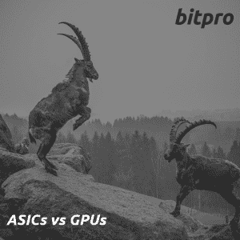

几乎在我与新客户的每一次互动中，ASICs 都不可避免地成为首先讨论的采矿钻机硬件选项之一。这是可以理解的，因为价值主张非常简单。专用集成电路是专用集成电路的缩写，专门用来做一件事，而且只做一件事:挖掘一个特定的密码，而且要快。在这方面，没有什么能与 ASIC 竞争。而 GPU 是通用处理器，可以计算任何东西。它们特别适合图形和加密货币挖掘。但重要的是，他们可以计算任何东西。尽管我们谈论的是采矿，但它们的灵活性比你可能意识到的要重要得多。

乍一看，ASICs 有很多优势。在原始哈希功率或效率方面，GPU 无法与 ASIC 竞争。ASIC 使用起来非常简单——字面意思是即插即用:*有 USB ASIC 矿工*。没有其他方法可以直接挖掘比特币，这是迄今为止最稳定的加密方法。单个 ASIC 甚至比一个完整的 GPU 平台更便宜。更强大、更高效、更稳定、易用、便宜。谈话结束了，对吗？没那么快…让我们在这里挖得更深一点。

> 这是反直觉的，但对于几乎所有阅读这篇文章的人来说，ASICs 是加密货币开采硬件中最糟糕的交易，也可以说是所有加密技术中最糟糕的交易。

让我们来看看 ASICs 和 GPU 如何真正积累所有这些假定的优势。

# ASIC 与 GPU:哈希能力

**ASIC**——在哈希速率方面无疑更强大。但是你是在挖掘哈希，还是在挖掘密码呢？这是一个非常重要的区别。

ASIC 不是密码的印刷机。机器的速度并不直接决定它能制造多少密码。这不是密码的工作方式。每个区块产生的新货币的数量是固定的。对于比特币，每十分钟 12.5 新 BTC，不多也不少。你的那份奖励是成正比的，*不是和你的散列率，* *而是和你在整个网络散列中的份额*。你买的 ASICs 和别人买的一样。所以在每个单位的基础上，你们都在一个水平的竞技场上，你可以完全把哈希值从等式中去掉。ASICs 本身的能力完全无关紧要。当谈到你将赚取的加密量时，你和其他人之间的唯一区别是你有多少 ASICs。除非你有一个旧的，效率较低的模型。在这种情况下，你和你的旧的和失败的 ASIC 现在是无关紧要的，因为你不能再竞争了。

GPU**——当然，他们无法在自己的游戏中击败 ASICs。但是他们玩的不是同一个游戏。他们可以挖掘每一个密码，还可以做很多 ASICs 做不到的有用的事情。**

**在 crypto 的早期，有一个短暂的时期，ASICs 几乎完全埋没了 GPU。但是 crypto 是一个草根运动。没过多久，人们就想出了很难为之开发专用集成电路新的功率算法。新的 ASICs 问世了。即便如此，它们要么比 GPU(以太坊)更高效。或者大多数 cryptos 改变了他们的软件，使 ASICs 变得无用(Cryptonight，Equihash)。新的抗 ASIC 算法和硬币一直在出来。简而言之，如果 ASICs 要彻底杀死 GPU，他们早就这么做了。他们没有这样做的事实证明他们不会这样做。这是一场猫捉老鼠的游戏，猫永远也抓不到所有的老鼠。有时这感觉像是一场必败之战，但那些老鼠不会就此打滚。只有少数公司从 ASIC 采矿中获利。然而，实际上有数千家大大小小的公司从 GPU 采矿中获利或完全依赖于 GPU 采矿。它涵盖了从 Nvidia 和 AMD 这样的大型公有跨国公司:从 GPU 销售中攫取数百万美元，到拥有几个 GPU 的普通游戏玩家。GPU 采矿中的大量利益相关者不会束手就擒，将整个加密货币采矿市场拱手让给比特大陆。**

# **ASIC 与 GPU:效率**

**ASIC——当然，它们更高效……每哈希。还是那句话，你是挖掘 hash，还是挖掘 crypto？**

**大多数 ASICs 消耗大约 800 瓦。旧 ASIC 上的 800 瓦和新 ASIC 上的 800 瓦消耗的功率完全一样。当您升级到更“高效”的 ASIC 时，您的电费并没有减少。因为其他人都在买和你一样的 ASICs，所以每个人都在完全相同的地方结束——燃烧相同的瓦特，获得相同的相对利润。这场军备竞赛中唯一真正的赢家是制造 ASICs 的公司。**

****GPU**—从最重要的角度来看，GPU 无疑更加高效。**

**在撰写本文时，只需要一个消耗 100W 的 GPU 每天就可以挖掘出 1 美元的以太币(电力后),而你需要一个 800W+ ASIC 每天才能挖掘出 1 美元的比特币(电力后)。从每瓦特的美元来看，这还远远不够。**

**对于大多数中小型矿商来说，不可避免地会遇到的第一个瓶颈是:**

1.  **电力服务能够提供的总电量，**
2.  **你的空间可以处理的热量。**

**GPU 平台肯定比 ASIC 大，但在大多数情况下，物理空间往往不是瓶颈。一旦你碰到了能源/热能墙，继续扩张通常是一个非常昂贵的升级，你需要就如何前进做出一些艰难的决定。有了 GPU，你就可以在碰壁之前赚取更多利润。**

# **ASIC 与 GPU:易用性**

**ASIC——这里没有争议，ASIC 很容易使用。即使你以前从未开采过，你也几乎不需要像我这样的人来帮助你设置 ASIC。**

**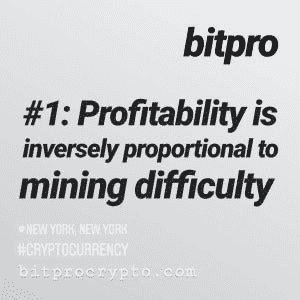**

**[https://www.instagram.com/bitprocrypto/](https://www.instagram.com/bitprocrypto/)**

**但是让我们永远不要忘记[采矿的首要原则](https://bitprocrypto.com/2018/07/02/the-10-cardinal-rules-of-crypto-mining/)——盈利能力总是与开采的难易程度成反比。采矿是一种竞争。当几乎没有准入门槛，成功有保证时——当每个人都是赢家*，没有人是赢家。***

**想象一下一场 1000 万美元的比赛，你所需要做的就是出现并举手获胜。参赛费用为 11 美元，每位获奖者平分奖金。会发生什么？100 万人出现，举起他们的手，把这 1000 万美元分成 100 万份，离开时比入场费少 1 美元。事实上，只有一个赢家——主持比赛的人，因为他们带走了 100 万美元，而其他人都很幸运，几乎达到了收支平衡。简而言之，这就是 ASIC 采矿。**

> **当然，现实要复杂得多，但总的想法是成立的——在采矿中，易用性不是一个积极因素，*而是一个消极因素*。**

**这意味着每个人都可以和你竞争，如果你真的想在这里获利，你最不想要的就是一场公平的战斗。**

****GPU**—毫无疑问，GPU 更难挖矿。但它不需要博士来组装一个基本的钻机，并插入一个带有软件的 u 盘，使 GPU 挖掘变得简单。**

**即便如此，首要原则仍然有效。就算没那么难，也还是比用 ASICs 挖矿有挑战性。因此，你最好离开狄莺，甚至购买现成的 GPU 平台，而不是购买 ASIC。但是首要原则#1 也适用于多个层面——当你在处理 GPU 时让事情变得简单，你也降低了你的利润。因为当你走容易的路线时，每个人都在建造和你一样的钻机，购买和你一样的 GPU，开采和你一样的以太坊、Monero 或 ZCash。它肯定比 ASICs 好，但离理想还差得很远。给你足够的时间，你可能仍然会盈利。但当形势变得艰难时，仅仅维持下去或获得令人满意的回报往往是不够的。为了通过 GPU 挖掘最大化您的盈利能力，您需要挖掘其他人没有挖掘的东西。以无人谈论的方式进行优化。在别人甚至不知道的事情上冒险。如果你准备好了并且有耐心，不从 GPU 挖掘中获利几乎是不可能的。如果你不是…好吧，那就是你打电话给[你友好的邻居密码员](https://bitprocrypto.com/contact-us/)的时候了。**

# **ASIC 与 GPU:价格**

**专用集成电路 —专用集成电路相对便宜，通常在<2000 美元甚至<1000 美元就能买到。如果你一直在听，你已经知道问题出在哪里了。便宜=进入门槛低=除了操纵市场的人，没有人会赢。首要原则#1 又来了。**

**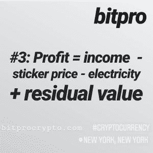**

**[https://www.instagram.com/bitprocrypto/](https://www.instagram.com/bitprocrypto/)**

**但是我们也不要忘记[的第三条基本原则](https://bitprocrypto.com/2018/07/02/the-10-cardinal-rules-of-crypto-mining/#cardinalrule3)。ROI 包括转售。在我看来，这是 ASICs 和 GPU 之间最重要的区别，所以我真的要详细说明这一点。**

**ASIC 是一匹只会一招的小马——它只能挖掘特定的硬币。如果密码的收入超过了电费，就没有理由关掉它。反正你也不能把它用在别的地方。每一个挖掘比特币的 ASIC 都将全天候挖掘比特币，直到这样做不再有利可图，因此没有反作用力来阻止比特币的增长。基本上，ASIC 仅仅是一台比特币挖矿机。而对于 GPU，其中很大一部分来自于在业余时间采矿的游戏装备或拥有一两个装备的临时矿工。当利润率变低时，游戏玩家停止采矿，临时矿工向游戏玩家出售他们的 GPU。这意味着当情况变得艰难时，对于坚持使用 GPU 的矿工来说，事情会变得更容易，因为许多竞争都消失了。**

**当你看到这对二级市场的影响时，事情会变得更糟。如果收入不再超过电费，你的 ASIC 就一文不值(至少对你来说)。当你在公开市场上购买比运行 ASIC 更多的密码时，根本没有理由打开 ASIC。你拥有那个 ASIC 的效用是零，对于成千上万和你拥有相同 ASIC 的人来说也是如此。这使得通往投资回报率的道路比你可能意识到的要陡峭得多，因为利润总是随着时间的推移而减少，你不能依靠转售价值来支撑等式的另一边。随着 ASIC 接近无利可图，转售价值迅速接近零。至少对于像你这样的人来说。但更糟糕的是！**

**这个等式中的一个微妙因素是每个人支付不同的电价。这意味着你的转售价值并不完全为零，因为用电更便宜的人仍然可以从购买你的 ASIC 中获利。但他们只会为它付最底的钱，因为他们知道它对你来说有多不值钱，每个人和他们的母亲都试图同时向他们出售他们不值钱的 ASICs。他们有最好的垃圾，所以你会得到一分钱。但是有总比没有好。因此，绝大多数人仍然会将他们的 ASIC 转售给用电更便宜的人，而不是扔进垃圾桶或留在货架上，这意味着这些 ASIC 实际上永远不会被关闭，它们只是被移动了一下。这意味着对 ASIC 硬币的散列率没有减轻影响。除非是一场自然灾害一下子夺去了数吨矿工的生命，否则哈斯拉特不会倒下。当市场崩溃时，增长率甚至几乎没有放缓。你不必相信我的话，这里有一张图表。**

**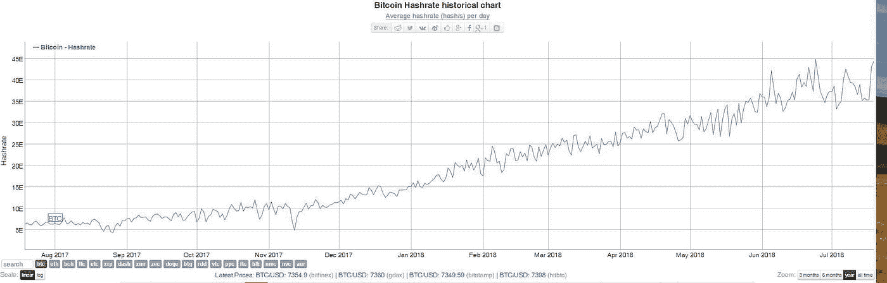**

**Bitcoin Hashrate Historical Chart — Courtesy of bitinfocharts.com**

**你的盈利能力超过第一天的唯一方法是比特币的市场价格上涨——但你必须问自己为什么要买 ASIC，而不仅仅是比特币本身。如果你愿意，你可以计算一下，但我会给你留点力气——除非你有非常便宜或免费的电力，否则在任何情况下，你都可以通过 ASIC 获利，你可以通过投资 GPU 采矿或购买加密技术获利更多。在任何情况下，如果您购买 ASIC 会有损失，那么投资 GPU 采矿或只购买加密会损失更少。**

****GPU**—GPU 的价格或高或低取决于你对未来的展望。一个完整的 6-GPU 平台将比你的平均 ASIC 成本更高，因为它不只是一个单一的东西，而是一个模块化系统。钻机的基础将运行约 500-700 美元，但每个单独的 GPU 相对便宜，你有太多不同的选择和价格。总的来说，它们运行起来当然更便宜，而且它们更容易获得和维修，因为它们是由现成的计算机部件组成的。**

**因此，虽然构建单个 GPU 平台的前期成本可能比构建单个 ASIC 要高，但请考虑一年的全部拥有成本。你在电力上花了多少钱取决于你的钻机有多强大，但随着 GPU 在美元/瓦特的基础上更有效，你在为 GPU 钻机供电上的花费相对较少。但更重要的是，您的硬件在那一年贬值了多少？因为这是拥有硬件成本的真实衡量标准——如果有的话，你的 ASIC 将大幅贬值，GPU 和设备中所有相关部件的价值将是你购买价格的一半或更多。总的来说，GPU 的前期成本要高一些，但随着时间的推移，拥有它的成本会更低。**

**由于加密是一个如此不稳定的市场，我们可以抱最好的希望，但仍然需要做最坏的打算。市场崩盘的时候 GPU 挖矿会怎么样？**

**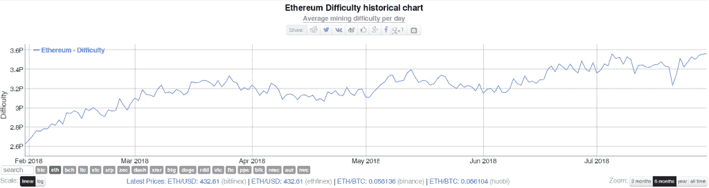**

**Ethereum Mining Difficulty historical chart — Courtesy of bitinfocharts.com**

**[它变慢了](https://bitprocrypto.com/wp-content/uploads/2018/07/1-Ethereum-mining-difficulty.jpg)。从 9 月中旬到 11 月，难度持平。随着市场在 12 月至 1 月出现泡沫，随着利润率飙升，GPU 大量涌入。随着市场在整个 3 月份持续下滑，它再次基本持平。5 月份，我们看到了短暂的复苏，以及相应的增长，但没有什么戏剧性的。**

**但真正的故事是在盈利图表中。**

**[这是比特币。十二月确实是一个好月份，但是五月的颠簸几乎察觉不到。利润率从可怜的 0.5 降至 0.6，因为 ASICs 从未下线，而且更多的 ASICs 不断上线。](https://bitinfocharts.com/comparison/bitcoin-mining_profitability.html#1y)**

**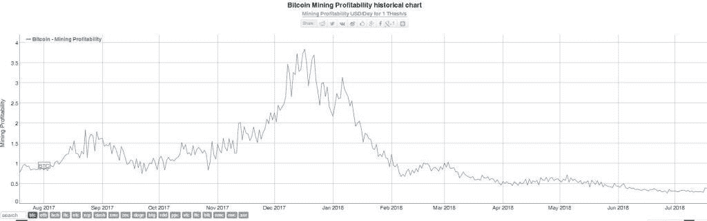**

**Bitcoin Mining Profitability historical chart — Courtesy of bitinfocharts.com**

**[现在看看以太坊。](https://bitinfocharts.com/comparison/ethereum-mining_profitability.html#1y)**

**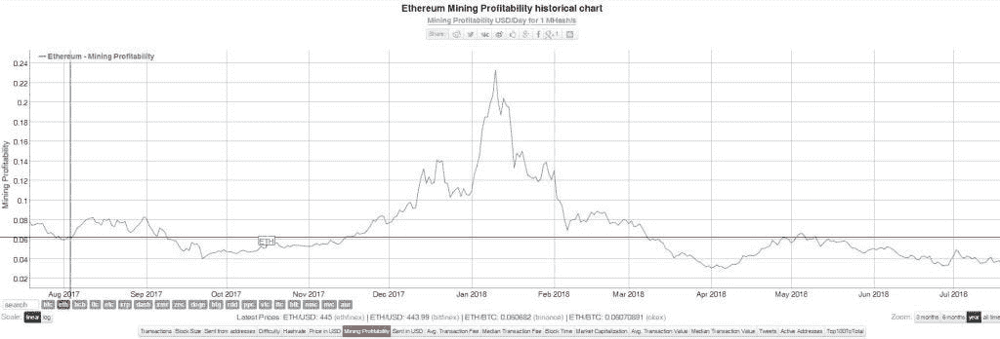**

**Etherium Mining Profitability historical chart — Courtesy of bitinfocharts.com**

**重点放在 4 月到 5 月。0.03 至 0.065。在比特币上涨的同一时期，盈利能力增加了一倍多。这是如此多的人放弃 GPU 挖掘的结果，让那些坚持下去的人收获所有的回报。当然，随着市场回落，它再次下滑，但这并不比 4 月份更糟糕。考虑到以太坊现在的价格甚至比当时还要低，这是很了不起的。而对于 ASICs 来说，盈利能力下降到了 4 月份的一半左右，而且这种下降还没有结束的迹象。**

# **ASIC 与 GPU:灵活性**

****ASICs** —这里没什么好说的。他们不灵活，句号。当然，有些 ASICs 可以挖掘不止一种算法，或者不止一枚硬币。但是到了最后，他们所能做的只是他们设计好要做的事情。**

**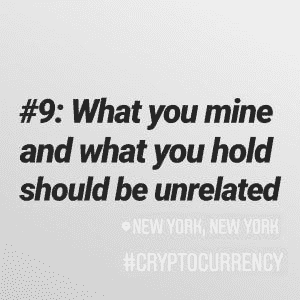**

**Source: [https://www.instagram.com/bitprocrypto](https://www.instagram.com/bitprocrypto/)**

****GPU**—这是 GPU 轻松取胜的地方。这也是为什么 GPU 永远是中小型矿商的更好选择。永远不要忘记基本原则# 9——不要占有你所拥有的，也不要占有你所拥有的。仅仅因为你的 Nvidia GPU 是 equihash 的理想选择，并不意味着你需要持有你开采的 ZEC。把 ZEC 变成 BTC 不费吹灰之力，很多泳池和交易所都提供这种服务。你不开采比特币的事实是一个没有区别的区别。**

> **你运行你的 GPU，你得到比特币作为回报。你还不如挖掘比特币:瞧，挖掘比特币有利可图。**

**没有比这一事实更好的反对 ASIC 的理由了，即美元换美元，一个不断将其收入转换为 BTC 的 GPU 矿工比花同等金额在比特币采矿 ASIC 上的人赚得更多的 BTC。让那一个下沉。一个 ASIC，一个比特币挖掘设备，最起码应该能够比其他任何东西都更好地挖掘比特币，当它归结到这一点时，它会在自己的游戏中被打败。GPU 还不如丢下麦克风走开。**

**这种开采任何替代硬币并将其与任何其他硬币进行交易的灵活性可以在现在和将来保护您。ASIC 出来让 Equihash 无利可图会怎么样？你矿 x16r。一个 x16r ASIC 出来会怎么样？你挖掘一些可能还不存在的东西。在我一无所有的另一个维度会发生什么？你出租你的硬件用于渲染，用于人工智能，用于数据分析，以及用于世界将会提出来使用这些 GPU 的一系列其他事情。不想花一整天的时间来计算如何从您的 GPU 中获得最佳利润，或者追逐下一件大事？你很幸运，这几乎是我所做的一切。**

**当一天结束时，当你的 GPU 不再对采矿有用，或者如果你决定完全退出采矿，灵活性仍然是你最好的朋友。假设你没有买采矿专用的 GPU(你不应该买)，他们总会找到一个愿意花大价钱让他们做他们最初被创造出来要做的事情——玩视频游戏的人。实际上有数以亿计的游戏玩家。他们的数量远远超过矿工，所以市场可以吸收大量的矿工，而不会让他们贬值到一文不值。对于你的内存、硬盘、PSU、CPU、主板和你的采矿设备中的每一个硬件来说更是如此，因为这对任何出于任何原因建造计算机的人都是有用的。你用现成的计算机部件建造了你的采矿设备，除非这个世界不再需要计算机——除非发生核灾难，否则不会发生，然后我们都同意我们有比你的采矿设备的剩余价值更大的问题——有人会以合理的价格购买它们。如果你不想处理出售采矿设备的麻烦…我也帮过客户！**

# ****ASIC 与 GPU:质量、可用性和保修****

****ASIC**——作为一种专门设计的机器，它们往往构造精良，但绝对没有多余的装饰。除了一些[显著的例外](https://bitprocrypto.com/wp-content/uploads/2018/07/1-Obelisk-Miners.jpg)，他们[甚至不试图让他们看起来漂亮。](https://bitprocrypto.com/wp-content/uploads/2018/07/1-Bitmain-ASIC.jpg)**

**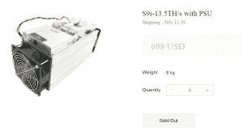**

**Bitmain ASIC Miner**

**可用性是值得怀疑的——在市场反弹之外，它们很容易获得……如果你愿意把钱汇到中国，支付大量的税收、运费和关税，并为你的 ASIC 等待数周。我曾经被报出 250 美元来运送两个 ASIC——我可以为此再买一个 GPU。如果你正在购买一个新的模型，当他们“测试”你的比特币挖矿设备几个星期的时候，预计会等待更长的时间，此时比特币处于最有利可图的状态。忘记信用卡或贝宝或大多数其他典型的网上支付方式。更糟糕的是，制造商只是勉强支持他们的产品——保修期通常为 90-180 天。如果您需要服务，请享受处理国际货件的乐趣。**

**最糟糕的是，如果你打算把 ASIC 放在一个人听得见或一个孩子伸手可及的任何地方，*让我打断你一下*。这些东西又热又吵又危险。我的意思不是比你想要的更大声，我的意思是比任何有理智的人都能忍受的更大声。当你第一次听到这种声音时，你会惊叹于这样一个小机器怎么会发出如此大的声音。你甚至不想和他们中的一个人共处一室，更别说 10 个了。而这些东西上的粉丝会毫不减速的切掉一根手指。任何一个带着蹒跚学步的孩子的人都知道，他们有一种不可抗拒的冲动去触摸一切，而 ASIC 将是这些小手曾经触摸过的最后一样东西。出于所有这些原因，当我在农场工作时，我几乎总是坚持附近的所有 ASICs 都暂时关闭。但是站在一个通风良好的满是 500 个 GPU 的房间里？没问题。**

****GPU**—GPU 有各种形状和大小。大的或小的，安静的或喧闹的，热的或不热的——如果你想要，有人制造它。这适用于钻机的每个部件。定制的个人电脑硬件被设计得像一个电脑硬件一样美观[。](https://bitprocrypto.com/wp-content/uploads/2018/07/1-GTX-GPU.jpg)**

**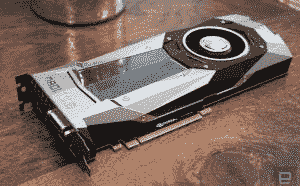**

**GPU**

**你愿意花多少钱，钻机就会造得多坚固。如果你只关心投资回报率的最大化，廉价和不稳定并不是一件坏事。即便如此，这里也没有什么会伤害你——最糟糕的情况是一个伤口和一个创可贴。GPU 之所以宜居，是因为它们被设计用来生活。事实上，整个冬天我都用不显眼的小型设备为我的整个房子供暖。当别人都在为暖气买单的时候，我的暖气却在为我买单。**

**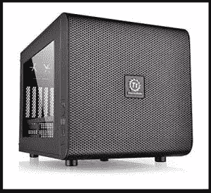**

**Mining Rig / Space Heater**

**可用性非常突出——亚马逊、新蛋甚至你当地的微中心将出售你需要的一切。把它全部放在你的信用卡上或者如果你想要的话直接支付现金。新蛋甚至接受比特币或者比特币现金！如果你想要的话，几乎所有东西都可以用隔夜运输，如果你不想要的话，可以免费运输。退货政策很慷慨，没有任何麻烦。保修期限通常为 3 年以上，这将持续零件的整个可用开采寿命。保修服务很简单，你需要寄送包裹的最远地方是加利福尼亚。再说一次，这甚至不是一场比赛，GPU 轻而易举地获胜。**

# **结论**

**这一切让 ASICs 听起来充其量是一个坏主意，或者最坏是一个骗局，但我不会走那么远。ASICs 不是一个骗局，甚至不是一个坏主意。它们只是大公司的工业机器，有理想的条件让它们盈利。你是一家拥有数百万美元资产的公司，在一个拥有廉价土地、廉价劳动力、寒冷气候和宽松监管的地方拥有数兆瓦的电力吗？如果是这样，那么 ASICs 就是为你准备的。如果没有，那就不要浪费你的时间和金钱。中小型采矿属于 GPU。特别是对于在地下室运行一些钻机的小型矿商来说，你在与大型竞争对手的竞争中处于相当大的优势，因为你不需要专门的设施或大规模的基础设施升级来运行它们。不要误解我——如果你对 ASICs 死心塌地，我会尽我所能让它们为你工作，只是你永远不会看到我推荐一个。**

**###########################################**

**哇，谢谢你一直陪着我！如果你喜欢你读过的东西，请在下面推荐并与你的媒体朋友分享！让我知道你对这篇文章和 ASIC 与 GPU 采矿的看法。**

## **关于我的业务:**

*****bitpro*** 设计、建造和管理加密货币开采钻机和大规模运营。除了我们在采矿方面的专业知识之外，我们还是一家全方位服务咨询公司，在所有加密货币(有利可图，值得您花费时间)方面拥有深厚的知识和专业技能，使我们成为一个有价值的合作伙伴和知识贡献者。我们帮助您建立并最大化您的投资— *我们与您一起赚钱*、*而不是离开您*。**

**在我们的网站上了解更多关于我们的信息:[bitprocrypto.com](https://bitprocrypto.com/)**

***原载于 2018 年 7 月 9 日 bitprocrypto.com***。****