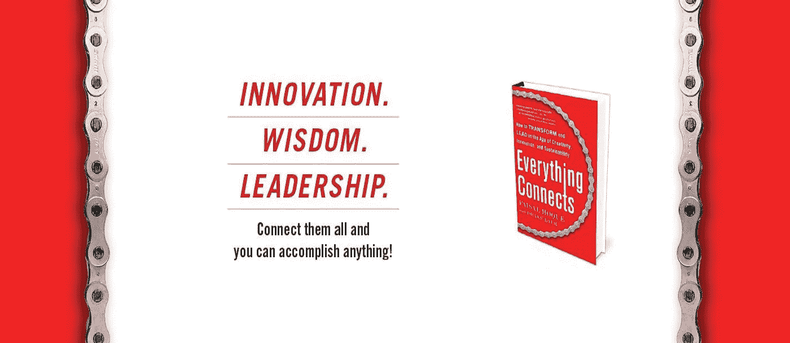

# 当你努力倾听时，问这 4 个感同身受的问题

> 原文：<https://medium.com/hackernoon/ask-these-4-empathetic-questions-when-youre-struggling-to-listen-555208a180cd>

[Photo by [rawpixel.com](https://unsplash.com/photos/MoH4SkuqUm4?utm_source=unsplash&utm_medium=referral&utm_content=creditCopyText) on [Unsplash](https://unsplash.com/collections/1512542/young-professionals?utm_source=unsplash&utm_medium=referral&utm_content=creditCopyText)]

## 失去你的耐心并开始忽视(或进行一次讽刺性的反驳)？试试这个。

你不需要被说服同情是一件好事——[不仅仅是出于道德原因，也是出于实际原因。虽然我们仍然](https://www.fastcompany.com/40457045/how-to-lead-with-empathy)[经常告诫](https://www.fastcompany.com/3063692/five-ways-the-most-effective-leaders-manage-their-emotions)要“不要感情用事”，但能够设身处地为他人着想是情商领导力的标志，更不用说是一个好同事了。它可以开辟新的交流渠道，创造理解，并帮助每个人实现共同的目标。

当然，这并不意味着这很容易。总会有一些时候，移情特别难以唤起和维持。当事情变得艰难，你的耐心消耗殆尽，你能感觉到你的挫败感在上升，深呼吸并继续以开放的心态倾听是非常困难的。尽管如此，这四个我学会在困难情况下问的移情问题帮助我保持冷静，找到问题的根源。

## 1.“这种情况对你有什么影响？”

不管他们如何回答，感谢他们分享他们的想法，让他们知道你会认真对待他们的观点。当你听你的直接下属或同事的回答时，[也要注意他们的肢体语言](https://www.fastcompany.com/40504026/how-your-coworkers-make-assumptions-about-you-based-on-body-language)。然后鼓励对方分享更多关于他们沮丧或担忧的背景或情况的细节:“你似乎对此感到不安。你能告诉我最初发生了什么让你有这种感觉吗？”然后仔细倾听他们的反馈，这样你就可以试着从他们的角度拼凑出事件的因果时间表。

## 2.“这是如何阻止你成功的？”

当员工、同事或商业伙伴知道他们可以向你敞开心扉谈论他们面临的挑战时，尽早解决这些冲突会更容易，也能避免你对以后更大的爆发失去耐心。你还将帮助建立一个开放的工作环境，最大限度地发挥每个人的才能，而不是一个充满抱怨和偏执的环境。所以，如果你在困境中被同事激怒了，问问他们遇到了什么障碍。当人们觉得自己的贡献受到重视时，他们也会更乐意解释——不带责备或愤怒——是什么*阻止了*他们做出贡献。

## 3.你认为最理想的结果是什么？

即使整个团队或组织朝着共同的目标努力，个人仍然倾向于培养他们自己的目标和愿望——这通常是好的！例如，一位经理可能着眼于更高级的领导职位，而一位顶级销售人员可能正在努力管理一个大客户。当紧张局势加剧时，重新联系个人的独立目标可以帮助你重新获得让每个人团结一致所需的同理心。问问你的同事，为什么他们每个人都希望从你们所处的困境中得到某种结果，这是一个很好的方法。

## 4.你从你清除的最后一个大障碍中学到了什么？

求职面试者喜欢问这个问题，这是有充分理由的——这有助于他们了解至少一个阻碍求职者前进的障碍，以及他们是如何克服的。你也可以用同样的问题来应对紧张的工作环境。这是一个很好的方法来控制你自己的情绪，同时要求别人重新使用他们解决问题的技能。

不要沉溺于现状的危险，你可以给你的同事或团队成员一点发泄的空间——为他们的焦虑创造一个出口，同时你帮助他们回忆起解决手头问题的模板。在这里，也要注意他们的语言和非语言暗示，这样你就能感受到他们过去是如何处理逆境的——这样你就能哄着他们重新采用那些最好的习惯，把那些不那么有成效的习惯放在一边。

同理心强的倾听者安静而耐心——尤其是在最困难的时候——他们会避免打断谈话或强加自己的假设。在这个过程中，不要让自己的负面情绪压倒你需要真正的努力，但有时最好的策略是最简单的:只问一个问题。

**版权所有 2018，作者 Faisal Hoque。保留所有权利。**

**原创文章**[**@ fast company**](https://www.fastcompany.com/40535080/ask-these-4-empathetic-questions-when-youre-struggling-to-listen)**。**

我是 [SHADOKA](http://shadoka.com/) 等公司的创始人。Shadoka 让抱负成为领导、创新和变革的动力。Shadoka 的加速器和解决方案汇集了管理框架、数字平台和思想领导力，以实现创新、转型、创业、增长和社会影响。

《万物互联——如何在创意、创新和可持续发展的时代进行变革和领导》和《T2:富有弹性的企业家、创新者和领导者的 27 种实践》的作者。在推特上关注我[费萨尔·霍克](http://medium.com/u/66953a6e238f)。免费使用[Everything Connects](http://app.everythingconnectsthebook.com/login.php)leadership app 和[SUV vive to Thrive](http://app.survivetothrive.pub/login.php)resiliency app。

