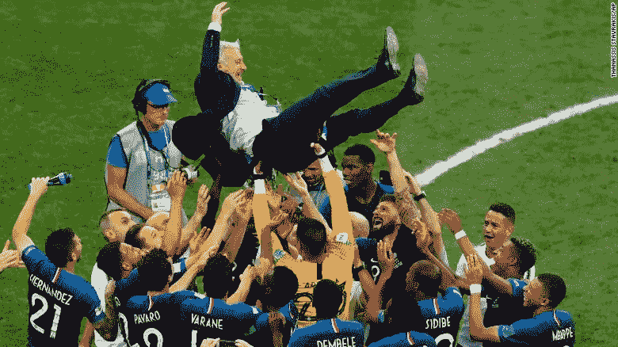

# 评估您团队的表现

> 原文：<https://medium.com/hackernoon/assessing-the-performance-of-your-team-d992b144f4d0>

French National Football Team Celebrates Winning the 2018 FIFA World Cup (photo: [@FIFAWorldCup](https://twitter.com/FIFAWorldCup/status/1018551158053507073))

巴士底日一天后，法国国家足球队成为 2018 年世界杯冠军。在 7 月 15 日的决赛中，法国以 4 比 2 的比分击败了克罗地亚。这是自 1966 年英格兰击败西德以来得分最高的世界杯决赛。 **Les Bleus** (法国队的官方名称)曾经赢得过一次世界杯:20 年前，他们在自己的国土上举办了[锦标赛](https://hackernoon.com/tagged/tournament)。

2018 年法国队派出了出色的球员，包括中场球员 [**保罗·博格巴**](https://twitter.com/paulpogba) 和轰动一时的年轻前锋 [**基利安·姆巴佩**](https://twitter.com/KMbappe) 。世界杯期间，姆巴佩在法国队出场的 7 场比赛中打入 4 球。年仅 19 岁的姆巴佩是第二位在世界杯决赛中进球的年轻球员。(最年轻的是贝利，他在 1958 年世界杯决赛中进球时才 17 岁。)

但是足球——或者在美国被称为英式足球——是一项团队运动。如果球队有机会，球员只能射门。这是法国队教练迪迪埃·德尚所熟知的，他也是 1998 年法国冠军队的一名球员。德尚是第三个同时作为球员和教练赢得世界杯的人。

关于德尚的执教，纽约时报做出了这样的评论:

> 他的 2018 年团队将不会作为最优雅的冠军，或最具创造力的冠军而被铭记。取而代之的是，它将因其本来的面目而被铭记:一个拥有非凡天赋和无情效率的团队，一个每个球员都知道自己的工作并完美完成的团队…
> 
> 法国与其说是伟大，不如说是本质上的杰出:一个由顶尖人才组成的团队愿意将他们的个人运动升华为集体使命。

每个足球队在给定的时间里派 11 名队员上场。个人位置从**守门员** (100%防守)，后场位置如**清洁工**和**阻挡者**(主要是防守)，**中场**(混合进攻&防守)，以及前锋如**边锋**和**前锋**(几乎完全是进攻)。决定胜败的是全队的配合。正如《每日电讯报》所指出的，德尚在执教他的球队时回归到“一种更有纪律和更务实的方法，这意味着束缚他们一些非凡的进攻天赋”。德尚取得了恰当的平衡:既指导个人表现，也指导团队整体表现。

对于任何教练来说，客观地看待关键球员的数据，关注与每个位置相关的数据是至关重要的。FIFA 世界杯官方网站[提供了所有参赛球员的统计数据:](https://www.fifa.com/worldcup/players/browser/#player-by-team)

*   **进球**(进球、点球等。)
*   **尝试次数**(总尝试次数、命中目标尝试次数、脱靶尝试次数、射门被挡、任意球射门次数等。)
*   **传球、传中&运球**(助攻、总传球、完成传球、尝试传中、完成传中、角球等。)
*   **防守**(铲球、铲球获胜、丢球、遭遇铲球、捡球、解围、拦网、扑救、扑救率、射门成功到达队友)
*   **犯规、越位&纪律**(红牌、黄牌、犯规、犯规导致判罚、犯规、越位)

在这些指标中，一些类别(**进球**、**尝试**)只与进攻球员相关。**防守**类别中的指标与中场球员和防守位置最为相关。**传球、传中&运球**指标可以适用于大多数位置。而且所有球员都可以根据犯规**，越位&纪律**统计进行评估。举个 Les Bleus 的例子，**(门将)的球员统计看起来和**(中场)以及 [**【基利安·姆巴佩】**](https://www.fifa.com/worldcup/players/player/389867/) (前锋)的球员统计很不一样。****

********

****Player Metrics Across 3 Very Different Positions****

****一个强有力的教练会确定适当的衡量标准，并与他的球员交流，这样他们就可以努力达到更高的水平。****

****最终，任何教练的工作都是:****

1.  ****识别个人绩效的杠杆。****
2.  ****提供影响这些绩效杠杆的环境和培训。****
3.  ****蔻驰&培养每个团队成员以最高水平运作。****
4.  ****教育整个团队他们的技能组合是如何相互作用的。****
5.  ****协调团队在球场上的表现，以实现他们的集体目标。****

****一个能做到以上所有的教练正在创建一个高绩效的团队。有效的辅导需要:收集相关的绩效数据，确定每个职位的最佳技巧，并在执行每个角色时执行纪律。团队可能不总是喜欢一个强有力的教练的工作，但他们会欣赏结果。****

********

****Coach Didier Deschamps thrown in the air by Les Bleus. (photo: [Thanassis Stavrakis](https://twitter.com/TStavrak), [AP](https://twitter.com/AP))****

****同样，一个工程经理是团队的教练。就像足球教练一样，工程经理试图根据花名册选出最好的球队。经理应通过以下方式不断审查他们的团队名单:****

*   ****招募新人来填补现有团队的空缺。****
*   ****识别不再补充团队其他成员的个人****

****同时，一个工程经理应该指导目前在他们名册上的每个人达到更高的绩效水平。尽最大能力培养个人将增加团队实现其目标的可能性:****

********

****工程团队由许多不同的角色组成，可以采取不同学科的形式:开发、QA、数据、平台、工具、架构、Ops/DevOps。就像足球教练一样，工程经理应该能够识别与团队中每个角色相关的指标。创建对适当度量标准的共同理解，允许管理者指导工程师达到更高水平的熟练程度和责任。工程经理应该能够识别能够衡量其团队成员的技术专长、交付和执行的数据点。****

****以下是可供考虑的非详尽指标列表:****

*   ****已合并拉取请求****
*   ****已审核的提取请求****
*   ****接触到 bug 或支持票****
*   ****开源贡献****
*   ****举办研讨会/技术讲座/午餐和学习****
*   ****编写的测试用例****
*   ****自动化测试通过率%****
*   ****本季度完成的承诺史诗百分比****
*   ****…还有更多，但**不是**“代码行”！****

****请记住，许多因素应该决定一个人是否是你的合适人选。工程师需要在公司环境中工作时能够与同事协作。整体团队契合度应包含以下部分(或全部):业务和领域知识、技术专长、质量思维、交付和执行、文化和领导潜力。****

****经理需要指导团队成员在**做什么**和**如何**做:****

*   ******“什么”工程师交付**(技术专长，交付&执行)****
*   ******“如何”工程师交付**(业务&领域知识、质量思维、文化&领导潜力)****

****世界杯决赛前几天，我有幸参加了由柏拉图组织的工程领袖峰会。作为一名导师，我主持了名为**“评估你的工程师的表现”**的研讨会，吸引了不同层次的个人和经理。对话内容丰富，参与者讨论这个话题的动机很多。以下是小组陈述的一些(转述的)问题和想法:****

*   *****我如何知道工程师是否在以适当的速度加速？*****
*   *****我如何确定工程师的表现是否低于他们的水平？*****
*   *****我如何标准化跨团队的绩效评分？跨关卡？*****
*   ****我如何知道一名工程师是否适合我的组织？****
*   ****我的一个工程师是一个多产的程序员，但是他不考虑他的工作对其他团队的影响。这是表现不佳吗？****
*   ****我想创建一个高绩效的团队，而不是一群各自为战的人。我如何衡量一名工程师对提高他人工作效率的影响？****
*   *****我就要成为经理了。我如何评估我的团队成员？*****
*   *****我是个人，但我对被认为是高绩效意味着什么感兴趣。*****
*   ****团队环境中的沟通至关重要。如果一个项目偏离了轨道，这个信息应该立即共享，因为它会影响到团队的其他成员(和公司)。****

****最终，对于如何评估你的工程师的表现，没有唯一的“正确答案”。在一个环境中蒸蒸日上的工程师可能会在另一个环境中苦苦挣扎——这取决于以下任何因素:公司所处的阶段、业务领域、团队规模、公司文化和整体团队构成。工程经理需要绩效管理的分析方法，以及评估协作、激励和文化等“软”技能是否适合动态业务环境的能力。作为一个工程团队的教练是复杂的，但是你的团队(和你的 CEO)会庆祝你的成功。****

****游戏开始。****

********

****Emmanuel Macron celebrating the French Victory (photo: Alexei Nikolsky, [TASS](https://twitter.com/tass_agency))****