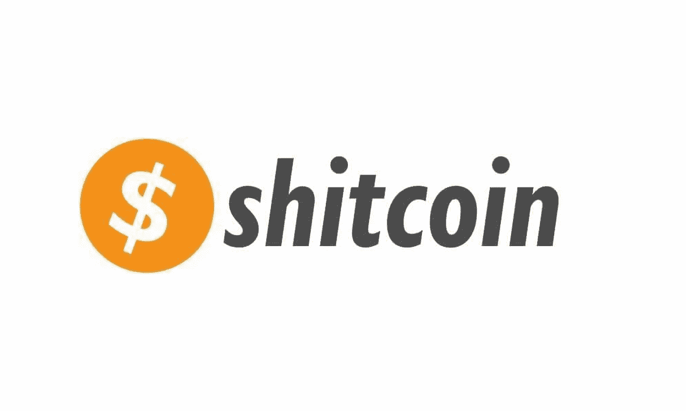
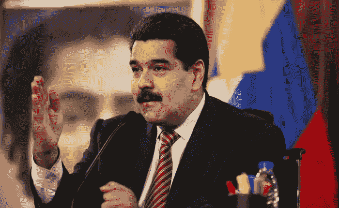
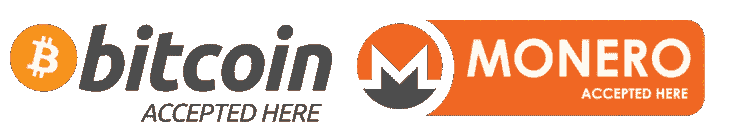
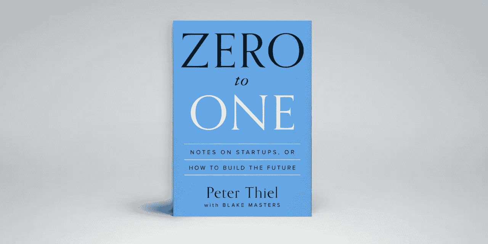

# 资产支持加密🤦🏽‍♂️🤦🏽‍♂️🤦🏽‍♂️ 😓😓😓

> 原文：<https://medium.com/hackernoon/asset-backed-cryptos-%EF%B8%8F-%EF%B8%8F-%EF%B8%8F-fc1d120a8b77>

## 它们是 ***而不是*** 实际上是加密货币…或者根本不是创新货币..

They come in all shapes & sizes..and colors..watch where you walk.

## 愚蠢…一个真实的故事…

有一天，一个家伙找到我，提出了创建资产支持加密货币的“天才”想法……他希望我成为他的“顾问委员会”成员。

以下是他的推介(粗略转述)。我的回答用*斜体*表示。

“你好，阿列克斯。我的名字是💩💩💩💩我们已经建立了一种由资产支持的加密货币。因此，我们将推出一个 ICO，用它来购买股票、债券和其他资产，然后进行交易，赚钱&创造密码的价值。”

嗯……..好的——所以你在创造一种投资基金，对吗？

“是啊..但是一个加密货币版本，它实际上是由一些东西支持的”

*对..那么，为什么加密货币&不仅仅是一种基金？*

“嗯，我们想以 ICO 的身份来做，这样每个人都可以参与进来”

*有基金牌照还是金融服务牌照？*

“不，我以为你不需要它作为加密货币”

*好吧……所以(1)，你没有加密货币。你有一个令牌化的资产。(2)一旦通过 howie 或任何其他证券测试，它 100%肯定会成为一种证券，而且它肯定需要许可。*

“豪伊考什么？”

*我继续解释 howie 测试等*

“那么，我们如何解决这个问题？”

*领证*

“如果我们的白皮书只是说它没有任何支持，然后我们用这些资金购买资产，那会怎么样？”

你是个白痴🤦🏽‍♂️🤦🏽‍♂️🤦🏽‍♂️

…电话通话结束。

Oil backed crypto…trust me…from one idiot to another…

## 我的想法

我从一开始就对“资产支持加密”有问题。事实上，他们试图在没有任何支持的情况下解决(假设的)加密问题，这表明了创建这些技术的人对技术的了解是多么的少。

*加密货币是* ***本地*** *数字资产，建立在某种形式的加密经济模型上，该模型结合了激励&抑制因素，以在网络中的非相关参与者之间建立共识。*

这就是加密货币的背后支持！

***安全、稀缺、激励、去激励、共识、效用、网络效应、反审查、去中心化、账本不变性。***

*这些*是真正的加密货币的属性，它们建立在使用区块链技术的开放、去中心化的 consesus 协议之上。

对于包含这些属性的技术来说，金钱是一个很好的用例。

*有你的价值。这就是为什么它不需要任何东西的“支持”。*

Real cryptocurrencies.

## 加密货币与令牌化资产

这些资产支持的加密技术实际上是令牌化的资产，是或声称有一天将建立在基于区块链的网络之上，也许是以太坊、Neo 或类似的网络。

其中大多数都不是真正意义上的加密货币，甚至也不是区块链项目。他们只是使用以太坊网络来自动化通过 ICO 筹集资本的过程，在大多数情况下，这是对传统筹集资本模式的规避，通常是由于无法通过传统模式筹集资金的想法而产生的，在传统模式中，投资人群更加精明和成熟。

反正…我跑题了..

令牌化资产与真正的加密货币是非常不同的产品。

他们确实有一个用例(流动性和准入)，但从根本上来说，他们与运行传统的投资式商业模式没有什么不同——我通常对此没有问题，除非当我看到一个行业声称通过“用真实世界的资产支持我们的令牌”解决了加密问题，我很自豪地淹没在胡说八道的 ico 中。

*对不起。这只是那些毫无创新天赋的人试图驾驭加密浪潮的荒谬尝试。*

基本上没有理由建立一种资产支持的加密货币。没用的。令牌化资产是另一回事，但它不是密码&因此不应该表现出网络效应比如比特币或 Monero 之类的东西的采用和升值。

BTC 和 XMR 是加密货币。它们天生是数字化的，天生稀缺。他们不需要与什么挂钩，也不需要什么支持。

## 真正的创新

真正的创新发生在你创造新事物的时候。

Regardless of how you feel about him personally, Thiel is a visionary & knows how to spot innovation

贝宝创始人彼得·泰尔是最受尊敬和最有远见的投资者之一，自由主义者和真正的反向投资者，他知道如何发现创新，在他的书《从零到一》中谈到了创新。

回应赫拉克利特的话，你只能踏入同一条河流一次，泰尔说，商业中的每一刻都只会发生一次，作为延伸，真正的创新也是如此。

“零到一”，意味着在以前没有的地方创造解决方案。

> *下一个比尔·盖茨不会建立操作系统。下一个拉里·佩奇或谢尔盖·布林不会做搜索引擎。下一个马克·扎克伯格不会创建社交网络。如果你在模仿这些人，你没有从他们身上学到东西。*

对泰尔来说，创新有两种类型。如果你采用现有的东西并加以改进，你会从 1 到 n。然而，如果我们创造新的东西，另一方面，我们会从“0 到 1”

这是目前密码/区块链领域正在发生的事情的一个极好的心理模型。

比特币当时是“0 比 1”。以前不存在这样的东西，而在现实中，它之后的一切都是它的“1 对 n”，除了以太坊背后的概念&图灵完全虚拟机。

如果你将这种思维模式应用到这些资产支持的密码中，你会发现这只是一群随机致富的人试图将当前的思维模式应用到一项新的创新技术中。

这就像试图为马和马车制造一个更好的“手推车”而不是创造汽车，或者你看到出租车公司为了与优步竞争而开发一个“应用程序”来让打车变得更容易。

他们忽略了整个要点！

当你听到有人对资产支持密码有“天才”想法时，要知道你在和一个缺乏想象力、真的不懂创新的人打交道。

如果你正在阅读这篇文章，并希望参与这个领域，投资这个领域，帮助建设这个领域，或者只是简单地谈论正在发生的事情，你需要真正地研究区块链背后的前提是什么，更重要的是去中心化的共识网络和协议，因为这是创新的前沿——我相信你和我一样，希望成为下一个“互联网”的一部分，而不是“内部网”😉

**作为研究前沿的一个小起点，请快速阅读以下内容:**

** [## “区块链”没有什么特别的

### 没有太多创新…但是有很多愚蠢..

hackernoon.com](https://hackernoon.com/theres-nothing-special-about-the-blockchain-35d38c554394)  [## WTF 就是区块链——2 分钟版

### 不确定这是否可能，但是让我们试一试，好吗？

hackernoon.com](https://hackernoon.com/wtf-is-the-blockchain-2min-version-c4ab6ecfaf76)  [## 密码经济学=社会工程

### 有点…..TL；灾难恢复版本…

medium.com](/the-mission/cryptoeconomics-social-engineering-bfbaed631633) 

**_ _ _ _ _ _ _ _ _ _ _ _ _ _ _ _ _ _ _ _ _ _ _ _ _ _ _ _ _ _ _ _ _ _ _ _ _ _ _ _ _ _ _ _ _ _ _ _ _ _ _ _ _ _ _ _ _ _ _ _**

如果你喜欢这篇文章，请给它一些爱，为它鼓掌(或几下)，并把它传给任何你认为应该读一读的人。

我的一些东西有点粗糙，但这样做是希望能让人们更清楚/更深入地思考他们在做什么。

希望你得到一些价值&反馈总是受欢迎的！

阿列克斯

**_ _ _ _ _ _ _ _ _ _ _ _ _ _ _ _ _ _ _ _ _ _ _ _ _ _ _ _ _ _ _ _ _ _ _ _ _ _ _ _ _ _ _ _ _ _ _ _ _ _ _ _ _ _**

您也可以关注我:

 [## 亚历山大·斯维特斯基|职业简介| LinkedIn

### 查看 Aleksandar Svetski 在 LinkedIn 上的职业简介。LinkedIn 是世界上最大的商业网络，帮助…

www.linkedin.com](https://www.linkedin.com/in/alekssvetski/)  [## 亚历山大·斯维茨基—中等

### 阅读亚历山大·斯韦茨基在媒介上的作品。试图“思考”的企业家。我所有东西的出口加密…

medium.com](/@AleksandarSvetski)  [## Earn.com

### 和我一起在 Earn.com 工作。

earn.com](https://earn.com/aleksandarsvetski/)  [## 亚历山大·斯维茨基(@亚历山大·斯维茨基)|推特

### Aleksandar Svetski 的最新推文(@AleksSvetski)。CEO @ Valley Iconic。澳大利亚

twitter.com](https://twitter.com/AleksSvetski)**